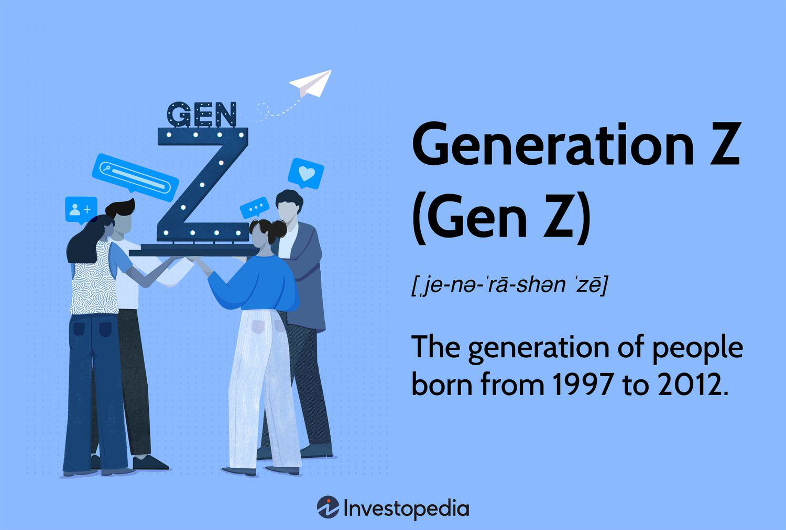

Generation Z, commonly referred to as Gen Z or Gen Zers, encompasses individuals born between the years 1997 and 2012. This cohort emerges as a significant demographic group with distinct characteristics and behaviors that set them apart in modern society. As digital natives, Gen Z has grown up in an era where technology and the internet are integral to daily life, granting them a unique fluency in digital environments.

This article focuses on exploring two major facets of Generation Z: their diverse demographics and their burgeoning interest in algorithmic trading. As the most racially and ethnically diverse generation in history, Gen Z reflects a broad spectrum of perspectives and experiences. They are also on track to be the most educated generation, exhibiting a strong awareness and advocacy for social issues such as healthcare, mental health, and environmental protection.



Understanding Generation Z is crucial due to their increasing influence on society and the marketplace. With a fresh outlook on financial behaviors, they show a marked interest in innovative financial technologies, including algorithmic trading. This interest stems from their comfort with rapidly evolving technology and their drive for efficient, data-driven decision-making in financial markets. As Gen Z transitions into financial independence and begins to accumulate capital, their preferences and behaviors are poised to significantly impact financial systems.

By examining Gen Z's intersection with algorithmic trading, stakeholders can better anticipate how this generation might reshape financial markets and trading trends in the years to come. Recognizing the potential disruptions and innovations Gen Z could introduce is vital for adapting financial services to meet the needs of this dynamic and influential cohort. Understanding Gen Z is essential for anyone aiming to engage effectively with this generation, whose influence will only continue to grow.

## Table of Contents

## Understanding Gen Z Demographics

Generation Z, representing individuals born between 1997 and 2012, has garnered attention for being the most racially and ethnically diverse generation in history. According to the Pew Research Center, over 48% of Gen Z in the United States are racial or ethnic minorities, compared to 39% among Millennials and 30% of Generation X [1]. This diversity is likely to influence societal norms and cultural trends, promoting inclusive perspectives across various fields, including education, technology, and business.

In terms of educational trends, members of Generation Z are on track to become the most educated cohort yet. Access to educational resources, advancements in technology, and the increasing importance of higher education in global economies have facilitated this shift. According to research by the National Center for Education Statistics, college enrollment rates are higher among post-millennials than any previous cohort [2]. This trend underscores Gen Z's commitment to academic achievement and underscores their potential for innovation and leadership in their professional lives.

Social consciousness is another defining characteristic of Generation Z. This cohort actively advocates for issues such as healthcare, mental health awareness, and environmental protection. Their engagement stems from growing up in an era marked by rapid technological advancement and significant global challenges such as climate change and social justice movements. A Deloitte global survey found that Gen Z prioritizes climate change and environmental sustainability, with many actively participating in climate strikes and supporting eco-friendly policies [3]. Furthermore, mental health is an area where Gen Z shows remarkable awareness and openness, often seeking to destigmatize conversations surrounding mental illness and stress management. 

Overall, the demographic profile of Generation Z, marked by diversity, ambition for higher education, and a strong social conscience, positions them as a pivotal force for future change across numerous societal dimensions.

---
[1] Pew Research Center: "On the Cusp of Adulthood and Facing an Uncertain Future: What We Know About Gen Z So Far" (2020)
[2] National Center for Education Statistics: "Undergraduate Enrollment" (2019)
[3] Deloitte: "The Deloitte Global Millennial Survey 2019"

## Generation Z Birth Years and Characteristics

Generation Z, commonly referred to as Gen Z, is defined by the birth years spanning 1997 to 2012. This places them as the successors of the Millennial generation and precedes Generation Alpha. This demographic cohort is beginning to have significant impacts on societal norms, the labor market, and technological trends as they come of age.

**Developmental Milestones**  
As of the early 2020s, the oldest members of Gen Z have already graduated from college and are establishing their careers across various industries. This group is noted for entering the workforce during a period characterized by rapid technological advancement and significant global challenges, such as the COVID-19 pandemic. This context has influenced their career choices, work habits, and expectations from employers. Moreover, societal and cultural developments have seen them focus on achieving a balance between professional aspirations and personal life milestones.

During their formative years, Gen Z individuals have experienced significant social milestones, such as a greater awareness and engagement with social issues, informal modes of education, and shifting norms about family and relationships. They tend to marry and start families later than previous generations, often prioritizing career development and personal fulfillment.

**Values and Technological Fluency**  
Gen Z is recognized for their distinctive values, particularly their commitment to social justice, inclusivity, and environmental sustainability. These values have been informed by growing up in a connected world where information is rapidly disseminated and social dialogues are instantaneous.

Perhaps the defining characteristic of Gen Z is their technological fluency. Born in the digital age, Gen Z has a natural affinity with technology, having been exposed to the internet, social media, and mobile technology from a young age. This fluency translates into how they learn, communicate, and make purchasing or investment decisions. Technology is integrated into their daily lives vertically and horizontally, influencing everything from education to entertainment, and extending to financial decisions.

Their worldview is particularly shaped by instant access to information, digital literacy, and a penchant for innovation. They are adept at leveraging technology to enhance efficiency and are open to new experiences and disruptive technologies. This adaptability positions them as early adopters in areas like [cryptocurrency](/wiki/cryptocurrency) and innovative financial services.

In summary, Generation Z is characterized by their distinct birth years from 1997 to 2012, marking them as digital natives with unique developmental and societal milestones. Their technological fluency and distinct value system place them in a position to significantly influence societal trends, economic markets, and the future of workplace dynamics.

## Gen Z and Financial Behavior

Generation Z, often seen as digital natives, faces a unique set of financial challenges and priorities shaped by their economic environment and digital literacy. One of their primary financial concerns is dealing with student loan debt, which significantly impacts their financial stability. Many Gen Zers are actively enrolled in college or have recently graduated, where the increasing cost of higher education continues to amass substantial financial burdens. As of 2023, the average student loan debt in the United States is approximately $37,000, influencing how Gen Z approaches savings and financial planning. This backdrop prompts many within this generation to prioritize debt management over other financial goals.

In terms of savings, Gen Z is characterized by a pragmatic approach, reflecting the economic uncertainties they have witnessed during their formative years, such as the financial crises witnessed by Millennials and the economic disruptions due to COVID-19. Many Gen Zers are keen on saving, albeit often beginning with smaller amounts compared to previous generations. One popular strategy among Gen Z is automating their savings through various financial apps, allowing them to consistently and conveniently set aside money without needing to consciously allocate funds each time.

Retirement planning is another area where Gen Z is gradually making ground. Unlike earlier generations, Gen Z has shown an inclination towards starting their retirement savings at an earlier age. This proactive behavior is influenced by an awareness of potential shortfalls in future social security benefits and the necessity of building a secure financial future. The use of retirement savings accounts, such as 401(k)s and IRAs, is increasingly becoming common, particularly among the employed segment of this cohort.

Investment habits among Gen Z are distinct, largely due to their comfort with technology and openness to adopting new financial instruments. They are significantly more inclined to invest in emerging commodities and technologies, with cryptocurrency being one of the most prominent examples. Cryptocurrencies offer a decentralized and potentially lucrative investment avenue, appealing to Gen Z’s desire for both innovation and financial autonomy. This is facilitated by the easy access to trading platforms and informational resources available online and via mobile applications, which suit their preference for managing investments on-the-go.

The following Python code snippet illustrates how a basic simulation of investment growth in a cryptocurrency might be structured:

```python
def simulate_investment_growth(initial_investment, annual_return_rate, years):
    """
    Simulates the growth of an investment over a period of years at a given annual return rate.
    :param initial_investment: The starting amount of money invested.
    :param annual_return_rate: The expected annual return rate (expressed as a decimal, e.g., 0.07 for 7%).
    :param years: The number of years the investment will grow.
    :return: The value of the investment after the specified number of years.
    """
    return initial_investment * ((1 + annual_return_rate) ** years)

# Example: Growing a $1000 investment at an annual rate of 7% over 10 years.
investment_value = simulate_investment_growth(1000, 0.07, 10)
print(f"The investment value after 10 years is: ${investment_value:.2f}")
```

The inclination towards technologically advanced methods also allows Gen Z to benefit from [algorithmic trading](/wiki/algorithmic-trading) and other automated investment tools previously inaccessible to retail investors. Their engagement with these technologies points to an emerging trend among Gen Z investors, signaling shifts in how investment portfolios might be managed in the future.

Overall, the financial behavior of Gen Z signifies a noteworthy transformation in managing personal finances, driven by an active approach to debt reduction, savings, and early investment adoption. Their preferences for integrating technology into financial activities suggest that the financial services industry must adapt to cater to this digitally savvy and economically cautious generation.

## Algorithmic Trading: A Natural Fit for Gen Z

Algorithmic trading has witnessed significant growth over recent years, driven by technological advancements like [artificial intelligence](/wiki/ai-artificial-intelligence) (AI) and big data. These technologies enable the rapid analysis of vast datasets, facilitating more informed and efficient trading decisions. AI algorithms, particularly those involving [machine learning](/wiki/machine-learning), can identify patterns and predictions about market movements much faster than traditional methods. This automation not only enhances trading accuracy but also minimizes human error, making algorithmic trading a compelling prospect for many investors.

Generation Z, characterized by their digital upbringing, naturally gravitates toward algorithmic trading. Raised alongside internet technologies and social media, Gen Z individuals are not only comfortable with technology but also expect seamless integration and efficiency in the services they use. Their familiarity with digital tools and platforms renders algorithmic trading a more approachable and appealing option. This demographic values time-efficiency and seeks heightened control over their investments, which algorithmic trading readily provides through automated systems that can operate round-the-clock without the need for constant manual input.

Moreover, the interest of Gen Z in financial markets is bolstered by the accessibility of trading platforms designed with user-friendly interfaces. Mobile apps and online platforms offer Gen Z an entry point into algorithmic trading, bypassing traditional financial institutions and reducing barriers to entry. As they enter the workforce and begin to accumulate disposable income, there's substantial potential for growth in algorithmic trading adoption within this demographic. Their propensity to adopt new technologies and trends suggests a significant increase in users who support and expand this trading method.

This generation's influence on financial systems will likely expand, as they bring fresh perspectives and a readiness to embrace innovation. As more Gen Zers participate in the workforce and acquire capital, they're poised not only to engage with existing financial structures but also to stimulate demand for new financial products. Algorithmic trading, aligned with their tech-centric lifestyles, represents an area of considerable growth potential. Businesses and financial services that acknowledge and cater to Gen Z's preferences may experience heightened engagement and success in appealing to this burgeoning segment of investors.

## Gen Z vs Other Generations in the Trading Landscape

Generation Z, the cohort born between 1997 and 2012, exhibits distinct trading preferences compared to earlier generations such as Millennials, Generation X, and Baby Boomers. These differences are predominantly shaped by Gen Z's familiarity with technology and their willingness to embrace innovative financial instruments. 

Firstly, Gen Z's approach to trading is strongly characterized by their comfort with mobile technologies and digital platforms. Unlike Baby Boomers and Generation X, who typically favor traditional brokerage services, Gen Z prefers using mobile trading apps that provide a seamless, user-friendly experience. Platforms like Robinhood, eToro, and Webull have become popular among Gen Z traders because they offer easy access to stock markets without the complexity of conventional trading systems.

Millennials, who also utilize digital tools, tend to be more conservative than Gen Z in adopting new financial instruments. While Millennials integrated digital platforms as they matured, Gen Z was the first generation to grow up with smartphones and constant internet connectivity. This exposure has led to a heightened fluency in navigating online platforms and apps. Gen Z's trading strategies often include leveraging social media and forums such as Reddit's WallStreetBets, where they can share insights and discuss market trends.

Gen Z's open-mindedness toward novel financial products is evident in their interest in cryptocurrencies and meme stocks. This cohort is more likely to experiment with decentralized finance (DeFi) and non-traditional assets compared to Baby Boomers and Generation X, who usually prefer established financial instruments like stocks and bonds. The inclination towards cryptocurrencies is partly due to Gen Z's engagement with digital culture and their perception of cryptocurrencies as part of the future of finance.

In addition to their affinity for digital platforms and new financial tools, Gen Z tends to prioritize efficiency and immediacy in their trading activities. They value quick and easy access to market information and trade execution, which aligns with the fast-paced nature of modern mobile apps. This demand for efficiency further distinguishes their trading habits from previous generations who may not prioritize speed and accessibility to the same extent.

Ultimately, Generation Z's tech-savvy nature and openness to innovative financial instruments shape a unique trading landscape. Their preference for mobile apps, willingness to embrace cryptocurrencies, and pursuit of efficiency differentiate them from Millennials, Generation X, and Baby Boomers, suggesting that Gen Z will continue to influence the evolution of financial markets as they mature and acquire more capital to invest.

## The Future Impact of Gen Z on Financial Markets

As Generation Z enters the financial market, their unique attributes are likely to drive significant changes in financial systems and trading trends. This generation, marked by their technological fluency and distinct values, is poised to foster innovations and disruptions in financial markets.

The entry of Gen Z into the workforce brings a cohort comfortable with digital platforms and innovative financial instruments. Their inherent ease with technology suggests a growth in digital financial services, with potential shifts in trading practices. Mobile trading applications and online platforms are expected to dominate, surpassing traditional brokerage services in popularity among younger investors. This transition could redefine trading norms, emphasizing user-friendly interfaces, seamless integration with financial apps, and enhanced functionalities powered by artificial intelligence and machine learning.

Gen Z's preference for efficiency and technology suggests a natural inclination towards algorithmic trading. The use of pre-programmed trading instructions based on variables such as timing, price, and [volume](/wiki/volume-trading-strategy) aligns with their desire for automated and data-driven decision-making processes. Additionally, the integration of artificial intelligence and big data in financial markets may accelerate as Gen Z influences market structures, leading to more sophisticated trading algorithms and personalized investment strategies.

The investment choices of Gen Z are likely to reflect their values, with a strong focus on socially responsible investing (SRI) and environmental, social, and governance ([ESG](/wiki/esg-investing)) criteria. As these investors prioritize sustainability and ethical considerations, financial markets may experience a shift towards greener investments, prompting firms to adapt by offering products aligned with these preferences.

The rise of decentralized finance (DeFi) platforms could also be catalyzed by Gen Z's comfort with cryptocurrencies and blockchain technology. The increasing adoption of digital currencies and peer-to-peer financial networks might introduce a democratized financial ecosystem, challenging traditional banking systems and encouraging decentralized models of wealth management.

Financial education will play a crucial role as Gen Z investors mature. The need for comprehensive financial literacy programs tailored to this generation's digital aptitude is evident. Educational initiatives may focus on complex financial concepts, risk management, and the responsible use of emerging technologies in trading. Moreover, financial institutions may need to develop personalized financial products and services that cater specifically to Gen Z's diverse needs, integrating advanced analytics to offer customized portfolio management and financial advice.

In conclusion, Gen Z's entry into financial markets is anticipated to bring innovative shifts, necessitating adaptations in financial education and product offerings to align with their technological acumen and value-driven investment strategies. Understanding and engaging with this dynamic generation will be vital for stakeholders aiming to thrive in an evolving financial landscape.

## Conclusion

Generation Z, characterized by its racial and ethnic diversity, high educational attainment, and profound social consciousness, presents a unique cohort as they come of age in a digitally-dominated world. With birth years spanning from 1997 to 2012, Gen Zers are distinguished by their technological fluency, comfort with digital tools, and their innovative approach to financial markets, particularly algorithmic trading. This generation's immersion in technology from a young age positions them naturally towards embracing algorithmic trading systems, which utilize artificial intelligence and big data analytics—areas where Gen Z is both knowledgeable and comfortable.

Understanding Gen Z's impact extends beyond demographics; their entrance into financial markets carries significant implications for stakeholders, especially within financial services. Their preference for mobile trading platforms and openness to new financial instruments such as cryptocurrencies suggest a shift in how financial products need to be structured and delivered. As Gen Z increasingly partakes in financial activities, their predisposition towards integrating technology in trading is poised to drive significant innovation and potentially disrupt established financial systems.

This new paradigm also highlights the necessity for continued research and adaptation. Financial institutions must tailor their strategies to engage effectively with Gen Z, ensuring their services are aligned with the expectations and tools preferred by this demographic. By addressing Gen Z's specific needs and leveraging their technological acumen, stakeholders can better position themselves to harness the potential of this influential generation. As such, ongoing studies and developments in financial services will be crucial in accommodating this dynamic cohort and ensuring that the products and platforms offered resonate with Gen Z investors and traders.

## References & Further Reading

[1] Pew Research Center. ["On the Cusp of Adulthood and Facing an Uncertain Future: What We Know About Gen Z So Far"](https://www.pewresearch.org/social-trends/2020/05/14/on-the-cusp-of-adulthood-and-facing-an-uncertain-future-what-we-know-about-gen-z-so-far/) (2020).

[2] National Center for Education Statistics. ["Undergraduate Enrollment"](https://nces.ed.gov/programs/coe/indicator/cha) (2019).

[3] Deloitte. ["The Deloitte Global Millennial Survey 2019"](https://www2.deloitte.com/us/en/insights/topics/talent/deloitte-millennial-survey-2019.html).

[4] ["Gen Z Unfiltered: Facing Nine Hidden Challenges of the Most Anxious Population"](https://www.amazon.com/Generation-Unfiltered-Challenges-Anxious-Population/dp/1732070342) by Tim Elmore 

[5] Campbell, R. (2018). ["The Five Factors of a Gen Z Workforce."](https://www.researchgate.net/publication/372372323_The_X-factors_behind_Gen_Z_employee_performance_A_systematic_review) Forbes.