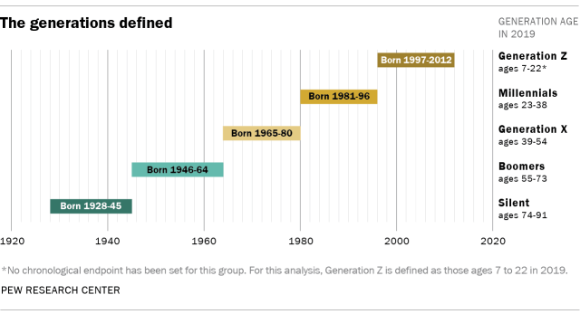

## Table of Contents

## What is Generation Z?

Generation Z, also known as Gen Z, refers to the group of people born between the mid-1990s and the early 2010s. They come after the Millennials and before Generation Alpha. Gen Z is the first generation to grow up with the internet, smartphones, and social media as a normal part of life. This has made them very comfortable with technology and digital communication.

Gen Z is known for being diverse, open-minded, and socially aware. They care a lot about issues like climate change, mental health, and social justice. Many in this generation are also very entrepreneurial and creative, often using technology to start their own businesses or share their ideas online. Overall, Gen Z is shaping the future with their unique perspectives and digital skills.

## What are the commonly accepted birth years for Generation Z?

Generation Z, or Gen Z, is the group of people born from the mid-1990s to the early 2010s. Most people agree that Gen Z starts around 1995 or 1996. This means that the oldest members of Gen Z were born in the mid-90s.

The end of Gen Z is a bit less clear, but many say it goes up to around 2010 or 2012. So, the youngest members of Gen Z were born in the early 2010s. These birth years help us understand who is part of this generation.

## How does Generation Z differ from previous generations?

Generation Z, or Gen Z, is different from earlier generations in many ways. One big difference is their relationship with technology. Gen Z grew up with the internet, smartphones, and social media as a normal part of life. This makes them very good at using technology and communicating online. Unlike older generations, who had to learn about these technologies as adults, Gen Z uses them naturally from a young age.

Another difference is their values and views on the world. Gen Z is known for being more open-minded and caring about social issues. They are very concerned about things like climate change, mental health, and social justice. This generation is also more diverse than previous ones, which influences their perspectives. They are often more entrepreneurial too, using technology to start businesses or share their ideas online. These differences show how Gen Z is unique and is shaping the future in their own way.

## What are the key demographic characteristics of Generation Z?

Generation Z, often called Gen Z, is very diverse. They come from different backgrounds and cultures. This generation is the most racially and ethnically diverse group compared to older generations. Many in Gen Z have parents from different countries or cultures, making them more open to different ways of life.

Gen Z is also known for being very connected to technology. They grew up with the internet, smartphones, and social media, which means they are very good at using these tools. They use technology to learn, work, and connect with friends. This generation also cares a lot about issues like climate change, mental health, and social justice. They want to make the world a better place and often use their voices online to speak up about these topics.

## How is Generation Z distributed globally in terms of population?

Generation Z is spread out all over the world. In countries like China and India, there are a lot more Gen Z people than in smaller countries. For example, China has a huge number of young people because it has a big population overall. India is similar, with a large number of Gen Z because it's one of the most populous countries in the world. In contrast, smaller countries like Norway or New Zealand have fewer Gen Z people because their total populations are smaller.

In the United States, Gen Z makes up a big part of the population, but it's still less than in China or India. Europe has a good number of Gen Z people too, but the numbers vary from country to country. For example, Germany and France have more Gen Z people than smaller European countries like Denmark. Overall, the number of Gen Z people in each country depends a lot on the total population of that country.

## What are the major influences on the development of Generation Z?

Technology is a big influence on Generation Z. They grew up with the internet, smartphones, and social media as normal parts of life. This means they are very good at using technology and communicating online. They use technology to learn, work, and connect with friends. This is different from older generations who had to learn about these technologies as adults. For Gen Z, technology is a natural part of everyday life.

Another major influence on Generation Z is the world around them. They care a lot about issues like climate change, mental health, and social justice. They see problems in the world and want to make it better. This generation is also very diverse, which makes them open to different cultures and ways of life. They use their voices online to speak up about the things they care about and work together to make changes.

## How do socioeconomic factors affect Generation Z?

Socioeconomic factors have a big impact on Generation Z. Where they grow up, how much money their family has, and the jobs their parents have can all affect their lives. For example, if a Gen Z person grows up in a poor family, they might not have the same opportunities as someone from a rich family. They might not go to a good school or have the chance to learn new skills. This can make it harder for them to get a good job when they grow up.

On the other hand, Gen Z people from richer families often have more chances. They can go to better schools, take part in more activities, and learn skills that help them get good jobs. But, even if they start with more, they still face challenges. For example, the cost of going to college is very high, and it can be hard to pay for it. Also, many Gen Z people worry about getting good jobs and being able to pay their bills. So, socioeconomic factors shape the lives of Generation Z in many ways.

## What are the educational trends among Generation Z?

Generation Z is known for being very focused on education. They often use technology to learn, like taking online classes or using apps to study. Many Gen Z people go to college or university because they know it can help them get better jobs. They also care a lot about learning skills that will be useful in the future, like coding or working with new technology. This generation is very good at finding information online and using it to learn new things.

But, there are some challenges too. The cost of going to college is very high, and many Gen Z people worry about how they will pay for it. Some choose to go to community colleges or trade schools instead because they are cheaper. Also, Gen Z is very interested in learning about real-world problems like climate change and social justice. They want their education to help them make the world a better place. So, while they are very focused on learning, they also face some big challenges.

## How does technology use vary among Generation Z across different regions?

Generation Z's use of technology varies a lot depending on where they live. In countries like the United States and many parts of Europe, Gen Z has easy access to the latest smartphones, laptops, and high-speed internet. They use these tools for everything, from schoolwork to connecting with friends on social media. They are very comfortable with technology and often use it to learn new skills or start their own businesses.

In contrast, in many developing countries, like parts of Africa and Asia, access to technology can be more limited. Gen Z in these regions might use older phones or have slower internet connections. Even so, they still find ways to use technology creatively. They might use mobile apps to learn or share information, and they often use social media to connect with others. The difference in technology use shows how Gen Z adapts to the resources available to them, no matter where they are.

## What are the employment patterns and career aspirations of Generation Z?

Generation Z has different employment patterns and career aspirations compared to older generations. Many Gen Z people want to work in jobs that make a difference in the world. They care about issues like climate change and social justice, so they often look for careers in areas like environmental science, social work, or technology that can help solve these problems. They also like jobs that give them flexibility, like working from home or having flexible hours. This is because they grew up with technology and are used to working in digital spaces.

Gen Z is also very entrepreneurial. A lot of them want to start their own businesses instead of working for someone else. They use technology to come up with new ideas and reach customers online. This generation is also interested in learning new skills that will help them in their careers. They often take online courses or learn on their own to stay up-to-date with the latest trends. Overall, Gen Z wants careers that are meaningful, flexible, and allow them to use their skills in creative ways.

## How do cultural and social values of Generation Z compare to other generations?

Generation Z, or Gen Z, has different cultural and social values compared to older generations. They grew up with the internet and social media, so they care a lot about being connected and sharing their thoughts online. Gen Z is very open-minded and values diversity. They believe everyone should be treated equally, no matter their background or identity. They also care a lot about issues like climate change and mental health, and they want to make the world a better place. This is different from older generations, who might not have been as focused on these issues when they were young.

Another big difference is how Gen Z thinks about work and money. They want jobs that are meaningful and help others, not just jobs that pay well. They also like flexibility, like working from home or having flexible hours. This is different from older generations, who often saw work as something you do to earn money, even if it's not something you enjoy. Gen Z also values experiences over things. They would rather spend money on travel or learning new skills than buying a lot of stuff. This shows how their values are shaping the way they live and work.

## What are the predicted long-term impacts of Generation Z on society and economy?

Generation Z, or Gen Z, is expected to have a big impact on society and the economy in the future. They care a lot about issues like climate change, social justice, and mental health. This means they will push for changes in laws and policies to make the world better. Companies will need to think about these issues too, or they might lose customers. Gen Z wants to work in jobs that help others, so more people might choose careers in areas like environmental science or social work. This could lead to more focus on solving big problems in society.

Gen Z is also very good with technology. They grew up with the internet and smartphones, so they know how to use these tools well. This means they will keep pushing for new technology and ways to use it. They might start a lot of new businesses and come up with new ideas that change how we live and work. They also like to work from home and have flexible hours, so the way we think about work might change. Overall, Gen Z will shape the future by focusing on big issues and using technology in new ways.

## References & Further Reading

[1] Pew Research Center. ["On the Cusp of Adulthood and Facing an Uncertain Future: What We Know About Gen Z So Far"](https://www.pewresearch.org/social-trends/2020/05/14/on-the-cusp-of-adulthood-and-facing-an-uncertain-future-what-we-know-about-gen-z-so-far/) (2020).

[2] National Center for Education Statistics. ["Undergraduate Enrollment"](https://nces.ed.gov/programs/coe/indicator/cha) (2019).

[3] Deloitte. ["The Deloitte Global Millennial Survey 2019"](https://www2.deloitte.com/us/en/insights/topics/talent/deloitte-millennial-survey-2019.html).

[4] ["Gen Z Unfiltered: Facing Nine Hidden Challenges of the Most Anxious Population"](https://www.amazon.com/Generation-Unfiltered-Challenges-Anxious-Population/dp/1732070342) by Tim Elmore 

[5] Campbell, R. (2018). ["The Five Factors of a Gen Z Workforce."](https://www.researchgate.net/publication/372372323_The_X-factors_behind_Gen_Z_employee_performance_A_systematic_review) Forbes.