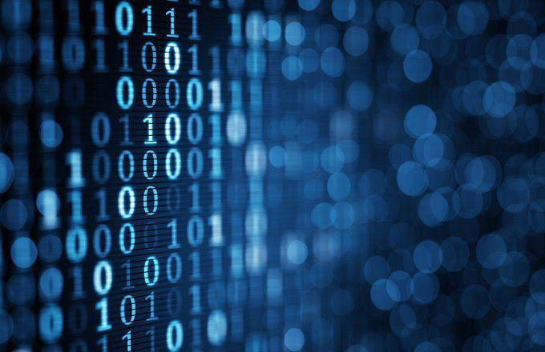

In the rapidly changing landscape of technology, blockchain stands out as a transformative innovation. It is redefining how we perceive data security and decentralization and has become a crucial component in various industry sectors. Initially developed to secure digital currencies such as Bitcoin, blockchain technology has evolved to disrupt a multitude of sectors beyond finance. By leveraging its decentralized nature, blockchain ensures unprecedented security, transparency, and efficiency.

The progression of blockchain technology is often categorized into different generations, each characterized by significant advancements. From its inception, blockchain was pivotal in establishing cryptocurrencies, which have since laid the foundation for further technological advancements. As blockchain technology matured, it gave rise to innovative platforms like Ethereum, which introduced smart contracts and expanded the utility of blockchain beyond simple transactions.



This article aims to discuss the evolution of blockchain through its generations and its intersection with algorithmic trading. The continuous integration of blockchain technology with algorithmic trading is creating new paradigms for trading systems, enhancing the security and transparency of these financial activities. By understanding how blockchain has revolutionized contemporary trade mechanisms, we can gain valuable insights into its future potential across various sectors.

Ultimately, the evolution of blockchain technology is not just about improving existing processes but also about unlocking new possibilities. By appreciating the transformative potential of blockchain, stakeholders can better leverage its capabilities to drive innovation and streamline operations in a decentralized digital ecosystem.

## Table of Contents

## Blockchain Technology's Generations

The journey of blockchain technology can be divided into three distinct generations, each marked by significant innovations that have expanded its utility and applications across various sectors.

**Generation 1: The Birth of Cryptocurrencies**

The first generation of blockchain technology was primarily characterized by the introduction of Bitcoin in 2008 by the pseudonymous Satoshi Nakamoto. This generation laid the groundwork for digital currencies, emphasizing decentralization, immutability, and transparency. Bitcoin's blockchain demonstrated the potential for a peer-to-peer electronic cash system that eliminated the need for intermediaries like banks. It utilized a Proof of Work (PoW) consensus mechanism, where miners solve complex mathematical problems to validate transactions and secure the network.

Bitcoin sparked the inception of various other cryptocurrencies, collectively referred to as altcoins, which aimed to address some of Bitcoin's perceived limitations, such as speed, scalability, and functionality. However, at its core, the first generation of blockchain was primarily focused on facilitating secure, decentralized monetary transactions.

**Generation 2: Ethereum and Smart Contracts**

The second generation of blockchain technology emerged with Ethereum in 2015, designed by Vitalik Buterin. Ethereum revolutionized the blockchain landscape by introducing the concept of smart contracts—self-executing contracts with encoded terms directly into lines of code. Ethereum expanded the blockchain's functionality beyond simple transactions to include decentralized applications (dApps) that operate automatically without intermediaries.

Smart contracts enabled developers to create a variety of decentralized applications ranging from finance (DeFi) to supply chain management. This innovation broadened the use cases for blockchain technology and contributed to the ecosystem of decentralized finance (DeFi), where financial services can be accessed without traditional banking infrastructure.

Ethereum operates on its unique blockchain using the Ether (ETH) [cryptocurrency](/wiki/cryptocurrency), and its network employs a Proof of Stake (PoS) consensus mechanism to improve efficiency and sustainability compared to Bitcoin's PoW model. This generation laid the groundwork for a range of applications and spawned numerous other blockchain platforms inspired by Ethereum's smart contract capabilities.

**Generation 3: The Rise of Web3 and Enterprise Adoption**

The current and third generation of blockchain technology is marked by further expansion into enterprise adoption and the integration of Web3 concepts. This generation focuses on enhancing scalability, interoperability, and speed to overcome the constraints faced by earlier blockchain technologies. The emergence of Web3 promises a more decentralized internet where users have control over their data and digital identities.

This generation sees the incorporation of AI and [machine learning](/wiki/machine-learning) into blockchain networks, enhancing data analytics, predictive modeling, and automation capabilities. These technologies collectively redefine connectivity and how data is managed across networks.

Enterprise-grade blockchains, such as those developed by Hyperledger and Ripple, are increasingly being adopted in industries ranging from finance to supply chain logistics, due to their enhanced privacy features and ability to handle a high [volume](/wiki/volume-trading-strategy) of transactions quickly. Additionally, these developments drive the integration of blockchain technologies into existing IT infrastructures, signaling a more comprehensive adoption across various sectors beyond fintech.

Overall, the third generation represents a matured adoption phase, both technologically and commercially, setting the stage for blockchain's deeper integration into our daily lives and digital processes.

## The Rise of Algorithmic Trading

Algorithmic trading has become increasingly prominent as a result of advancements in high-speed data processing capabilities and the application of machine learning. This form of trading leverages pre-programmed algorithms to execute financial transactions swiftly, guided by complex mathematical models that analyze various market conditions. The ability to process vast amounts of data in real-time and execute trades in milliseconds gives institutional and individual traders a significant edge in the highly competitive financial markets.

Algorithmic trading systems analyze historical data to identify patterns and forecast future price movements. Such systems can use various strategies, including statistical [arbitrage](/wiki/arbitrage), mean reversion, and [momentum](/wiki/momentum) trading. By automating these strategies, traders can mitigate emotional biases, enhance trading efficiency, and potentially achieve better outcomes compared to manual trading approaches. Here's a simple example of a moving average crossover strategy implemented in Python:

```python
def moving_average_crossover(prices, short_window=40, long_window=100):
    short_mavg = prices.rolling(window=short_window, min_periods=1).mean()
    long_mavg = prices.rolling(window=long_window, min_periods=1).mean()

    signals = pd.DataFrame(index=prices.index)
    signals['signal'] = 0.0
    signals['signal'][short_window:] = np.where(short_mavg[short_window:] > long_mavg[short_window:], 1.0, 0.0)
    signals['positions'] = signals['signal'].diff()

    return signals
```

By incorporating blockchain technology, [algorithmic trading](/wiki/algorithmic-trading) not only gains a new layer of security but also transparency. Blockchain's immutable ledger offers a definitive record of transactions, drastically reducing the potential for fraudulent activities. Each trade and alteration is documented chronologically across a decentralized network, ensuring data integrity and accessibility.

Blockchain addresses critical challenges in trading, such as transaction settlement times and counterparty risks. Its decentralized nature aligns with the demands of secure and efficient trading systems. Unlike traditional systems that rely on a central clearinghouse, blockchain offers a peer-to-peer network, which can reduce settlement times from days to mere minutes or seconds, thereby freeing up capital that would otherwise be tied up.

Furthermore, blockchain's role in providing a transparent record is invaluable for regulatory compliance and auditing processes, which are demanding increasingly higher standards of transparency and accountability. The combination of blockchain’s security features with the precision of algorithmic trading systems heralds a new era in financial markets, where transactions are not only faster but also more secure and transparent.

## Blockchain in Algorithmic Trading: A Paradigm Shift

Blockchain's integration into algorithmic trading represents a significant shift in the landscape of financial technology. This integration enhances the security, transparency, and efficiency of trading mechanisms and holds the potential to revolutionize the way trades are executed and recorded.

Smart contracts, a cornerstone of blockchain technology, play a crucial role in this paradigm shift by automating the execution of trades based on predefined conditions. These conditions are encoded into the blockchain, ensuring that the contracts self-execute when the terms are met, thereby minimizing the probability of human error. For instance, a trading algorithm may automatically trigger a buy order for a stock when its price drops below a certain threshold, and a smart contract can ensure this transaction occurs seamlessly and securely.

Moreover, blockchain technology provides an immutable and transparent ledger of all transactions. Each transaction is recorded in a decentralized manner, preventing tampering and fostering trust among traders and investors. The verifiable nature of blockchain records ensures that all market participants have access to the same data, reducing the incidence of fraudulent activities and increasing confidence in the market.

The intersection of blockchain and algorithmic trading could usher in a novel era for financial analysis and trading strategies. Algorithmic trading, which relies on complex mathematical models and high-frequency data inputs, can benefit from blockchain's ability to handle large volumes of data securely and efficiently. By leveraging blockchain, traders can implement more sophisticated strategies that draw on real-time analysis and up-to-date transaction records.

The use of blockchain could also lead to more equitable market conditions. Price manipulation and insider trading become more challenging when all transactions are publicly and permanently recorded on a blockchain. Additionally, by reducing reliance on centralized institutions, blockchain frees algorithmic trading from potential biases or inefficiencies associated with traditional financial systems.

In essence, the integration of blockchain into algorithmic trading systems represents a shift towards more robust and democratized trading practices. This synergy not only strengthens the foundations of financial trading by ensuring security and transparency but also paves the way for innovative trading solutions and strategies.

## Future Prospects and Challenges

Blockchain technology continues to demonstrate its potential to transform a wide array of sectors by enhancing data security and operational efficiency. As we look to the future, its implications are particularly promising with the ongoing development of Web3. This shift towards a more decentralized and user-centered internet aims to foster applications across various digital domains, extending beyond trading to influence many aspects of our digital lives. Through its decentralized nature, Web3 is expected to empower users with greater control over their data and interactions online, promoting trust and transparency in digital engagements.

However, the path forward is not without its challenges. One of the primary obstacles is scalability. Current blockchain infrastructures often struggle with handling large volumes of transactions efficiently, leading to potential bottlenecks. Solutions such as layer-2 protocols and sharding are being explored to address these issues, striving to enhance transaction throughput without compromising security and decentralization. Successful implementation of these innovations will be crucial for blockchain's viability in high-demand environments.

Regulatory hurdles also pose a significant challenge. As blockchain technology disrupts traditional industries, existing regulatory frameworks can be ill-suited to accommodate the novel features of decentralized networks. This misalignment may result in regulatory uncertainty, potentially hindering the growth and adoption of blockchain solutions. Continued dialogue between technology developers, industry stakeholders, and policymakers is essential to create a regulatory environment that fosters innovation while safeguarding users and financial systems.

Grasping these future prospects and challenges is vital for stakeholders aiming to leverage blockchain's full potential in algorithmic trading and beyond. By addressing scalability issues and navigating regulatory landscapes, blockchain technology can realize its promise of creating secure, efficient, and transparent systems for an array of applications. As such, ongoing innovation, collaboration, and policy development will be the linchpins of successfully integrating blockchain into the fabric of our digital future.

## Conclusion

The evolution of blockchain from currency facilitation to a multifaceted technology reflects its transformative potential across various sectors. Initially emerging as the backbone of digital currencies like Bitcoin, blockchain technology has progressively expanded its scope beyond cryptocurrencies to encompass a wide array of applications. One of the most promising areas of impact is algorithmic trading, where blockchain's capabilities offer significant benefits. By providing a secure, decentralized trading environment, blockchain minimizes the risks of fraud and enhances transactional transparency. This is achieved through its immutable ledger, which records all transactions with precision and reliability, thereby fostering trust among traders and investors.

The integration of blockchain with algorithmic trading mechanisms represents a substantial shift in financial ecosystems. By leveraging blockchain’s transparent and secure infrastructure, along with the efficiency of algorithmic processes, trading operations can become more streamlined and robust. Smart contracts, a key feature of blockchain, can automate a wide range of trading activities, thus reducing human error and operational delays. These self-executing contracts, defined by code on the blockchain, execute trades when specific conditions are met, ensuring consistency and reliability.

For industry leaders, investors, and developers, staying updated with these technological advancements is crucial. Embracing the synergy between blockchain and algorithmic trading can lead to the development of innovative financial products and trading strategies. As blockchain technology continues to evolve, bringing about new opportunities and challenges, it is essential for stakeholders to remain vigilant and adaptive. This proactive approach will allow them to harness blockchain’s full potential, ensuring a future where trading systems are not only more secure and efficient but also fundamentally transformative.

## FAQs

### FAQs

**What are the main innovations introduced in each generation of blockchain evolution?**

Blockchain technology has progressed through three significant generations. The first generation, exemplified by Bitcoin, introduced the decentralized ledger system, primarily focusing on secure and immutable record-keeping for cryptocurrencies. This laid the foundational concept of decentralized currency without the need for third-party intermediaries. The second generation saw the arrival of Ethereum, which added the functionality of smart contracts and decentralized applications (dApps). These innovations allowed for the execution of programmable transactions, significantly expanding blockchain's applicability beyond digital currencies. The third generation of blockchain involves enterprise-level adoption and the integration of Web3 technologies, which include [artificial intelligence](/wiki/ai-artificial-intelligence) (AI) and machine learning to enhance connectivity and interoperability across decentralized networks. This evolution aims to improve scalability and operational efficiency, addressing challenges like transaction throughput and privacy.

**How does blockchain improve the security of algorithmic trading?**

Blockchain enhances the security of algorithmic trading systems by providing an immutable and transparent ledger of all transactions. This ensures that each trade and transaction is permanently recorded, reducing the risk of fraud and manipulation. The decentralized nature of blockchain means that no single point of failure can compromise the entire system, making it resilient to hacking and cyber-attacks. Additionally, smart contracts can automate trade executions according to pre-set conditions, minimizing human intervention and errors. These features collectively strengthen trust among participants in the trading ecosystem and ensure that all operations are conducted transparently and reliably.

**What are the potential risks associated with integrating blockchain into trading systems?**

While the benefits of integrating blockchain into trading systems are substantial, several risks must be considered. Scalability is a primary concern, as current blockchain networks may struggle to handle the high transaction volumes required by modern trading environments. Latency issues may also arise, potentially impacting the speed and efficiency vital for high-frequency trading. Furthermore, the integration of blockchain necessitates compliance with evolving regulations, which can vary significantly across jurisdictions. Any misalignment between blockchain operations and regulatory frameworks could pose legal risks. There is also the potential for over-reliance on technology, where system failures or vulnerabilities in smart contracts could lead to financial losses.

**How will Web3 impact the financial trading sector?**

Web3 promises to transform the financial trading sector by promoting a more decentralized and user-centric internet. This shift could enhance transparency and security in trading operations, as data ownership moves towards end-users, reducing the control of centralized entities. Decentralized finance (DeFi) platforms, a key component of Web3, allow users to directly interact with trading and financial services without intermediaries, potentially lowering costs and increasing market access. Additionally, through greater interoperability and integration of AI technologies, Web3 could enable more sophisticated and personalized trading algorithms, improved decision-making processes, and innovative financial products. However, this transition will require robust infrastructures and regulatory considerations to ensure a secure and efficient trading landscape.

## References & Further Reading

[1]: Nakamoto, S. (2008). ["Bitcoin: A Peer-to-Peer Electronic Cash System."](https://nakamotoinstitute.org/library/bitcoin/) Bitcoin.org.

[2]: Buterin, V. (2013). ["Ethereum Whitepaper."](https://ethereum.org/en/whitepaper/) Ethereum Foundation.

[3]: Mougayar, W. (2016). ["The Business Blockchain: Promise, Practice, and Application of the Next Internet Technology."](https://books.google.com/books/about/The_Business_Blockchain.html?id=CEsPDAAAQBAJ) Wiley.

[4]: Yaga, D., Mell, P., Roby, N., & Scarfone, K. (2018). ["Blockchain Technology Overview."](https://www.nist.gov/publications/blockchain-technology-overview) National Institute of Standards and Technology.

[5]: Tapscott, D., & Tapscott, A. (2016). ["Blockchain Revolution: How the Technology Behind Bitcoin Is Changing Money, Business, and the World."](https://dl.acm.org/doi/10.5555/3051781) Portfolio.

[6]: Antonopoulos, A. M. (2017). ["Mastering Bitcoin: Unlocking Digital Cryptocurrencies."](https://books.google.com/books/about/Mastering_Bitcoin.html?id=IXmrBQAAQBAJ) O'Reilly Media.

[7]: Szabo, N. (1997). ["Smart Contracts: Building Blocks for Digital Markets."](https://www.semanticscholar.org/paper/Smart-Contracts%3A-Building-Blocks-for-Digital-Szabo/9b6cd3fe0bf5455dd44ea31422d015b003b5568f) 

[8]: Gomber, P., Arndt, B., Lutat, M., & Uhle, T. (2011). ["High-Frequency Trading."](https://papers.ssrn.com/sol3/papers.cfm?abstract_id=1858626) Wirtschaftsinformatik.