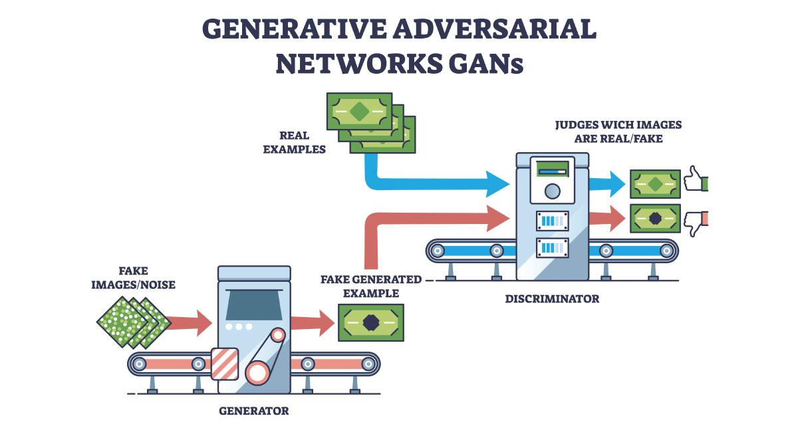

## Table of Contents

## What is a Generative Adversarial Network (GAN)?

A Generative Adversarial Network (GAN) is a type of artificial intelligence model that consists of two neural networks, called the generator and the discriminator, which work together to create new, synthetic data that resembles real data. The generator tries to produce fake data, like images or text, that looks as realistic as possible. Meanwhile, the discriminator's job is to tell the difference between the real data and the fake data created by the generator. They are in a constant competition, where the generator tries to fool the discriminator, and the discriminator tries to get better at spotting the fakes.

As the training progresses, the generator gets better at creating realistic data, and the discriminator becomes more skilled at identifying fakes. This back-and-forth process continues until the generator produces data that is almost indistinguishable from real data. GANs have many applications, such as generating realistic images, creating new music, or even producing synthetic text. They are powerful tools in the field of machine learning because they can learn to mimic complex data distributions, making them useful for tasks where real data is scarce or expensive to obtain.

## How does a GAN work?

A Generative Adversarial Network, or GAN, works by using two parts that compete with each other: the generator and the discriminator. The generator's job is to create new, fake data that looks real, like pictures or sounds. It starts by making random data and tries to make it better over time. The discriminator's job is to look at the data and decide if it's real or fake. It gets better at telling the difference as it sees more examples. They work together in a game where the generator tries to trick the discriminator, and the discriminator tries to not be tricked.

As they keep working, the generator gets better at making realistic data, and the discriminator gets better at spotting fakes. This happens through a process called training, where both parts learn from their mistakes. The generator learns to make data that's more and more like the real thing, while the discriminator learns to be more accurate at telling real from fake. Over time, the generator can make data that's so good, it's hard to tell if it's real or not. This makes GANs very useful for creating new things that look or sound like they could be real, even though they're made by a computer.

## What are the main components of a GAN?

The main components of a Generative Adversarial Network (GAN) are the generator and the discriminator. The generator is like an artist that creates new, fake data, such as images or sounds. It starts with random noise and tries to turn it into something that looks real. The discriminator is like a detective that looks at the data and decides if it's real or fake. It gets better at its job by looking at lots of examples of real and fake data.

These two parts work together in a game. The generator tries to fool the discriminator by making better and better fake data. The discriminator tries to get better at spotting the fakes. They keep going back and forth, learning from each other. Over time, the generator gets really good at making data that looks just like the real thing, and the discriminator gets really good at telling real from fake. This process helps the GAN create new data that's hard to tell apart from real data.

## What is the difference between the generator and discriminator in a GAN?

The generator in a GAN is like an artist that makes new, fake data. It starts with random noise and tries to turn it into something that looks real, like pictures or sounds. Its goal is to fool the other part of the GAN, called the discriminator, by making data that's hard to tell apart from real data. As the generator keeps trying, it gets better at making things that look more and more like the real thing.

The discriminator in a GAN is like a detective that looks at the data and decides if it's real or fake. It gets better at its job by looking at lots of examples of real and fake data. Its goal is to correctly tell the difference between the real data and the fake data made by the generator. As the discriminator keeps trying, it gets better at spotting the fakes, which pushes the generator to make even better fake data.

Together, the generator and discriminator in a GAN play a game where the generator tries to trick the discriminator, and the discriminator tries not to be tricked. This back-and-forth helps the GAN create new data that's hard to tell apart from real data.

## What are some common applications of GANs?

GANs are used in many cool ways. One big use is making realistic pictures. Artists and designers can use GANs to create new images that look like real photos. For example, they can make pictures of people or places that don't really exist but look like they could. This is helpful in fashion, where designers can see how new clothes might look on different people without having to take lots of photos.

Another use of GANs is in making fake but realistic videos or sounds. This is called deepfakes. People can use GANs to change how someone looks or sounds in a video, which can be fun but also a bit tricky because it can be hard to tell what's real. GANs can also help in making new music or sounds that sound like they could be real. This is useful for musicians who want to try out new ideas without spending a lot of time recording.

GANs are also used in science and medicine. They can help make new drugs by creating models of molecules that might work well. Doctors can use GANs to make pictures of what a disease might look like inside the body, which can help them learn more about it. This can save time and money because they don't have to do as many real experiments.

## How can GANs be used in image generation?

GANs are really good at making new pictures that look real. They do this by using two parts that work together: the generator and the discriminator. The generator starts with random noise and tries to turn it into a picture that looks like the ones it has seen before. The discriminator looks at these pictures and decides if they are real or fake. They keep going back and forth, getting better at their jobs. Over time, the generator gets really good at making pictures that are hard to tell from real photos. This is helpful for artists and designers who want to make new images without taking lots of real photos.

In simple terms, if you want to make pictures of new fashion designs, you can use a GAN. The generator can make images of clothes on different people, even if those people don't really exist. The discriminator helps by checking if the clothes look real. This way, designers can see how their new designs might look on different body types without needing to do a big photo shoot. It saves time and money and lets them try out lots of new ideas quickly.

## What are the challenges in training GANs?

Training GANs can be tricky because the generator and discriminator need to work well together. If one gets too good too fast, it can mess up the whole process. For example, if the discriminator gets too good at spotting fakes, the generator might not learn anything new because it can't fool the discriminator anymore. This problem is called mode collapse, where the generator only makes a few types of images instead of a wide variety. It's like the generator giving up and only making the same thing over and over.

Another challenge is that GANs need a lot of data and time to train. They have to look at many examples of real and fake data to get better. If there isn't enough data, the GAN might not learn to make realistic images. Also, training can take a long time because the generator and discriminator are always trying to outdo each other. It's like a never-ending game where both sides keep getting better, but it can be hard to know when to stop. Balancing this back-and-forth is key to making sure the GAN works well.

## What is mode collapse in GANs and how can it be addressed?

Mode collapse is a problem in GANs where the generator starts making the same kind of images over and over instead of creating a variety of different images. It's like the generator gets stuck and only knows how to make a few types of pictures. This happens when the discriminator gets too good at telling real from fake, so the generator can't learn anything new. It's a big challenge because the whole point of a GAN is to make lots of different, realistic images, not just a few.

To address mode collapse, one way is to change how the GAN is trained. Instead of having one big competition, you can use many smaller ones. This means using lots of generators and discriminators at the same time, so if one generator gets stuck, the others can keep learning. Another way is to make the generator try to make different images by adding a bit of randomness to its work. This helps it keep trying new things instead of getting stuck on the same old images. By using these tricks, GANs can keep making a wide variety of images and avoid mode collapse.

## How do Wasserstein GANs improve upon traditional GANs?

Wasserstein GANs, or WGANs, make traditional GANs better by solving some of their biggest problems. One big problem with regular GANs is that they can be hard to train because the generator and discriminator are always trying to outdo each other. This can lead to mode collapse, where the generator only makes a few types of images. WGANs fix this by using a different way to measure how well the generator and discriminator are doing. Instead of using a simple yes-or-no answer to tell if an image is real or fake, WGANs use a number called the Wasserstein distance. This number helps the generator learn more smoothly and avoid getting stuck, making it easier to train the GAN.

In simple terms, the Wasserstein distance is like measuring how far apart two things are. For WGANs, it measures how different the real data is from the fake data the generator makes. By using this distance, the generator gets better feedback on what it needs to do to make its images more like the real ones. This makes the training process more stable and helps the GAN make a wider variety of images. So, WGANs are a big step forward because they help solve some of the tricky problems that come with training regular GANs.

## What are conditional GANs and how do they differ from regular GANs?

Conditional GANs, or cGANs, are a special type of GAN that let you control what kind of images the generator makes. In a regular GAN, the generator just makes random images that look real. But with a cGAN, you can tell the generator what you want it to make by giving it extra information, like a label or a picture. For example, if you want a picture of a dog, you can tell the cGAN to make a dog picture, and it will use that information to create an image that matches what you asked for.

The main difference between cGANs and regular GANs is this extra information. In a regular GAN, the generator and discriminator just learn from a big set of images without any specific instructions. But in a cGAN, both the generator and discriminator get this extra information, which helps them focus on making and checking certain types of images. This makes cGANs really useful for tasks where you need specific kinds of images, like turning sketches into full-color pictures or making pictures that match certain styles or themes.

## How can GANs be evaluated and what metrics are commonly used?

Evaluating GANs can be tricky because it's hard to know if the images they make are good enough. One way to check is by looking at the images yourself and seeing if they look real. But this isn't always fair because different people might think different things. So, scientists use numbers to help measure how good the GANs are. One common number is the Inception Score (IS), which checks if the images look real and if they show a lot of different things. Another number is the Fréchet Inception Distance (FID), which compares the real images to the fake ones and sees how similar they are. These numbers help us understand if the GAN is doing a good job without having to look at every image ourselves.

Another way to evaluate GANs is by using the Wasserstein distance, which we talked about with WGANs. This number helps us see how different the real data is from the fake data the generator makes. The formula for the Wasserstein distance is pretty complicated, but it's something like this: $$W(\mathbb{P}_r, \mathbb{P}_g) = \inf_{\gamma \in \Pi(\mathbb{P}_r, \mathbb{P}_g)} \mathbb{E}_{(x, y) \sim \gamma} [\|x - y\|]$$. This number is useful because it gives the generator better feedback on what it needs to do to make its images more like the real ones. By using these different numbers and ways to check, we can get a better idea of how well a GAN is working and if it's making images that are hard to tell apart from real ones.

## What are the latest advancements in GAN research?

The latest advancements in GAN research have focused on making them more stable and easier to train. One big step forward is the development of StyleGAN, which lets you control the style of the images the generator makes. It does this by using a new way to mix different styles together, making it easier to create images that look just right. Another advancement is the use of self-attention in GANs, which helps the generator and discriminator focus on the most important parts of the images. This makes the images more detailed and realistic. Researchers are also working on making GANs faster to train by using new techniques like progressive growing, where the GAN starts with small, simple images and slowly makes them bigger and more detailed.

Another exciting area of GAN research is in making them more useful for real-world problems. For example, CycleGANs can turn one type of image into another without needing paired examples. This means you can turn a picture of a horse into a picture of a zebra, even if you don't have photos of the same scene with both a horse and a zebra. Researchers are also looking at using GANs to help with medical imaging, where they can create realistic images of diseases to help doctors learn more about them. These advancements show how GANs are becoming more powerful and useful in many different fields, from art to medicine.

## References & Further Reading

[1]: Goodfellow, I., Pouget-Abadie, J., Mirza, M., Xu, B., Warde-Farley, D., Ozair, S., ... & Bengio, Y. (2014). ["Generative Adversarial Nets."](https://arxiv.org/abs/1406.2661) Advances in Neural Information Processing Systems 27.

[2]: Radford, A., Metz, L., & Chintala, S. (2015). ["Unsupervised Representation Learning with Deep Convolutional Generative Adversarial Networks."](https://arxiv.org/abs/1511.06434) arXiv preprint arXiv:1511.06434.

[3]: Arjovsky, M., Chintala, S., & Bottou, L. (2017). ["Wasserstein GAN."](https://arxiv.org/abs/1701.07875) arXiv preprint arXiv:1701.07875.

[4]: Mirza, M., & Osindero, S. (2014). ["Conditional Generative Adversarial Nets."](https://arxiv.org/abs/1411.1784) arXiv preprint arXiv:1411.1784.

[5]: Karras, T., Laine, S., & Aila, T. (2018). ["A Style-Based Generator Architecture for Generative Adversarial Networks."](https://arxiv.org/abs/1812.04948) arXiv preprint arXiv:1812.04948.

[6]: Isola, P., Zhu, J. Y., Zhou, T., & Efros, A. A. (2017). ["Image-to-Image Translation with Conditional Adversarial Networks."](https://ieeexplore.ieee.org/document/8100115) IEEE Conference on Computer Vision and Pattern Recognition.

[7]: Zhu, J. Y., Park, T., Isola, P., & Efros, A. A. (2017). ["Unpaired Image-to-Image Translation using Cycle-Consistent Adversarial Networks."](https://arxiv.org/abs/1703.10593) IEEE International Conference on Computer Vision.

[8]: Borji, A. (2019). ["Pros and cons of GAN evaluation measures."](https://www.sciencedirect.com/science/article/pii/S1077314218304272) Computer Vision and Image Understanding, 179, 41-65.