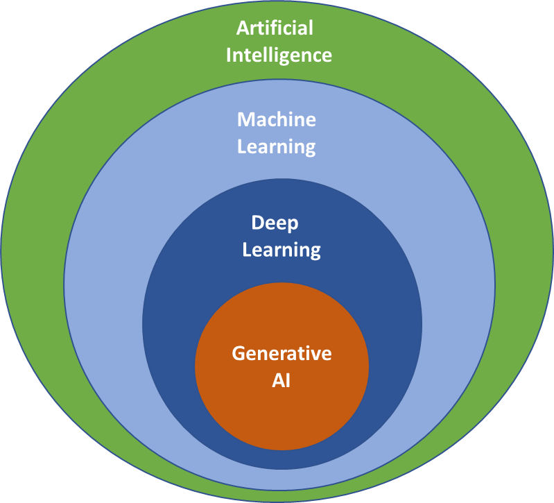

## Table of Contents

## What is Generative AI and how does it differ from other types of AI?

Generative AI is a type of artificial intelligence that can create new content, like text, images, or music, by learning from examples. It uses special math models to understand patterns in the data it's given. Once it learns these patterns, it can generate new things that are similar to what it has seen before. For example, if you show a generative AI lots of pictures of dogs, it can create new pictures of dogs that look real, even though they are made up.

Generative AI is different from other types of AI because it focuses on creating new content, not just understanding or classifying existing data. Other types of AI, like those used in self-driving cars or recommendation systems, are good at recognizing patterns and making decisions based on what they know. They might help a car see a stop sign or suggest a movie you might like. But generative AI goes a step further by making new things, which can be used for art, writing stories, or even designing new products. This makes generative AI a powerful tool for creativity and innovation.

## Can you explain the basic principles behind machine learning in Generative AI?

Machine learning in Generative AI works by feeding the AI lots of examples of something, like pictures or text. The AI then looks for patterns in these examples. It uses these patterns to learn how to make new things that look like the examples it was shown. This process is called training. During training, the AI adjusts its internal math model to get better at making things that match the examples. The math model is usually something called a neural network, which is good at finding and using patterns in data.

One key part of this process is the loss function, which tells the AI how far off its guesses are from the examples. The AI tries to make this number smaller by changing its math model. For example, if the AI is making pictures of dogs, the loss function might measure how different the AI's picture is from real dog pictures. The AI keeps tweaking its model until the loss function gets as small as possible, meaning the AI's pictures look more and more like real dogs. This is how the AI learns to generate new content that seems real and fits the patterns it was taught.

Generative AI often uses special kinds of neural networks called Generative Adversarial Networks (GANs) or Variational Autoencoders (VAEs). In a GAN, there are two parts: a generator that makes new content, and a discriminator that checks if the content looks real. They work together, with the generator trying to fool the discriminator, and the discriminator trying to get better at spotting fakes. This back-and-forth helps both parts get better over time. VAEs, on the other hand, learn to compress and then reconstruct data, which helps them understand and generate new data that fits the patterns they've learned. Both methods help Generative AI create new, realistic content.

## What are some common applications of Generative AI in everyday life?

Generative AI is used in many ways that we see every day. One common use is in creating pictures and art. For example, some apps let you type in what you want to see, like a "dog wearing sunglasses," and the app will make a new picture of it. This is fun for making art or even designing things. Another everyday use is in writing. Some tools can help you write emails or stories by suggesting words or even whole sentences based on what you've already written. This can save time and help you be more creative.

Generative AI also helps in making music and videos. Music apps can create new songs or beats by mixing together different sounds it has learned from other songs. Video apps might use Generative AI to make short clips or even help edit longer videos by suggesting scenes or effects. These tools make it easier for people to create and share their own music and videos without needing a lot of technical skills. Overall, Generative AI makes our lives more creative and fun by helping us make new things easily.

## How does a Generative Adversarial Network (GAN) work?

A Generative Adversarial Network (GAN) is like a game between two players: a generator and a discriminator. The generator's job is to create new, fake data, like pictures or text. It starts by making random guesses and then tries to get better at making these fakes look real. The discriminator's job is to look at the data and decide if it's real or fake. It gets examples of real data and the fakes made by the generator. As they play this game, the generator tries to fool the discriminator, and the discriminator tries to get better at spotting the fakes. They both learn from each other, getting better and better with each round.

This back-and-forth helps the generator make fakes that are more and more like the real thing. The math behind it is based on something called the loss function, which measures how well the discriminator can tell real from fake and how well the generator can fool it. The generator and discriminator keep adjusting their math models, trying to make the loss function smaller. Over time, the generator can create new data that looks very real, because it has learned from the discriminator's feedback. This makes GANs a powerful tool for creating new, realistic content.

## What are the key differences between supervised and unsupervised learning in the context of Generative AI?

Supervised learning in Generative AI is like having a teacher. The AI is given examples of data along with the right answers. For instance, if you're teaching the AI to make pictures of dogs, you show it lots of dog pictures and tell it, "These are dogs." The AI then learns to create new dog pictures by copying what it has seen. It's called supervised because it's guided by the examples and correct answers it gets. This type of learning is good for tasks where you know exactly what you want the AI to do, like making a specific kind of image or text.

Unsupervised learning, on the other hand, is like learning without a teacher. The AI is given data but not told what it means. It has to find patterns and make sense of the data on its own. For example, if you give the AI lots of pictures without telling it what they are, it might figure out that some pictures have similar shapes or colors and group them together. In Generative AI, this can help the AI create new things based on the patterns it finds. Unsupervised learning is useful when you don't have labeled data or when you want the AI to discover new things you might not have thought of.

## What role do neural networks play in Generative AI?

Neural networks are the brain behind Generative AI. They help the AI learn patterns from the data it is given, like pictures or text. Imagine a [neural network](/wiki/neural-network) as a big math puzzle that gets better at solving itself the more it practices. When you show the neural network lots of examples, it figures out what makes those examples special. Then, it uses what it learned to create new things that look or sound like the examples. This is how Generative AI can make new pictures, stories, or music that seem real.

In Generative AI, special kinds of neural networks like Generative Adversarial Networks (GANs) and Variational Autoencoders (VAEs) are often used. GANs work by having two neural networks play a game. One network, called the generator, tries to make fake data that looks real. The other, called the discriminator, tries to tell if the data is real or fake. They keep playing until the generator gets really good at making fakes that fool the discriminator. VAEs, on the other hand, learn to squeeze data into a smaller form and then stretch it back out. This helps them understand the data's patterns and create new data that fits those patterns. Both methods help Generative AI make new, realistic content.

## How can Generative AI be used to create art or music?

Generative AI can create art by learning from lots of pictures or paintings. When you show the AI many examples, it finds patterns in colors, shapes, and styles. Then, it uses those patterns to make new pictures that look like the ones it has seen. For example, if you show the AI lots of paintings of landscapes, it can create a new landscape painting that looks real, even though it's made up. This is fun because you can tell the AI what kind of picture you want, like "a dog wearing sunglasses," and it will make a new picture just for you. Artists use this to help them create new ideas or to make art that mixes different styles in new ways.

Generative AI can also make music by learning from lots of songs. It listens to the notes, rhythms, and styles of the songs and then uses what it learned to create new music. For example, if you show the AI lots of jazz songs, it can make a new jazz song that sounds like real jazz. This is helpful for musicians who want to try new sounds or need help coming up with new tunes. Some apps even let you tell the AI what kind of music you want, like "a happy pop song," and it will create a new song just for you. This makes it easier for anyone to make music, even if they don't know how to play an instrument.

## What are the ethical considerations when using Generative AI?

When using Generative AI, one big ethical concern is making sure it's used fairly and doesn't hurt anyone. For example, if the AI makes pictures or stories, it's important that it doesn't create things that are mean or wrong about people. Also, if someone uses the AI to make art or music, they should give credit to the AI and not pretend it's all their own work. This is like sharing toys nicely and being honest about who made what.

Another thing to think about is privacy. If the AI learns from lots of data, like pictures or songs, it's important that it doesn't use people's private stuff without asking. Also, if the AI makes new things, like a song or a picture, it shouldn't copy someone else's work too closely. This is like not peeking at someone's diary or copying their homework. We need to make sure Generative AI is used in a way that's fair and respects everyone's rights.

## How do you evaluate the performance of a Generative AI model?

To evaluate the performance of a Generative AI model, you look at how well it can create new things that look real and match what you want. One way to do this is by using a measure called the loss function. The loss function tells you how different the AI's creations are from the real examples it was shown. If the loss function is small, it means the AI is doing a good job at making things that look like the examples. Another way to check is by having people look at the AI's creations and say how real they look. This is called human evaluation. If lots of people think the AI's pictures or stories look real, then the model is doing well.

There are also other ways to check how good the model is, like using special math tests. For example, you can use something called the Fréchet Inception Distance (FID) to see how close the AI's pictures are to real pictures. A lower FID score means the AI's pictures are more like real ones. You can also look at how varied the AI's creations are. If the AI can make lots of different things that all look real, that's a good sign. By using these different ways to check, you can get a good idea of how well the Generative AI model is working and if it needs to be improved.

## What are some advanced techniques used to improve the quality of outputs in Generative AI?

One advanced technique to improve the quality of outputs in Generative AI is using something called transfer learning. This means the AI starts with what it has learned from one task and uses that knowledge to do a new task better. For example, if the AI learned to recognize different kinds of dogs, it can use that knowledge to help it make new pictures of dogs. This helps the AI make better and more realistic pictures faster because it's not starting from scratch. Another technique is fine-tuning, where you take a model that's already pretty good and make it even better by showing it more specific examples. This is like giving the AI extra practice on the things it needs to get better at.

Another way to boost the quality of Generative AI outputs is by using a technique called attention mechanisms. These help the AI focus on the most important parts of the data it's working with. For example, when making a story, the AI can pay more attention to the main characters and plot points, making the story more interesting and coherent. Additionally, using larger and more complex neural networks, like transformers, can also help. These networks can handle more data and find more detailed patterns, which leads to better and more varied outputs. By combining these advanced techniques, Generative AI can create higher quality pictures, stories, and music that are more realistic and engaging.

## Can you discuss the challenges and limitations of current Generative AI technologies?

One of the big challenges with Generative AI is making sure it creates things that look real and are useful. Sometimes, the AI might make pictures or stories that look a bit off or strange. This happens because the AI is trying to guess what to make based on the examples it has seen, and it might not always get it right. Another challenge is that Generative AI needs a lot of data to learn from. If it doesn't have enough examples, it won't be able to make good new things. Also, the AI can take a long time to learn and can use a lot of computer power, which can be expensive and slow.

Another limitation is that Generative AI can sometimes make things that are too similar to the examples it was shown. This can be a problem if you want the AI to be creative and come up with new ideas. Also, there's a risk that the AI might copy parts of the examples it learned from, which can lead to issues with copyright and fairness. It's important to make sure the AI doesn't use people's private information or make things that could hurt or upset people. These challenges and limitations mean that while Generative AI is very powerful, it still needs to be used carefully and improved over time.

## What future developments can we expect in the field of Generative AI?

In the future, we can expect Generative AI to get even better at making things that look and sound real. Scientists are working on ways to make the AI learn faster and with less data. This means the AI won't need as many examples to make good pictures, stories, or music. They're also trying to make the AI more creative, so it can come up with new ideas that are different from what it has seen before. This could help artists and musicians create new and exciting works more easily.

Another big change we might see is Generative AI being used in more parts of our lives. For example, it could help doctors by making detailed models of the human body to plan surgeries. It could also help teachers by creating new and interesting lessons for students. As the technology gets better, it will be important to make sure it's used in a fair and safe way. This means making rules to protect people's privacy and making sure the AI doesn't make things that could hurt or upset anyone.

## References & Further Reading

[1]: Goodfellow, I., Pouget-Abadie, J., Mirza, M., Xu, B., Warde-Farley, D., Ozair, S., ... & Bengio, Y. (2014). ["Generative adversarial nets."](https://arxiv.org/abs/1406.2661) Advances in Neural Information Processing Systems, 27.

[2]: Kingma, D. P., & Welling, M. (2013). ["Auto-Encoding Variational Bayes."](https://arxiv.org/abs/1312.6114) arXiv preprint arXiv:1312.6114.

[3]: Radford, A., Metz, L., & Chintala, S. (2015). ["Unsupervised Representation Learning with Deep Convolutional Generative Adversarial Networks."](https://arxiv.org/abs/1511.06434) arXiv preprint arXiv:1511.06434.

[4]: O'Reilly Media. ["Deep Learning with Python"](https://www.oreilly.com/library/view/deep-learning-with/9781617296864/) by Francois Chollet.

[5]: [Generative Design: Visualize, Program, and Create with Processing](https://www.amazon.com/Generative-Design-Visualize-Program-Processing/dp/1616890770) by Hartmut Bohnacker, Benedikt Groß, Julia Laub, and Claudius Lazzeroni.

[6]: Wang, Z., Bovik, A. C., Sheikh, H. R., & Simoncelli, E. P. (2004). ["Image quality assessment: From error visibility to structural similarity."](https://ieeexplore.ieee.org/document/1284395) IEEE transactions on image processing, 13(4), 600-612.

[7]: [Deep Generative Models](https://mit-6s978.github.io/) (Springer, 2019) by Jakub M. Tomczak and Max Welling.

[8]: Sutton, R. S., & Barto, A. G. (2018). ["Reinforcement Learning: An Introduction."](https://web.stanford.edu/class/psych209/Readings/SuttonBartoIPRLBook2ndEd.pdf) MIT Press.

[9]: [The Ethics of Artificial Intelligence](https://academic.oup.com/book/46748) by Nick Bostrom, Eliezer Yudkowsky.