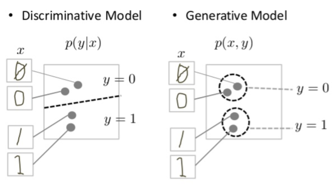

## Table of Contents

## What is a generative model in machine learning?

A generative model in machine learning is a type of model that learns how to generate new data similar to the data it was trained on. Imagine you have a bunch of pictures of dogs. A generative model would learn from these pictures and then be able to create new pictures of dogs that look like they could be part of the original set, even though they are completely new.

These models work by learning the underlying patterns and structures in the data. For example, they might learn what makes a dog look like a dog, including the shape of the ears, the texture of the fur, and the typical colors. Once the model understands these patterns, it can generate new images by combining these features in different ways. Generative models are used in many areas, like creating realistic images, generating text, or even composing music. They are powerful tools because they can produce entirely new content that feels authentic and original.

## How do generative models differ from discriminative models?

Generative models and discriminative models are two different approaches to solving problems in machine learning. Generative models focus on understanding how the data is created. They learn the joint probability distribution of the input features and the output labels, $$P(X, Y)$$. This means they can generate new samples that look like the training data. For example, if you train a generative model on pictures of cats, it could create new cat pictures that look real. They are useful for tasks like data generation and can handle missing data well because they understand the whole data distribution.

On the other hand, discriminative models are all about predicting the output directly from the input. They focus on learning the conditional probability of the output given the input, $$P(Y|X)$$. This makes them good at classification tasks, where you need to decide which category an input belongs to. For instance, if you want to know if a picture shows a cat or a dog, a discriminative model would look at the picture's features and make a prediction. They are often simpler and more accurate for classification because they don't try to model the entire data distribution, just the boundary between different classes.

## What are some common applications of generative models?

Generative models are used in many cool ways. One big use is in creating realistic images and videos. For example, they can make fake pictures of people that look real, or they can turn a sketch into a detailed painting. This is super helpful in the art and entertainment world, where people need new and unique visuals all the time. Also, in the fashion industry, generative models can help design new clothes by mixing and matching different styles and patterns.

Another common use is in generating text. Imagine a computer that can write stories, news articles, or even poetry. Generative models can learn from lots of text and then create new text that sounds like it was written by a human. This is great for things like chatbots, where the computer needs to talk to people in a natural way. It's also used in language translation, where the model can generate sentences in different languages.

Generative models also help in the world of music and sound. They can compose new songs or create sound effects for movies and games. By learning from existing music, these models can mix different styles and come up with something totally new. This is really exciting for musicians and sound designers because it opens up endless possibilities for creativity.

## Can you explain the basic principle behind how generative models work?

Generative models work by learning the patterns and structures in the data they are trained on. Imagine you have a big box of LEGO bricks, and you want to build new creations. The generative model is like someone who has seen lots of LEGO models before and knows how the pieces fit together. It learns how different parts of the data, like colors, shapes, and sounds, come together to make the whole picture. By understanding these patterns, the model can then create new examples that look like they came from the original box of data.

The key idea is that generative models learn the joint probability distribution of the data, which is written as $$P(X, Y)$$. This means they understand how the input features (X) and the output labels (Y) relate to each other. For example, if the model is trained on pictures of dogs, it learns what makes a dog look like a dog - the shape of the ears, the texture of the fur, and so on. Once it has this understanding, the model can generate new pictures of dogs by mixing and matching these learned features in different ways. This ability to create new data that looks real is what makes generative models so powerful and useful in many applications.

## What are the main types of generative models?

There are two main types of generative models: Generative Adversarial Networks (GANs) and Variational Autoencoders (VAEs). GANs work with two models: a generator that makes new data and a discriminator that checks if the data is real or fake. They play a game where the generator tries to fool the discriminator, and the discriminator tries to get better at spotting fakes. Over time, the generator gets really good at making data that looks real. VAEs, on the other hand, learn how to compress data into a simpler form and then expand it back into something that looks like the original data. They do this by learning the probability distribution of the data, $$P(X)$$, and can create new data by sampling from this distribution.

Both types of models have their strengths. GANs are really good at making high-quality, realistic images because of the competition between the generator and discriminator. They can create very detailed and sharp images that are hard to tell apart from real ones. VAEs are great at understanding the structure of the data and can be used for tasks like data compression and denoising. They are also good at generating new data that is similar to the training data, but the images might not be as sharp as those from GANs. Both types of generative models are used in many fields, from art and entertainment to medicine and science, to create new and useful data.

## How does a Generative Adversarial Network (GAN) function?

A Generative Adversarial Network (GAN) works by using two neural networks that compete with each other. One network, called the generator, creates fake data, like pictures or sounds. The other network, called the discriminator, tries to tell if the data is real or fake. They play a game where the generator tries to make data that looks real enough to fool the discriminator, and the discriminator tries to get better at spotting the fakes. Over time, as they keep playing this game, the generator gets better at making realistic data, and the discriminator gets better at telling real from fake.

This back-and-forth process continues until the generator can make data that the discriminator can't tell apart from real data. The generator starts by making random noise and turning it into something that looks like the training data. The discriminator then looks at this data and the real data, and decides which is which. If the discriminator says the generated data is fake, it gives feedback to the generator, so the generator can try again. This cycle helps the generator learn how to make better and better fakes until they are almost indistinguishable from the real thing.

## What is the role of the Variational Autoencoder (VAE) in generative modeling?

A Variational Autoencoder (VAE) is a type of generative model that helps create new data by learning how to compress and then expand it. Imagine you have a big picture that you want to shrink down to a tiny size and then blow it back up to look like the original. A VAE does something similar. It learns to take data, like pictures, and turn it into a smaller, simpler form, which is called the latent space. From this smaller form, the VAE can then create new data that looks a lot like the original data it was trained on.

VAEs work by learning the probability distribution of the data, which is written as $$P(X)$$. This means they understand how the different parts of the data fit together. For example, if you train a VAE on pictures of cats, it learns what makes a cat look like a cat - the shape of the eyes, the color of the fur, and so on. Once the VAE knows this, it can create new pictures of cats by mixing and matching these learned features. VAEs are really good at understanding the structure of the data and can be used for tasks like data compression and denoising, making them a powerful tool in generative modeling.

## How can one evaluate the performance of a generative model?

Evaluating the performance of a generative model can be tricky because it's not just about getting the right answer like in classification tasks. Instead, you want to see how well the model can create new data that looks like the real thing. One common way to do this is by using a metric called the Fréchet Inception Distance (FID). The FID measures how similar the generated data is to the real data by comparing their features. A lower FID score means the generated data is more similar to the real data, which is good. Another way is to use the Inception Score (IS), which looks at both the quality and variety of the generated data. A higher IS means the model is doing a good job at creating diverse and realistic data.

Another approach to evaluating generative models is through human evaluation. This means showing the generated data to people and asking them if it looks real. For example, you could show people pictures created by a model and ask them to rate how realistic they look. This can give you a good idea of how well the model is doing, but it can be time-consuming and subjective. Sometimes, you might also use the model's ability to perform specific tasks, like generating text that makes sense or creating music that sounds good. By testing the model in different ways, you can get a better overall picture of how well it's working.

## What are some challenges faced when training generative models?

Training generative models can be tough because they need a lot of data to learn from. If you don't have enough pictures, sounds, or text, the model might not be able to create new things that look real. Also, these models can take a long time to train because they have to learn a lot about the data. For example, if you're trying to make a model that creates pictures of cats, it needs to learn what makes a cat look like a cat, which can be a lot of information to process. This means you need powerful computers and a lot of patience.

Another challenge is making sure the model creates new things that are different from each other. Sometimes, a generative model might just make the same thing over and over again, which isn't very useful. This is called mode collapse, and it happens when the model finds one way to create data that works well and sticks to it. To avoid this, you have to be careful about how you set up the model and keep an eye on what it's doing. It's like teaching a kid to draw - you want them to try different styles and not just copy the same picture every time.

## How do advancements in hardware, like GPUs, impact the development of generative models?

Advancements in hardware, especially GPUs, have made a big difference in how we develop generative models. GPUs are like super fast computers that can handle a lot of math at the same time. This is really helpful for training generative models because they need to do a lot of calculations to learn from the data. With GPUs, the training process can be much faster, which means we can try out more ideas and make the models better in less time. It's like having a super-powered engine that helps you get to your destination quicker.

These hardware improvements also let us work with bigger and more complicated models. Generative models can be very detailed, and they need a lot of memory and processing power to run smoothly. GPUs give us the power we need to handle these big models, so we can create more realistic images, sounds, and text. This has opened up new possibilities in fields like art, entertainment, and even medicine, where we can use generative models to help with things like designing new drugs or creating realistic simulations.

## What are the latest trends and research directions in generative modeling?

One of the latest trends in generative modeling is the development of more efficient and versatile models. Researchers are working on ways to make generative models train faster and use less data. For example, techniques like transfer learning are becoming popular, where a model trained on one task can be fine-tuned for another. This means we can start with a model that already knows a lot about pictures or text and then teach it to do something new, like creating different styles of art or writing in different languages. Another exciting direction is the use of self-supervised learning, where models learn from the data itself without needing labels, making them more flexible and easier to use.

Another big area of research is improving the quality and diversity of the data generated by these models. Scientists are trying to make sure that generative models can create a wide variety of outputs, not just the same thing over and over. This is important for applications like drug discovery, where you want to generate many different potential new drugs to test. Techniques like normalizing flows and diffusion models are being explored to better understand and control the data distribution $$P(X)$$. These methods help in creating more realistic and varied outputs, which is crucial for making generative models useful in real-world scenarios.

Lastly, there's a growing interest in ethical and responsible use of generative models. As these models become more powerful, it's important to think about how they might be used in ways that could be harmful, like creating fake news or deepfake videos. Researchers are working on ways to detect and prevent misuse, as well as making sure the models are fair and don't produce biased outputs. This involves developing new algorithms and guidelines to ensure that generative models are used in ways that benefit society and respect privacy and ethical standards.

## Can you discuss the ethical considerations and potential societal impacts of deploying generative models?

When we use generative models, we need to think about how they might affect society. These models can make fake pictures, videos, and text that look real. This can be a problem if someone uses them to spread false information or create deepfakes to trick people. It's important to make rules and tools to spot and stop this kind of misuse. Also, we need to make sure these models don't treat people unfairly. For example, if a model learns from data that has biases, like showing only certain types of people, it might create new data that continues those biases. We have to be careful to use fair data and check the models to make sure they don't harm anyone.

Another thing to consider is how generative models can change jobs and the economy. These models can do things like write articles, create art, or even help with medical research. This can be good because they can help us do things faster and better. But it can also mean that some jobs might go away, and people need to learn new skills to keep up. We need to think about how to help people who might lose their jobs because of these technologies. Overall, generative models have a lot of potential to do good things, but we have to use them in a way that is fair and safe for everyone.

## References & Further Reading

[1]: Goodfellow, I., Pouget-Abadie, J., Mirza, M., Xu, B., Warde-Farley, D., Ozair, S., ... & Bengio, Y. (2014). ["Generative Adversarial Nets."](https://arxiv.org/abs/1406.2661) Advances in Neural Information Processing Systems, 27, 2672-2680.

[2]: Kingma, D. P., & Welling, M. (2014). ["Auto-Encoding Variational Bayes."](https://arxiv.org/abs/1312.6114) arXiv preprint arXiv:1312.6114.

[3]: Radford, A., Metz, L., & Chintala, S. (2016). ["Unsupervised Representation Learning with Deep Convolutional Generative Adversarial Networks."](https://arxiv.org/abs/1511.06434) arXiv preprint arXiv:1511.06434.

[4]: Karras, T., Laine, S., Aila, T. (2019). ["A Style-Based Generator Architecture for Generative Adversarial Networks."](https://arxiv.org/abs/1812.04948) Proceedings of the IEEE/CVF Conference on Computer Vision and Pattern Recognition, 4401-4410.

[5]: van den Oord, A., Kalchbrenner, N., Espeholt, L., Vinyals, O., & Graves, A. (2016). ["Conditional Image Generation with PixelCNN Decoders."](https://arxiv.org/abs/1606.05328) arXiv preprint arXiv:1606.05328.

[6]: Brock, A., Donahue, J., & Simonyan, K. (2018). ["Large Scale GAN Training for High Fidelity Natural Image Synthesis."](https://arxiv.org/abs/1809.11096) arXiv preprint arXiv:1809.11096.

[7]: Higgins, I., Matthey, L., Pal, A., Burgess, C., Glorot, X., Botvinick, M., ... & Lerchner, A. (2017). ["beta-VAE: Learning Basic Visual Concepts with a Constrained Variational Framework."](https://openreview.net/forum?id=Sy2fzU9gl) International Conference on Learning Representations.