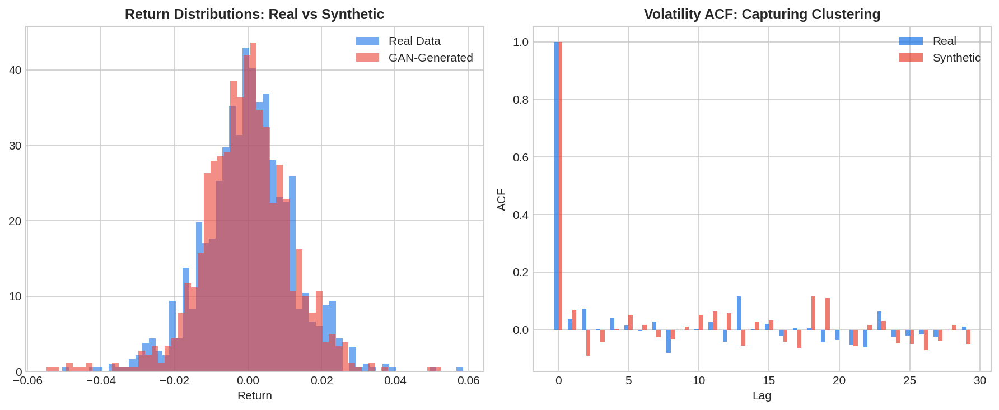

**Generative models for financial data** use deep learning architectures — Generative Adversarial Networks (GANs), Variational Autoencoders (VAEs), and diffusion models — to create synthetic market data that preserves the statistical properties of real data. For algo traders, synthetic data solves several critical problems: augmenting limited training sets, generating stress scenarios not present in historical data, privacy-preserving data sharing, and creating diverse market environments for [RL agent training](https://paperswithbacktest.com/wiki/reinforcement-learning-portfolio-management).

## Why Synthetic Financial Data?

Real financial data has fundamental limitations: history is a single realization of a stochastic process, rare events (crashes, flash crashes) appear only a few times, and the total amount of available data may be insufficient for training complex models. Generative models address this by learning the underlying data distribution and sampling unlimited new examples from it.

The key requirement: synthetic data must preserve the **stylized facts** of real financial data — fat tails, volatility clustering, leverage effects, cross-asset correlations, and the absence of linear return autocorrelation.

## Generative Model Architectures

| Architecture | Mechanism | Strengths | Financial Applications |
|-------------|-----------|-----------|----------------------|
| GAN | Generator vs discriminator adversarial training | Realistic outputs, sharp distributions | Return series, order book simulation |
| VAE | Encoder-decoder with latent space regularization | Smooth latent space, interpolation | Scenario generation, anomaly detection |
| Diffusion | Iterative denoising from noise to data | High quality, stable training | High-dimensional time series |
| Normalizing Flow | Invertible transformations | Exact likelihood, fast sampling | Risk-neutral density estimation |

## How Financial GANs Work

A GAN for financial data consists of two neural networks:

**Generator** $G(z)$: takes random noise $z \sim \mathcal{N}(0, I)$ and produces synthetic return sequences.

**Discriminator** $D(x)$: takes a return sequence and classifies it as real or synthetic.

They train adversarially:

$$\min_G \max_D \; \mathbb{E}_{x \sim p_{\text{data}}}[\log D(x)] + \mathbb{E}_{z \sim p_z}[\log(1 - D(G(z)))]$$

As training progresses, the generator produces increasingly realistic data that the discriminator cannot distinguish from real market data.



## Python Implementation: Simple Financial GAN

```python
import numpy as np

class SimpleFinancialGAN:
    """
    Minimal GAN for generating synthetic return sequences.
    Uses linear layers for simplicity; production uses LSTMs/Transformers.
    """
    def __init__(self, seq_len=50, latent_dim=10, lr=0.01):
        self.seq_len = seq_len
        self.latent_dim = latent_dim
        self.lr = lr
        # Generator weights
        self.G_W = np.random.randn(latent_dim, seq_len) * 0.01
        self.G_b = np.zeros(seq_len)
        # Discriminator weights
        self.D_W = np.random.randn(seq_len, 1) * 0.01
        self.D_b = np.zeros(1)
    
    def generate(self, n_samples=100):
        z = np.random.randn(n_samples, self.latent_dim)
        return np.tanh(z @ self.G_W + self.G_b) * 0.03  # Scale to return range
    
    def discriminate(self, x):
        logits = x @ self.D_W + self.D_b
        return 1 / (1 + np.exp(-logits))  # Sigmoid
    
    def train_step(self, real_data):
        batch_size = len(real_data)
        
        # Train discriminator
        fake_data = self.generate(batch_size)
        real_scores = self.discriminate(real_data)
        fake_scores = self.discriminate(fake_data)
        
        d_loss = -np.mean(np.log(real_scores + 1e-8) + np.log(1 - fake_scores + 1e-8))
        
        # Simple gradient update for D
        d_grad = (fake_data.T @ (fake_scores - 0) - real_data.T @ (1 - real_scores)) / batch_size
        self.D_W -= self.lr * d_grad
        
        # Train generator
        fake_data = self.generate(batch_size)
        fake_scores = self.discriminate(fake_data)
        g_loss = -np.mean(np.log(fake_scores + 1e-8))
        
        return d_loss, g_loss

# Train on real data
np.random.seed(42)
real_returns = np.random.standard_t(5, (500, 50)) * 0.01  # Fat-tailed

gan = SimpleFinancialGAN(seq_len=50)
for epoch in range(100):
    idx = np.random.choice(len(real_returns), 64)
    d_loss, g_loss = gan.train_step(real_returns[idx])
    if epoch % 25 == 0:
        print(f"Epoch {epoch}: D_loss={d_loss:.3f}, G_loss={g_loss:.3f}")

# Generate synthetic data
synthetic = gan.generate(200)
print(f"\nReal data:      mean={real_returns.mean():.5f}, std={real_returns.std():.5f}")
print(f"Synthetic data: mean={synthetic.mean():.5f}, std={synthetic.std():.5f}")
print(f"Real kurtosis:     {np.mean(real_returns**4)/np.mean(real_returns**2)**2:.2f}")
print(f"Synthetic kurtosis: {np.mean(synthetic**4)/np.mean(synthetic**2)**2:.2f}")
```

## Quality Metrics for Synthetic Data

Evaluating synthetic financial data requires domain-specific metrics beyond standard GAN metrics: match of first four moments (mean, variance, skewness, kurtosis), preservation of autocorrelation structure in absolute returns, realistic cross-asset correlation structure, consistent tail behavior (QQ-plots, Hill estimator), and stylized fact preservation score across multiple dimensions.

## Applications for Algo Traders

**Data augmentation**: Expand limited training sets for ML models by generating synthetic samples that preserve the statistical structure of real data. **Stress scenario generation**: Generate realistic crisis scenarios for [stress testing](https://paperswithbacktest.com/wiki/scenario-analysis-stress-testing-portfolio) by conditioning the generative model on extreme latent variables. **Privacy-preserving sharing**: Share synthetic data that mimics proprietary datasets without revealing actual trading data. **RL environment enrichment**: Generate diverse market conditions for training robust [trading agents](https://paperswithbacktest.com/wiki/simulated-market-environments-algo-trading).

## Limitations and Risks

Generative models can produce data that looks realistic but fails to capture critical distributional properties. Mode collapse in GANs can result in synthetic data that lacks diversity. Training instability is common. Most importantly, backtesting on synthetic data provides false confidence if the synthetic data misses important real-world features — always validate on real held-out data.

## Conclusion

Generative models for financial data represent a powerful tool for augmenting the limited historical record. By learning to produce synthetic data that captures the complex statistical properties of real markets, these models enable more robust strategy development, comprehensive stress testing, and efficient RL training. As architectures improve, the boundary between real and synthetic financial data will continue to blur.

---

**Explore further on PapersWithBacktest:**
- Browse [backtested strategies](https://paperswithbacktest.com/strategies) with Python code and performance metrics
- Access [clean historical market data](https://paperswithbacktest.com/datasets) for equities, crypto, and futures
- Take the [algo trading course](https://paperswithbacktest.com/course) — 60+ video lessons and notebooks
- Related wiki pages: [Geometric Brownian Motion Simulation](https://paperswithbacktest.com/wiki/geometric-brownian-motion-simulation-with-python) · [Backtesting with Python](https://paperswithbacktest.com/wiki/backtesting-with-python) · [Neural Networks in Quantitative Trading](https://paperswithbacktest.com/wiki/how-are-neural-networks-used-in-quantitative-trading)
