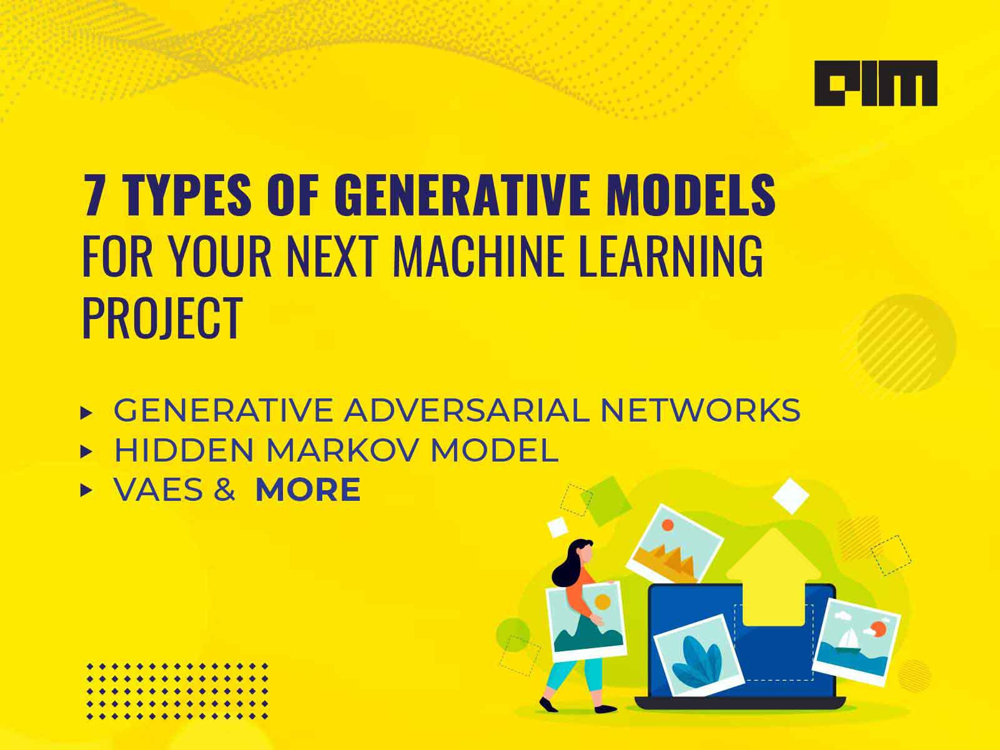

In the fast-paced world of online trading, generative models are transforming the way traders innovate and conduct operations. Generative AI (GenAI) is at the forefront of this transformation, evolving rapidly to produce new patterns and strategies derived from existing data sets. The year 2024 signifies a pivotal moment where the influence of GenAI is more significant than ever, providing traders with innovative methods to analyze markets and manage risks effectively.

As GenAI algorithms progress, they facilitate the generation of new data by identifying intricate patterns within historical datasets. This capability is invaluable in trading, where predicting market trends and developing new strategies require sophisticated analysis of vast amounts of data. Technologies such as Generative Adversarial Networks (GANs) and Variational Autoencoders (VAEs) have become central to these processes. GANs are adept at creating realistic market simulations, which are instrumental for testing and refining trading strategies, whereas VAEs assist in uncovering hidden market patterns that may go unnoticed with traditional methods.



The surge in GenAI’s impact creates an opportunity for algorithmic trading to evolve, addressing diverse scenarios more efficiently than before. This article examines the potential, applications, and associated challenges of GenAI in the trading sector, highlighting its transformative role in redefining market analysis and risk management strategies. By embracing these innovations, traders stand to gain a significant competitive edge in a dynamic market landscape.

## Table of Contents

## Understanding Generative AI in Trading

Generative AI models are specialized algorithms designed to generate new data by identifying and learning patterns from existing datasets. In the context of trading, these models utilize extensive historical market data to forecast future trends and develop innovative trading strategies. Generative AI's ability to simulate potential future scenarios allows traders to refine their approaches and adaptability to market dynamics.

Two prominent technologies exemplify the capabilities of Generative AI in trading: Generative Adversarial Networks (GANs) and Variational Autoencoders (VAEs). GANs consist of two neural networks, a generator and a discriminator, in a continuous feedback loop. The generator creates data resembling real market scenarios, while the discriminator evaluates the authenticity of this data, iteratively improving the generator's outputs. This interaction leads to highly realistic market simulations, empowering traders to test and refine their strategies under plausible future conditions.

Conversely, VAEs adopt a different methodology. By compressing input data into a latent space, VAEs capture essential characteristics and uncover hidden patterns within the market data. The process entails encoding the information into a lower-dimensional representation and sampling new data points from this latent distribution, effectively generating plausible new market scenarios. This capability helps traders identify subtle trends and correlations that might not be evident through traditional analyses.

### Python Example of a Simple GAN Implementation

To illustrate how GANs work, here is a basic Python implementation using TensorFlow:

```python
import tensorflow as tf
from tensorflow.keras import layers

def make_generator_model():
    model = tf.keras.Sequential()
    model.add(layers.Dense(256, activation="relu", input_shape=(100,)))
    model.add(layers.Dense(512, activation="relu"))
    model.add(layers.Dense(1024, activation="relu"))
    model.add(layers.Dense(2))  # Assume market data has two features
    return model

def make_discriminator_model():
    model = tf.keras.Sequential()
    model.add(layers.Dense(1024, activation="relu", input_shape=(2,)))
    model.add(layers.Dense(512, activation="relu"))
    model.add(layers.Dense(256, activation="relu"))
    model.add(layers.Dense(1, activation="sigmoid"))
    return model

generator = make_generator_model()
discriminator = make_discriminator_model()

discriminator.compile(optimizer="adam", loss="binary_crossentropy")
discriminator.trainable = False

gan_input = layers.Input(shape=(100,))
fake_data = generator(gan_input)
gan_output = discriminator(fake_data)

gan_model = tf.keras.Model(gan_input, gan_output)
gan_model.compile(optimizer="adam", loss="binary_crossentropy")
```

In this code, a simple GAN architecture is defined, where both the generator and discriminator are multi-layer perceptrons tailored for generating and validating market data. The training process involves alternately updating the generator and discriminator to improve their respective capabilities.

Generative AI, through its advanced modeling techniques, thus offers traders sophisticated tools to foresee market movements and craft strategic interventions, supporting more informed decision-making processes within the financial landscape.

## How GenAI Models Work

Generative Adversarial Networks (GANs) and Variational Autoencoders (VAEs) are two pivotal technologies in the domain of Generative AI, particularly within trading applications. These models are engineered to generate new data and simulate market scenarios, providing crucial insights and innovative strategies for traders.

GANs are composed of two components: the generator and the discriminator. The generator's role is to create data that resembles real market scenarios, whereas the discriminator evaluates the authenticity of this data, distinguishing between real and generated examples. The interaction between these two components is inherently adversarial; the generator continually strives to improve its outputs to fool the discriminator, while the discriminator enhances its ability to identify generated data. This adversarial process is mathematically represented by the minimax optimization:

$$
\min_G \max_D V(D, G) = \mathbb{E}_{x \sim p_\text{data}(x)}[\log D(x)] + \mathbb{E}_{z \sim p_z(z)}[\log(1 - D(G(z)))]
$$

where $G$ is the generator, $D$ is the discriminator, $p_\text{data}$ represents the distribution of real data, and $p_z$ is the noise distribution used by the generator. This optimization ultimately results in the generator producing high-fidelity synthetic market data, enabling traders to refine their strategies against realistic and varied market conditions.

Variational Autoencoders, on the other hand, implement a different approach by encoding market data into a latent space. This latent representation captures the underlying structure of the data, thus allowing the VAE to generate new, plausible market scenarios that align with the encoded market characteristics. VAEs are particularly useful for scenarios where it is crucial to maintain a balance between exploration of new data points and exploitation of known strategies.

In mathematical terms, a VAE seeks to approximate the true data distribution $p(x)$ with a model distribution $q(z|x)$, where $z$ is the latent variable. The optimization objective is to maximize the Evidence Lower Bound (ELBO):

$$
\log p(x) \geq \mathbb{E}_{q(z|x)}[\log p(x|z)] - D_{KL}(q(z|x) || p(z))
$$

where $p(z)$ is the prior distribution on latent variables, $\mathbb{E}$ denotes expectation, and $D_{KL}$ is the Kullback-Leibler divergence. By focusing on maximizing ELBO, VAEs ensure they can compress, reconstruct, and generate data that closely replicates real market scenarios.

Using these GenAI models, traders can test and optimize their strategies efficiently across diverse and hypothetical market conditions. This adaptability provides a groundbreaking advantage in crafting responses to various trading environments, further enhancing decision-making and risk management processes.

## Reinforcement Learning and Federated Learning in GenAI

Reinforcement Learning (RL) and Federated Learning (FL) are pivotal techniques in enhancing the applicability and efficiency of Generative AI (GenAI) in trading. RL is instrumental in enabling AI models to adaptively optimize trading strategies through a process akin to trial and error. This adaptive learning involves training an agent that interacts with a simulated trading environment, receiving feedback in the form of rewards or penalties based on its actions. The ultimate goal is to learn a policy that maximizes cumulative reward, translating into informed decision-making in live trading scenarios. 

Python's `gym` is a popular toolkit that facilitates the development and testing of RL algorithms. For instance, a basic implementation of a Q-learning algorithm, a type of RL, could look as follows:

```python
import numpy as np
import gym

# Create trading environment
env = gym.make('TradingEnv-v0')
q_table = np.zeros([env.observation_space.n, env.action_space.n])

# Parameters
alpha = 0.1  # Learning rate
gamma = 0.6  # Discount factor
epsilon = 0.1 # Exploration rate

# Training loop
for episode in range(1, 1001):
    state = env.reset()
    done = False

    while not done:
        if np.random.rand() < epsilon:
            action = env.action_space.sample()  # Explore action space
        else:
            action = np.argmax(q_table[state])  # Exploit learned values

        next_state, reward, done, _ = env.step(action)
        q_value = q_table[state, action]
        q_table[state, action] = q_value + alpha * (reward + gamma * np.max(q_table[next_state]) - q_value)
        state = next_state
```

Federated Learning (FL), on the other hand, addresses the challenges of data privacy and security by enabling models to be trained across multiple decentralized devices or servers holding local data, without exchanging the data itself. This distributed approach to model training not only enhances data privacy but also contributes to the robustness of GenAI models by diversifying the data sources involved in training. A typical federated learning pipeline involves initializing a global model, distributing this model to local nodes (e.g., traders' devices), updating the model on these nodes using local data, and then aggregating these updates to improve the global model. 

The incorporation of RL and FL in GenAI signifies a move towards more resilient and secure trading strategies, balancing the need for sophisticated decision-making capabilities with the imperative of safeguarding data.

## The GenAI Market Landscape

The Generative AI (GenAI) market is experiencing significant growth, with projections indicating it will reach $72.4 billion by 2024. This substantial expansion reflects the escalating influence of GenAI technologies within the financial sector. Key financial institutions, including JPMorgan Chase and Numerai, are making substantial investments in GenAI, underscoring its critical role in shaping future financial strategies.

The increasing integration of GenAI in financial markets can be attributed to its ability to provide a competitive edge. GenAI models offer sophisticated data analysis and predictive capabilities, which are vital for formulating advanced trading strategies. The adoption of GenAI opens new possibilities for market simulations, enhanced risk assessments, and personalized trading experiences. As such, financial institutions are leveraging these technologies to optimize their operations and maintain a competitive stance in the rapidly evolving market landscape.

The trajectory of the GenAI market is propelled by a growing recognition of its potential to revolutionize trading systems. Institutions are increasingly relying on GenAI to glean insights from complex datasets, enabling more informed decision-making processes. As the market continues to expand, the strategic deployment of GenAI solutions is likely to become a hallmark of innovation in the financial industry. This trend points not only to its current capabilities but also to its potential to reshape the future of trading, ensuring that the market operates with increased efficiency and intelligence.

## How GenAI is Transforming Online Trading

Generative AI (GenAI) is revolutionizing online trading through enhanced market analysis, optimized trading strategies, and improved risk management. The integration of advanced algorithms allows for more precise pattern recognition in market trends, enabling traders to anticipate movements and make informed decisions. This transformation is fundamentally altering how market data is analyzed, moving beyond traditional statistical methods to incorporate sophisticated [machine learning](/wiki/machine-learning) techniques that offer richer and more actionable insights.

Automated decision-making is a key facet of GenAI's impact on trading. By processing vast amounts of data in real-time, GenAI models can simulate numerous scenarios, offering automated recommendations that adapt to changing market conditions. This capability not only streamlines the trading process but also minimizes human error, thus enhancing overall efficiency and strategic execution. In doing so, GenAI ensures that trading strategies are continuously refined and optimized based on the latest data-driven insights.

Furthermore, GenAI enables personalized trading experiences tailored to the preferences and risk profiles of individual traders. By analyzing behavioral patterns and historical trade data, these generative models can suggest bespoke strategies that align with a trader's unique goals and trading style. This level of personalization fosters greater engagement and loyalty among users, as their specific needs and preferences are addressed with precision.

Traders benefit significantly from the augmented data-driven insights provided by GenAI. These insights not only support strategic decision-making but also facilitate more informed risk management practices. Generative models can identify latent risks and potential market shifts that might not be immediately apparent through conventional analysis. For instance, by training on historical [volatility](/wiki/volatility-trading-strategies) and correlation data, GenAI can predict potential market instabilities and propose strategies to mitigate associated risks.

In summary, the transformative role of GenAI in online trading is evidenced by its ability to enhance analytical capabilities, automate decision-making, and deliver personalized experiences. These advancements empower traders with unprecedented levels of accuracy and efficiency, equipping them with the tools necessary to navigate complex financial markets effectively.

## Comparison: Traditional AI vs GenAI in Trading

Generative AI (GenAI) is transforming trading practices through its advanced adaptability and data creation capabilities, marking a significant evolution over traditional [artificial intelligence](/wiki/ai-artificial-intelligence) (AI) and machine learning (ML) techniques commonly used in trading. Traditional AI/ML models typically rely on predefined algorithms and historical data to identify patterns and make predictions. This approach, while effective, often limits the capability of systems to adapt to novel or changing market conditions.

GenAI, in contrast, excels in generating new data and insights by detecting and synthesizing patterns from large datasets. One of the key advantages of GenAI is its ability to create original strategies and insights that were not previously outlined explicitly within the training data. For instance, Generative Adversarial Networks (GANs) and Variational Autoencoders (VAEs) can simulate realistic market scenarios that assist traders in visualizing and preparing for various future market conditions, thus offering innovative ways to plan trading strategies.

Traditional AI focuses on optimizing strategies that leverage past data points, often leading to static or semi-static systems. These systems are efficient at tasks like classification or regression within known data parameters, yet struggle when market dynamics shift drastically or when new data landscapes emerge.

Blending traditional AI/ML approaches with GenAI models amplifies both systems' strengths. By utilizing the pattern recognition and optimization skills of traditional AI alongside GenAI's data generation and adaptability, traders can build more robust and resilient trading systems. For instance, in a trading algorithm, the initial parameters and constraints can be set using traditional AI systems to establish a framework of known successful strategies. GenAI can then iterate on this framework, generating new strategies that can be tested within simulated environments, thereby uncovering potentially profitable avenues that were not apparent in historical analysis alone.

The integration of these advanced technologies can also enhance the speed and efficiency of data collection and analysis, a crucial [factor](/wiki/factor-investing) in the fast-paced trading environment. The synergistic use of traditional AI/ML with GenAI could lead to the development of advanced systems that are not only predictive but also prescriptive, guiding traders with comprehensive strategies that consider a wider range of market variables and potential outcomes.

In summary, while traditional AI offers consistency and reliability through predefined models, GenAI brings creativity and adaptability, rendering it particularly suitable for the dynamic and often unpredictable nature of financial markets. The combination of these technologies holds the promise of more sophisticated and dependable trading systems capable of responding effectively to the complexities of modern markets.

## NexusTrade: A GenAI-Powered Trading Platform

NexusTrade stands out as a premier platform that leverages Generative AI (GenAI) to empower traders with cutting-edge tools and analytical capabilities. This platform integrates a suite of features designed to enhance the trading experience, spearheaded by its flagship component, Aurora AI. Aurora AI acts as an intuitive strategy builder, enabling traders to devise, test, and optimize trading strategies with precision. By analyzing vast datasets, Aurora AI uncovers patterns and trends, providing users with strategic insights otherwise difficult to discern.

Further enriching NexusTrade's offerings is its capacity to deliver real-time market insights. This feature capitalizes on GenAI's strength in processing and analyzing streaming data, ensuring that traders remain informed of market dynamics as they unfold. By maintaining an up-to-date understanding of market conditions, traders can make more agile and informed decisions.

Sentiment analysis represents another critical component of NexusTrade, leveraging GenAI to assess market sentiment from various data sources, such as news articles and social media. By quantifying market sentiment and correlating it with historical price movements, NexusTrade aids traders in anticipating market shifts driven by public perception and reactions.

NexusTrade's commitment to democratizing access to innovative trading technologies is evident in its user-centric design. The platform is structured to accommodate both novice and experienced traders, providing tools that are both sophisticated yet accessible. By lowering the barriers to entry, NexusTrade fosters greater trader engagement and performance, promoting a more inclusive and competitive trading environment.

The integration of these advanced features within NexusTrade exemplifies how GenAI's capabilities can be harnessed to transform trading practices, offering traders not only the tools to remain competitive but also the insights to excel in a constantly evolving market landscape.

## Challenges and Opportunities

Generative AI (GenAI) presents both challenges and opportunities for the trading sector, shifting traditional paradigms and introducing innovative capabilities. Among the primary challenges is data quality. High-quality data is crucial since GenAI models rely on learning from extensive datasets. Poor data quality can lead to inaccurate predictions and flawed trading strategies. Addressing this involves ensuring data integrity, timeliness, and accuracy, requiring robust data management systems.

Model explainability is another critical challenge. As GenAI models become more complex, understanding their decision-making processes becomes difficult. This opacity can be problematic for traders who need to comprehend and trust the model's outputs. Developing methods to enhance model explainability, such as incorporating Explainable AI (XAI) techniques, can aid traders in understanding and validating the strategies generated by GenAI models.

Regulatory compliance is a significant concern when integrating GenAI into trading systems. Financial markets are heavily regulated to ensure fairness and protect investors. As GenAI continues to evolve, ensuring that these models comply with existing regulations and adapting to new frameworks will be essential. This includes adhering to guidelines around data usage, model transparency, and decision accountability.

System integration poses another hurdle. Incorporating GenAI models into existing trading infrastructures requires seamless integration with current systems and processes. This often involves overcoming technical incompatibilities and ensuring that the new models complement rather than disrupt established workflows. Effective integration strategies and modular software solutions can facilitate this process.

Despite these challenges, GenAI offers substantial opportunities for the trading industry. It can drive innovation by enabling the creation of advanced trading strategies that adapt swiftly to market changes. GenAI enhances fairness in trading by democratizing access to sophisticated analytical tools, traditionally available only to large financial institutions. By lowering the barriers to entry, GenAI empowers individual traders with personalized support, leveling the playing field.

Moreover, GenAI can lead to the democratization of financial trading by making complex trading tools accessible to a wider range of users. This democratization can contribute to financial inclusion, allowing more individuals to participate in trading and benefit from market opportunities.

To fully exploit the potential of GenAI, it is imperative to overcome these challenges through strategic investment in technology development, regulatory collaboration, and education initiatives. By doing so, the trading industry can harness the power of GenAI to foster a more innovative, fair, and inclusive financial market.

## Socio-Economic Impacts of GenAI in Trading

Generative Artificial Intelligence (GenAI) in trading brings complex socio-economic impacts that extend beyond mere automation. One major concern is job displacement; however, GenAI primarily enhances, rather than eliminates, human expertise by augmenting analytical capabilities and offering new avenues for professional development in finance. Traditional trading roles may evolve, with professionals becoming curators of AI strategies and overseers of automated systems rather than executors of manual trades.

Beyond employment, GenAI fosters financial inclusion by democratizing access to sophisticated trading tools. These advanced technologies, previously reserved for large institutions with substantial resources, are increasingly available to individual traders and smaller firms. By leveraging vast computational power and intuitive interfaces, GenAI platforms enable a wider array of participants to engage in markets, irrespective of their experience level.

Moreover, GenAI lowers barriers to market entry, creating opportunities for novices to receive personalized support. By analyzing user behavior and market responses, GenAI systems can offer tailored advice and strategies, akin to personalized coaching. This adaptability can significantly diminish the learning curve associated with market entry for new traders, promoting greater participation across different demographic groups.

Furthermore, the integration of GenAI may lead to broader shifts in market dynamics. As access to trading tools becomes more widespread, the diversity of market participants could increase [liquidity](/wiki/liquidity-risk-premium) and enhance price discovery mechanisms. This evolution might lead to more resilient markets that better reflect the aggregate sentiments and decisions of a global populace.

In summary, while GenAI introduces challenges, such as the potential redefinition of job roles within the trading sector, it simultaneously offers opportunities for unprecedented inclusivity and market participation, paving the way for a more democratized and dynamic financial ecosystem.

## Future of GenAI in Trading

The future of Generative AI (GenAI) in trading is poised for significant advancements and innovations, reshaping the industry landscape. Developments in robo-advisors are enhancing the level of automation in trading by incorporating sophisticated GenAI algorithms. These algorithms can analyze vast datasets, extracting pertinent information to provide personalized financial advice and execute trades with increased precision and efficiency. This shift is expected to make wealth management services more accessible to a broader audience, democratizing finance.

Decentralized trading networks represent another frontier in trading innovation facilitated by GenAI. These networks, built on blockchain technology, allow for peer-to-peer trading without the need for traditional intermediaries. The integration of GenAI can improve the efficiency and security of these networks by optimizing transaction validation processes and providing real-time risk assessments. Additionally, GenAI-driven decentralized networks can adapt to market changes swiftly, fostering a more resilient trading ecosystem.

Adaptive risk management is another critical area where GenAI is making strides. By continuously learning from new data and evolving market conditions, GenAI models can offer dynamic risk assessment and mitigation strategies. This capability is particularly beneficial in volatile markets, where traditional risk models may fall short. GenAI empowers traders to make informed decisions, balancing potential rewards against inherent risks more effectively.

The emergence of Explainable AI (XAI) is addressing the challenge of transparency in GenAI models. XAI focuses on making the decision-making processes of AI systems more understandable to humans. This is crucial in trading, where stakeholders demand transparency and accountability. The application of XAI in GenAI models can enhance trust and reliability by elucidating how conclusions are reached, thereby aiding compliance with regulatory standards.

Ongoing advancements in GenAI suggest that trading systems and strategies will continue to evolve, offering exciting opportunities for innovation. The ability of GenAI to generate new insights and adapt to an ever-changing market environment ensures that traders equipped with these technologies remain at the forefront of the financial sector.

## Technical Analysis with Google Gemini

Google Gemini's cloud capabilities provide a robust platform for deploying and testing machine learning models specifically designed for trading analysis. This technology plays a critical role in enhancing traders' insights into market movements through technical analysis. A key feature of Google Gemini is its support for technical analysis using candlestick data, a method popular among traders for predicting market trends and making informed trading decisions.

Candlestick charts illustrate a range of data within a specified period, typically displaying open, high, low, and close prices, and visually interpret market sentiment. The utilization of candlestick data on Google Gemini enables traders to perform comprehensive market analyses, ultimately augmenting their strategic decision-making. Leveraging the expansive computational resources offered by Google's cloud infrastructure, traders can swiftly execute complex analyses that incorporate GenAI-powered algorithms to predict future price movements and devise effective trading strategies.

One possible approach involves the use of machine learning models to identify candlestick patterns automatically. For example, a GenAI model can be trained to recognize various candlestick formations, such as Doji, Hammer, or Engulfing patterns, which are indicative of potential price reversals or continuations. Here's a simple Python code snippet that illustrates how a machine learning model might categorize candlestick patterns:

```python
import pandas as pd
from sklearn.ensemble import RandomForestClassifier

# Sample data loading
data = pd.read_csv('candlestick_data.csv')
X = data[['open', 'high', 'low', 'close']]
y = data['pattern_label']  # Assume this column has labels for patterns

# Train a simple Random Forest model
model = RandomForestClassifier()
model.fit(X, y)

# Predicting patterns on new data
new_data = pd.read_csv('new_candlestick_data.csv')
predictions = model.predict(new_data[['open', 'high', 'low', 'close']])
```

By applying these models within Google Gemini, traders gain advanced analytical tools that can adapt to changing market conditions and theoretical frameworks. These capabilities are crucial for designing automated trading systems that not only identify favorable market conditions but also recommend precise entry and [exit](/wiki/exit-strategy) points. Moreover, the real-time data processing capabilities of Google Gemini allow traders to promptly act on market fluctuations, effectively aligning their trading actions with evolving market sentiment.

In conclusion, Google Gemini enhances the technical analysis capabilities available to traders, facilitating a more nuanced understanding of market behaviors through sophisticated machine learning models and extensive candlestick data analysis. This allows for more precise prediction and strategy formulation, making it an indispensable tool in the modern trading toolkit.

## Conclusion

Generative AI (GenAI) is revolutionizing the trading landscape, significantly enhancing data-driven decision-making capabilities. By leveraging complex algorithms that generate new data from existing patterns, GenAI empowers traders to uncover novel insights and strategies, thus reshaping the dynamics of financial markets. The adaptability and efficiency of GenAI allow for more sophisticated analysis and optimization of trading strategies than traditional methods could offer.

However, the integration of GenAI into trading is not without its challenges. Key issues such as interpretability and regulatory compliance present significant hurdles. Interpretability is crucial, as traders need to trust and understand the decision-making processes of GenAI models. Regulatory bodies also demand transparency and adherence to specific guidelines to ensure market integrity and prevent undue risks.

Despite these challenges, the potential benefits of GenAI in trading are immense. The technology facilitates the creation of personalized, automated trading strategies that can adapt to ever-changing market conditions. By enhancing predictive accuracy and enabling more nuanced market understanding, GenAI equips traders with tools necessary to gain a competitive edge.

Therefore, traders are encouraged to embrace and integrate GenAI innovations actively into their trading processes. By doing so, they can not only maintain relevancy in the rapidly evolving market landscape but also unlock new opportunities for growth and profitability. This proactive adoption of GenAI will ensure that traders are better positioned to navigate the complexities and demands of modern financial markets.

## References & Further Reading

[1]: Goodfellow, I., Pouget-Abadie, J., Mirza, M., Xu, B., Warde-Farley, D., Ozair, S., ... & Bengio, Y. (2014). ["Generative Adversarial Nets."](https://arxiv.org/abs/1406.2661) Advances in Neural Information Processing Systems, 27.

[2]: Kingma, D. P., & Welling, M. (2013). ["Auto-Encoding Variational Bayes."](https://arxiv.org/abs/1312.6114) arXiv preprint arXiv:1312.6114.

[3]: Silver, D., Huang, A., Maddison, C. J., Guez, A., Sifre, L., Van Den Driessche, G., ... & Hassabis, D. (2016). ["Mastering the Game of Go with Deep Neural Networks and Tree Search."](https://www.nature.com/articles/nature16961) Nature, 529(7587), 484-489.

[4]: ["Machine Learning for Asset Managers"](https://epubs.siam.org/doi/book/10.1137/1.9781611977905) by Marcos Lopez de Prado

[5]: Kairouz, P., McMahan, H. B., Avent, B., Bellet, A., Bennis, M., Bhagoji, A. N., ... & Zhao, S. (2021). ["Advances and Open Problems in Federated Learning."](https://arxiv.org/abs/1912.04977) Foundations and Trends® in Machine Learning, 14(1), 1-210.

[6]: Sutton, R. S., & Barto, A. G. (2018). ["Reinforcement Learning: An Introduction."](https://web.stanford.edu/class/psych209/Readings/SuttonBartoIPRLBook2ndEd.pdf) MIT Press.

[7]: Amodei, D., Olah, C., Steinhardt, J., Christiano, P., Schulman, J., & Mane, D. (2016). ["Concrete Problems in AI Safety."](https://arxiv.org/abs/1606.06565) arXiv preprint arXiv:1606.06565.

[8]: Heaton, J. B., Polson, N. G., & Witte, J. H. (2017). ["Deep Learning for Finance: Deep Portfolios."](https://www.semanticscholar.org/paper/Deep-Learning-in-Finance-Heaton-Polson/0d79c56fe25c1c45b3c55dc9cda8cb863a045c09) Applied Stochastic Models in Business and Industry, 33(1), 3-12.