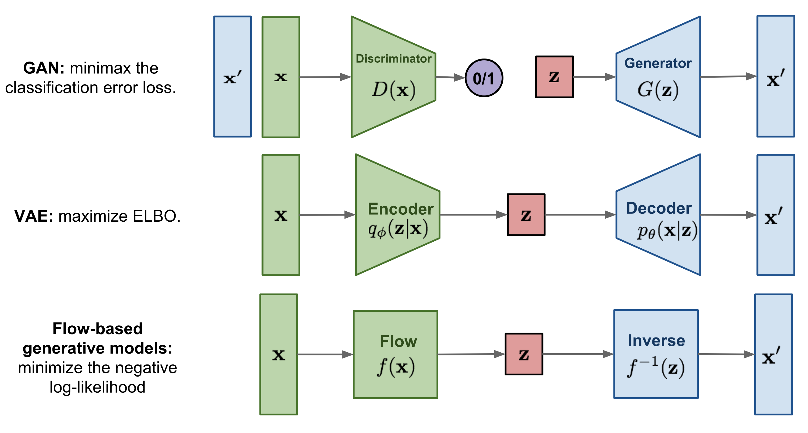

## Table of Contents

## What are generative sequence models in machine learning?

Generative sequence models are a type of machine learning model that can create new sequences of data, like text, music, or even DNA sequences. They learn patterns from existing data and then use those patterns to generate new, similar sequences. Imagine you have a bunch of sentences, and you want the model to learn how to make new sentences that sound like they could come from the same book or author. The model looks at the order of words and how they connect to each other, and then it tries to mimic that style when creating new sentences.

These models often use something called a "probability distribution" to decide what the next item in the sequence should be. For example, if the model is generating text, it might look at the last few words it has written and then choose the next word based on which word is most likely to come next. This is done using math that can be quite complex, but the basic idea is that the model keeps track of how often certain sequences appear in the training data and uses that information to make its choices. A common way to represent this is with a formula like $$ P(x_{t+1} | x_1, x_2, ..., x_t) $$, where $$ x_{t+1} $$ is the next item in the sequence, and $$ x_1, x_2, ..., x_t $$ are all the items that came before it.

Some popular types of generative sequence models include Recurrent Neural Networks (RNNs), Long Short-Term Memory networks (LSTMs), and more recent models like Transformers. Each of these models has its own way of handling sequences, but they all share the goal of generating new data that looks like the data they were trained on. For example, an LSTM might be used to predict the next word in a sentence, while a Transformer might be used to generate a whole paragraph of text. The choice of model depends on the specific task and the kind of data you're working with.

## How do generative sequence models differ from discriminative models?

Generative sequence models and discriminative models are two different approaches in [machine learning](/wiki/machine-learning). Generative sequence models focus on learning the underlying patterns in data to generate new sequences that are similar to the training data. They do this by modeling the joint probability distribution of the input data and the output, which means they try to understand how all the pieces fit together. For example, if you're generating text, a generative model would learn how words typically follow each other and then use that knowledge to create new sentences. This can be represented with a formula like $$ P(x, y) $$, where $$ x $$ is the input and $$ y $$ is the output.

On the other hand, discriminative models focus on learning the boundary between different classes of data. They are more concerned with predicting the output given the input, rather than understanding the full structure of the data. Discriminative models directly model the conditional probability $$ P(y | x) $$, which means they try to find the best way to predict $$ y $$ when given $$ x $$. For instance, if you're classifying emails as spam or not spam, a discriminative model would learn the features that make an email likely to be spam and use those to make predictions. While generative models can be used for tasks like generating new data, discriminative models are typically better at tasks like classification where the goal is to make accurate predictions.

In summary, the key difference is that generative sequence models aim to understand and replicate the entire data distribution, allowing them to generate new data, while discriminative models focus on distinguishing between different classes of data to make accurate predictions. Both types of models have their strengths and are used in different scenarios depending on the specific task at hand.

## What is the basic principle behind the operation of generative sequence models?

The basic principle behind the operation of generative sequence models is to learn the patterns in sequences of data, like words in a sentence or notes in a piece of music, and then use those patterns to create new sequences. Imagine you're trying to write a story in the style of your favorite author. You would read a lot of their work to understand how they use words, how they structure sentences, and how they develop characters. A generative sequence model does something similar, but with math. It looks at lots of examples of sequences and figures out the probability of one item following another. For example, if the model is generating text, it might learn that the word "the" is often followed by a noun. This can be represented with a formula like $$ P(x_{t+1} | x_1, x_2, ..., x_t) $$, where $$ x_{t+1} $$ is the next item in the sequence, and $$ x_1, x_2, ..., x_t $$ are all the items that came before it.

Once the model has learned these patterns, it can start generating new sequences. It does this by choosing each new item based on the probabilities it learned from the training data. If the model is generating text and it has just written "the," it might choose the next word by looking at the probabilities of different words following "the" in the training data. Over time, the model can generate entire sequences that look like they could have come from the original data. This ability to create new sequences is what makes generative sequence models so powerful and useful in fields like natural language processing, music composition, and even biology, where they can be used to generate new DNA sequences.

## Can you explain the architecture of a typical generative sequence model?

A typical generative sequence model often uses a [neural network](/wiki/neural-network) architecture, like a Recurrent Neural Network (RNN) or a Transformer. These models are designed to handle sequences of data, such as words in a sentence or notes in a piece of music. The core idea is to learn the patterns in the sequences and then use those patterns to generate new sequences. For example, an RNN processes the sequence one item at a time, keeping track of what it has seen so far in a hidden state. This hidden state helps the model understand the context of the sequence, which is crucial for generating coherent new sequences. The model uses this information to predict the next item in the sequence based on a probability distribution, which can be represented as $$ P(x_{t+1} | x_1, x_2, ..., x_t) $$, where $$ x_{t+1} $$ is the next item and $$ x_1, x_2, ..., x_t $$ are the items that came before it.

Transformers, on the other hand, use a different approach called self-attention. Instead of processing the sequence one item at a time, a Transformer looks at all the items in the sequence at once. It calculates how much each item should pay attention to every other item, which helps the model understand the relationships between different parts of the sequence. This attention mechanism allows the model to capture long-range dependencies in the data, which can be very useful for generating coherent and contextually relevant sequences. Both RNNs and Transformers have an output layer that converts the model's internal representations into actual predictions, like choosing the next word in a sentence. The choice between these architectures depends on the specific task and the type of data being used.

## What are some common applications of generative sequence models?

Generative sequence models are used in many cool ways. One common use is in writing stories or articles. These models can learn how people write and then create new stories or articles that sound like they were written by a human. For example, if you give the model a bunch of stories by a certain author, it can learn the style and then write new stories that sound like they were written by that author. This is done by looking at the patterns in the words and sentences and then using those patterns to make new ones. The model uses a formula like $$ P(x_{t+1} | x_1, x_2, ..., x_t) $$ to decide what the next word should be, based on the words that came before it.

Another use is in making music. Generative sequence models can learn how to make new songs by looking at a lot of existing music. They can figure out how notes and rhythms usually go together and then create new music that sounds similar. This is really helpful for musicians who want to try out new ideas or for people who want to make music but don't know how to play an instrument. Just like with writing, the model uses the patterns it learns to generate new sequences of notes and rhythms.

Generative sequence models are also used in biology to create new DNA sequences. Scientists can use these models to understand how genes work and then create new genes that might be useful for things like medicine. The model looks at a lot of DNA data and learns the patterns in the sequences. Then, it can generate new sequences that might have certain properties that scientists are interested in. This is a powerful tool for research and can help us learn more about how life works.

## How does the TD-VAE model work as a generative sequence model?

The TD-VAE, or Temporal Difference Variational Autoencoder, is a type of generative sequence model that combines ideas from [reinforcement learning](/wiki/reinforcement-learning) and variational autoencoders. It's designed to generate sequences by learning how to predict future states based on past states. Imagine you're playing a video game and you want to predict what will happen next based on what you've seen so far. The TD-VAE does something similar, but with data. It uses a formula like $$ P(x_{t+1} | x_1, x_2, ..., x_t) $$ to figure out what the next item in a sequence should be, based on the items that came before it. The model learns by comparing its predictions to what actually happens in the data, and it uses this information to get better at generating new sequences.

In the TD-VAE, there's a part called the encoder that takes in the sequence data and turns it into a simpler form called a latent space. This latent space is like a map that the model uses to understand the data. Then, there's a part called the decoder that takes the latent space and turns it back into a sequence. The model also uses something called temporal difference learning, which helps it learn from the differences between what it predicts and what actually happens. This makes the TD-VAE really good at generating sequences that look like the ones it was trained on. For example, if you train it on a bunch of sentences, it can learn how words usually go together and then create new sentences that sound like they could have been written by the same author.

## What are the key components of the TD-VAE architecture?

The TD-VAE, or Temporal Difference Variational Autoencoder, has a few main parts that help it generate sequences. One part is called the encoder, which takes in the sequence data and turns it into a simpler form called a latent space. This latent space is like a map that the model uses to understand the data. The encoder uses math to figure out the best way to represent the data in this map. Another part is the decoder, which takes the latent space and turns it back into a sequence. The decoder also uses math to make sure the new sequence looks like the ones it was trained on. The model uses a formula like $$ P(x_{t+1} | x_1, x_2, ..., x_t) $$ to figure out what the next item in a sequence should be, based on the items that came before it.

Another important part of the TD-VAE is the temporal difference learning. This is a way for the model to learn from the differences between what it predicts and what actually happens in the data. The model keeps track of these differences and uses them to get better at generating new sequences. This makes the TD-VAE really good at predicting what will happen next in a sequence, which is helpful for creating new sequences that look like the ones it was trained on. For example, if you train it on a bunch of sentences, it can learn how words usually go together and then create new sentences that sound like they could have been written by the same author.

## How does TD-VAE handle the challenge of modeling long sequences?

The TD-VAE, or Temporal Difference Variational Autoencoder, handles the challenge of modeling long sequences by using a special kind of learning called temporal difference learning. This method helps the model learn from the differences between what it predicts and what actually happens in the data. By doing this, the model can better understand the patterns in long sequences and predict what will happen next. It uses a formula like $$ P(x_{t+1} | x_1, x_2, ..., x_t) $$ to figure out what the next item in a sequence should be, based on the items that came before it. This way, even if the sequence is long, the model can keep track of the important parts and use them to generate new sequences that make sense.

Another way the TD-VAE deals with long sequences is by using a latent space. The encoder part of the model turns the sequence data into a simpler form called a latent space. This latent space is like a map that helps the model understand the data. Even if the sequence is long, the latent space can capture the important patterns and relationships. Then, the decoder part of the model uses this map to turn the latent space back into a sequence. This makes it easier for the model to generate new sequences that are coherent and similar to the ones it was trained on, even when the sequences are long and complex.

## What are the advantages of using TD-VAE over other generative sequence models?

One of the main advantages of using TD-VAE over other generative sequence models is its ability to learn from the differences between what it predicts and what actually happens in the data. This method, called temporal difference learning, helps the model understand long sequences better. For example, if you're trying to predict the next word in a long sentence, TD-VAE can keep track of the important parts of the sentence and use them to make better predictions. This is done using a formula like $$ P(x_{t+1} | x_1, x_2, ..., x_t) $$, where the model figures out what the next item should be based on the items that came before it.

Another advantage is that TD-VAE uses a latent space to represent the data in a simpler form. This makes it easier for the model to understand and generate long sequences. The encoder part of the model turns the sequence into a latent space, which is like a map that captures the important patterns and relationships in the data. Then, the decoder part uses this map to turn the latent space back into a sequence. This way, even if the sequence is long and complex, the model can generate new sequences that are coherent and similar to the ones it was trained on.

## How can the performance of a generative sequence model like TD-VAE be evaluated?

The performance of a generative sequence model like TD-VAE can be evaluated in a few different ways. One common way is to look at how well the model can generate new sequences that are similar to the ones it was trained on. For example, if you train the model on a bunch of sentences, you can see if the new sentences it generates sound like they could have been written by the same author. This can be done by comparing the generated sequences to the original ones using measures like perplexity, which tells you how surprised the model is by the data. A lower perplexity means the model is better at predicting what comes next in a sequence, which is a good sign that it's working well. You can also use human evaluators to read the generated sequences and rate how good they are.

Another way to evaluate the performance of a TD-VAE is to look at how well it can handle long sequences. Since TD-VAE uses temporal difference learning, it's good at understanding long sequences and predicting what will happen next. You can test this by giving the model longer sequences and seeing if it can still generate coherent and meaningful new sequences. This can be measured using metrics like the BLEU score, which compares the generated sequences to reference sequences to see how similar they are. If the model can generate good sequences even when they are long, that's a sign that it's working well. Overall, the goal is to make sure the model can generate new sequences that are both similar to the training data and make sense on their own.

## What are some limitations or challenges faced when implementing TD-VAE?

One challenge when implementing TD-VAE is handling the complexity of long sequences. Even though TD-VAE is good at understanding long sequences using temporal difference learning, it can still be hard to make sure the model keeps track of all the important parts. For example, if you're trying to predict the next word in a long sentence, the model needs to remember what happened at the beginning of the sentence. This can be tricky because the model has to balance understanding the whole sequence with focusing on the most recent parts. If it doesn't do this well, the generated sequences might not make sense or might not be similar to the training data.

Another limitation is the computational resources needed to train and use TD-VAE. Because the model uses a latent space and needs to learn from the differences between its predictions and the actual data, it can take a lot of time and computer power to get it working well. This can be a problem if you don't have access to powerful computers or if you need to generate sequences quickly. For example, if you're trying to generate new music or stories in real-time, you might find that TD-VAE takes too long to produce results. This means you might need to find a balance between the model's performance and the resources you have available.

## What recent advancements have been made in the field of generative sequence models beyond TD-VAE?

Recent advancements in generative sequence models have gone beyond TD-VAE and include models like the Transformer and its variants. One notable advancement is the development of the Generative Pre-trained Transformer (GPT) series. These models use a self-attention mechanism to understand the relationships between different parts of a sequence, which helps them generate coherent and contextually relevant text. For example, if you're generating a story, a Transformer can look at all the words at once and figure out how they connect, making the story more interesting and realistic. This is different from TD-VAE, which focuses more on learning from the differences between predictions and actual data. The self-attention mechanism in Transformers is represented as $$ \text{Attention}(Q, K, V) = \text{softmax}\left(\frac{QK^T}{\sqrt{d_k}}\right)V $$, where $$ Q $$, $$ K $$, and $$ V $$ are query, key, and value matrices, respectively.

Another advancement is the use of diffusion models for generating sequences. Diffusion models work by gradually adding noise to data and then learning to reverse this process to generate new data. This approach has been successful in generating high-quality images and is now being applied to sequence data like text and music. For instance, a diffusion model can start with a random sequence of words and then refine it step by step to create a coherent story or song. This method can produce sequences that are more diverse and creative than those generated by traditional models like TD-VAE. The process of denoising in diffusion models can be described by the formula $$ x_t = \sqrt{\bar{\alpha}_t} x_0 + \sqrt{1 - \bar{\alpha}_t} \epsilon $$, where $$ x_t $$ is the noisy data at time step $$ t $$, $$ x_0 $$ is the original data, $$ \epsilon $$ is random noise, and $$ \bar{\alpha}_t $$ is a parameter that controls the noise level.