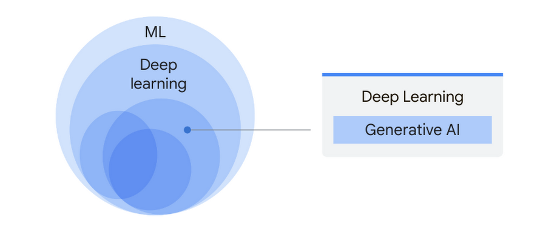

## Table of Contents

## What is Generative Training in the context of Machine Learning?

Generative training in machine learning is a method where a model learns to generate new data that is similar to the data it was trained on. This approach is often used in tasks like text generation, image creation, and music composition. The idea is to understand the underlying patterns and structures of the training data so well that the model can produce new, original content that looks like it could have come from the same source.

One common technique used in generative training is the use of generative adversarial networks (GANs). In a GAN, there are two models: a generator and a discriminator. The generator tries to create data that looks real, while the discriminator tries to tell the difference between the generated data and real data. They compete against each other, and through this competition, the generator gets better at making realistic data. This back-and-forth process helps the model learn how to produce high-quality, believable outputs.

## How does Generative Training differ from Discriminative Training?

Generative training and discriminative training are two different approaches to building machine learning models. In generative training, the model learns how to generate new data that looks like the data it was trained on. It does this by understanding the patterns and structures of the training data. For example, if you train a model on pictures of dogs, a generative model would learn to create new pictures of dogs that look real. This is often done using techniques like generative adversarial networks (GANs), where one part of the model generates data and another part tries to tell if it's real or fake. They keep improving until the generated data is very good.

On the other hand, discriminative training focuses on learning the differences between different types of data. Instead of generating new data, a discriminative model tries to classify or predict based on the input it gets. For example, if you train a model on pictures of dogs and cats, a discriminative model would learn to tell the difference between them and label new pictures correctly. Discriminative models are often used in tasks like image recognition, spam detection, and speech recognition. They are usually simpler and can be more accurate for classification tasks because they directly learn the boundary between classes.

In summary, generative training is about creating new data that matches the training set, while discriminative training is about distinguishing between different types of data. Both approaches have their uses, and the choice between them depends on what you want your model to do. Generative models can be more complex but offer creative possibilities, whereas discriminative models are often more straightforward and effective for classification tasks.

## What are some common applications of Generative Training?

Generative training is used in many cool ways. One big use is in making new pictures or videos. For example, artists and designers can use generative models to create new art or special effects for movies. These models learn from lots of pictures and then make new ones that look real. They can even make pictures of things that don't exist in real life, like a dog with wings. Another fun use is in games, where generative models can create new worlds or characters, making each game different and exciting.

Another important use of generative training is in writing and music. With text, generative models can write stories, poems, or even news articles. They learn from lots of text and then make new text that sounds like it was written by a human. In music, these models can compose new songs or change existing ones to sound different. This helps musicians come up with new ideas or finish songs they are working on. It's like having a creative partner that never runs out of ideas.

Generative training also helps in more serious areas like science and medicine. In science, these models can help predict how molecules will behave or even design new ones for medicines. In medicine, they can generate realistic images of body parts from scans, helping doctors see things more clearly. This can lead to better diagnoses and treatments. Overall, generative training opens up a world of possibilities, from art and entertainment to science and health.

## Can you explain the concept of Denoising Score Matching in Generative Training?

Denoising Score Matching is a way to train generative models, especially those used in creating images or other data. It works by adding noise to the data on purpose and then teaching the model to take away this noise. Imagine you have a clear picture, and you scribble over it with a marker. The model's job is to learn how to clean up the scribbles and get back the original picture. By doing this over and over with different amounts of noise, the model gets better at understanding the data's true shape and patterns. This helps the model create new, clean data that looks like the original data it was trained on.

In more technical terms, denoising score matching involves estimating the score function, which is the gradient of the log probability density of the data. The model learns to predict this score by minimizing the difference between the true score and the model's estimate. The formula for the loss function in denoising score matching is $$ \mathbb{E}_{x,\epsilon} \left[ \left\| s_\theta(x + \sigma \epsilon) - \frac{\epsilon}{\sigma} \right\|^2 \right] $$, where $$ x $$ is the data, $$ \epsilon $$ is the noise, $$ \sigma $$ is the noise level, and $$ s_\theta $$ is the model's estimate of the score. By training the model to minimize this loss, it learns to effectively remove noise and understand the underlying structure of the data, which is crucial for generating new, high-quality samples.

## How does the Informative Sample Mining Network contribute to Generative Training?

The Informative Sample Mining Network helps make generative training better by [picking](/wiki/asset-class-picking) out the most useful pieces of data to learn from. In generative training, the model tries to create new data that looks like the data it was trained on. But not all data is equally helpful for this task. The Informative Sample Mining Network looks at the data and finds the parts that are most important for the model to learn from. By focusing on these key pieces, the model can learn more effectively and create better new data.

This network works by figuring out which samples in the training data will help the model the most. It does this by measuring how much each sample can teach the model about the patterns and structures in the data. Once it finds these important samples, it gives them more attention during training. This way, the model can learn faster and make higher quality new data. It's like studying the most important parts of a textbook to do well on a test.

## What is ILVR and how does it apply to Generative Training?

ILVR stands for Iterative Latent Variable Refinement, and it's a way to make generative training better. In generative training, the goal is to teach a model to make new data that looks like the data it learned from. ILVR helps by improving how the model understands the hidden patterns in the data. It does this by going through the data again and again, each time making the model's understanding a bit better. Think of it like fixing a blurry picture: each time you adjust it, the picture gets clearer.

In more detail, ILVR works by using something called latent variables, which are hidden factors that help explain the data. The model starts with a guess about these variables and then keeps refining them. It does this by looking at how well the current guess matches the data and then making small changes to get closer to the truth. The formula for this process can be written as $$ \theta_{t+1} = \theta_t + \alpha \nabla_{\theta} \log p(x, z_t | \theta_t) $$, where $$ \theta $$ is the model's parameters, $$ \alpha $$ is the learning rate, and $$ z_t $$ are the latent variables at step $$ t $$. By doing this over and over, the model gets better at understanding the data and can create new, realistic data.

## How can Safety-llamas be used to enhance the safety aspects of Generative Training?

Safety-llamas are special tools that help make sure generative training is safe. They work by checking the data the model is trained on and the new data it creates to make sure there's nothing harmful or wrong. Imagine you're teaching a robot to draw pictures. You wouldn't want it to draw anything scary or bad. Safety-llamas act like a friendly teacher, making sure the robot only learns and creates good things. They do this by setting rules and filters that the model has to follow, so it stays safe and helpful.

In practice, safety-llamas can be used in many ways during generative training. They can look at the training data to remove any harmful content before the model even sees it. They can also keep an eye on the new data the model makes, flagging anything that doesn't meet safety standards. This helps keep the model from learning bad habits or creating unsafe outputs. By using safety-llamas, we can trust that the generative models we create will be safe and useful for everyone.

## What are the advantages of using Generative Training over other machine learning approaches?

Generative training has some cool benefits compared to other ways of teaching machines. One big advantage is that it can make new stuff that looks like the things it learned from. For example, if you train a model on pictures of cats, it can create new cat pictures that look real. This is super useful for artists, designers, and even scientists who need to imagine new things. Generative training also helps in understanding the data better because it looks at the whole picture, not just parts of it. This means it can find patterns and connections that other methods might miss.

Another advantage is that generative models can be very flexible. They can work with different types of data like text, images, and sounds. This makes them really helpful in many different areas, from making art to helping with medical research. Generative training can also fill in missing information or fix errors in data. For instance, if a picture is damaged, a generative model can guess what the missing parts should look like and fix it. This ability to create and repair data makes generative training a powerful tool in [machine learning](/wiki/machine-learning).

## What challenges are commonly faced when implementing Generative Training techniques?

One big challenge with generative training is that it can be really hard to make sure the new data it creates is good and useful. Sometimes, the model might make things that look real but are actually wrong or weird. This is called "mode collapse," where the model keeps making the same kind of thing over and over. It's like if you asked a robot to draw different animals, but it only drew cats. To fix this, people use tricks like changing the training data a lot or using special methods like $$ \text{GANs} $$ to make the model learn better.

Another challenge is that generative training can take a lot of time and computer power. These models need to look at a lot of data and do a lot of math to learn how to make new things. This means you need strong computers and a lot of patience. Sometimes, even with all that, the model might not learn well enough to make really good new data. People try to solve this by using smarter ways to train the model, like $$ \text{ILVR} $$ or by using special networks like the Informative Sample Mining Network to help the model focus on the most important parts of the data.

## How can one evaluate the performance of a model trained using Generative Training?

One way to check how well a model trained using generative training is doing is by looking at the new data it makes. You can compare this new data to the real data it learned from. If the new data looks a lot like the real data, then the model is doing a good job. People often use something called the "Inception Score" or "Fréchet Inception Distance" (FID) to measure this. The Inception Score looks at how clear and varied the new pictures are, while the FID measures how close the new pictures are to the real ones. A lower FID means the model is doing better. The formula for FID is $$ \text{FID} = \|\mu_r - \mu_g\|^2 + \text{Tr}(\Sigma_r + \Sigma_g - 2(\Sigma_r \Sigma_g)^{1/2}) $$, where $$ \mu_r $$ and $$ \Sigma_r $$ are the mean and covariance of the real data, and $$ \mu_g $$ and $$ \Sigma_g $$ are the mean and covariance of the generated data.

Another way to evaluate the performance is by seeing how well the model can fill in missing parts of data. For example, if you give the model a damaged picture and it can fix it well, that's a good sign. This is called "image inpainting." You can also test the model by asking it to make new data that follows certain rules or has certain features. If the model can do this well, it shows that it understands the patterns in the data it learned from. This kind of test can be trickier to measure, but it's a good way to see how smart the model is at creating new things that fit what you want.

## What are some advanced techniques or optimizations used in Generative Training?

One advanced technique in generative training is using something called "Variational Autoencoders" (VAEs). VAEs help the model learn how to make new data by breaking it down into simpler parts and then putting it back together in new ways. They do this by using a special math trick called the "reparameterization trick," which helps the model learn better. This trick makes it easier for the model to understand the hidden patterns in the data and create new things that look real. By using VAEs, the model can make new data that is not only similar to the training data but also varied and interesting.

Another optimization technique is called "Progressive Growing of GANs." This method starts with making small, simple images and then slowly makes them bigger and more detailed. It's like building a house from the ground up, starting with the foundation and adding more floors and details as you go. By doing this, the model learns to create high-quality images step by step, which can be less confusing and more effective than trying to make big, detailed images right from the start. This technique helps the model create really good new images that look very real and detailed.

A third advanced technique is using "StyleGAN," which is a special kind of GAN that can control the style of the images it makes. StyleGAN uses something called "style vectors" to change how the images look, like making them brighter or darker, or changing the colors. This helps the model create images that can be customized in many different ways. The formula for how StyleGAN works can be written as $$ w = f(z) $$, where $$ z $$ is a random noise vector and $$ f $$ is a mapping function that turns $$ z $$ into a style vector $$ w $$. By using StyleGAN, the model can make new images that look really good and can be changed to fit different needs.

## Can you discuss any recent developments or future trends in the field of Generative Training?

One recent development in generative training is the use of diffusion models. These models work by adding noise to data and then learning how to remove it step by step. This is different from older methods like GANs, which use a competition between two models to create new data. Diffusion models can make very high-quality images and are easier to train because they don't need the tricky balance that GANs do. They're becoming popular for tasks like image generation and even text-to-image creation. Researchers are excited about diffusion models because they can produce results that look very realistic and can be controlled in many ways.

Another trend to watch out for is the integration of generative models with other AI technologies. For example, combining generative training with [reinforcement learning](/wiki/reinforcement-learning) can make models that not only create new data but also learn how to do tasks better over time. This could be really useful in areas like robotics, where a robot could learn to perform new actions by watching and then practicing. Also, the use of generative models in natural language processing is growing. Models like $$ \text{GPT-3} $$ can write text that sounds like a human, and future models might be even better at understanding and creating language. As these technologies keep improving, we can expect to see more creative and helpful uses of generative training in our daily lives.

## References & Further Reading

[1]: Goodfellow, I., Pouget-Abadie, J., Mirza, M., Xu, B., Warde-Farley, D., Ozair, S., ... & Bengio, Y. (2014). ["Generative Adversarial Nets."](https://arxiv.org/abs/1406.2661) Advances in Neural Information Processing Systems 27.

[2]: Kingma, D. P., & Welling, M. (2014). ["Auto-Encoding Variational Bayes."](https://arxiv.org/abs/1312.6114) arXiv preprint arXiv:1312.6114.

[3]: Karras, T., Aila, T., Laine, S., & Lehtinen, J. (2017). ["Progressive Growing of GANs for Improved Quality, Stability, and Variation."](https://arxiv.org/abs/1710.10196) arXiv preprint arXiv:1710.10196.

[4]: Abadi, M. et al. (2016). ["TensorFlow: Large-Scale Machine Learning on Heterogeneous Distributed Systems."](https://arxiv.org/abs/1603.04467) arXiv preprint arXiv:1603.04467.

[5]: Mirza, M., & Osindero, S. (2014). ["Conditional Generative Adversarial Nets."](https://arxiv.org/abs/1411.1784) arXiv preprint arXiv:1411.1784.

[6]: Ramesh, A., Pavlov, M., Goh, G., Gray, S., Voss, C., Radford, A., ... & Sutskever, I. (2021). ["Zero-Shot Text-to-Image Generation."](https://arxiv.org/abs/2102.12092) arXiv preprint arXiv:2102.12092.

[7]: Bengio, Y. (2017). ["Deep Learning of Representations: Looking Forward."](https://arxiv.org/abs/1305.0445) In Proceedings of the 2017 ACM on Conference on Information and Knowledge Management.

[8]: Ho, J., Jain, A., & Abbeel, P. (2020). ["Denoising Diffusion Probabilistic Models."](https://arxiv.org/abs/2006.11239) arXiv preprint arXiv:2006.11239. 

[9]: Mescheder, L., Geiger, A., & Nowozin, S. (2018). ["Which Training Methods for GANs do actually Converge?"](https://arxiv.org/abs/1801.04406) arXiv preprint arXiv:1801.04406.