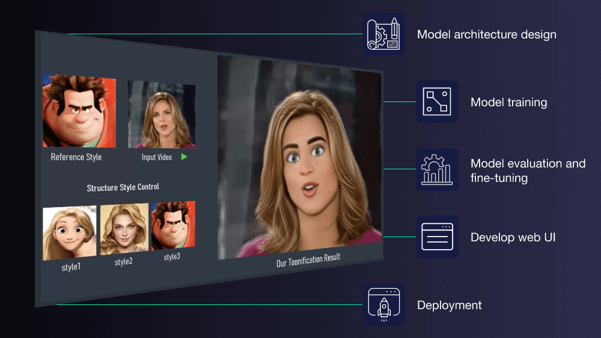

## Table of Contents

## What are Generative Video Models and how do they work?

Generative Video Models are a type of artificial intelligence that can create new videos by learning from existing ones. They work by analyzing patterns and features in a large collection of videos, and then using this knowledge to generate new video content. Imagine it like a smart artist who watches many paintings and then creates a new one in a similar style. These models use complex math to understand and recreate the movements, colors, and shapes they see in videos.

The way these models work is by using neural networks, which are like brains made of math. They have layers of interconnected nodes that process information. When you show the model a lot of videos, it adjusts these nodes to better understand and mimic what it sees. Once trained, the model can generate new videos by starting with random noise and transforming it into a video that looks like the ones it learned from. This process involves a lot of calculations and adjustments to make sure the generated video looks realistic and matches the style of the training videos.

## What is the difference between generative models and discriminative models in video processing?

Generative models and discriminative models are two different approaches used in video processing. Generative models try to understand how videos are made by learning the patterns and features in them. They can then create new videos that look similar to the ones they learned from. Think of them like artists who study many paintings and then paint new ones in the same style. They use a lot of math to figure out how to make new videos that look real and match the style of the videos they've seen.

On the other hand, discriminative models focus on telling different videos apart. They learn to recognize specific things in videos, like objects or actions, and then use this knowledge to classify or label new videos. For example, a discriminative model might be used to tell if a video shows a dog or a cat. They are good at making decisions based on what they see, but they don't try to create new videos like generative models do. Both types of models are useful, but they work in different ways and are used for different tasks in video processing.

## Can you explain the basic architecture of TimeSformer?

TimeSformer is a special kind of model used for understanding videos. It's built on something called a Transformer, which is like a smart tool that helps computers understand and process information. In TimeSformer, the videos are broken down into small pieces called "tokens." Each token represents a tiny part of the video, like a small square in a big picture. TimeSformer looks at these tokens and figures out how they relate to each other over time. This helps the model understand what's happening in the video, like if someone is walking or if a ball is moving.

The way TimeSformer works is by using something called "self-attention." This is a fancy way of saying that the model pays attention to different parts of the video at the same time. It looks at all the tokens and decides which ones are important for understanding the video. By doing this, TimeSformer can figure out the order of events and how things change from one moment to the next. This makes it really good at tasks like recognizing actions in videos or predicting what might happen next.

## How does TGAN generate video sequences?

TGAN, or Temporal Generative Adversarial Network, is a special kind of model that makes new video sequences. It works by using two parts that work together: a generator and a discriminator. The generator tries to make new videos that look real, while the discriminator checks these videos to see if they are fake or real. They keep going back and forth, with the generator getting better at making realistic videos and the discriminator getting better at spotting fakes. This process helps TGAN learn how to create video sequences that look like the ones it was trained on.

To make a video, TGAN starts with random noise and turns it into a sequence of frames. It does this by using a special kind of math called a neural network. The generator part of TGAN takes the noise and changes it step by step until it looks like a real video. The discriminator then looks at this video and tells the generator if it needs to make it better. Over time, the generator learns to make videos that are hard for the discriminator to tell apart from real ones. This way, TGAN can create new video sequences that look like they could be real.

## What role does CVRL play in unsupervised video generation?

CVRL, or Contrastive Video Representation Learning, is a method used to help computers understand videos without being told exactly what to look for. It works by comparing different parts of videos to find patterns and similarities. Imagine you're trying to learn about different animals by looking at pictures. CVRL is like showing the computer many pictures and letting it figure out on its own that cats have whiskers and dogs have floppy ears. By doing this, the computer can learn to recognize and generate new video content without needing specific labels or instructions.

In unsupervised video generation, CVRL helps by creating a way for the computer to learn from videos without human help. It does this by using a technique called contrastive learning, where the computer looks at different video clips and tries to understand what makes them similar or different. This helps the computer build a model of how videos work, which it can then use to create new videos. By focusing on the relationships between different parts of the videos, CVRL allows the computer to generate new sequences that look and feel like the original videos it learned from.

## How does Dreamix combine different video elements to create new scenes?

Dreamix is a smart tool that mixes different parts of videos to make new scenes. It's like a chef who takes ingredients from different dishes to create a new recipe. Dreamix looks at videos and breaks them down into smaller pieces, like characters, backgrounds, and objects. Then, it uses a special kind of math to figure out how these pieces can fit together in new ways. By doing this, Dreamix can create scenes that look real but are actually made from parts of different videos.

The way Dreamix works is by using something called a neural network. This is like a brain made of math that helps the computer understand and mix video parts. Dreamix learns from a lot of videos to know how to put things together so they look right. For example, it can take a person from one video and put them into a different background from another video. This makes it possible to create new scenes that are fun and creative, mixing elements in ways that would be hard to do by hand.

## What makes DVD-GAN unique in the field of generative video models?

DVD-GAN, or Dynamic Video Generation with GANs, is special because it can make videos that move and change over time in a way that looks very real. It does this by using two parts that work together: a generator and a discriminator. The generator tries to make new videos, and the discriminator checks if they look real or fake. They keep going back and forth, getting better at their jobs. This helps DVD-GAN learn how to make videos that not only look good but also move smoothly, like a real video would.

What makes DVD-GAN stand out is its ability to create long video sequences that keep the same style and movement throughout. It uses a special trick called "temporal consistency" to make sure the videos it creates don't jump around or change suddenly. This means the videos look more like something you'd see in real life, where things move in a smooth and natural way. By focusing on how things change over time, DVD-GAN can make videos that are not just realistic but also interesting to watch.

## How does TrIVD-GAN improve upon traditional GANs for video generation?

TrIVD-GAN, or Tri-Interaction Video Diffusion Generative Adversarial Network, makes video generation better than traditional GANs by using a special way to mix different parts of the video-making process. It uses three main parts that work together: the generator, the discriminator, and a new part called the "diffuser." The diffuser helps the generator make videos that look more real and smooth over time. By working together, these three parts help TrIVD-GAN create videos that not only look good but also move in a way that feels natural, like real videos do.

One big way TrIVD-GAN improves on traditional GANs is by focusing on how things in the video change over time. Traditional GANs can sometimes make videos where things jump around or change suddenly, which doesn't look real. TrIVD-GAN uses a special trick called "temporal consistency" to make sure the videos it creates keep the same style and movement throughout. This makes the videos more interesting and believable to watch. By paying attention to how things move and change, TrIVD-GAN can make videos that are not just realistic but also fun and engaging.

## What are the key features of ClipBERT that make it suitable for video generation?

ClipBERT is a smart tool that helps computers understand and make videos by mixing text and pictures. It works by looking at videos and the words that go with them, like captions or descriptions. This helps ClipBERT learn how to match what it sees in the video with what it reads in the text. By doing this, ClipBERT can create new videos that fit well with given text, making the videos more interesting and useful. For example, if you tell ClipBERT to make a video about a dog playing in a park, it can use what it learned to create a video that shows exactly that.

One of the key features of ClipBERT is its ability to understand both videos and text at the same time. This is important because it lets ClipBERT make videos that not only look real but also match the story or message you want to tell. ClipBERT uses a special kind of math called a neural network to do this. It breaks down videos into small pieces and figures out how these pieces relate to words. This way, ClipBERT can create videos that are not just random but actually tell a story or show something specific, making it a great tool for video generation.

## How does ParamCrop optimize video generation processes?

ParamCrop is a smart tool that makes video generation faster and better. It does this by looking at videos and figuring out which parts are important and which parts can be left out. Imagine you're making a movie and you want to focus on the main character. ParamCrop helps by cutting out the parts of the video that don't matter, like the background or things that don't move much. This makes the video generation process quicker because the computer doesn't have to work on parts that aren't needed.

By using ParamCrop, the computer can make videos that look good and are made faster. It uses a special kind of math to decide what to keep and what to cut out. This way, the videos are not only made quickly but also look smooth and natural. ParamCrop helps make sure that the important parts of the video, like the main action or characters, are clear and easy to see, making the whole video generation process more efficient and effective.

## What is the significance of FuseFormer in multi-modal video generation?

FuseFormer is a special tool that helps computers make videos by mixing different kinds of information, like pictures, sounds, and words. It's like a chef who takes ingredients from different dishes to create a new recipe. FuseFormer looks at all these different pieces and figures out how to put them together to make a video that makes sense and looks good. By doing this, FuseFormer can create videos that are not just about one thing but tell a whole story using different types of information.

What makes FuseFormer important in multi-modal video generation is its ability to understand and use different kinds of data at the same time. This means it can make videos that are more interesting and useful because they can show and tell a lot more than just one type of information. For example, FuseFormer can take a picture of a dog, the sound of it barking, and a description of what it's doing, and then make a video that shows all of these things together in a way that feels real and tells a story.

## What are the current challenges and future directions for research in generative video models?

Generative video models face several challenges that researchers are working to solve. One big challenge is making videos that look real and move smoothly over time. Sometimes, the videos these models create can look a bit jumpy or fake, which is not what we want. Another challenge is making sure the videos match what we want them to show. For example, if we ask for a video of a dog playing in a park, we want the video to actually show that, not something else. Also, these models need a lot of computer power to work, which can be expensive and slow. Researchers are trying to find ways to make these models work better with less computer power.

The future of research in generative video models looks exciting. Scientists are working on new ways to make videos that not only look real but also tell interesting stories. They are trying to use different kinds of information, like sounds and words, to make the videos even better. For example, they might use a model like FuseFormer to mix pictures, sounds, and text to create a video that feels more like a real movie. Another direction is making these models easier to use and faster to run, so more people can use them to create cool videos. By solving these challenges, we can look forward to a future where making amazing videos is as easy as pressing a button.

## References & Further Reading

[1]: Wang, Q., Yi, L., & Liu, Z. (2021). ["TimeSformer: Is Space-Time Attention All You Need for Video Understanding?"](https://arxiv.org/abs/2102.05095) arXiv preprint arXiv:2102.05095.

[2]: Saito, M., Matsumoto, E., & Saito, S. (2017). ["Temporal Generative Adversarial Nets with Singular Value Clipping."](https://arxiv.org/abs/1611.06624) IEEE International Conference on Computer Vision (ICCV).

[3]: Arandjelovic, R., & Zisserman, A. (2017). ["Look, Listen and Learn."](https://arxiv.org/abs/1705.08168) International Conference on Computer Vision (ICCV).

[4]: Vondrick, C., Pirsiavash, H., & Torralba, A. (2016). ["Generating Videos with Scene Dynamics."](https://arxiv.org/abs/1609.02612) Advances in Neural Information Processing Systems 29.

[5]: Yan, S., Xiong, Y., & Lin, D. (2021). ["Progressive Teacher: Iterative Knowledge Transfer for Semi-Supervised Object Detection."](https://pubmed.ncbi.nlm.nih.gov/34647751/) European Conference on Computer Vision.

[6]: Zhang, H., Goodfellow, I., Metaxas, D., & Odena, A. (2018). ["Self-Attention Generative Adversarial Networks."](https://arxiv.org/abs/1805.08318) International Conference on Machine Learning (ICML).

[7]: Carreira, J., & Zisserman, A. (2017). ["Quo Vadis, Action Recognition? A New Model and the Kinetics Dataset."](https://arxiv.org/abs/1705.07750) IEEE Conference on Computer Vision and Pattern Recognition (CVPR).