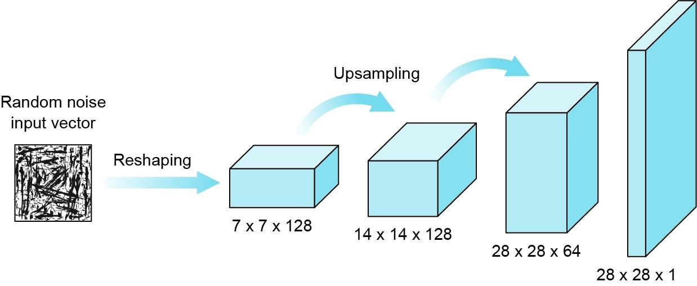

## Table of Contents

## What is a generator in the context of machine learning?

In machine learning, a generator is a type of model often used in generative models, like Generative Adversarial Networks (GANs). A generator's main job is to create new data that looks like the data it was trained on. For example, if you train a generator on pictures of dogs, it can create new pictures of dogs that look real. The generator learns the patterns and features of the training data and uses this knowledge to produce new, similar data.

Generators are important because they can help with tasks like creating new images, generating text, or even composing music. They work by taking random noise as input and transforming it into structured data through a series of layers in a neural network. This process can be represented simply as $$ \text{Generator}(\text{noise}) = \text{new data} $$. By adjusting the parameters of the generator, it gets better at producing data that closely matches the training set, making it a powerful tool in machine learning applications.

## How does a generator differ from a traditional function in programming?

A generator in programming is different from a traditional function because it can pause and resume its execution. When you call a traditional function, it runs from start to finish and returns a result. But a generator can stop at certain points, remember where it left off, and continue from there later. This is useful when you want to generate a series of values over time, rather than all at once. For example, if you want to generate numbers from 1 to 100, a traditional function might return a list of all 100 numbers at once, while a generator would give you one number at a time as you need it.

Generators are often used in Python with the `yield` keyword. When a generator function encounters `yield`, it returns a value and pauses its execution. The next time you ask for a value, it picks up right after the last `yield` statement. This makes generators memory-efficient because they don't need to store all the values in memory at once. Here's a simple example of a generator function in Python:

```python
def number_generator(n):
    for i in range(n):
        yield i

# Using the generator
gen = number_generator(5)
for num in gen:
    print(num)
```

This code will print the numbers 0 through 4, one at a time, without creating a list of all the numbers in memory.

## What are the basic components of a generator model in machine learning?

A generator model in [machine learning](/wiki/machine-learning) has a few key parts that work together to create new data. The main part is the [neural network](/wiki/neural-network), which is like a series of connected layers that learn to turn random noise into something that looks like the data it was trained on. This neural network is the heart of the generator, and it uses weights and biases to adjust how it transforms the input noise into output data. The goal is to make the output as close as possible to real data, so the generator needs to learn the patterns and features of the training data.

Another important part of a generator model is the loss function, which measures how well the generator is doing. The loss function compares the generated data to the real data and tells the generator how far off it is. The generator then uses this information to adjust its weights and biases, trying to reduce the loss and make better data. This process is often done using a technique called backpropagation, where the error is sent back through the network to update the parameters. The generator keeps learning and improving until it can create data that looks very similar to the training data.

In the context of Generative Adversarial Networks (GANs), there's also a discriminator that works with the generator. The discriminator's job is to tell the difference between real data and the data the generator makes. The generator tries to fool the discriminator by making better and better data. This back-and-forth between the generator and discriminator helps both models get better over time. The whole process can be thought of as a game where the generator tries to create realistic data, and the discriminator tries to spot the fakes. This competition drives the generator to improve its output, making it a powerful tool for generating new data that looks real.

## Can you explain the role of a generator in Generative Adversarial Networks (GANs)?

In Generative Adversarial Networks (GANs), the generator plays a key role by creating new data that looks like the data it was trained on. Imagine you have a bunch of pictures of cats, and you want the generator to make new pictures of cats that look real. The generator starts with random noise and uses a neural network to turn that noise into a picture of a cat. The goal is to make the generated cat pictures look so real that they can't be told apart from real cat pictures. The generator does this by learning the patterns and features of the cat pictures it was trained on, and it keeps getting better at making realistic cat pictures over time.

The generator works together with another part of the GAN called the discriminator. The discriminator's job is to tell the difference between real cat pictures and the ones the generator makes. It's like a game where the generator tries to fool the discriminator by making better and better cat pictures, and the discriminator tries to get better at spotting the fakes. This back-and-forth helps both the generator and the discriminator improve. The generator's performance can be measured by a loss function that compares its output to real data, and it uses this feedback to adjust its neural network. This process continues until the generator can create cat pictures that are very hard to tell from real ones.

## What are some common applications of generator models in machine learning?

Generator models in machine learning are used in many cool ways. One common use is making new images. For example, if you train a generator on pictures of dogs, it can create new pictures of dogs that look real. This is helpful for things like making more training data for other machine learning models or creating art. Another use is in making new text. A generator can learn how to write like a certain author or create new stories. This is useful for things like writing assistants or generating content for websites.

Another important use of generator models is in making new music. By training a generator on a lot of songs, it can create new music that sounds like the songs it learned from. This can be fun for making new music or helping musicians come up with new ideas. Generators are also used in [data augmentation](/wiki/data-augmentation), where they create new data to help other models learn better. For example, if you have a small dataset of pictures, a generator can make more pictures that look similar, helping the other models get better at recognizing things in the pictures.

In the world of science, generator models help with things like drug discovery. By learning the patterns of different molecules, a generator can create new molecules that might be good for new medicines. This can speed up the process of finding new drugs. Generators are also used in creating realistic simulations, like making fake but realistic videos or voices. This can be useful for testing new technologies or creating special effects in movies. Overall, generator models are powerful tools that help in many areas by creating new and useful data.

## How does a generator produce new data samples?

A generator produces new data samples by starting with random noise and using a neural network to transform that noise into something that looks like the data it was trained on. Think of it like a machine that takes a jumble of letters and turns it into a poem. The generator learns the patterns and features of the training data, like the shapes in pictures or the rhythm in music, and uses this knowledge to create new data that follows those patterns. For example, if you train a generator on pictures of cats, it will learn what makes a cat look like a cat, and then it can create new pictures of cats that look real.

The process of creating new data involves several steps. First, the generator takes in random noise, which is just a bunch of random numbers. Then, it passes this noise through a series of layers in its neural network. Each layer changes the noise a little bit, making it more and more like the training data. This can be represented simply as $$ \text{Generator}(\text{noise}) = \text{new data} $$. The generator keeps adjusting its layers, or parameters, to make the new data look more like the real data. This adjustment happens through a process called backpropagation, where the generator uses feedback from a loss function to get better at creating realistic data. Over time, the generator gets really good at making new data that looks just like the data it was trained on.

## What is the importance of the loss function in training a generator?

The loss function is super important when training a generator because it tells the generator how well it's doing. Imagine you're trying to draw a picture of a cat, and someone keeps telling you if your drawing looks like a real cat or not. The loss function does the same thing for the generator. It compares the data the generator makes with real data and gives a score, called the loss. The lower the loss, the closer the generated data is to the real data. This score helps the generator know what to change to get better at making realistic data.

The generator uses the loss to adjust its neural network through a process called backpropagation. Think of it like tweaking the knobs on a radio to get a clear signal. The generator changes its parameters, or weights and biases, to minimize the loss. This can be shown simply as $$ \text{Loss} = \text{measure}(\text{real data}, \text{generated data}) $$. By constantly trying to lower the loss, the generator learns to make better and better data. This is why the loss function is so important – it guides the generator on its journey to creating realistic new data samples.

## How can overfitting be prevented when training a generator?

Overfitting can be prevented when training a generator by using a few smart tricks. One way is to use more data. The more pictures of cats the generator sees, the better it gets at making new cat pictures without just copying the ones it knows. Another trick is to stop training early. If the generator keeps training for too long, it might start to remember the training data too well and not be good at making new pictures. So, we can watch the loss and stop training when it starts to get worse on new data.

Another way to prevent overfitting is to use something called regularization. This is like telling the generator to keep things simple. Regularization adds a little penalty to the loss function, making the generator try harder to make good pictures without getting too complicated. This can be shown as $$ \text{Loss} = \text{measure}(\text{real data}, \text{generated data}) + \text{regularization penalty} $$. By using these methods, the generator can learn to make new data that looks real without just copying the training data.

## What are some advanced techniques used to improve the performance of generator models?

One advanced technique to improve the performance of generator models is called "progressive growing of GANs." This method starts with a small, low-resolution image and gradually adds more details to it, making the final image look much better. Imagine drawing a cat starting with just a few lines and then slowly adding more lines and colors until it looks like a real cat. This helps the generator learn to make better pictures without getting too confused by all the details at once. Another technique is called "style transfer," where the generator learns to mix the style of one image with the content of another. For example, it can take a picture of a cat and make it look like it's painted in the style of Van Gogh. This makes the generator more versatile and able to create a wider range of images.

Another way to boost the performance of generator models is by using "conditional GANs." In this technique, the generator gets extra information, like a label or a specific feature, to help it make more targeted data. For example, if you want the generator to make a picture of a specific breed of dog, you can tell it which breed, and it will try to make a picture that matches that breed. This can be shown as $$ \text{Generator}(\text{noise}, \text{condition}) = \text{new data} $$. Using conditional GANs helps the generator make more accurate and useful data. Additionally, techniques like "feature matching" can be used, where the generator tries to match not just the final image but also the intermediate features of the real data. This helps the generator learn to make images that are more similar to the real ones in many ways, not just in the final picture.

## How do you evaluate the quality of data generated by a generator?

Evaluating the quality of data generated by a generator is important to see how well it's doing its job. One way to do this is by using a discriminator, which is like a judge that tells if the generated data looks real or not. In Generative Adversarial Networks (GANs), the discriminator's job is to spot the difference between real data and the data made by the generator. If the discriminator can't tell the difference, it means the generator is doing a good job. Another way to evaluate the generator is by using a loss function, which measures how close the generated data is to the real data. The lower the loss, the better the generator is at making realistic data. This can be shown as $$ \text{Loss} = \text{measure}(\text{real data}, \text{generated data}) $$.

Another method to check the quality of generated data is through human evaluation. People can look at the generated images, listen to the generated music, or read the generated text and give their opinion on how real it looks or sounds. This can be more accurate because humans can pick up on small details that machines might miss. There are also more technical ways to evaluate the generator, like using metrics such as the Inception Score or the Fréchet Inception Distance (FID). These metrics compare the generated data to a large set of real data and give a score based on how similar they are. By using a mix of these methods, you can get a good idea of how well the generator is doing at making new data that looks real.

## What are the challenges faced when scaling generator models for large datasets?

Scaling generator models for large datasets can be tricky because it takes a lot of computer power and time. When you have a lot of data, like thousands of pictures, the generator needs to learn from all of it. This means the neural network has to be big enough to handle all that data, and that can make your computer work really hard. Sometimes, the computer might not have enough memory to keep everything in its head at once, so you have to find ways to break the data into smaller pieces and train the model bit by bit. This process can be slow and might need special computers that are good at handling big tasks.

Another challenge is making sure the generator doesn't just memorize the data but actually learns to make new stuff that looks real. When you have a lot of data, the generator might start to overfit, which means it gets too good at copying the training data and not good at making new things. To stop this from happening, you can use tricks like regularization, which is like telling the generator to keep things simple. You can also use methods like early stopping, where you watch the loss and stop training when it starts to get worse on new data. By using these techniques, you can help the generator learn to make good, new data even when you're working with a huge dataset.

## Can you discuss recent innovations or research trends in generator-based machine learning?

Recent innovations in generator-based machine learning have focused a lot on making better images and videos. One cool trend is using something called "style-based generators," which can mix different styles to make really cool pictures. For example, a generator can take a picture of a cat and make it look like it's painted in the style of Picasso. This is done using a technique called "style transfer," where the generator learns to separate the content from the style and then combine them in new ways. Another big trend is making videos that look real. Researchers are working on generators that can create whole videos from just a few frames, using techniques like "temporal GANs" to make sure the video looks smooth and natural over time.

Another exciting area of research is using generators to make new data for other machine learning models. This is called "data augmentation," and it helps when you don't have a lot of data to train your models. Generators can make new pictures, sounds, or even text that look and sound real, which can be used to train other models better. For example, if you're trying to teach a model to recognize different types of dogs, a generator can make more pictures of dogs to help the model learn. Researchers are also looking into making generators more efficient, so they can work faster and use less computer power. This involves techniques like "progressive growing of GANs," where the generator starts with simple images and slowly adds more details, making the final image look much better.