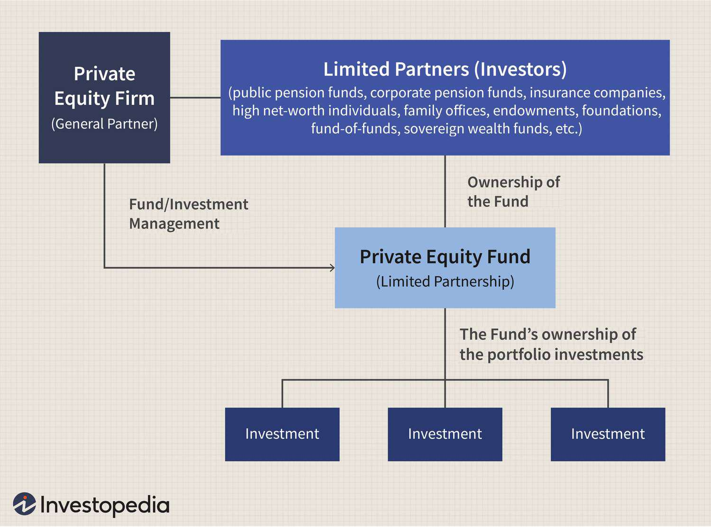

## Table of Contents

## What are generic securities?

Generic securities are financial instruments that represent a broad category of investments, rather than specific ones. They are often used in financial planning and analysis to simplify discussions about investment portfolios. For example, instead of talking about individual stocks or bonds, someone might refer to "equities" or "fixed income" securities. This helps in understanding the overall risk and return characteristics of a portfolio without getting into the details of each specific investment.

These securities can include stocks, bonds, and other types of investments that are grouped together based on their general features. For instance, all stocks might be considered as one type of generic security, while all government bonds might be another. By using generic securities, investors and financial advisors can more easily compare different investment options and make decisions about how to allocate their money across various asset classes. This approach is particularly useful for creating diversified portfolios that balance risk and potential returns.

## What is the purpose of generic securities in financial markets?

Generic securities help make things simpler in the financial world. Instead of talking about every single stock or bond, people can talk about groups of them. For example, instead of discussing Apple or Microsoft stocks separately, someone might just talk about "stocks" in general. This makes it easier for people to understand and talk about their investments without getting into too many details.

Using generic securities also helps investors plan their money better. By looking at groups like "stocks" or "bonds," people can see how much risk they are taking and how much money they might make. This helps them decide how to spread their money across different types of investments. It's like putting together a puzzle where each piece is a different kind of investment, and generic securities help see the big picture more easily.

## How do generic securities differ from specific securities?

Generic securities and specific securities are two different ways to look at investments. Generic securities are broad categories, like "stocks" or "bonds." They help people talk about their investments in a simple way, without going into details about each one. For example, if someone says they have "stocks," they're talking about a generic security that could include many different companies' stocks.

On the other hand, specific securities are the individual investments within those categories. If someone talks about owning Apple stock, that's a specific security. It's a single piece of the puzzle, not the whole group. Specific securities give more detailed information about what someone owns, but they can make things more complicated when trying to understand the overall picture of an investment portfolio.

Using generic securities helps people plan their money better because it's easier to see the big picture. It's like looking at a map of a city instead of every single street. But when you need to know the details, like how much a particular stock is worth, you look at specific securities. Both are important, but they serve different purposes in understanding and managing investments.

## What are the common types of generic securities?

Generic securities are broad categories of investments that help people talk about their money in a simple way. The most common types of generic securities are stocks, bonds, and cash equivalents. Stocks are pieces of ownership in companies, and when people talk about "stocks," they mean all kinds of company shares, not just one specific company. Bonds are like loans that people give to governments or companies, and when someone mentions "bonds," they're talking about all kinds of these loans, not just one specific bond.

Another type of generic security is cash equivalents, which are safe places to keep money, like savings accounts or money market funds. These are easy to turn into cash and don't lose value quickly. By using these broad categories, people can plan their investments without getting into the tiny details of each specific stock, bond, or cash equivalent. It's like looking at a big picture instead of focusing on every little piece.

## How are generic securities issued and traded?

Generic securities like stocks, bonds, and cash equivalents are not issued or traded directly. Instead, the specific securities within these categories are issued and traded. For example, a company issues its own stocks, and these stocks are bought and sold on stock exchanges like the New York Stock Exchange or NASDAQ. Governments or companies issue bonds, and these are traded on bond markets. Banks or financial institutions offer cash equivalents like savings accounts or money market funds, which can be easily bought or sold.

When people talk about trading generic securities, they are really talking about trading the specific securities that fall into these broad categories. For instance, someone might say they are investing in "stocks," but what they are actually doing is buying and selling individual company stocks. The same goes for bonds and cash equivalents; people trade specific bonds or move money into and out of specific savings accounts or money market funds. This way, the use of generic securities helps simplify discussions about investments, even though the actual trading happens with specific securities.

## What are the risks associated with investing in generic securities?

When you invest in generic securities like stocks, bonds, or cash equivalents, you face different kinds of risks. For stocks, the big risk is that the value of the companies you own can go down. If lots of people think a company is not doing well, the price of its stock can drop, and you might lose money. Also, stocks can be very up and down, which means their value can change a lot in a short time. This can make people feel nervous about their money.

Bonds have their own risks too. One risk is that the company or government that issued the bond might not be able to pay you back. This is called default risk. Another risk is that if interest rates go up, the value of your bond can go down. This is because new bonds might be issued with higher interest rates, making your old bond less attractive to other people. Cash equivalents are usually safer, but they can lose value if inflation goes up faster than the interest you earn on them.

Even though generic securities help people talk about their investments in a simple way, the risks are still there. It's important to understand that when you invest in "stocks" or "bonds," you are really investing in many different specific securities, each with its own risks. By knowing these risks, you can make better choices about where to put your money and how to spread it out to lower your overall risk.

## How do generic securities contribute to portfolio diversification?

Generic securities help people spread out their money across different kinds of investments, which is called portfolio diversification. When you put your money into different categories like stocks, bonds, and cash equivalents, you're not putting all your eggs in one basket. If one type of investment doesn't do well, the others might do better and help balance things out. For example, if the stock market goes down, your bonds might stay steady or even go up in value, helping protect your money.

By using generic securities, it's easier to see the big picture of your investments and make sure you have a good mix. This can help lower the overall risk of losing money. If you only invest in one type of security, like just stocks, you might lose a lot if the stock market crashes. But if you spread your money across stocks, bonds, and cash equivalents, you're more likely to keep your money safe and still have a chance to make some money.

## What are the regulatory frameworks governing generic securities?

Generic securities like stocks, bonds, and cash equivalents are not directly regulated, but the specific securities within these categories are. The main regulatory body in the United States for securities is the Securities and Exchange Commission (SEC). The SEC makes rules to protect people who invest money. For example, companies that issue stocks have to share important information about their business so that people can make smart choices about buying or selling those stocks. The same goes for bonds; the SEC makes sure that the people or companies issuing bonds tell the truth about their ability to pay back the money.

Other countries have their own rules and organizations to watch over securities. In the United Kingdom, it's the Financial Conduct Authority (FCA) that keeps an eye on things. They make sure that people selling investments are honest and that investors get the information they need. Even though generic securities are just broad categories, the specific securities within them have to follow these rules. This helps keep the whole financial system fair and safe for everyone who wants to invest their money.

## How do market makers influence the pricing of generic securities?

Market makers are important people in the world of investing. They help decide the prices of specific securities like stocks and bonds, which are part of the bigger groups called generic securities. When someone wants to buy or sell a stock, they often go through a market maker. The market maker looks at what people are willing to pay and what sellers want, and then they set a price that makes the trade happen. This means market makers can affect the prices of stocks and bonds, which in turn affects the overall value of the generic securities like "stocks" or "bonds."

Even though market makers work with specific securities, their actions can change how people see the value of generic securities. If market makers set high prices for many stocks, people might think that "stocks" in general are doing well. On the other hand, if they set low prices, people might think "stocks" are not doing so great. This can influence how investors decide to spread their money across different types of investments, like choosing between stocks, bonds, or cash equivalents. So, market makers play a big role in shaping the market, even if they're not directly dealing with generic securities.

## What role do generic securities play in hedging strategies?

Generic securities like stocks, bonds, and cash equivalents help people protect their money through something called hedging. Hedging is like having a safety net for your investments. If you think the value of your stocks might go down, you can use other types of generic securities to balance out the risk. For example, if you own a lot of stocks and you're worried about a stock market crash, you might buy some bonds. Bonds often go up in value when stocks go down, so they can help protect your money.

Using generic securities for hedging makes it easier to plan because you're looking at big groups of investments instead of each one separately. If you own a bunch of different stocks and you want to hedge against a drop in the stock market, you don't need to hedge each stock one by one. Instead, you can use a broad category like "bonds" to hedge against your "stocks." This way, you can keep your money safer without getting too caught up in the details of every single investment.

## How can advanced investors use generic securities for arbitrage opportunities?

Advanced investors can use generic securities to find arbitrage opportunities by looking at the price differences between different types of investments. Arbitrage is when you buy something in one place and sell it in another place for a higher price, making a profit from the difference. For example, if an investor sees that stocks in one market are priced lower than similar stocks in another market, they can buy the cheaper stocks and sell them in the market where they are more expensive. By using generic securities like "stocks" or "bonds," investors can quickly spot these price differences without having to look at each specific security one by one.

This approach helps advanced investors take advantage of small price differences that might not be obvious when looking at individual securities. For instance, if an investor notices that the overall bond market in one country is undervalued compared to another, they can buy bonds in the cheaper market and sell them in the more expensive one. This way, they can make money from the price gap between the two markets. Using generic securities makes it easier to see these opportunities and act on them quickly, which is key in arbitrage because the price differences can disappear fast.

## What are the latest trends and innovations in the market for generic securities?

The market for generic securities has seen some interesting trends and innovations lately. One big trend is the rise of exchange-traded funds (ETFs). ETFs are like baskets of stocks or bonds that you can buy and sell easily, just like a single stock. They help people invest in generic securities like "stocks" or "bonds" without having to pick out each one themselves. This makes it easier for people to spread their money across different types of investments and manage their risk. Another trend is the use of robo-advisors, which are computer programs that help people pick and manage their investments. They often use generic securities to build portfolios that match what people want, like more stocks for growth or more bonds for safety.

Innovations in the market for generic securities also include the use of artificial intelligence (AI) and big data. These technologies help investors understand big trends in the market and make smarter choices about where to put their money. For example, AI can look at lots of information to figure out if "stocks" are likely to go up or down, helping investors decide if they should buy more or sell some. Another innovation is the growth of sustainable investing, where people choose generic securities based on how good they are for the environment or society. This means more people are looking at things like "green bonds" or "socially responsible stocks" when they build their investment portfolios.

## What are the investment strategies concerning risk and reward?

Investing in generic securities requires a thorough understanding of the underlying loans or mortgages and the associated risks, particularly the potential for default within the first year. Investors must conduct detailed analyses to assess these risks, which involves evaluating factors like the creditworthiness of borrowers, the economic environment, and interest rate fluctuations. A robust credit risk assessment model, often employing quantitative metrics such as the probability of default (PD), the loss given default (LGD), and exposure at default (EAD), is crucial. These can be mathematically represented as:

$$
\text{Expected Loss (EL)} = \text{PD} \times \text{LGD} \times \text{EAD}
$$

Diversification remains a fundamental strategy to mitigate these inherent risks. By spreading investments across different types of generic securities and asset classes, investors can balance the high-risk profile of these securities with more stable investments. This approach limits potential losses from any single security impacting the portfolio disproportionately.

Perfecting the diversification strategy involves understanding correlation among assets. As part of diversification, investors might use the correlation coefficient, $\rho$, as a key metric to select assets that do not move in tandem, thereby reducing portfolio risk. The correlation coefficient is mathematically expressed as:

$$
\rho_{X,Y} = \frac{\text{Cov}(X, Y)}{\sigma_X \sigma_Y}
$$

Where $\text{Cov}(X, Y)$ is the covariance between securities X and Y, and $\sigma_X$ and $\sigma_Y$ are their respective standard deviations.

Practical implementation strategies for incorporating generic securities into investment portfolios include detailed risk-return analysis and periodic rebalancing. Investors should continuously assess the evolving risk profile of their investments compared to their risk tolerance and financial goals. Using optimization algorithms such as the Modern Portfolio Theory (MPT), developed by Harry Markowitz, investors can determine the optimal allocation that maximizes returns for a given level of risk.

A Python example to calculate optimal portfolio weights might use the following code snippet:

```python
import numpy as np
import pandas as pd
import scipy.optimize as sco

# Sample returns data
returns = np.array([[0.01, 0.02, 0.015], [0.02, 0.01, 0.025], [0.015, 0.01, 0.01]])
mean_returns = np.mean(returns, axis=0)
cov_matrix = np.cov(returns.T)

def portfolio_performance(weights, mean_returns, cov_matrix):
    returns = np.dot(weights, mean_returns)
    std_dev = np.sqrt(np.dot(weights.T, np.dot(cov_matrix, weights)))
    return std_dev, returns

def minimize_volatility(weights):
    return portfolio_performance(weights, mean_returns, cov_matrix)[0]

num_assets = len(mean_returns)
constraints = {'type': 'eq', 'fun': lambda x: np.sum(x) - 1}
bounds = tuple((0, 1) for asset in range(num_assets))
result = sco.minimize(minimize_volatility, num_assets*[1./num_assets,], method='SLSQP', bounds=bounds, constraints=constraints)

optimal_weights = result['x']
```

Understanding the nuances of generic securities and employing effective strategies can enhance a portfolio's performance while managing associated risks. Investment decisions in these securities thus should be continuously informed by risk metrics, diversification strategies, and ongoing market assessments, ensuring alignment with broader financial objectives.

## References & Further Reading

[1]: Dominquez, A. (2018). ["Algorithmic Trading: Winning Strategies and Their Rationale"](https://www.wiley.com/en-us/Algorithmic+Trading%3A+Winning+Strategies+and+Their+Rationale-p-9781118460146) by Ernest P. Chan

[2]: Auinger, D. (2018). ["Advances in Financial Machine Learning"](https://books.google.com/books/about/Advances_in_Financial_Machine_Learning.html?id=oU9KDwAAQBAJ) by Marcos Lopez de Prado

[3]: Aronson, D. (2007). ["Evidence-Based Technical Analysis: Applying the Scientific Method and Statistical Inference to Trading Signals"](https://www.amazon.com/Evidence-Based-Technical-Analysis-Scientific-Statistical/dp/0470008741)

[4]: Louie, J. (2020). ["Machine Learning for Algorithmic Trading"](https://github.com/stefan-jansen/machine-learning-for-trading) by Stefan Jansen

[5]: Chan, E. P. (2009). ["Quantitative Trading: How to Build Your Own Algorithmic Trading Business"](https://github.com/ftvision/quant_trading_echan_book)

[6]: Lewis, F. (2016). ["Quantitative Financial Risk Management: Theory and Practice"](https://onlinelibrary.wiley.com/doi/book/10.1002/9781119080305)

[7]: Milne, A. (2009). ["The Fall of the House of Credit: What Went Wrong in Banking and What Can Be Done to Repair the Damage?"](https://archive.org/details/fallofhouseofcre0000miln)

[8]: Kolomiyets, N., & Mauch, M. (2016). ["Algorithmic trading and quantitative strategies"](https://api.pageplace.de/preview/DT0400.9781498737197_A39374186/preview-9781498737197_A39374186.pdf) BBC technology & finance article.  

[9]: Bergstra, J., Bardenet, R., Bengio, Y., & Kégl, B. (2011). ["Algorithms for Hyper-Parameter Optimization."](https://dl.acm.org/doi/10.5555/2986459.2986743) Advances in Neural Information Processing Systems 24.