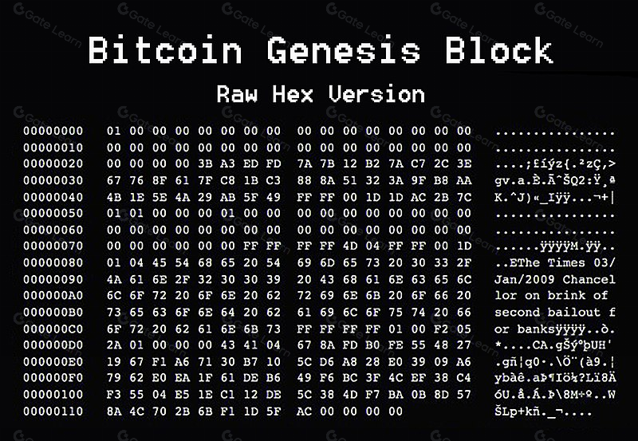

## Table of Contents

## What is the Genesis Block in Bitcoin?

The Genesis Block is the very first block in the Bitcoin blockchain. It was created by Bitcoin's founder, Satoshi Nakamoto, on January 3, 2009. This block is special because it marks the beginning of the entire Bitcoin network. Without it, there would be no Bitcoin as we know it today.

In the Genesis Block, there is a message hidden in the block's data. This message is a headline from a newspaper, saying, "The Times 03/Jan/2009 Chancellor on brink of second bailout for banks." Satoshi put this message there to show that Bitcoin was created during a time when the world was having big problems with money and banks. It shows that Bitcoin was meant to be a new kind of money that people could trust.

## Who created the Genesis Block and when was it created?

The Genesis Block was created by Satoshi Nakamoto. Satoshi Nakamoto is the name used by the person or group of people who invented Bitcoin. We don't know who Satoshi really is, but we know they started Bitcoin.

The Genesis Block was created on January 3, 2009. This was the very first block in the Bitcoin blockchain. It's special because it started everything and showed that Bitcoin could work.

## What is the significance of the Genesis Block in the Bitcoin network?

The Genesis Block is super important in the Bitcoin network because it's the very first block. It's like the starting point of the whole Bitcoin system. Without this block, there wouldn't be any other blocks or Bitcoin at all. It was created by Satoshi Nakamoto on January 3, 2009, and it shows that the idea of Bitcoin could actually work.

This block also has a special message in it from a newspaper. The message says, "The Times 03/Jan/2009 Chancellor on brink of second bailout for banks." Satoshi put this message there to show that Bitcoin was made during a time when people were having big problems with money and banks. It's a reminder that Bitcoin was created to be a new kind of money that people could trust and use without needing banks.

## What is the secret message embedded in the Genesis Block?

The secret message in the Genesis Block is a headline from a newspaper. It says, "The Times 03/Jan/2009 Chancellor on brink of second bailout for banks." Satoshi Nakamoto, the person who created Bitcoin, put this message in the first block to show that Bitcoin was made during a time when the world was having big problems with money and banks.

This message is important because it shows why Bitcoin was created. It was a time when people didn't trust banks and needed a new way to handle money. By putting this message in the Genesis Block, Satoshi wanted to remind everyone that Bitcoin was meant to be a different kind of money that people could trust and use without needing banks.

## How was the secret message discovered in the Genesis Block?

The secret message in the Genesis Block was found when people started looking closely at the data inside the block. The message is part of the block's data, and it's a headline from a newspaper. When people first saw the Genesis Block, they noticed that there was some extra information in it. This extra information turned out to be the message, "The Times 03/Jan/2009 Chancellor on brink of second bailout for banks."

Once people found the message, they realized it was important. It showed that Bitcoin was created during a time when the world was having big problems with money and banks. Satoshi Nakamoto, the person who made Bitcoin, put this message in the first block to remind everyone why Bitcoin was created. It was meant to be a new kind of money that people could trust and use without needing banks.

## What is the meaning behind the secret message in the Genesis Block?

The secret message in the Genesis Block is a headline from a newspaper. It says, "The Times 03/Jan/2009 Chancellor on brink of second bailout for banks." This message was put there by Satoshi Nakamoto, the person who created Bitcoin. It tells us that Bitcoin was made during a time when people were having big problems with money and banks. Banks were failing, and the government was trying to help them with bailouts.

The message is important because it shows why Bitcoin was created. It was a time when people didn't trust banks and needed a new way to handle money. By putting this message in the first block, Satoshi wanted to remind everyone that Bitcoin was meant to be a different kind of money. It's a money system that people could trust and use without needing banks. This message helps us understand the purpose and the timing of Bitcoin's creation.

## How does the Genesis Block relate to the financial crisis of 2008?

The Genesis Block is the very first block in the Bitcoin blockchain, created by Satoshi Nakamoto on January 3, 2009. It's special because it marks the start of Bitcoin, and it has a message in it that connects to the financial crisis of 2008. The message in the Genesis Block is a headline from a newspaper that says, "The Times 03/Jan/2009 Chancellor on brink of second bailout for banks." This shows that Bitcoin was created right when the world was dealing with big money problems.

The financial crisis of 2008 was a time when many banks and financial systems around the world were failing. Governments were trying to help by giving money to banks, called bailouts, but people were losing trust in the system. Satoshi Nakamoto put the newspaper headline in the Genesis Block to show that Bitcoin was a response to these problems. Bitcoin was meant to be a new kind of money that people could trust and use without needing banks. This message in the Genesis Block reminds us why Bitcoin was created and how it relates to the financial troubles of 2008.

## What technical features distinguish the Genesis Block from other blocks in the Bitcoin blockchain?

The Genesis Block is unique because it's the very first block in the Bitcoin blockchain. It doesn't have a previous block to link to, so it has a special field called the "previous block hash" that is set to zeros. This is different from all other blocks, which have a hash from the block that came before them. Also, the Genesis Block has a fixed reward of 50 bitcoins, but it's not spendable because Satoshi Nakamoto, who created it, made sure it couldn't be used. This means the bitcoins in the Genesis Block are just there to show that the system works, but they can't be moved or spent.

Another thing that makes the Genesis Block different is the timestamp. It was created on January 3, 2009, and it has a special message inside it from a newspaper headline about the financial crisis. This message isn't in any other block. The Genesis Block also has a unique "nonce" value, which is a number used to solve the puzzle that creates the block. The nonce in the Genesis Block is 2,083,236,893, which is different from the nonces in other blocks. These technical details make the Genesis Block stand out and show that it's the foundation of the whole Bitcoin system.

## How does the Genesis Block impact the mining process in Bitcoin?

The Genesis Block is special because it's the very first block in the Bitcoin blockchain, created by Satoshi Nakamoto. It doesn't have a previous block to connect to, so it's set up differently. In the mining process, every new block needs to link back to the block before it. But the Genesis Block doesn't have a "previous block hash" to link to, so it's set to all zeros. This makes it unique and shows that it's the start of everything. Also, the Genesis Block has a fixed reward of 50 bitcoins, but these bitcoins can't be spent. This is different from other blocks where the rewards can be used.

The Genesis Block also affects mining because it sets the stage for how the whole system works. Miners solve puzzles to add new blocks to the chain, and each block needs to be harder to solve than the one before it. The Genesis Block's difficulty level is set to be very easy, which is different from later blocks that get harder over time. This easy start helps show that the system can work and grow. By having a special first block, the Genesis Block helps miners understand how the blockchain grows and how they can keep adding new blocks to it.

## What are the theories surrounding the choice of transactions included in the Genesis Block?

There are some interesting theories about why Satoshi Nakamoto chose the transactions in the Genesis Block. One theory is that Satoshi wanted to show how Bitcoin could work without needing banks. The Genesis Block has a special message from a newspaper about the financial crisis, which shows that Bitcoin was made during a time when people didn't trust banks. By not including any real transactions, Satoshi might have been saying that Bitcoin is a new way to handle money, different from the old system.

Another theory is that Satoshi wanted to keep the Genesis Block simple and clear. Since it's the first block, it doesn't have any transactions that link to other blocks. This makes it easier for people to understand how the blockchain starts. The only "transaction" in the Genesis Block is the reward of 50 bitcoins, but these bitcoins can't be spent. This might be Satoshi's way of showing that the system can create new bitcoins, but also that the Genesis Block is just the beginning and not part of the regular flow of transactions.

## How has the Genesis Block influenced subsequent blockchain technologies?

The Genesis Block has been really important for other blockchain technologies that came after Bitcoin. It showed people that you can make a system where everyone can see and check transactions without needing a bank or a central authority. This idea of a starting block, or a "genesis" point, has been used in many other blockchains. They all have their own first block that sets everything up, just like Bitcoin's Genesis Block. This helps new blockchains to start and grow in a clear and organized way.

Also, the message in Bitcoin's Genesis Block about the financial crisis has inspired other blockchain projects. It showed that these technologies can be about more than just money. They can be about trust, fairness, and making things better for everyone. Many new blockchains have their own special messages or goals in their first block, showing what they want to achieve. The Genesis Block has become a symbol of new beginnings and big ideas in the world of blockchain technology.

## What are the ongoing debates and mysteries surrounding the Genesis Block among Bitcoin experts?

There are a lot of debates and mysteries about the Genesis Block among Bitcoin experts. One big question is about the message inside it. The message says, "The Times 03/Jan/2009 Chancellor on brink of second bailout for banks." Some people think Satoshi Nakamoto put this message there to show that Bitcoin was a response to the financial crisis. Others wonder if there's a deeper meaning or if it's just a way to show the date. No one knows for sure what Satoshi was thinking, and this mystery keeps people talking and guessing.

Another mystery is about the 50 bitcoins in the Genesis Block. These bitcoins can't be spent, and some people think this was Satoshi's way of showing that the system works without actually putting real money into it. But why did Satoshi choose to make these bitcoins unspendable? Some experts believe it's to keep the Genesis Block separate from the rest of the blockchain, while others think it might be a way to avoid any legal issues with creating money out of nowhere. These ongoing debates and mysteries make the Genesis Block a fascinating topic that keeps the Bitcoin community interested and engaged.

## References & Further Reading

[1]: Satoshi Nakamoto. (2008). ["Bitcoin: A Peer-to-Peer Electronic Cash System."](https://nakamotoinstitute.org/library/bitcoin/)

[2]: Antonopoulos, A. M. (2017). ["Mastering Bitcoin: Unlocking Digital Cryptocurrencies."](https://books.google.com/books/about/Mastering_Bitcoin.html?id=IXmrBQAAQBAJ)

[3]: ["Advances in Financial Machine Learning"](https://www.amazon.com/Advances-Financial-Machine-Learning-Marcos/dp/1119482089) by Marcos Lopez de Prado

[4]: ["Quantitative Trading: How to Build Your Own Algorithmic Trading Business"](https://www.amazon.com/Quantitative-Trading-Build-Algorithmic-Business/dp/1119800064) by Ernest P. Chan

[5]: ["Algorithmic Trading: Winning Strategies and Their Rationale"](https://www.wiley.com/en-us/Algorithmic+Trading%3A+Winning+Strategies+and+Their+Rationale-p-9781118460146) by Ernest P. Chan

[6]: Narayanan, A., Bonneau, J., Felten, E., Miller, A., & Goldfeder, S. (2016). ["Bitcoin and Cryptocurrency Technologies."](https://press.princeton.edu/books/hardcover/9780691171692/bitcoin-and-cryptocurrency-technologies)