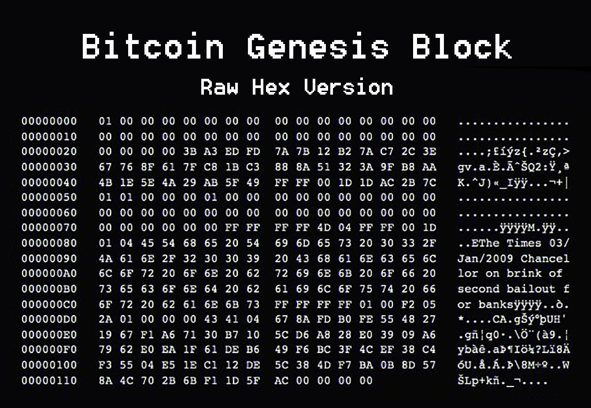

In the world of cryptocurrency, the term 'Genesis Block' carries significant weight, especially when examining Bitcoin and blockchain technology. The Genesis Block, often referred to as Block 0, serves as the cornerstone of the Bitcoin network, marking the beginning of a revolutionary approach to digital transactions. Its creation laid the groundwork for the entire blockchain infrastructure and introduced the concept of decentralized finance, which has since evolved into various forms, including algorithmic trading.

As the digital asset ecosystem expands, automated trading systems are becoming increasingly prevalent. These systems leverage the transparency, security, and decentralization principles established by the Genesis Block to enhance trading strategies and efficiency. Understanding the Genesis Block is essential for appreciating how it influences the development of algorithmic trading, allowing traders to optimize their strategies in a rapidly growing market.

The Genesis Block is a testament to the potential of blockchain technology, setting a precedent for future innovations. Its implementation demonstrated the viability of a secure and decentralized ledger system, which has spurred further advancements in financial technology. This article explores the origins of the Genesis Block and its enduring impact on algorithmic trading, illustrating how foundational elements of Bitcoin's blockchain continue to drive progress within the cryptocurrency ecosystem.

## Table of Contents

## What is the Genesis Block?

The Genesis Block is the foundational element of a blockchain, marking the beginning of its existence. It is uniquely significant because it acts as the anchor from which all subsequent blocks derive and build upon. In Bitcoin, the Genesis Block was initiated by the elusive figure known as Satoshi Nakamoto. This historic milestone occurred in 2009, when Nakamoto mined the very first block, setting the stage for the revolutionary digital currency that would later emerge.

One of the distinct characteristics of the Genesis Block in Bitcoin is its lack of reference to a prior block. Unlike all blocks that follow, which inherently connect to a predecessor, the Genesis Block stands alone, establishing what is referred to as the 'zero address' for Bitcoin's flow. This sets a precedent for the decentralized ledger's chain structure and establishes Bitcoin’s foundational history.

Moreover, the Genesis Block carries an embedded message from the UK newspaper, The Times, which reads, "Chancellor on brink of second bailout for banks." This message is encoded within the data of the block and is perceived as a commentary on the monetary policies and the financial instability that preceded Bitcoin's creation. The inclusion of this specific message emphasizes Bitcoin's intended role as an alternative to traditional financial systems, highlighting its potential as a decentralized currency and store of value against the backdrop of economic challenges.

## Understanding Blockchain and Its Critical Role

Blockchains are integral to the structure and function of decentralized cryptocurrencies like Bitcoin. A blockchain is a chronological ledger composed of blocks, where each block stores transaction data and contains a reference to its predecessor, forming an immutable sequence. This attribute ensures the integrity and security of transaction records within the blockchain.

Bitcoin's blockchain is structured to include several key elements: block size, block header, and transaction counter. The block header itself comprises several fields such as the version, a timestamp, a cryptographic hash of the previous block, the Merkle root of all transactions in the block, and a nonce used in the mining process. This intricate architecture supports secure and verifiable transactions.

The Genesis Block, as the inaugural block of the Bitcoin blockchain, set vital protocols for subsequent blocks. It is unique due to its absence of a reference to a preceding block, which is an anomaly, since Bitcoin blocks are typically linked to their predecessors. This feature, dubbed the 'zero address', is fundamental for the blockchain's continuity as it serves as the starting point for all Bitcoin transactions. This absence ensures that the chain can initiate and maintain continuous and coherent transaction records without dependency on prior records.

The foundational protocols established by the Genesis Block are crucial in blockchain security and transaction validation. As the blueprint for all future Bitcoin blocks, the Genesis Block laid the groundwork for robust data transmission protocols. Its structure ensures that subsequent blocks inherit the security features and protocols necessary for maintaining a tamper-proof and transparent transaction ledger.

In sum, the Genesis Block's design principles and the broader blockchain architecture collectively foster an environment conducive to secure, decentralized, and reliable data transactions. These characteristics underscore the importance of understanding blockchain's critical role in the continuing evolution of digital currencies and related technologies.

## History and Mystery of Bitcoin's Genesis Block

On January 3, 2009, Satoshi Nakamoto mined the first block of the Bitcoin blockchain, known as the Genesis Block, without facing any external competition. This event marked a pivotal moment in the history of digital currencies as it laid the foundational stone for Bitcoin and, by extension, the development of blockchain technology. At that time, the mining of this block was considered an experiment to test the feasibility and mechanics of a decentralized electronic cash system.

The Genesis Block contained a reward of 50 bitcoins, which, intriguingly, are unspendable. This peculiarity is primarily due to the hard-coded uniqueness of the Genesis Block in Bitcoin's source code, making its outputs invalid for spending. This characteristic has contributed to the air of mystery surrounding the block, as it suggests the existence of elements in its creation that were intentionally set apart from the standard protocol for potential reasons known only to Nakamoto.

Following the mining of the Genesis Block, a significant delay occurred before the mining of the subsequent block, Block 1. The time gap between these blocks has sparked discussions and theories regarding Nakamoto’s intentions. Some speculate that this pause was a deliberate move to test the network's resilience and stability under controlled conditions before opening it up for public exploration and mining competition. Another theory postulates that Nakamoto used this time to refine and solidify the underlying software and network parameters to ensure secure operations in decentralized settings.

The anonymity surrounding Bitcoin's creator, Satoshi Nakamoto, further intensifies the intrigue surrounding the Genesis Block. Nakamoto’s identity remains unknown, creating a shroud of mystery over the original motivations and goals of Bitcoin's creation. This enigmatic presence leads to questions concerning the ideological beliefs and technical aspirations embedded within Bitcoin's initial framework. The execution of such a groundbreaking project without revealing the creator's identity contributed significantly to the discussions and allure of Bitcoin's origins.

These unclarifiable initial conditions and the unique structure of the Genesis Block underpin the fascination with Bitcoin's historical beginning. They highlight an era when the intricate details of this revolutionary financial instrument were still nascent, adding layers of mystery that continue to captivate enthusiasts, researchers, and historians in the field of [cryptocurrency](/wiki/cryptocurrency).

## The Influence of the Genesis Block on Algo Trading

The Genesis Block stands as a pivotal element in cryptocurrency, shaping the underlying framework that supports both blockchain technology and [algorithmic trading](/wiki/algorithmic-trading). The decentralized nature of Bitcoin, initiated by the Genesis Block, has significantly influenced the way financial transactions are conducted. This decentralization removes the need for intermediaries, which, in turn, reduces transaction costs and enhances the speed and security of transactions. 

Algorithmic trading, which relies heavily on these principles, has emerged as a transformative approach in financial markets. By automating trading processes, algorithmic trading systems can execute trades swiftly and efficiently. The transparency and security provided by the blockchain ensure that transactions are verifiable and immutable, crucial aspects for developing reliable trading algorithms.

At the core of Bitcoin's blockchain, the Genesis Block's architecture offers insights into creating robust trading algorithms. These algorithms can harness the decentralized properties of the blockchain to predict and act upon market movements accurately. By analyzing patterns within the blockchain, developers can refine algorithms to optimize trading strategies, taking advantage of the real-time data and the secure environment that the blockchain provides.

The legacy of the Genesis Block, thus, extends beyond its historical significance, playing a crucial role in advancing algorithmic trading. It provides a secure and transparent platform that enhances the efficiency of trading operations, ultimately fostering innovation and progress in the financial sector.

## Conclusion

The Genesis Block is more than just Bitcoin's first block; it represents a pivotal moment in financial technology. Its creation signaled the beginning of a decentralized financial system, liberating digital transactions from traditional intermediaries. The block's embedded message, “Chancellor on brink of second bailout for banks,” reflects a deep-rooted skepticism towards centralized financial structures and highlights Bitcoin's role as a potential alternative to conventional banking systems.

The principles established by the Genesis Block, including immutability, transparency, and decentralization, have become foundational to both blockchain and algorithmic trading. These principles offer more secure, fast, and cost-effective transaction processes, reshaping how trades are conducted in digital assets. Algorithmic trading systems today utilize these attributes to execute trades with high efficiency and accuracy, adapting to market changes without human intervention.

Moreover, the enduring intrigue of the Genesis Block, with its unclaimed bitcoins, continues to inspire developments and discussions in the cryptocurrency ecosystem. Its mysterious origin story and the innovative groundwork it laid have spurred advancements across various blockchain applications and technology sectors.

As the landscape of crypto trading grows increasingly complex, understanding the origins encapsulated by the Genesis Block is essential. Acknowledging this foundation not only preserves the historical context of blockchain technology but also enhances future innovation, guiding the development of more sophisticated trading algorithms and decentralized systems.

## References & Further Reading

[1]: Antonopoulos, A. M. (2017). ["Mastering Bitcoin: Unlocking Digital Cryptocurrencies."](https://books.google.com/books/about/Mastering_Bitcoin.html?id=IXmrBQAAQBAJ) O'Reilly Media.

[2]: Nakamoto, S. (2008). ["Bitcoin: A Peer-to-Peer Electronic Cash System."](https://nakamotoinstitute.org/library/bitcoin/) 

[3]: Narayanan, A., Bonneau, J., Felten, E., Miller, A., & Goldfeder, S. (2016). ["Bitcoin and Cryptocurrency Technologies: A Comprehensive Introduction."](https://press.princeton.edu/books/hardcover/9780691171692/bitcoin-and-cryptocurrency-technologies) Princeton University Press.

[4]: Antonopoulos, A. M., & Wood, G. (2018). ["Mastering Ethereum: Building Smart Contracts and DApps."](https://www.amazon.com/Mastering-Ethereum-Building-Smart-Contracts/dp/1491971940) O'Reilly Media.

[5]: Bhaskar, N. D. C., & Chuen, D. L. K. (2015). ["Bitcoin Mining Technology."](https://searchworks.stanford.edu/view/13597080) In "Handbook of Digital Currency: Bitcoin, Innovation, Financial Instruments, and Big Data," Academic Press.