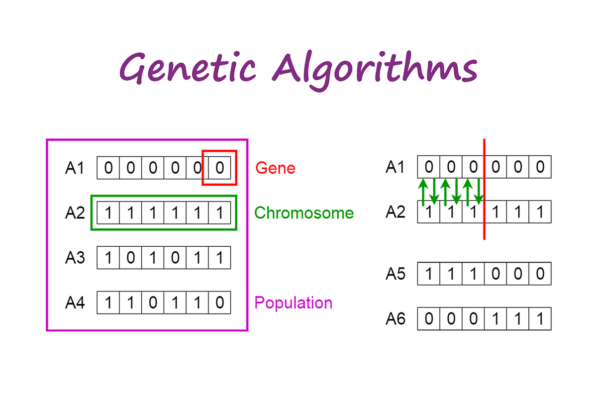

## Table of Contents

## What is a Genetic Algorithm and how does it relate to machine learning?

A Genetic Algorithm is a method inspired by the process of natural selection to solve problems. It works by creating a population of possible solutions to a problem and then using principles like selection, crossover, and mutation to evolve these solutions over time. The idea is to start with a set of random solutions and then, through generations, improve them until a good solution is found. For example, if you want to find the best route for a delivery truck, you could use a Genetic Algorithm to keep improving different routes until you find the most efficient one.

Genetic Algorithms relate to machine learning because both are ways to get computers to learn and solve problems without being explicitly programmed to do so. In machine learning, you might use algorithms like neural networks to learn from data and make predictions. Similarly, in Genetic Algorithms, the computer learns by evolving solutions over time. The key difference is that Genetic Algorithms often work by mimicking biological processes, while machine learning can use a wider variety of techniques. Both approaches are powerful tools for solving complex problems that are hard to tackle with traditional programming methods.

## What are the basic components of a Genetic Algorithm?

The basic components of a Genetic Algorithm include a population of individuals, a fitness function, selection, crossover, and mutation. The population is a set of possible solutions to the problem you're trying to solve. Each individual in the population represents a different solution. The fitness function is a way to measure how good each solution is. It gives a score to each individual, showing how well it solves the problem. Selection is the process of choosing which individuals will be used to create the next generation. Usually, individuals with higher fitness scores are more likely to be selected.

Crossover and mutation are the ways that new individuals are created. Crossover involves taking parts of two selected individuals and combining them to make a new individual. This is like mixing the genes of two parents to create a child. Mutation, on the other hand, involves making small random changes to an individual. This helps to introduce new variety into the population and can sometimes lead to better solutions. Together, these components allow the Genetic Algorithm to search for better solutions over time, much like how species evolve in nature.

To illustrate, imagine you're trying to find the best route for a delivery truck. Each route is an individual in the population. The fitness function might measure the total time taken for each route. Selection would pick the faster routes to create new routes. Crossover might combine parts of two fast routes to make a new one, and mutation could randomly change a part of a route to see if it becomes even faster. By repeating these steps over many generations, the Genetic Algorithm can find a very good route.

## How does the process of selection work in Genetic Algorithms?

In Genetic Algorithms, selection is like choosing the best players for a team. It's the step where you pick which individuals from the current population will be used to create the next generation. The main idea is to give a higher chance of being selected to individuals that have a higher fitness score. This means that solutions that are better at solving the problem are more likely to be chosen. There are different ways to do selection, but a common one is called "roulette wheel selection." In this method, you imagine a wheel where each individual gets a slice proportional to its fitness score. You spin the wheel, and wherever it lands, that's the individual you pick.

For example, let's say you have four routes for a delivery truck, and their fitness scores (how fast they are) are 10, 20, 30, and 40. In roulette wheel selection, the first route would get a 10% chance of being picked, the second a 20% chance, the third a 30% chance, and the fourth a 40% chance. You can keep spinning the wheel to pick multiple individuals for the next generation. Another method is "tournament selection," where you randomly pick a few individuals and then choose the one with the highest fitness score from that group. Both methods help make sure that the next generation will have more of the better solutions, which helps the Genetic Algorithm find a good solution faster.

## What is crossover in Genetic Algorithms and why is it important?

Crossover in Genetic Algorithms is like mixing the traits of two parents to create a child. It's a way to combine parts of two selected individuals to make a new one. Imagine you have two routes for a delivery truck, and you want to create a new route that might be even better. You could take the first half of one route and the second half of the other route and put them together. This new route is the result of crossover. It's a key step because it helps to create new solutions by mixing the good parts of existing ones.

Crossover is important because it helps the Genetic Algorithm search for better solutions more effectively. By combining parts of different individuals, you can create new solutions that might be better than the ones you started with. Without crossover, the algorithm would just be making small changes to existing solutions, which might not be enough to find the best solution quickly. Crossover helps to speed up the search for good solutions by exploring new combinations of traits, making the Genetic Algorithm more powerful and efficient.

## Can you explain the concept of mutation in Genetic Algorithms?

Mutation in Genetic Algorithms is like making small, random changes to an individual. Think of it as a tiny mistake or variation that happens when copying something. For example, if you're trying to find the best route for a delivery truck, mutation might mean changing one stop in the route to a different one. This small change can sometimes make the route faster or more efficient. Mutation helps to keep the population diverse, which means there are lots of different solutions being tried.

This diversity is important because it helps the Genetic Algorithm find new and better solutions. Without mutation, all the individuals might start to look the same after a while, and the algorithm might get stuck on solutions that aren't the best. By adding mutation, you make sure that there are always new ideas being tested, which can lead to finding the best solution faster. So, mutation is a key part of how Genetic Algorithms work to solve problems effectively.

## How do Genetic Algorithms maintain population diversity?

Genetic Algorithms maintain population diversity mainly through the processes of crossover and mutation. Crossover mixes parts of different individuals to create new ones, which helps to combine good traits from different solutions. Imagine you're trying to find the best route for a delivery truck. By taking parts of two good routes and putting them together, you might create an even better route. This mixing keeps the population from becoming too similar, which is important for finding the best solution.

Mutation also plays a big role in keeping the population diverse. Mutation is like making small, random changes to an individual. For example, if you change one stop in the delivery truck's route, you might find a faster way. These small changes help to introduce new ideas into the population. Without mutation, all the routes might start to look the same, and the Genetic Algorithm might miss out on finding the best solution. By keeping the population diverse, the algorithm can explore more possibilities and find better solutions over time.

## What are the common fitness functions used in Genetic Algorithms?

In Genetic Algorithms, a fitness function is like a score that tells you how good a solution is. For example, if you're trying to find the best route for a delivery truck, the fitness function might measure the total time taken for each route. The goal is to minimize the time, so the fitness function could be the negative of the total time, like this: $$ \text{fitness} = -\text{total time} $$. This way, shorter routes get higher (less negative) scores. Another common fitness function is to count how many goals are met. If you're trying to schedule classes, the fitness function might count how many students get their preferred times. The more preferences met, the higher the fitness score.

Sometimes, the fitness function can be more complex. For example, if you're designing a car, the fitness function might look at speed, fuel efficiency, and safety all at once. You could use a weighted sum to combine these different goals, like this: $$ \text{fitness} = w_1 \times \text{speed} + w_2 \times \text{fuel efficiency} + w_3 \times \text{safety} $$. Here, $$ w_1, w_2, $$ and $$ w_3 $$ are numbers that show how important each goal is. By tweaking these weights, you can guide the Genetic Algorithm to focus on what's most important to you. This kind of fitness function helps the algorithm find solutions that balance multiple goals.

## How can Genetic Algorithms be applied to solve optimization problems?

Genetic Algorithms are great for solving optimization problems because they can search through a huge number of possible solutions to find the best one. Imagine you're trying to find the shortest route for a delivery truck that needs to visit many different places. You could use a Genetic Algorithm to start with a bunch of random routes and then use selection, crossover, and mutation to keep improving them. The fitness function would measure how short each route is, and the algorithm would keep evolving the routes until it finds a really good one. This way, even if the problem is really hard, the Genetic Algorithm can still find a good solution by mimicking how nature evolves over time.

For example, if you want to find the best way to schedule classes in a school so that as many students as possible get their preferred times, a Genetic Algorithm can help. You could start with many different schedules and then use the fitness function to see how many students are happy with each schedule. By using selection to pick the best schedules and crossover to mix them together, you can create new schedules that might be even better. Mutation would make small changes to these schedules, which can sometimes lead to finding the perfect schedule. This method is really useful for problems where you need to balance lots of different things, like making sure students get their preferred times while also keeping the school's resources in mind.

## What are the advantages of using Genetic Algorithms over traditional optimization techniques?

Genetic Algorithms have several advantages over traditional optimization techniques. One big advantage is that they can handle problems with a lot of variables or where the solution space is really big. Traditional methods might get stuck or take too long to find a good answer, but Genetic Algorithms can keep searching and trying new things until they find something good. They're also good at solving problems where you need to balance many different goals at once. For example, if you're designing a car, you might want it to be fast, fuel-efficient, and safe. A Genetic Algorithm can use a fitness function like $$ \text{fitness} = w_1 \times \text{speed} + w_2 \times \text{fuel efficiency} + w_3 \times \text{safety} $$ to find a solution that balances all these goals.

Another advantage is that Genetic Algorithms don't need to know much about the problem to start working on it. Traditional methods often need a lot of information about how the problem works, but Genetic Algorithms can start with just a fitness function and a way to represent solutions. This makes them really flexible and useful for all kinds of problems. They're also good at finding solutions that might be good enough, even if they're not perfect. This is helpful when you need a quick answer and don't have time to find the absolute best solution.

## What are some challenges and limitations of Genetic Algorithms?

One challenge with Genetic Algorithms is that they can take a long time to find a good solution, especially if the problem is really hard. They work by trying lots of different solutions and seeing which ones are the best. This can be slow because they need to keep trying new things until they find something good. Also, sometimes they might get stuck on a solution that's not the best but looks good enough. This is called getting stuck in a local optimum. For example, if you're trying to find the shortest route for a delivery truck, the algorithm might find a pretty good route but miss an even better one because it's hard to keep looking for something better.

Another limitation is that Genetic Algorithms need a good way to measure how good a solution is. This is called the fitness function, and it can be hard to make one that really shows how good a solution is. If the fitness function is not right, the algorithm might pick the wrong solutions to keep trying. For example, if you're trying to schedule classes, the fitness function might count how many students get their preferred times. But if it doesn't also consider how many classrooms are needed, it might pick a schedule that's not possible. So, making a good fitness function is really important but can be hard.

Finally, Genetic Algorithms can be tricky to set up right. You need to choose the right way to represent solutions, decide how to do crossover and mutation, and pick the right settings for things like population size and how many generations to run. If you don't set these things up well, the algorithm might not work as well as it could. For example, if you set the mutation rate too high, you might end up with solutions that are too different from each other and never find a good one. So, while Genetic Algorithms are powerful, they need careful tuning to work their best.

## How can the performance of a Genetic Algorithm be evaluated and improved?

To evaluate the performance of a Genetic Algorithm, you can look at how quickly it finds a good solution and how good that solution is. One way to do this is by using a fitness function, which gives a score to each solution. For example, if you're trying to find the shortest route for a delivery truck, the fitness function might be $$ \text{fitness} = -\text{total time} $$. By tracking the highest fitness scores over time, you can see if the algorithm is getting better at solving the problem. You can also compare the final solution to the best known solution, if one exists, to see how close it gets. This helps you understand if the algorithm is working well or if it needs some tweaks.

To improve the performance of a Genetic Algorithm, you can try different settings and methods. One thing to change is the population size. A bigger population might find better solutions but take longer to run. Another thing is the mutation rate. If it's too high, the solutions might change too much and never get better. If it's too low, the algorithm might get stuck on a solution that's not the best. You can also try different ways of doing crossover and selection. For example, using tournament selection instead of roulette wheel selection might help find better solutions faster. By experimenting with these settings and methods, you can find the best way to make your Genetic Algorithm work well for your problem.

## What are some advanced techniques or variations of Genetic Algorithms used in modern applications?

In modern applications, one advanced technique used with Genetic Algorithms is called "Island Model" or "Parallel Genetic Algorithms." This method involves breaking the population into smaller groups, or "islands," that evolve separately. Each island runs its own Genetic Algorithm, and occasionally, individuals from different islands are exchanged. This can help maintain diversity in the population and prevent the algorithm from getting stuck on a local optimum. For example, if you're trying to find the best route for a delivery truck, different islands might explore different parts of the solution space, and sharing solutions between islands could lead to finding a better route overall.

Another variation is "Niching," which helps the Genetic Algorithm find multiple good solutions instead of just one. Niching works by encouraging the population to split into different groups, or "niches," each focusing on a different part of the solution space. This is useful when there might be several good answers to a problem. For example, if you're designing a car, there might be different designs that balance speed, fuel efficiency, and safety in different ways. By using niching, the Genetic Algorithm can explore these different designs and find multiple good solutions. The fitness function might look like $$ \text{fitness} = w_1 \times \text{speed} + w_2 \times \text{fuel efficiency} + w_3 \times \text{safety} $$, but niching would help find different sets of weights that lead to good cars.

A third advanced technique is "Co-evolution," where different parts of a solution evolve together. In co-evolution, you might have two or more populations that interact with each other. For instance, if you're designing a game, you could have one population for the game's AI and another for the game's levels. As the AI evolves to become better at playing the game, the levels evolve to become more challenging. This back-and-forth helps both populations improve over time. By using co-evolution, you can find solutions that work well together, making the overall solution better than what you might find with a single population.

## References & Further Reading

[1]: Holland, J. H. (1992). ["Adaptation in Natural and Artificial Systems: An Introductory Analysis with Applications to Biology, Control, and Artificial Intelligence"](https://ieeexplore.ieee.org/book/6267401). MIT Press.

[2]: Goldberg, D. E. (1989). ["Genetic Algorithms in Search, Optimization, and Machine Learning"](https://archive.org/details/geneticalgorithm0000gold) Addison-Wesley Longman Publishing.

[3]: Mitchell, M. (1998). ["An Introduction to Genetic Algorithms"](https://direct.mit.edu/books/monograph/4675/An-Introduction-to-Genetic-Algorithms). MIT Press.

[4]: Eiben, A. E., & Smith, J. E. (2003). ["Introduction to Evolutionary Computing"](https://www.researchgate.net/publication/216300585_Introduction_To_Evolutionary_Computing). Springer.

[5]: Back, T. (1996). ["Evolutionary Algorithms in Theory and Practice"](https://academic.oup.com/book/40791) Oxford University Press.

[6]: Haupt, R. L., & Haupt, S. E. (2004). ["Practical Genetic Algorithms"](https://onlinelibrary.wiley.com/doi/book/10.1002/0471671746) Wiley.