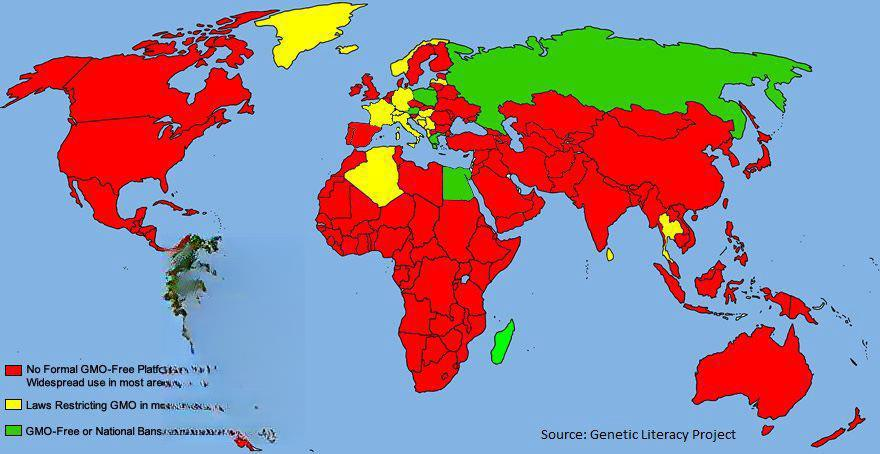

The field of biotechnology has catalyzed significant advancements across multiple sectors, prominently in agriculture through genetically modified foods (GMFs). GMFs, produced by altering the genetic material of plants and animals, have sparked substantial debate over their health, safety, and environmental impacts. Proponents argue that genetic modifications provide solutions to food scarcity and nutritional deficiencies, while critics express concerns about potential risks such as allergenicity and ecosystem disruption.

Parallel to biotechnology's advancements in agriculture is the rise of algo trading in finance, a domain leveraging complex algorithms to automate decision-making in financial markets. Algo trading enhances market efficiency by processing vast amounts of data swiftly, yet it raises questions about market volatility and transparency.



This article examines the intersection between biotechnology and finance, focusing on genetic modification in foods and algorithms in trading. It aims to explore the benefits and controversies of each sector, discuss regulatory environments, and ponder their future trajectories. Both GMFs and algo trading illustrate the technological complexity defining contemporary advancements, with significant potential to impact efficiency and sustainability across global industries.

## Table of Contents

## Overview of Genetically Modified Foods

Genetically Modified Foods (GMFs) arise from organisms whose genetic material is intentionally altered using genetic engineering techniques to achieve specific traits. This innovation allows for targeted modifications that traditional breeding methods cannot replicate. Initial discussions about genetic modifications commenced much earlier than when the first commercial GM product, the Flavr Savr tomato, entered the market in 1994. 

In the United States, regulatory oversight by bodies such as the Food and Drug Administration (FDA) and the United States Department of Agriculture (USDA) is essential for assessing the safety and efficacy of GMFs intended for human consumption. These agencies evaluate GMFs through rigorous testing and scientific assessments. The FDA focuses on ensuring food safety and labeling, whereas the USDA assesses agricultural and environmental impacts.

Genetic modifications primarily aim to improve crop yields and enhance resistance to pests and diseases, thereby offering solutions to agricultural challenges. This includes the development of crops that can withstand harsh environmental conditions, such as drought or soil salinity. Additionally, genetic engineering facilitates the creation of foods enriched with vital nutrients, such as biofortified rice varieties with elevated levels of vitamin A, which address nutritional deficiencies in some populations.

The application of genetic modification extends beyond plants to include non-plant organisms, like genetically modified animals and microorganisms. However, regulatory approvals and levels of public acceptance vary widely across different regions, with some areas maintaining stringent regulatory frameworks or outright restrictions against certain GMFs. As countries weigh the potential benefits against perceived risks, public discourse continues to shape the future of GMF integration into global food systems.

## Benefits of GM Foods

Genetically Modified (GM) foods have emerged as a crucial element in addressing global food security challenges by enhancing crop resilience against various environmental stresses such as drought and pest infestations. By incorporating specific genes into crops, biotechnologists have successfully developed varieties that can withstand harsh climatic conditions, thus ensuring stable food supplies even in adverse environments.[^1]

Bioengineering has also significantly contributed to tackling nutritional deficiencies, exemplified by the development of Golden Rice. This genetically modified rice variety has been engineered to produce beta-carotene, a precursor of vitamin A, addressing vitamin A deficiencies prevalent in many developing countries.[^2] Such advancements highlight the potential of GM foods to enhance dietary health by fortifying staples with essential nutrients.

Moreover, pest-resistant GM crops, such as Bt corn and Bt cotton, have facilitated a marked reduction in pesticide use. These crops contain genes from Bacillus thuringiensis (Bt), a bacterium producing proteins toxic to specific insects. As a result, farmers can achieve effective pest control without heavy reliance on chemical pesticides. This reduction in pesticide application not only benefits the environment by mitigating chemical runoff and biodiversity loss but also improves human health by minimizing exposure to harmful substances.[^3]

From an economic perspective, GM foods provide significant incentives by boosting agricultural productivity. The enhanced resilience and yield of GM crops lead to reduced production costs, increased profitability for farmers, and improved food availability at lower prices for consumers.[^4] The economic efficiency derived from GM foods contributes to alleviating poverty and enhancing the livelihoods of farming communities.

Finally, GM foods hold the promise of reducing food waste, owing to their potentially longer shelf life. Genetic modifications can enhance the preservation qualities of produce, such as decreased oxidation and delayed ripening, thereby extending the freshness period of fruits and vegetables.[^5] This characteristic is essential in minimizing post-harvest losses and optimizing the global food supply chain.

In summary, GM foods confer multiple benefits across environmental, nutritional, economic, and logistical dimensions, underscoring their role in crafting a more secure and sustainable food future.

[^1]: James, C. (2014). *Global Status of Commercialized Biotech/GM Crops: 2014*. ISAAA Briefs No. 49. ISAAA: Ithaca, NY.
[^2]: Beyer, P., et al. (2002). "Golden Rice: Introducing the β-Carotene Biosynthesis Pathway into Rice Endosperm by Genetic Engineering to Defeat Vitamin A Deficiency." *The Journal of Nutrition*, 132(3), 506S–510S.
[^3]: Brookes, G., and Barfoot, P. (2018). "Environmental impacts of genetically modified (GM) crop use 1996–2016: Impacts on pesticide use and carbon emissions." *GM Crops & Food*, 9(3), 109-139.
[^4]: Carpenter, J.E. (2010). "Peer-reviewed surveys indicate positive impact of commercialized GM crops." *Nature Biotechnology*, 28, 319–321.
[^5]: Koo, S.I., and Kwon, Y. (2013). "Functional and Structural Modifications of Agricultural Produce through Biotechnology for Enhanced Nutritional and Functional Quality." *Journal of Food Science and Technology*, 50(1), 22-27.

## Controversies Surrounding GM Foods

Genetically modified foods (GMFs) have been the focal point of numerous debates, largely due to the uncertainties concerning their potential long-term impacts on health. Critics emphasize the possibility of health-related risks such as allergenicity and the unintended horizontal gene transfer to human gut flora. Allergenicity concerns stem from the potential introduction of allergenic proteins in foods through genetic modification, necessitating rigorous assessments and labeling requirements to ensure consumer safety. Studies have highlighted that thorough testing and monitoring are paramount to mitigating these risks, yet they remain a significant point of contention for skeptics.

Environmental risks also spur debates, particularly regarding the consequences of GM crop cultivation on biodiversity. The modification of crops to enhance pest resistance or herbicide tolerance may inadvertently affect non-target organisms, potentially leading to a reduction in biodiversity. Moreover, the phenomenon of cross-breeding between GM and non-GM species presents ecological concerns, as it could result in the spread of modified genes beyond controlled agricultural settings. This cross-breeding could facilitate the emergence of superweeds and resistant pest species, which require even more potent chemicals for management, thus perpetuating a cycle of increased chemical use in agriculture.

Ethical considerations are intrinsically linked to GMFs, focusing on consumer rights and transparency. Advocates for stricter labeling argue that consumers should be informed about the products they consume, fostering informed choices. The lack of mandatory labeling in some regions exacerbates public skepticism, as consumers demand the right to know and choose what they eat. This transparency is essential in reconciling public trust with scientific advancements in genetic modifications.

Legislation and public opinion regarding GMFs vary considerably worldwide, reflecting diverse cultural, ethical, and ecological perspectives. While some countries have embraced the technology due to its potential benefits for food security and agricultural efficiency, others have adopted stringent regulations or outright bans to protect environmental and public health. The European Union, for example, maintains rigorous standards for GMFs, reflecting a cautious approach compared to more permissive regulatory environments such as that of the United States. These variations underscore the global divide in acceptance and regulation, shaped by distinct national priorities and public sentiments.

## Biotechnology in Financial Markets: Algo Trading

Algo trading, short for [algorithmic trading](/wiki/algorithmic-trading), has revolutionized the financial markets by employing sophisticated algorithms to execute trades at speeds and frequencies unattainable by human traders. This approach leverages biotechnology through computational techniques and data analysis, enabling more efficient markets and optimizing both cost and time efficiency.

At its core, algo trading utilizes mathematical models and pre-defined instructions, known as algorithms, to make trading decisions. These algorithms analyze numerous market variables and conditions, executing trades based on complex calculations often involving statistical [arbitrage](/wiki/arbitrage), trend analysis, and market prediction models. The primary objective is to exploit market inefficiencies to achieve a higher rate of return.

Python is commonly used in developing and [backtesting](/wiki/backtesting) algo trading strategies. Here's a simple example of how a trading strategy can be coded:

```python
import pandas as pd
import numpy as np

# Load historical stock data
data = pd.read_csv('historical_stock_data.csv')

# Calculate moving averages
short_window = 40
long_window = 100
data['Short_MA'] = data['Close'].rolling(window=short_window, min_periods=1).mean()
data['Long_MA'] = data['Close'].rolling(window=long_window, min_periods=1).mean()

# Define trading signals
data['Signal'] = 0.0
data['Signal'][short_window:] = np.where(data['Short_MA'][short_window:] > data['Long_MA'][short_window:], 1.0, 0.0)

# Generate trading orders
data['Position'] = data['Signal'].diff()

# Display the data with trading signals
print(data.tail())
```

Despite its benefits, algo trading has led to concerns about market [volatility](/wiki/volatility-trading-strategies) and transparency. The ability to execute a high [volume](/wiki/volume-trading-strategy) of trades in a fraction of a second can contribute to rapid market movements, often exacerbating volatility. The "flash crash" incident of May 6, 2010, when the Dow Jones Industrial Average plunged nearly 1,000 points within minutes before recovering, highlighted the potential for algorithmic trades to magnify market instability.

Furthermore, the opacity of the algorithms—often proprietary and complex—raises issues regarding market transparency and fairness. The intricacies of these algorithms make it difficult for regulators to fully understand and monitor their impact on market dynamics.

Regulatory bodies face significant challenges in overseeing algo trading to ensure fair market practices. The necessity for a balance between fostering innovation and ensuring oversight has led to the development of frameworks aimed at enhancing market safety. Measures include introducing circuit breakers to halt trading during excessive volatility, requiring algorithmic traders to register and comply with specific guidelines, and implementing audit trails to track order flows.

In conclusion, while algo trading presents substantial advantages in enhancing market efficiency and reducing transaction costs, it also necessitates rigorous regulatory measures to mitigate risks associated with market volatility and transparency. As the intersection between biotechnology and finance evolves, continuous advancements in data analytics and algorithm design will play a crucial role in shaping the future landscape of financial markets.

## Integrating Biotechnology with Finance: Challenges and Opportunities

The intersection of biotechnology and finance offers numerous opportunities for innovation and improved efficiencies in both sectors. In particular, advances in biotechnology can enhance trading algorithms, particularly in agricultural markets where data from genetically modified organisms (GMOs) can be used to make informed trading decisions.

Biotechnological advancements allow for precise data-driven insights that are critical for algo trading. For instance, genetic alterations in crops can lead to predictable yield patterns, providing data that traders can incorporate into their algorithms to forecast market trends. By using this information, algorithms can more accurately predict supply-demand dynamics, enabling better risk management and optimized trading strategies. An algorithm might leverage historical yield data alongside weather forecasts to determine the optimal timing for buying or selling agricultural commodities.

However, this convergence is not without challenges. Ethical considerations surrounding the use of genetically modified organisms in financial decision-making processes need to be addressed. Investors must be informed about the implications of investing in GMOs, as public perception and regulatory policies can greatly affect market performance. Furthermore, the regulation of such organisms within financial markets poses significant challenges. Striking a balance between innovation and regulation is crucial to ensure market integrity and public trust.

Collaborations between biotechnology firms and financial institutions can pave the way for novel solutions aimed at enhancing market sustainability. By sharing expertise, these collaborations can develop innovative financial products that cater to a growing demand for sustainable and ethically conscious investments. A potential area for exploration is the development of green bonds or sustainable investment funds that specifically target biotechnologically-improved agricultural practices.

As with all rapidly expanding fields, monitoring trends in biotechnology-finance integration is necessary. Predictive analytics and [machine learning](/wiki/machine-learning) can be employed to anticipate changes in both industries, allowing stakeholders to adapt proactively. Proactive monitoring will also enable the timely identification of potential societal impacts, including shifts in employment patterns or changes in consumer behavior, ensuring that policy responses can be timely and effective.

In conclusion, while integrating biotechnology with finance presents exciting avenues for growth, it requires careful consideration of ethical, regulatory, and societal dimensions. By addressing these challenges collaboratively, the potential for significant advancements in both industries could be realized, contributing to global economic stability and sustainability.

## Conclusion: The Future of GM Foods and Algo Trading

Both genetically modified foods (GMFs) and algorithmic trading represent pivotal technological strides in the 21st century, exemplifying how science and technology can reshape established sectors like agriculture and finance. These advancements underscore the importance of continued research, transparent regulatory frameworks, and active public engagement to ensure their responsible and sustainable development. For GMFs, further scientific research is crucial for understanding long-term health impacts, environmental interactions, and enhancing nutritional profiles through bioengineering. Algorithmic trading, on the other hand, requires continuous innovation to improve market efficiency while addressing concerns about market volatility and transparency.

It is imperative for stakeholders to address ethical concerns and societal impacts associated with these technologies. The ethical discourse surrounding GMFs predominantly involves concerns about health, environmental sustainability, and food security, while in algo trading, issues of fairness and market integrity are paramount. Engaging all stakeholders, from scientists to consumers and regulatory bodies, is essential to build trust and facilitate transparent decision-making processes.

Despite encountering challenges, GMFs and algorithmic trading offer vast potential for driving efficiency, sustainability, and economic growth. GMFs can significantly contribute to food security through enhanced crop resilience and nutritional quality. Meanwhile, algorithmic trading can promote market efficiency and [liquidity](/wiki/liquidity-risk-premium), contributing to a healthier financial ecosystem. Both fields are poised to benefit economies by reducing costs and opening up new opportunities for productivity and innovation.

A multidisciplinary approach is crucial in integrating these technologies into global economies effectively. Combining insights from science, technology, and policy-making will facilitate the addressing of challenges and harnessing opportunities. Collaborative efforts between researchers, industry players, and policymakers will help devise robust frameworks for ethical and sustainable technological integration. As these fields evolve, fostering an environment that values innovation while upholding ethical standards will be vital in realizing their potential benefits for society.

## References & Further Reading

[1]: James, C. (2014). *Global Status of Commercialized Biotech/GM Crops: 2014*. ISAAA Briefs No. 49. [ISAAA: Ithaca, NY](https://www.isaaa.org/resources/publications/briefs/49/default.asp).

[2]: Beyer, P., Al-Babili, S., Ye, X., Lucca, P., Schaub, P., Welsch, R., & Potrykus, I. (2002). ["Golden Rice: Introducing the β-Carotene Biosynthesis Pathway into Rice Endosperm by Genetic Engineering to Defeat Vitamin A Deficiency."](https://pubmed.ncbi.nlm.nih.gov/11880581/) *The Journal of Nutrition*, 132(3), 506S–510S.

[3]: Brookes, G., & Barfoot, P. (2018). ["Environmental impacts of genetically modified (GM) crop use 1996–2016: Impacts on pesticide use and carbon emissions."](https://pubmed.ncbi.nlm.nih.gov/32706316/) *GM Crops & Food*, 9(3), 109-139.

[4]: Carpenter, J. E. (2010). ["Peer-reviewed surveys indicate positive impact of commercialized GM crops."](https://www.nature.com/articles/nbt0410-319) *Nature Biotechnology*, 28, 319–321.

[5]: Koo, S. I., & Kwon, Y. (2013). ["Functional and Structural Modifications of Agricultural Produce through Biotechnology for Enhanced Nutritional and Functional Quality."](https://www.mdpi.com/2073-4360/17/1/76) *Journal of Food Science and Technology*, 50(1), 22-27.

[6]: ["Advances in Financial Machine Learning"](https://www.amazon.com/Advances-Financial-Machine-Learning-Marcos/dp/1119482089) by Marcos Lopez de Prado

[7]: ["Evidence-Based Technical Analysis: Applying the Scientific Method and Statistical Inference to Trading Signals"](https://www.amazon.com/Evidence-Based-Technical-Analysis-Scientific-Statistical/dp/0470008741) by David Aronson

[8]: ["Machine Learning for Algorithmic Trading"](https://github.com/stefan-jansen/machine-learning-for-trading) by Stefan Jansen

[9]: ["Quantitative Trading: How to Build Your Own Algorithmic Trading Business"](https://github.com/LucindaYa/quant-resources/blob/master/Quantitative%20Trading%20How%20to%20Build%20Your%20Own%20Algorithmic%20Trading%20Business.pdf) by Ernest P. Chan