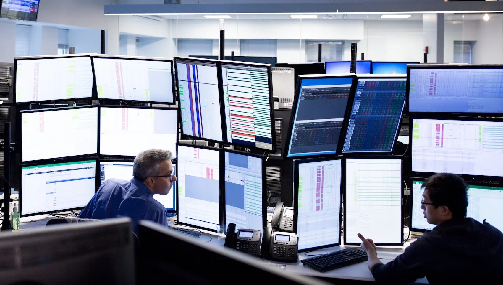

## Table of Contents

## What is Geneva Trading?

Geneva Trading is a company that helps people buy and sell things like stocks and other financial stuff. They use computers and special programs to do this quickly and well. The company started in 1999 and has offices in different places like Chicago and Dublin.

They work with big companies and other traders to make trading easier and faster. Geneva Trading uses technology to find the best prices and make good deals. They also help their clients understand the markets and make smart choices about buying and selling.

## When was Geneva Trading founded?

Geneva Trading was founded in 1999. It is a company that helps people trade things like stocks using computers and special programs.

They have offices in places like Chicago and Dublin. They work with big companies and other traders to make trading easier and faster.

## Who are the founders of Geneva Trading?

Geneva Trading was started by two people, Don and Liz. They wanted to use computers to help people buy and sell things like stocks better and faster. They thought technology could make trading easier for everyone.

Don and Liz began the company in 1999. They worked hard to make their special programs work well. Now, Geneva Trading helps big companies and other traders all over the world.

## What types of financial markets does Geneva Trading operate in?

Geneva Trading works in many different financial markets. They help people buy and sell things like stocks, which are pieces of companies. They also work with futures, which are agreements to buy or sell something at a later time, and options, which give people the right to buy or sell at a certain price.

The company uses computers and special programs to make trading easier and faster. They help their clients understand these markets and make smart choices about buying and selling. Geneva Trading works with big companies and other traders to find the best prices and make good deals.

## How does Geneva Trading make money?

Geneva Trading makes money by helping people buy and sell things like stocks, futures, and options. They use computers and special programs to do this quickly and well. When someone wants to buy or sell something, Geneva Trading helps them find the best price and make the deal happen. For this help, they get a small fee or a part of the money made from the trade.

They also make money by working with big companies and other traders. These clients pay Geneva Trading to use their technology and knowledge to make trading easier and faster. By helping these clients understand the markets and make smart choices, Geneva Trading earns money from the services they provide.

## What are the key services offered by Geneva Trading?

Geneva Trading helps people buy and sell things like stocks, futures, and options. They use computers and special programs to make trading quick and easy. When someone wants to trade, Geneva Trading finds the best price and makes the deal happen. They charge a small fee or a part of the money made from the trade for this help.

They also work with big companies and other traders. These clients pay Geneva Trading to use their technology and knowledge. This makes trading easier and faster for the clients. Geneva Trading helps them understand the markets and make smart choices about buying and selling.

## Can you explain the trading strategies used by Geneva Trading?

Geneva Trading uses computers and special programs to help people buy and sell things like stocks, futures, and options. They use a strategy called [algorithmic trading](/wiki/algorithmic-trading), which means they use math and computer code to decide when to buy and sell. This helps them find the best prices and make deals quickly. They also use high-frequency trading, which means they buy and sell a lot in a short time to make small profits that add up.

Another strategy they use is [market making](/wiki/market-making). This means they help keep the market running smoothly by always being ready to buy or sell. They put prices in the market that others can trade with. This helps make trading easier for everyone. By using these strategies, Geneva Trading can help their clients make smart choices and find good deals in the financial markets.

## What is the company culture like at Geneva Trading?

At Geneva Trading, the company culture is all about teamwork and using technology to help people trade better. Everyone works together to make sure they can find the best prices and make good deals for their clients. They use computers and special programs a lot, so everyone needs to be good at working with technology. The people at Geneva Trading also like to learn new things and keep up with what's happening in the markets.

The company also cares about having a good work-life balance. They want their employees to be happy and healthy, so they offer things like flexible work hours and time off when needed. Everyone at Geneva Trading feels like they are part of a big family. They help each other out and celebrate successes together. This makes it a fun and supportive place to work.

## How does Geneva Trading contribute to the financial industry?

Geneva Trading helps the financial industry by making trading easier and faster. They use computers and special programs to help people buy and sell things like stocks, futures, and options. This means they can find the best prices and make good deals quickly. They also work with big companies and other traders, helping them understand the markets and make smart choices. By doing this, Geneva Trading makes the whole trading process smoother and more efficient for everyone.

Geneva Trading also helps keep the markets running smoothly with a strategy called market making. This means they are always ready to buy or sell, which helps keep the market active and stable. They use technology to do this quickly and accurately. By using these strategies, Geneva Trading plays an important role in making sure the financial markets work well. They help create a fair and efficient place for people to trade, which is good for the whole industry.

## What are the major achievements of Geneva Trading in the past decade?

In the past ten years, Geneva Trading has grown a lot. They have opened new offices in different places like Chicago and Dublin. This has helped them work with more people and companies around the world. They also made their computer programs even better, which means they can help people buy and sell things like stocks faster and at better prices. This has made them a big name in the trading world.

Another big achievement for Geneva Trading is how they have helped the financial markets stay stable. They use a strategy called market making, where they are always ready to buy or sell. This keeps the markets running smoothly and helps everyone trade more easily. They also keep learning and improving their technology, which makes them good at finding the best deals for their clients. All these things have made Geneva Trading an important part of the financial industry.

## What regulatory challenges has Geneva Trading faced?

Geneva Trading, like many companies that help people buy and sell things like stocks, has to follow rules set by governments and financial groups. Sometimes, these rules can be hard to follow and can cause problems. For example, they have to make sure their computer programs and trading strategies follow all the laws about how trading should be done. If they don't, they might get in trouble with regulators, who are like referees making sure everyone plays by the rules.

One specific challenge Geneva Trading faced was about high-frequency trading. This is when they buy and sell a lot very quickly to make small profits. Some people and regulators worry that this kind of trading might not be fair to everyone. So, they have to be very careful and make sure their high-frequency trading follows all the rules. This can be hard because the rules can change and they have to keep up with them to avoid any issues.

## How does Geneva Trading stay competitive in the high-frequency trading market?

Geneva Trading stays competitive in the high-frequency trading market by using really fast computers and special programs. They always work on making their technology better so they can buy and sell things like stocks very quickly. This helps them find the best prices and make good deals faster than other companies. They also use a lot of math and computer code to make smart choices about when to trade. This way, they can stay ahead in the fast-paced world of high-frequency trading.

Another way Geneva Trading stays competitive is by always learning and trying new things. They keep up with what's happening in the markets and change their strategies when needed. They also work closely with big companies and other traders, which helps them understand what people want and need. By being flexible and using their technology well, Geneva Trading can keep up with the competition and help their clients make money in the high-frequency trading market.

## References & Further Reading

[1]: Aldridge, I. (2013). ["High-Frequency Trading: A Practical Guide to Algorithmic Strategies and Trading Systems"](https://www.amazon.com/High-Frequency-Trading-Practical-Algorithmic-Strategies/dp/1118343506) Wiley.

[2]: Chan, E. (2009). ["Quantitative Trading: How to Build Your Own Algorithmic Trading Business"](https://github.com/ftvision/quant_trading_echan_book) Wiley.

[3]: Jansen, S. (2020). ["Machine Learning for Algorithmic Trading"](https://github.com/stefan-jansen/machine-learning-for-trading) Packt Publishing.

[4]: Lopez de Prado, M. (2018). ["Advances in Financial Machine Learning"](https://www.amazon.com/Advances-Financial-Machine-Learning-Marcos/dp/1119482089) Wiley.

[5]: Gomber, P., Arndt, B., Lutat, M., & Uhle, T. (2011). ["High-Frequency Trading"](https://papers.ssrn.com/sol3/papers.cfm?abstract_id=1858626). In Algorithmic Trading (pp. 57-78). Springer Verlag.

[6]: Hendershott, T., Jones, C. M., & Menkveld, A. J. (2011). ["Does Algorithmic Trading Improve Liquidity?"](https://onlinelibrary.wiley.com/doi/full/10.1111/j.1540-6261.2010.01624.x) The Review of Financial Studies, 24(8), 2495-2522.

[7]: Narang, R. K. (2013). ["Inside the Black Box: A Simple Guide to Quantitative and High-Frequency Trading"](https://onlinelibrary.wiley.com/doi/book/10.1002/9781118662717) Wiley.