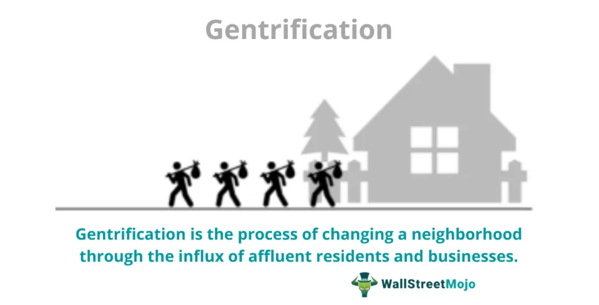

Socioeconomic change refers to significant alterations in the societal and economic structure of communities. These changes may result from numerous factors, including shifts in employment patterns, income distribution, and demographic dynamics. Gentrification, on the other hand, is a controversial aspect of socioeconomic change, characterized by the transformation of lower-income urban neighborhoods through trends of higher-income individuals moving in, leading to altered cultural and social dynamics as well as displacement of long-time residents.

Urban development denotes the comprehensive process of designing and developing urban areas, addressing housing, infrastructure, and public spaces to facilitate living standards, economic growth, and sustainability. Algorithmic trading involves the use of computer algorithms to make trading decisions in financial markets with precision and speed, significantly impacting the economic landscapes, including those related to urban real estate investments.

These concepts interconnect during the evolution of modern cities, where rapid technological advances and financial strategies significantly influence urban environments. The dynamic interplay between socioeconomic change, gentrification, and urban development is driven by innovations in technology and finance, which play pivotal roles in shaping today’s urban landscapes. Financial markets, particularly through algorithmic trading, heavily influence property values, investment patterns, and ultimately contribute to the socioeconomic shifts within urban settings.

The purpose of this article is to explore these interconnections, providing an insight into how urban changes are intertwined with financial strategies. As technology continues to advance and financial markets evolve, their influences on urban landscapes grow ever more prominent. This article aims to investigate these dynamics, revealing the extent to which financial approaches, including algorithmic trading, impact urban development and socioeconomic changes. By analyzing these connections, the article seeks to provide a comprehensive overview of the ongoing transformation within urban areas guided by technological and financial advancements.

## Table of Contents

## Understanding Socioeconomic Change

Socioeconomic change in urban areas is a multifaceted phenomenon influenced by several interrelated factors. Economic policies, globalization, and technological advancements are among the primary drivers that reshape social structures and economic landscapes in cities.

Economic policies play a pivotal role in shaping urban socioeconomic conditions. Policies related to taxation, urban planning, and infrastructure development can significantly affect wealth distribution and living standards. For instance, tax incentives and subsidies for businesses can attract investments, creating job opportunities and boosting local economies. However, these policies can also widen income disparities if benefits are not evenly distributed across different socioeconomic groups.

Globalization has accelerated socioeconomic changes by increasing interconnectedness and economic activity across cities worldwide. Cities have become focal points for international trade, investment, and migration, leading to cultural exchanges and economic growth. However, globalization can also contribute to economic inequality by favoring skilled labor and industries that benefit from global markets, while traditional sectors may face competitive pressures and decline. This disparity can exacerbate social stratification and limit opportunities for upward mobility, particularly for lower-income individuals.

Technological advancements have transformed urban landscapes by driving innovations in communication, transportation, and industry. The rise of technology-driven economies has created new industries, shifting employment patterns and skill requirements. Urban areas have seen an increase in high-tech sectors, necessitating a more educated workforce and leading to a rise in income levels for those with the necessary skills. However, this technological shift can marginalize workers in traditional industries, creating a divide between those with access to technology and those without.

Several cities provide examples of recent significant socioeconomic changes. For instance, San Francisco, influenced by the tech boom, has experienced a dramatic reshaping of its social fabric and economic landscape. The influx of technology companies and workers has led to rising property values and increased cost of living, contributing to the displacement of long-term residents and a growing divide between wealthy technology professionals and lower-income communities.

Income disparity remains a core issue as urban areas continue to evolve. High income inequality can hinder social mobility, as access to education, health care, and employment opportunities often correlates with economic status. This disparity is critical, as it affects social cohesion and economic sustainability. Socioeconomic stratification can lead to tensions and undermine the inclusive growth necessary for urban areas to thrive.

In summary, socioeconomic change in urban areas is driven by economic policies, globalization, and technological advancements, each exerting significant influence on social structures. Analyzing case studies like San Francisco highlights the complexity of these factors and the critical issues of income disparity and social mobility that cities face. Addressing these challenges requires a comprehensive understanding of the interplay between different influences and their implications for urban populations.

## The Role of Gentrification in Urban Development

Gentrification, a term that originated in the 1960s, refers to the process by which wealthier individuals move into, renovate, and rejuvenate urban neighborhoods, often displacing lower-income residents. This phenomenon has historical roots in urban policy-making and economic shifts, as cities have sought to revive declining areas to boost economic development and social appeal. Gentrification typically involves the transformation of urban spaces to cater to the middle and upper classes, altering the socioeconomic landscape of these neighborhoods.

Benefits of gentrification include the revitalization of deteriorating urban areas, increased property values, and enhanced local services and infrastructure. With the influx of financial investments, neighborhoods often become more aesthetically pleasing and safer due to better policing and community watch schemes. Moreover, gentrification can stimulate local economies by attracting new businesses, cafes, and restaurants, contributing to job creation and greater market variety.

However, gentrification also presents significant drawbacks. One primary concern is the displacement of long-standing residents who can no longer afford rising rent and property taxes. This displacement often leads to social tension and the erasure of cultural and historical identities of communities. Furthermore, the influx of wealthier residents can create an economic divide, exacerbating existing inequalities and generating feelings of alienation among original inhabitants.

Culturally, gentrification can alter the identity of communities. As new demographic groups move in, traditional cultural symbols and community activities may be replaced or overshadowed. Socially, this shift can lead to a homogenization of urban areas, where diversity is lost, and local customs and languages may diminish. Economically, while some benefit from improved property values, others face increased living costs without corresponding wage increases, effectively marginalizing lower-income populations.

Real-world examples illustrate the multifaceted nature of gentrification. In New York City's Brooklyn neighborhood, areas such as Williamsburg and Bushwick have witnessed significant gentrification. Once considered gritty and industrial, these areas now boast high-end boutiques, cafes, and luxury apartments. While this transformation has increased housing values and spurred economic activity, it has also displaced lower-income families and local businesses, altering the original character of the community.

In London, the district of Shoreditch has transformed from a largely overlooked area into a vibrant, tech-driven neighborhood. The associated rise in property prices has pushed out many original residents, leading to debates about the impact on London's broader cultural and social fabric. Similarly, San Francisco's Mission District has seen a tech-fueled increase in property values, bringing economic growth at the cost of cultural displacement and social stress for longstanding Latino communities.

These examples underscore the complex interplay of cultural, social, and economic consequences inherent in gentrification. While it can revitalize urban areas, enhance economic opportunities, and improve infrastructure, it can also undermine the social fabric, leading to significant questions about who benefits and who bears the costs of urban development efforts.

## Urban Development in the Age of Technology

Technology profoundly impacts urban planning and design, reshaping how cities are conceptualized, built, and managed. The concept of smart cities epitomizes this transformation, integrating information and communication technology (ICT) to enhance the quality of urban services and reduce resource consumption.

Smart cities harness advanced technologies to improve efficiency and quality of life. They are characterized by their use of sensors, networks, and data analytics to manage services such as transportation, healthcare, and energy. The potential benefits of smart cities include increased efficiency, reduced environmental impact, and enhanced quality of life. However, challenges remain, including the need for substantial investment, potential privacy issues, and the digital divide that may exclude certain demographics.

Big data and connectivity are crucial in urban development, allowing city planners to make data-driven decisions. The vast amounts of data generated daily can provide insights into traffic patterns, energy usage, and social behavior, enabling more responsive and efficient urban systems. Connectivity, enabled by the Internet of Things (IoT), allows for the seamless integration of services, ensuring that infrastructure is responsive to the needs of its citizens.

Sustainable energy and green architecture are becoming integral to urban strategies as cities face the dual challenges of climate change and growing populations. Renewable energy sources, such as solar and wind, are increasingly used to power urban infrastructure, reducing dependency on fossil fuels. Green architecture promotes energy efficiency through the use of sustainable materials and designs that minimize ecological impact. Key features include energy-efficient buildings, extensive green spaces, and sustainable public transportation options.

In summary, technology is a driving force in urban development, offering solutions to contemporary challenges while requiring careful consideration of ethical and practical implications. The integration of ICT in urban planning is reshaping cities into smart, efficient, and sustainable environments.

## Algorithmic Trading: Influence on Urban Real Estate Markets

Algorithmic trading involves the use of computer algorithms to automate trading decisions in financial markets. These algorithms can process vast amounts of data at high speed to execute buy and sell orders, often across multiple exchanges and markets, with minimal human intervention. The primary advantages of [algorithmic trading](/wiki/algorithmic-trading) include increased efficiency, reduced transaction costs, and the ability to exploit market opportunities that require rapid response times.

In recent times, algorithmic trading has begun to exert a notable influence on real estate investments. This shift can primarily be attributed to the use of data-driven strategies that allow investors to analyze real estate markets with increased precision. By processing various data points—including economic indicators, property trends, and demographic changes—algorithms can generate insights that inform investment decisions in the real estate sector. This development has implications for urban real estate markets, as investors can now respond to market trends more swiftly, leading to shifts in property values and influencing urban development patterns.

The financialization of urban spaces, driven in part by algorithmic trading, has led to both opportunities and challenges. Financialization refers to the increasing role of financial motives, markets, instruments, and institutions in affecting economic policy and practice. In urban contexts, this manifests as a heightened focus on real estate as a financial asset, influencing development priorities and often driving up property prices. This can lead to the prioritization of profit-driven projects over community needs, impacting urban social dynamics and potentially exacerbating socioeconomic inequalities.

Data-driven trading strategies have also introduced new dynamics into property markets. For instance, the capability of algorithms to swiftly interpret large datasets means that investment firms can forecast property price fluctuations with greater accuracy, allowing them to optimize purchase and sale timings. This can result in more volatile market conditions, as rapid transactions might contribute to price swings. Additionally, the use of predictive analytics can lead to a focus on short-term gains, leading to decisions that may not align with sustainable urban development goals.

One illustrative example of data-driven trading's impact on property markets is the rise of real estate investment trusts (REITs) that employ algorithmic trading methods to manage their portfolios. By leveraging algorithms, these REITs can efficiently assess market trends and allocate resources to various property segments. Moreover, the collection and analysis of data regarding tenant behaviors, market demand, and regional economic conditions enable these entities to remain competitive and market-responsive.

In summary, algorithmic trading significantly influences urban real estate markets through enhanced data analysis capabilities, contributing to the broader financialization of urban spaces. This interaction raises crucial questions about the long-term impact on urban development and social equity, highlighting the need for balanced regulatory frameworks to ensure that technological advancements in finance benefit a wide array of stakeholders.

## Intersecting Pathways: Finance Meets Urban Life

Examining the interconnection between financial markets and urban life reveals complex yet significant influences shaping modern cities. As cities become increasingly intertwined with global financial systems, one of the most critical mechanisms driving this change is algorithmic trading. This form of trading, which uses computer algorithms to execute trades at speeds and volumes impossible for human traders, is increasingly impacting socioeconomic patterns in urban environments.

Algorithmic trading operates through the systematic use of mathematical models and computational strategies to determine trading decisions in financial markets without human intervention. This technology contributes to urban socioeconomic shifts by influencing real estate markets and investment patterns. As traders leverage algorithms to analyze massive datasets, they can identify macroeconomic trends and micro-market opportunities, leading to a more dynamic and responsive property market. For instance, algorithms can detect neighborhood trends through data points such as demographic shifts, infrastructure investments, or changes in local zoning laws. By aligning investment strategies with these predictive insights, financial institutions can capitalize on emerging urban trends, ultimately influencing property values and urban development.

Financial tools and strategies are fundamental in shaping urban landscapes, particularly through the financialization of real estate. Financialization involves viewing real estate not just as a static asset but as an integral component of investment portfolios. Institutions utilize instruments such as Real Estate Investment Trusts (REITs), mortgage-backed securities, and derivatives to allocate capital efficiently. As these tools facilitate significant capital flows into urban areas, they have the power to accelerate development projects, enhance infrastructure, and transform cityscapes. Such developments can lead to upscale housing and commercial spaces, but they often raise concerns about affordability and displacement of existing communities.

Potential future trends in the interplay between finance and urban development are influenced by advances in technology, specifically in data analytics and [machine learning](/wiki/machine-learning). With growing access to real-time data, algorithms are becoming more sophisticated in predicting market movements and identifying investment opportunities. Urban development is likely to increasingly rely on predictive analytics to optimize urban planning, enhance sustainability efforts, and improve resource allocation.

Moreover, the rise of decentralized finance (DeFi) platforms presents opportunities for democratizing investment in real estate. By leveraging blockchain technology, DeFi could allow fractional ownership of properties, reducing barriers to entry for investors and enabling broader participation in urban development projects. This could potentially create more inclusive financial ecosystems, though it may also introduce regulatory challenges regarding transparency and security.

In conclusion, the intersection between finance and urban life is multifaceted and continually evolving. Algorithmic trading and financial strategies are reshaping how cities grow and how residents interact with their environments. The dual impact of technology and finance in urban development underscores the need for thoughtful integration of these elements to cultivate urban environments that are economically vibrant and socially equitable. Further research and proactive planning are essential to navigate the challenges and harness the opportunities presented by this evolving landscape.

## Challenges and Opportunities

The convergence of socioeconomic change, gentrification, urban development, and algorithmic trading presents a series of challenges and opportunities that are reshaping urban landscapes globally. One significant challenge is the potential increase in socioeconomic disparity. As technology and financial strategies like algorithmic trading become more influential, wealth concentration in urban centers may intensify, marginalizing lower-income residents. This can lead to a homogenization of neighborhoods and the erosion of cultural diversity, often associated with gentrification. 

Another challenge involves the rapid pace of urban change driven by financialization, where property markets are increasingly influenced by global capital flows rather than local needs. This can inflate property values, making housing less affordable for average citizens, disrupting communities, and displacing long-standing residents. Moreover, the [volatility](/wiki/volatility-trading-strategies) introduced by algorithmic trading can lead to unstable real estate markets, affecting long-term urban planning and development.

Despite these challenges, there are substantial opportunities for fostering sustainable urban growth through mindful financial strategies. Integrating environmental, social, and governance ([ESG](/wiki/esg-investing)) criteria into investment decisions could direct capital toward projects that prioritize sustainability and community well-being. Smart urban planning, supported by technological advancements, can enhance efficiency and connectivity, fostering more inclusive growth.

Regulation plays a crucial role in balancing economic growth with social equity. Governments can implement policies that encourage community-based development and protect affordable housing. For example, tax incentives for developers to include affordable units in new projects can help mitigate displacement pressures. Additionally, regulations imposing transparency on algorithmic trading practices can help stabilize property markets and protect them from speculative bubbles.

To mitigate the adverse effects of gentrification and financialization, potential solutions include community land trusts, which keep housing affordable and within community control. Implementing rent control measures and exploring public-private partnerships for housing development can help maintain diversity and accessibility in urban areas.

In conclusion, while the convergence of these themes presents notable challenges, it also offers a pathway to innovative, sustainable urban development strategies. With thoughtful policies and mindful financial practices, cities can achieve economic growth that benefits a broader spectrum of the populace.

## Conclusion

The article explored the intricate connections between socioeconomic change, gentrification, urban development, and algorithmic trading, highlighting how these elements collectively shape urban landscapes in contemporary cities. Socioeconomic changes, driven by factors such as globalization and technological advancements, are reshaping social structures and contributing to substantial shifts in urban areas. The phenomenon of gentrification was discussed as both a driver and consequence of these changes, bringing both benefits and challenges to local communities.

The role of technology in urban development was examined, particularly focusing on the emergence of smart cities, the application of big data, and the integration of sustainable practices like green architecture. These technological advancements present both opportunities for efficient urban planning and challenges related to privacy and infrastructure.

Algorithmic trading, a sophisticated financial tool, significantly influences real estate markets by altering investment patterns and contributing to the financialization of urban environments. This financialization can have profound effects on urban development, often leading to increased disparities and social inequality.

A balanced approach is essential, one that leverages technological and financial advancements while also addressing their socio-economic implications. This necessitates mindful regulation to ensure that economic growth does not exacerbate social inequalities. The intertwined nature of these factors suggests a complex landscape that requires further research and thoughtful discourse to navigate successfully. 

Moving forward, it is crucial to continue exploring these interconnected topics, emphasizing sustainable development and equitable growth, which will ensure that cities remain inclusive and adaptable to future challenges.

## References & Further Reading

[1]: Atkinson, R., & Bridge, G. (Eds.). (2005). ["Gentrification in a Global Context: The New Urban Colonialism."](https://www.taylorfrancis.com/books/edit/10.4324/9780203392089/gentrification-global-context-rowland-atkinson-gary-bridge) Routledge.

[2]: Lees, L., Slater, T., & Wyly, E. (2008). ["Gentrification."](https://www.taylorfrancis.com/books/mono/10.4324/9780203940877/gentrification-loretta-lees-elvin-wyly-tom-slater) Routledge.

[3]: Curran, W. (2017). ["Gentrification and the Nature of Work: Exploring the Linkages in Williamsburg, Brooklyn."](https://journals.sagepub.com/doi/10.1068/a36240) Journal of Urban Affairs.

[4]: Berman, M. (1982). ["All That Is Solid Melts into Air: The Experience of Modernity."](https://archive.org/details/berman_marshall_all_that_is_solid_melts_into_air_the_experience_of_modernity) Verso Books.

[5]: Lopez de Prado, M. (2018). ["Advances in Financial Machine Learning."](https://books.google.com/books/about/Advances_in_Financial_Machine_Learning.html?id=oU9KDwAAQBAJ) Wiley.

[6]: Chan, E. P. (2009). ["Quantitative Trading: How to Build Your Own Algorithmic Trading Business."](https://github.com/ftvision/quant_trading_echan_book) Wiley Trading.

[7]: Graham, S., Marvin, S. (2001). ["Splintering Urbanism: Networked Infrastructures, Technological Mobilities, and the Urban Condition."](https://www.taylorfrancis.com/books/mono/10.4324/9780203452202/splintering-urbanism-steve-graham-simon-marvin) Routledge.

[8]: Harvey, D. (1989). ["The Condition of Postmodernity: An Enquiry into the Origins of Cultural Change."](https://www.researchgate.net/publication/292518136_The_condition_of_postmodernity_1989_David_Harvey) Blackwell Publishing.

[9]: Zuboff, S. (2019). ["The Age of Surveillance Capitalism: The Fight for a Human Future at the New Frontier of Power."](https://www.jstor.org/stable/26862460) PublicAffairs.

[10]: Florida, R. (2017). ["The New Urban Crisis: How Our Cities Are Increasing Inequality, Deepening Segregation, and Failing the Middle Class—and What We Can Do About It."](https://link.springer.com/article/10.1007/s10901-018-9632-3) Basic Books.