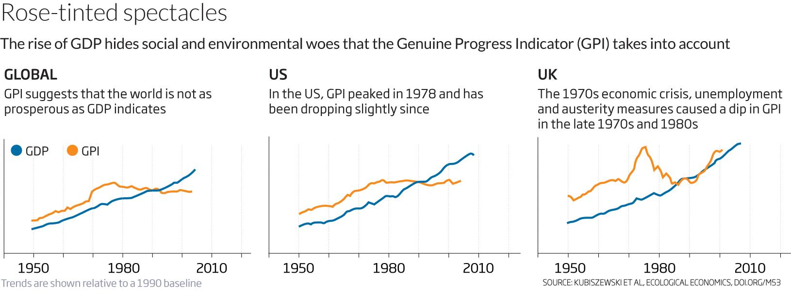

## Table of Contents

## What is the Genuine Progress Indicator (GPI)?

The Genuine Progress Indicator (GPI) is a way to measure how well a country is doing, beyond just looking at money. It tries to see if people are really better off by considering things like how happy people are, how healthy they are, and how much they help each other. The GPI takes into account things that traditional measures like Gross Domestic Product (GDP) might miss, such as the value of volunteer work or the cost of pollution.

The GPI works by adding up the good things and subtracting the bad things. For example, it adds the value of housework and education, but subtracts the costs of crime and environmental damage. By doing this, the GPI gives a more complete picture of a country's progress. It helps people understand that growth isn't just about making more money, but about improving the quality of life for everyone.

## What is Gross Domestic Product (GDP)?

Gross Domestic Product, or GDP, is a way to measure the total value of all the goods and services produced in a country during a specific time, usually a year. It's like adding up everything that people buy and sell, from cars and computers to haircuts and hamburgers. GDP is often used to see how well a country's economy is doing. If the GDP goes up, it usually means the economy is growing and people are spending more money.

However, GDP only looks at the money side of things. It doesn't tell us if people are happier or if the environment is getting better or worse. For example, if a country cuts down a lot of trees to make paper, the GDP might go up because they are selling more paper, but it doesn't show the harm done to the forests. So, while GDP is a useful tool for understanding economic activity, it doesn't give the full picture of a country's well-being.

## How does GPI differ from GDP in measuring economic progress?

The Genuine Progress Indicator (GPI) and Gross Domestic Product (GDP) are two different ways to measure how well a country is doing. GDP looks at the total value of all goods and services made in a country. It's like adding up all the money spent on things like cars, food, and haircuts. If people buy more stuff, GDP goes up, and people think the economy is doing well. But GDP only cares about money and doesn't tell us if people are happier or if the environment is getting better or worse.

On the other hand, GPI tries to give a fuller picture of how people are doing. It doesn't just look at money; it also considers things like how happy people are, how healthy they are, and how much they help each other. GPI adds up the good things, like the value of housework and education, and subtracts the bad things, like the costs of crime and pollution. So, GPI can show that even if a country's GDP is going up, people might not be better off if there's more crime or pollution.

## What are the key components included in the GPI that are not in GDP?

The Genuine Progress Indicator (GPI) includes many things that the Gross Domestic Product (GDP) does not. GPI looks at the value of things that don't cost money but are important for a good life. For example, GPI counts the time people spend doing housework or volunteering, which helps others but doesn't show up in GDP. It also includes the value of education and how much people enjoy their free time. These things make life better but don't add to the money counted in GDP.

GPI also takes away the bad things that GDP ignores. For instance, if there's more crime or pollution, GPI subtracts the costs of these problems. If people have to spend more money on healthcare because they're sick from pollution, GPI counts that as a negative. GDP might go up if people buy more medicine, but GPI sees that as a sign that something is wrong. By including both the good and the bad, GPI gives a more complete picture of how well a country and its people are really doing.

## Can you explain how GPI accounts for environmental factors?

The Genuine Progress Indicator (GPI) takes into account environmental factors by looking at the costs that come from harming the environment. For example, if a factory pollutes the air or water, it can make people sick. GPI subtracts the costs of this pollution, like the money people spend on medicine or the time they lose being sick. It also considers the damage done to nature, like cutting down forests or losing wildlife. These costs are not counted in the Gross Domestic Product (GDP), which might even go up if people buy more medicine or if the factory makes more money.

GPI also tries to show the value of having a healthy environment. It adds the benefits we get from nature, like clean air and water, which help us live better lives. If a country works to protect its environment, GPI will show that as a positive thing. For instance, if people plant more trees or clean up rivers, GPI will count these efforts as adding to the well-being of the country. This way, GPI gives a fuller picture of how environmental health affects the quality of life, something that GDP does not consider.

## How does GPI consider income distribution compared to GDP?

The Genuine Progress Indicator (GPI) looks at how money is shared among people in a different way than the Gross Domestic Product (GDP). GDP just adds up all the money made in a country, so it doesn't care if a few people have a lot of money while many others have very little. GPI, on the other hand, tries to see if the money is spread out fairly. If the rich get richer and the poor stay poor, GPI will show that as a problem because it means not everyone is doing better.

GPI does this by adjusting the total income to reflect how evenly it's shared. If the gap between the rich and the poor grows, GPI will go down because it sees that as bad for the overall well-being of the country. This way, GPI gives a more complete picture of how well a country is doing, not just in terms of total money, but in terms of how that money helps everyone live better lives.

## What are some examples of countries or regions that use GPI instead of or alongside GDP?

Some places that use the Genuine Progress Indicator (GPI) are Maryland in the United States and the Canadian province of Nova Scotia. Maryland started using GPI in 2010 to get a better idea of how well its people are doing. They wanted to see if people were happier and healthier, not just if they were making more money. Nova Scotia also uses GPI to help make decisions about things like health care and the environment. They think it's important to know if their policies are really helping everyone live better lives.

In Europe, some countries like Sweden and Finland have looked at GPI to help them understand more about their progress. They use it alongside GDP to get a fuller picture of how their country is doing. For example, Sweden might use GPI to see if their efforts to protect the environment are making a difference in people's lives. Finland might use it to check if their education and health programs are working well. By using GPI, these places can make sure they are not just growing their economy, but also improving the quality of life for their people.

## How is the calculation of GPI performed, and what data sources are typically used?

The calculation of the Genuine Progress Indicator (GPI) starts by taking the total income of a country, similar to how Gross Domestic Product (GDP) is calculated. But then, GPI adjusts this number to show a more complete picture of how well people are doing. It adds the value of things that make life better but don't cost money, like the time people spend doing housework or volunteering. It also adds the benefits we get from a healthy environment, like clean air and water. On the other hand, GPI subtracts the costs of bad things, like crime, pollution, and the loss of natural resources. By doing this, GPI shows if people are really better off, not just if they are making more money.

To calculate GPI, different kinds of data are used. This includes economic data like income and spending, which can be found in government reports and economic surveys. Social data, like crime rates and health [statistics](/wiki/bayesian-statistics), come from sources like police records and health departments. Environmental data, such as pollution levels and natural resource use, are gathered from environmental agencies and research studies. Sometimes, surveys are used to find out how happy people are or how much they value things like free time and a clean environment. By putting all this information together, GPI gives a fuller picture of a country's progress than just looking at money.

## What criticisms or limitations are associated with using GPI as an economic indicator?

One criticism of the Genuine Progress Indicator (GPI) is that it can be hard to measure some of the things it includes. For example, how do you put a number on how happy people are or the value of housework? Different people might have different ideas about what these things are worth. This makes it tricky to compare GPI numbers from one place to another or over time. Also, GPI needs a lot of different kinds of data, like health, crime, and environment numbers. If this data is not good or complete, the GPI might not be accurate.

Another limitation is that GPI is not used as much as GDP, so it can be harder to find GPI numbers for different countries or years. This makes it tough to use GPI to compare how different places are doing. Some people also think that GPI can be too complicated because it tries to include so many different things. They worry that it might be hard for people to understand what the GPI number really means. Even though GPI tries to give a fuller picture of how well a country is doing, these challenges can make it less useful for some people.

## How have trends in GPI compared to GDP over time in specific case studies?

In Maryland, USA, they started using GPI in 2010 to see if people were really doing better. From 2010 to 2019, Maryland's GDP went up, which means people were spending more money. But the GPI didn't go up as much. This showed that even though people were buying more stuff, other things like crime and pollution were getting worse. So, the GPI helped Maryland see that just making more money wasn't making life better for everyone.

In Nova Scotia, Canada, they also use GPI to help make decisions. Over the years, they found that while their GDP was growing, the GPI was not growing as fast. This was because things like income inequality and environmental damage were getting worse. By looking at GPI, Nova Scotia could see that they needed to focus on more than just making money. They needed to work on making sure everyone had a good life and that the environment was healthy too.

## What are the policy implications of using GPI over GDP for economic planning and decision-making?

Using the Genuine Progress Indicator (GPI) instead of Gross Domestic Product (GDP) for economic planning and decision-making can lead to different kinds of policies. GPI looks at more than just money; it considers things like how happy people are, how healthy they are, and how the environment is doing. If a country uses GPI, they might focus more on making sure everyone has a good life, not just on making more money. For example, they might spend more on education and health care because these things make people's lives better, even if they don't add to GDP. They might also work harder to protect the environment because GPI shows that pollution and losing natural resources are bad for people.

This shift in focus can lead to policies that try to make income more equal. If GPI shows that the rich are getting richer while the poor stay poor, a country might make policies to help the poor more. They might also put more effort into reducing crime and improving the quality of life for everyone. By using GPI, governments can see the full picture of how their country is doing and make better decisions that help everyone live better lives, not just a few people get richer.

## How can GPI be integrated into national accounting systems, and what challenges might arise?

Integrating the Genuine Progress Indicator (GPI) into national accounting systems means adding it to the way countries keep track of their economy. This would mean collecting a lot more information than just money numbers. Countries would need to gather data on things like how happy people are, how much they volunteer, and how healthy the environment is. They would then use this information to adjust the total income to show a fuller picture of how well the country is doing. This could help governments make better decisions that focus on improving life for everyone, not just on making more money.

However, there are challenges to doing this. One big challenge is that GPI needs a lot of different kinds of data, and not all countries have good or complete information on things like happiness or pollution. This can make the GPI numbers less accurate. Another challenge is that GPI can be hard to understand because it includes so many different things. People might find it confusing to know what the GPI number really means. Also, since GPI is not used as much as GDP, it can be hard to compare GPI numbers between different countries or over time. Despite these challenges, using GPI could help countries see the full picture of their progress and make better policies.

## What is GDP as a Conventional Indicator?

Gross Domestic Product (GDP) is a critical economic indicator that quantifies the economic output of a country by measuring the market value of all final goods and services produced within a specific time frame. It is typically calculated on an annual or quarterly basis, providing a snapshot of a nation's economic health and activity. The formula for calculating GDP can be expressed as:

$$
\text{GDP} = C + I + G + (X - M)
$$

where $C$ represents consumption, $I$ stands for investment, $G$ denotes government spending, $X$ is exports, and $M$ is imports. This formula aggregates the total expenditures of consumers, businesses, and the government, factoring in net exports to provide a comprehensive overview of economic activity.

While GDP is extensively used by policymakers to assess and compare economic performance across different countries and time periods, it is not without its limitations. One major critique is that GDP does not account for income inequality within a nation. It aggregates economic output without reflecting how evenly (or unevenly) that wealth is distributed among the population. Consequently, a country might exhibit robust GDP growth, yet a significant portion of its citizens could still experience stagnant or even declining living standards.

Moreover, GDP does not consider the environmental costs of economic production. Activities that lead to environmental degradation, such as deforestation, pollution, and depletion of natural resources, may contribute positively to GDP, even though they have adverse long-term impacts on ecological sustainability and quality of life. This limitation has led to growing concerns about the suitability of GDP as a sole measure of economic progress, especially in an era increasingly focused on sustainable development.

Critics also argue that GDP fails to capture non-market activities that contribute to societal well-being, such as unpaid household work and volunteer efforts. These activities, while not transacted in markets, enhance the social fabric and quality of life but are overlooked in GDP calculations. As a result, GDP provides an incomplete picture of a nation's prosperity and can mislead policymakers by emphasizing economic scale rather than the well-being of its citizens.

This critical discourse underscores the need for complementary indicators that provide a more holistic view of economic progress, incorporating both quantitative and qualitative aspects of economic performance and societal welfare.

## How do GDP and GPI compare?

Gross Domestic Product (GDP) and the Genuine Progress Indicator (GPI) offer contrasting perspectives on evaluating economic success. GDP serves as a measure of a country's total economic output, quantifying the value of all goods and services produced over a given time frame. Its primary focus is on economic activity and production, making it a straightforward gauge of economic size and growth. However, GDP has significant limitations when it comes to assessing the overall well-being of a society, as it does not account for environmental degradation, social inequality, or other externalities that may affect quality of life.

In contrast, GPI extends beyond mere economic transactions to incorporate considerations of societal welfare. It adjusts economic output by factoring in both positive contributions and negative costs to the society. This involves subtracting the detriments, such as pollution, resource depletion, crime, and inequality, from the raw economic output. By doing so, GPI attempts to provide a more nuanced view of progress that aligns with sustainable development and quality of life.

Mathematically, GPI can be expressed as:

$$
\text{GPI} = \text{GDP} + \sum (\text{Positive Adjustments}) - \sum (\text{Negative Adjustments})
$$

Where "Positive Adjustments" may include factors like household labor and volunteer work, and "Negative Adjustments" might involve environmental degradation and social costs.

This juxtaposition between GDP and GPI brings to the forefront a fundamental debate on what constitutes 'progress' within a society. Traditional GDP might show positive growth as economic activity increases, often celebrated in policy circles. Yet, if the gains are accompanied by significant social and environmental drawbacks, GPI may reflect stagnation or even decline. Understanding this discrepancy is vital, as it underscores the limitations of GDP in representing true economic welfare and highlights the importance of a more comprehensive approach like GPI. This philosophical contention forces policymakers and economists to reconsider how progress is defined and measured, especially in an era that increasingly values sustainability and human well-being over sheer economic output.

## References & Further Reading

[1]: Kubiszewski, I., et al. (2013). ["Beyond GDP: Measuring and Achieving Global Genuine Progress"](https://www.sciencedirect.com/science/article/pii/S0921800913001584). Ecological Economics, 93.

[2]: Talberth, J., Cobb, C., & Slattery, N. (2007). ["The Genuine Progress Indicator 2006: A Tool for Sustainable Development"](https://www.researchgate.net/publication/252265237_The_Genuine_Progress_Indicator_2006).

[3]: Costanza, R., et al. (2009). ["Beyond GDP: The Need for New Measures of Progress"](https://www.bu.edu/pardee/files/documents/PP-004-GDP.pdf). Solutions Journal.

[4]: Lawn, P. (2003). ["A Theoretical Foundation to Support the Index of Sustainable Economic Welfare (ISEW), Genuine Progress Indicator (GPI), and Other Related Indexes"](https://web.pdx.edu/~kub/publicfiles/MeasuringWellBeing/Lawn_2003_GPI.pdf). Ecological Economics, 44(1).

[5]: Bagstad, K. J., et al. (2014). ["The Artificial Intelligence of Economic Progress Indicators"](https://www.usgs.gov/staff-profiles/kenneth-j-bagstad). Ecological Indicators, 45.