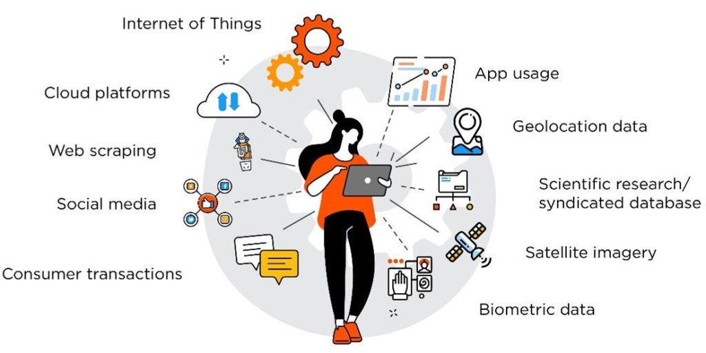

## Table of Contents

## What is geo-location alternative data?

Geo-location alternative data is information about where people or things are located, collected using technology like smartphones or GPS devices. This data can show patterns and trends that are not available in traditional data sources. For example, it can tell businesses where their customers are coming from or how people move around a city.

This type of data is useful for many industries. Companies can use it to make better decisions about where to open new stores or how to target their advertising. For instance, a restaurant might use geo-location data to see if there are enough people nearby to support a new location. It helps businesses understand their customers better and improve their services.

## How is geo-location data collected?

Geo-location data is collected mainly through devices that can track where they are, like smartphones, GPS devices, and even some cars. When you use apps on your phone, like a map or a social media app, they often ask for permission to use your location. If you say yes, the app can track where you are and send that information back to the company that made the app. Sometimes, this data is collected passively, meaning it happens in the background without you doing anything special.

Another way to collect geo-location data is through Wi-Fi and cell towers. When your phone connects to a Wi-Fi network or a cell tower, it can figure out where you are based on the location of those towers. Companies can then use this information to build a picture of where people are going and how they are moving around. This method is useful because it can track people even if they don't have a GPS signal, like inside buildings.

Overall, geo-location data is gathered from many sources and in different ways. It's important for companies to be clear about how they collect and use this data, so people know what's happening with their information. This helps build trust and ensures that the data is used in a way that respects people's privacy.

## What are the common sources of geo-location alternative data?

Geo-location [alternative data](/wiki/best-alternative-data) comes from many places. One common source is smartphone apps. When you use apps like maps or social media, they can track where you are if you allow them to. This data helps companies see where people go and how they move around. Another source is GPS devices, which are often in cars or used by people who like to hike or travel. These devices send location information to companies that can then use it to understand travel patterns.

Another way to get geo-location data is through Wi-Fi and cell towers. When your phone connects to these, it can figure out where you are. This is helpful because it works even inside buildings where GPS might not reach. Companies can use this data to see how people move in cities or shopping centers. Credit card transactions are also a source of geo-location data. When you use your card to buy something, the location of the store is recorded, which can show where people are spending money.

Overall, geo-location alternative data is collected from smartphones, GPS devices, Wi-Fi and cell towers, and credit card transactions. These sources help businesses understand where people are and how they behave in different places. It's important for companies to be clear about how they collect and use this data to respect people's privacy.

## What are the main uses of geo-location data in business?

Businesses use geo-location data to make smart choices about where to open new stores or offices. For example, a company might look at where their customers live and work to find the best spot for a new location. This helps them make sure there are enough people nearby who might want to visit their store. Geo-location data also helps businesses understand how people move around a city or a shopping center. This can show them the best places to put ads or where to set up a new branch.

Another big use of geo-location data is in marketing. Companies can use this data to send special offers or ads to people when they are near a store. This makes the ads more useful because they are shown at the right time and place. For example, a coffee shop might send a discount coupon to someone walking by. Geo-location data also helps businesses see where their customers come from and how they behave. This can help them make their products or services better to meet their customers' needs.

## How can geo-location data improve marketing strategies?

Geo-location data can make marketing strategies better by helping businesses send ads and offers to people at the right time and place. For example, if someone is walking near a store, the business can send them a special discount on their phone. This makes the ad more useful because it's shown when the person is close enough to use it. It's like getting a coupon for a coffee shop just as you pass by, which can make you more likely to stop in and buy something.

Also, geo-location data helps businesses understand where their customers come from and how they move around. This information can show them the best places to put ads or where to open new stores. For instance, if a lot of customers come from a certain area, a business might decide to put more ads there or even open a new location. By knowing where people are and how they behave, businesses can make their marketing more targeted and effective, which can help them sell more and grow.

## What are the privacy concerns associated with using geo-location data?

Using geo-location data can raise big privacy concerns. When companies track where people are, it can feel like someone is always watching. People might worry that their every move is being recorded and used without their full understanding. This can make them feel uncomfortable and less trusting of the companies that use this data. It's important for businesses to be clear about how they collect and use this information, so people know what's happening with their data.

Another worry is that this data could be used in ways that harm people. For example, if someone's location is tracked and shared, it could put them in danger if the wrong person gets that information. Also, companies might use geo-location data to make decisions that affect people's lives, like where to build new stores or how to target ads. If this data is not used carefully, it could lead to unfair treatment or discrimination. That's why it's crucial for companies to handle geo-location data responsibly and protect people's privacy.

## How does geo-location data help in real-time analytics?

Geo-location data helps businesses see what's happening right now. When people move around with their phones or devices, companies can track where they are and use this information to make quick decisions. For example, if a lot of people are suddenly gathering in one place, a business might decide to send special offers to those people right away. This helps them take advantage of what's happening in real-time and reach customers when they are most likely to respond.

This kind of data also lets businesses see patterns as they happen. If a store sees that more people are coming in during certain times of the day, they can change their staff schedules or promotions to match. Real-time analytics with geo-location data means businesses can react quickly to what's going on around them, making their decisions smarter and more timely.

## What are the challenges in processing and analyzing large volumes of geo-location data?

Handling a lot of geo-location data can be tough because there's so much of it coming in all the time. Every time someone moves with their phone or device, it creates more data. This means businesses need strong computers and smart software to keep up. They have to store all this data safely and make sure it's easy to find and use later. If the systems aren't good enough, it can slow everything down and make it hard to get the information they need quickly.

Another challenge is making sense of all this data. It's not just about collecting it; businesses need to turn it into useful information. They have to look for patterns and trends, which can be tricky when there's so much data to go through. Sometimes, the data might not be perfect, with mistakes or missing pieces, which makes it even harder to analyze. Businesses need to use special tools and smart people to figure out what the data is telling them, so they can make good decisions based on it.

## How can geo-location data be integrated with other types of alternative data?

Geo-location data can be mixed with other types of alternative data to give businesses a fuller picture of what's going on. For example, if a company combines geo-location data with social media data, they can see not just where people are, but also what they're saying about different places. This can help a business understand if people like a certain area or if they're having problems there. Another way to use geo-location data is with credit card transaction data. By looking at where people are spending money and where they are, a business can figure out the best spots to open new stores or where to target their ads.

Mixing geo-location data with other data sources can also help with real-time decisions. For instance, if a company uses geo-location data along with weather data, they can see how the weather affects where people go. If it's raining, people might stay inside more, and a business can change their plans based on that. This kind of integration helps businesses react quickly to what's happening around them and make smarter choices about how to reach their customers.

## What advanced techniques are used to enhance the accuracy of geo-location data?

To make geo-location data more accurate, businesses use special methods like triangulation. This means using signals from different cell towers or Wi-Fi points to figure out exactly where a device is. It's like using multiple clues to find the right spot. Another way is to use [machine learning](/wiki/machine-learning), which is a kind of smart computer program. It can look at lots of past data to guess where someone might be, even if the signal isn't perfect. This helps make the location data more reliable and useful.

Another technique is called data fusion, where different kinds of data are mixed together to get a better picture. For example, if you combine GPS data with information from a person's phone, like which Wi-Fi networks they're near, you can get a more exact location. This is helpful because sometimes one type of data might not be enough on its own. By using these advanced methods, businesses can make sure their geo-location data is as accurate as possible, which helps them make better decisions.

## How do regulatory frameworks impact the use of geo-location alternative data?

Regulatory frameworks set rules that businesses must follow when they use geo-location data. These rules are important because they help protect people's privacy. For example, laws like the General Data Protection Regulation (GDPR) in Europe say that companies need to ask for permission before they track someone's location. They also have to tell people how their data will be used and let them see or delete their data if they want to. This makes sure that businesses handle geo-location data in a fair and clear way.

These regulations can also affect how businesses use geo-location data for things like marketing or planning new stores. Companies need to make sure they follow the rules, or they might get in trouble and have to pay fines. This means they have to be careful about how they collect and use the data. While these rules can make things a bit harder for businesses, they are important for keeping people's information safe and making sure everyone is treated fairly.

## What future trends are expected in the field of geo-location alternative data?

In the future, geo-location data is expected to become even more important for businesses. As technology gets better, companies will be able to track where people are with more accuracy and in real-time. This means they can make quicker and smarter decisions about where to open new stores or how to target their ads. For example, a store might use this data to see when more people are coming in and change their staff schedules or promotions to match. Also, as more devices like smartwatches and cars start tracking location, there will be even more data for businesses to use.

Another trend is that privacy rules will likely get stricter. People are becoming more aware of how their location data is used, and they want to make sure it's handled safely. This means businesses will need to be very clear about how they collect and use this data. They might need to ask for permission more often and give people more control over their information. While this can make things a bit harder for businesses, it's important for keeping people's trust and making sure their data is used in a fair way.

## How is Geo-Location Data Utilized in Algorithmic Trading?

Algorithmic trading systems rely on automated processes to execute trades based on predefined criteria, aiming to optimize the timing and profitability of these trades. The integration of geo-location data into these systems introduces an innovative source of actionable intelligence. This data provides granular insights into human mobility patterns, helping traders to better understand economic indicators and predict market movements.

By observing foot traffic data at various locations, traders can glean information about consumer behavior and potential shifts in economic activity. For example, a significant increase in foot traffic to a retail store could suggest an upcoming rise in the store's sales, which can serve as an early indicator of revenue changes. Traders can use this information to anticipate stock performance and adjust their portfolios accordingly.

Consider a scenario where a retail chain experiences a consistent increase in foot traffic across its outlets. This trend might be captured through GPS data from mobile devices, revealing higher engagement from consumers. Algorithmic trading models can process this data to generate predictive analytics, prompting automated trades based on expected stock price movement due to projected sales increases.

Geo-location data adds a layer of real-time, on-the-ground evidence to trading strategies. Unlike traditional economic indicators that often suffer from reporting lag, geo-location data can update continuously, offering near-instantaneous insights. This immediacy allows traders to detect trends and adjust their strategies more agilely compared to competitors relying solely on historical data.

Moreover, integrating geo-location data into trading algorithms necessitates sophisticated methods for correlating disparate data sets. The processing of large volumes of location data requires robust computational models capable of discerning meaningful patterns without succumbing to noise.

The mathematical approach to geo-location data might involve correlating foot traffic data to sales figures using regression analysis. A simplified linear regression model could predict potential sales (S) from foot traffic (F) as follows:

$$
S = \beta_0 + \beta_1 \times F + \epsilon
$$

where $\beta_0$ and $\beta_1$ are coefficients determined through regression that best fit the historical data, and $\epsilon$ is the error term.

In summary, leveraging geo-location data in [algorithmic trading](/wiki/algorithmic-trading) enriches the decision-making process, enabling traders to anticipate and respond to market conditions with enhanced precision and timeliness.

## References & Further Reading

[1]: Lopez de Prado, M. (2018). ["Advances in Financial Machine Learning."](https://www.amazon.com/Advances-Financial-Machine-Learning-Marcos/dp/1119482089) Wiley.

[2]: Jansen, S. (2020). ["Machine Learning for Algorithmic Trading."](https://github.com/stefan-jansen/machine-learning-for-trading) Packt Publishing.

[3]: Aronson, D. R. (2007). ["Evidence-Based Technical Analysis: Applying the Scientific Method and Statistical Inference to Trading Signals."](https://onlinelibrary.wiley.com/doi/book/10.1002/9781118268315) Wiley.

[4]: Brockman, R. (2016). ["Alternative Data and the Battle for Alpha: How Information is Transforming Investing."](https://journals.sagepub.com/doi/full/10.1177/02654075241292561) Alpha-Sense Publishing.

[5]: Chinco, A., & Fos, V. (2016). ["The Sound of Many Funds Rebalancing."](https://papers.ssrn.com/sol3/papers.cfm?abstract_id=2764941) Econometrica, 84(3), 1025-1060.

[6]: Chan, E. P. (2008). ["Quantitative Trading: How to Build Your Own Algorithmic Trading Business."](https://github.com/ftvision/quant_trading_echan_book) Wiley.