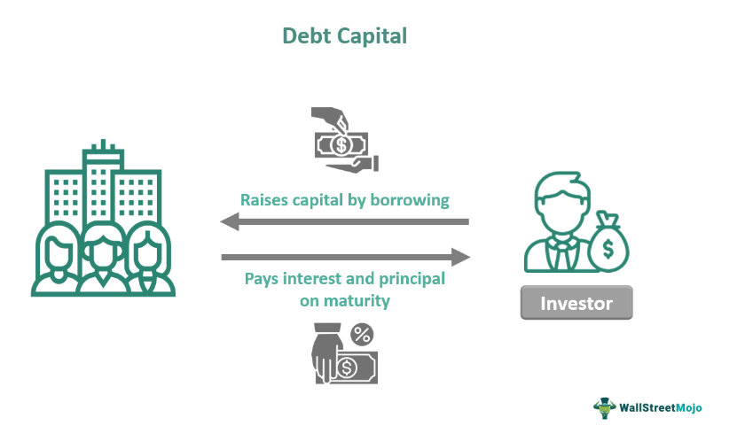

## Table of Contents

## What is Geode Capital Management?

Geode Capital Management is a company that manages money for other people and organizations. They help their clients invest their money in different ways, like in stocks and bonds. Geode is known for being good at managing large amounts of money, and they often work with big clients like pension funds and insurance companies.

The company started in 2001 and is based in Boston, Massachusetts. Geode is part of a bigger company called Fidelity Investments, but they make their own decisions about how to invest money. They focus on using computers and data to make smart investment choices, which helps them do a good job for their clients.

## When was Geode Capital Management founded?

Geode Capital Management was founded in 2001. It is a company that helps people and organizations invest their money. They are good at managing big amounts of money and often work with large clients like pension funds and insurance companies.

Geode is based in Boston, Massachusetts. It is part of a bigger company called Fidelity Investments, but Geode makes its own decisions about how to invest money. They use computers and data to make smart choices, which helps them do a good job for their clients.

## Who are the founders of Geode Capital Management?

Geode Capital Management was started by Vince Gubitosi and Jeff Hussey. They wanted to create a company that would help people and big organizations invest their money wisely. Vince and Jeff had a lot of experience in the investment world, which helped them build Geode into a successful company.

The company began in 2001 and is based in Boston, Massachusetts. Vince and Jeff worked hard to make Geode a place where smart investment choices are made using computers and data. Their focus on using technology to manage money has helped Geode grow and work with big clients like pension funds and insurance companies.

## What types of investment services does Geode Capital Management offer?

Geode Capital Management offers different types of investment services to help people and big organizations grow their money. They manage money for clients by investing in stocks, bonds, and other financial products. Geode is known for managing big amounts of money, which means they often work with clients like pension funds and insurance companies.

One of the main services Geode provides is managing index funds. Index funds are a type of investment that tries to match the performance of a specific market index, like the S&P 500. Geode uses computers and data to make smart choices about which stocks to include in these funds. This helps their clients' investments grow in a steady way.

Geode also offers customized investment solutions. This means they can create special investment plans that fit the unique needs of their clients. Whether it's a big pension fund or a smaller organization, Geode works closely with their clients to make sure their money is invested in the best way possible.

## How does Geode Capital Management manage its investment portfolios?

Geode Capital Management manages its investment portfolios by using computers and data to make smart choices. They focus a lot on index funds, which are investments that try to match the performance of a market index like the S&P 500. By using technology, Geode can pick the right stocks to include in these funds. This helps their clients' investments grow in a steady way because the funds follow the overall market.

Geode also offers customized investment solutions. This means they can create special plans that fit the unique needs of their clients. Whether it's a big pension fund or a smaller organization, Geode works closely with their clients to make sure their money is invested in the best way possible. They use their expertise and technology to manage these portfolios carefully, aiming to meet the specific goals of each client.

## What are the key investment philosophies of Geode Capital Management?

Geode Capital Management believes in using technology and data to make smart investment choices. They think that by using computers, they can pick the best stocks and bonds to invest in. This helps them manage large amounts of money for their clients, like pension funds and insurance companies. Geode focuses a lot on index funds, which are investments that try to match the performance of a market index like the S&P 500. By following the market, they help their clients' investments grow in a steady way.

Another key philosophy of Geode is to offer customized investment solutions. They believe that every client is different and has unique needs. So, they work closely with their clients to create special investment plans that fit those needs. Whether it's a big pension fund or a smaller organization, Geode uses its expertise and technology to manage these portfolios carefully. Their goal is to help each client meet their specific investment goals in the best way possible.

## What is the asset under management (AUM) for Geode Capital Management?

Geode Capital Management manages a lot of money for its clients. As of the latest data, they have about $1.3 trillion in assets under management (AUM). This means they help take care of a huge amount of money for different people and big organizations.

They work with clients like pension funds and insurance companies to invest this money in stocks, bonds, and other financial products. Geode uses computers and data to make smart choices about where to put this money, which helps their clients' investments grow in a steady way.

## How has Geode Capital Management performed compared to its competitors?

Geode Capital Management has done well compared to other companies that manage money. They focus a lot on managing index funds, which try to match the performance of a market index like the S&P 500. This has helped them do a good job for their clients, like pension funds and insurance companies. Because they use computers and data to make smart choices, their investments often grow in a steady way. This has made them popular and helped them manage a lot of money, about $1.3 trillion.

When we compare Geode to other companies, they stand out because of their focus on technology and their ability to handle big amounts of money. Some competitors might offer different types of investment services, but Geode's use of index funds and their customized solutions have made them a strong player in the market. Overall, Geode has been able to keep up with, and often do better than, many of its competitors by sticking to their key investment philosophies and using technology to their advantage.

## What are some of the major funds managed by Geode Capital Management?

Geode Capital Management manages a lot of different funds. One of their big funds is the Geode U.S. Equity Index Fund. This fund tries to match the performance of the whole U.S. stock market. They use computers and data to pick the right stocks to include in this fund, which helps their clients' investments grow in a steady way.

Another important fund they manage is the Geode Developed International Equity Index Fund. This fund focuses on stocks from countries outside the U.S., like Europe and Japan. It's meant to give clients a chance to invest in other parts of the world and spread out their money. Geode also has the Geode Total Bond Market Fund, which invests in different types of bonds. This helps clients who want to invest in something safer than stocks.

## How does Geode Capital Management incorporate ESG (Environmental, Social, and Governance) factors into its investment strategies?

Geode Capital Management cares about the environment, how companies treat people, and how they are run, which is called [ESG](/wiki/esg-investing) (Environmental, Social, and Governance) factors. They use these factors to help pick the right investments for their clients. Geode looks at things like how a company affects the environment, how it treats its workers, and how honest and fair its leaders are. By considering these things, Geode tries to make sure the companies they invest in are doing good things for the world and their workers.

Geode has special funds that focus on ESG factors. These funds invest in companies that do well in areas like reducing pollution, treating employees fairly, and having good leaders. Geode uses computers and data to keep track of how these companies are doing with ESG. This helps them make smart choices about which companies to include in these special funds. By doing this, Geode helps their clients invest in a way that matches their values and supports companies that are trying to make the world a better place.

## What are the regulatory challenges faced by Geode Capital Management?

Geode Capital Management, like other investment companies, has to follow a lot of rules set by the government. These rules are meant to make sure that the company is being fair and honest with its clients. One big challenge is keeping up with all the different regulations from different places, like the U.S. Securities and Exchange Commission (SEC). Geode has to make sure they are following all these rules, which can be hard because the rules can change and there are a lot of them.

Another challenge is making sure that they are doing a good job for their clients. The government wants to know that Geode is managing money in a way that helps their clients, not just the company itself. This means Geode has to report a lot of information about what they are doing with the money they manage. They also have to be ready for checks from the government to make sure they are following all the rules. Keeping everything in order can be a big job, but it's important for Geode to do it right so they can keep helping their clients invest their money wisely.

## What future trends might impact Geode Capital Management's business model?

Geode Capital Management might see changes because of new technology. More and more, computers and data are being used to make smart investment choices. This is something Geode already does, but it will keep getting better. They might need to use even more advanced technology to stay ahead. Also, more people are wanting to invest in a way that helps the environment and society. This means Geode might need to focus more on ESG (Environmental, Social, and Governance) factors in their funds. If they do this well, they can attract more clients who care about these things.

Another trend that could affect Geode is how people want to use their money. More people are looking for ways to invest that fit their personal values and goals. Geode might need to offer more customized investment plans to meet these needs. Also, the rules from the government might change. Geode will need to keep up with these changes to make sure they are following all the rules. If they can do this, they can keep helping their clients invest their money in the best way possible.

## References & Further Reading

[1]: Bergstra, J., Bardenet, R., Bengio, Y., & Kégl, B. (2011). ["Algorithms for Hyper-Parameter Optimization."](https://proceedings.neurips.cc/paper/2011/file/86e8f7ab32cfd12577bc2619bc635690-Paper.pdf) Advances in Neural Information Processing Systems 24.

[2]: ["Advances in Financial Machine Learning"](https://www.amazon.com/Advances-Financial-Machine-Learning-Marcos/dp/1119482089) by Marcos Lopez de Prado

[3]: ["Evidence-Based Technical Analysis: Applying the Scientific Method and Statistical Inference to Trading Signals"](https://www.amazon.com/Evidence-Based-Technical-Analysis-Scientific-Statistical/dp/0470008741) by David Aronson

[4]: ["Machine Learning for Algorithmic Trading"](https://github.com/stefan-jansen/machine-learning-for-trading) by Stefan Jansen

[5]: ["Quantitative Trading: How to Build Your Own Algorithmic Trading Business"](https://books.google.com/books/about/Quantitative_Trading.html?id=j70yEAAAQBAJ) by Ernest P. Chan