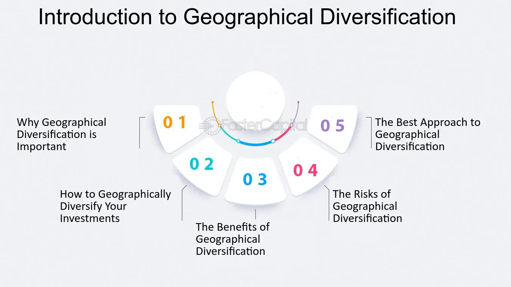

## Table of Contents

## What is geographical diversification?

Geographical diversification is when a person or a company spreads their investments or business activities across different countries or regions. Instead of focusing all their efforts or money in one place, they choose to operate in various locations around the world. This helps reduce the risk that comes from having everything in one area, like if there's a problem in that specific place, it won't affect all their investments or business.

For example, a company might have factories in the United States, Europe, and Asia. If something bad happens in one of these regions, like a natural disaster or economic downturn, the company can still rely on its operations in the other areas. This way, the company can keep making money and stay strong even when one part of the world faces difficulties. It's like not putting all your eggs in one basket, but spreading them out to keep them safe.

## Why is geographical diversification important for businesses?

Geographical diversification is important for businesses because it helps them lower their risks. If a business only operates in one place, it can be in big trouble if something bad happens there, like a natural disaster, political problems, or an economic downturn. But if the business has operations in different countries or regions, it can keep going even if one area faces difficulties. This way, the business can still make money and stay strong, no matter what happens in one specific place.

Another reason geographical diversification is important is that it can help businesses grow and reach more customers. By expanding to new areas, a business can sell its products or services to people in different parts of the world. This can lead to more sales and bigger profits. Plus, being in different places can help a business learn new things and get new ideas from different cultures and markets. So, geographical diversification not only makes a business safer but also helps it grow and succeed in new ways.

## How does geographical diversification benefit investors?

Geographical diversification helps investors by spreading their money across different countries and regions. This means if something bad happens in one place, like an economic crisis or a natural disaster, it won't hurt all of their investments at once. For example, if an investor only puts money in one country and that country's economy crashes, they could lose a lot. But if they have investments in many countries, the problems in one place won't affect everything they own.

Another way geographical diversification benefits investors is by giving them a chance to make more money. Different countries can grow at different speeds, and some might have better opportunities for making profits. By investing in various regions, an investor can take advantage of these opportunities and potentially earn higher returns. Plus, it helps them learn about different markets and how to make smart choices in each place.

## What are the main strategies for achieving geographical diversification?

One main strategy for achieving geographical diversification is to invest in international stocks and bonds. This means buying shares in companies or bonds from different countries. Instead of just putting money into businesses in your own country, you can spread it out by investing in companies all over the world. This can be done through buying individual stocks or by using mutual funds and exchange-traded funds (ETFs) that focus on international markets. This way, you can have a piece of the action in many different places, which helps lower your risk.

Another strategy is to start or expand a business in different countries or regions. For a company, this might mean setting up new offices, factories, or stores in other parts of the world. By doing this, the business can reach new customers and not depend on just one market. It also means the company can keep making money even if something goes wrong in one area. For an individual investor, this could mean investing in real estate or other business ventures in different countries to spread out the risk and take advantage of growth opportunities in various places.

A third strategy involves using global supply chains and partnerships. This means working with suppliers and partners from different countries to produce and sell products. By having a network that spans the globe, a business can reduce the risk of disruptions in one area affecting the whole operation. For investors, this can mean putting money into companies that have strong international partnerships and supply chains, as these companies are often better at handling global challenges and can offer more stable returns.

## Can you explain the risks associated with geographical diversification?

Geographical diversification can help lower risks, but it also comes with its own set of challenges. One big risk is that you might not know enough about the countries or regions where you're investing or doing business. Each place has its own rules, ways of doing things, and economic conditions. If you don't understand these well, you could make mistakes that cost you money. For example, a business might expand to a new country without realizing there are strict regulations that make it hard to operate there.

Another risk is the cost of managing operations or investments in different parts of the world. It can be expensive to set up and run businesses in multiple countries because of things like travel, communication, and dealing with different laws and taxes. For investors, managing a diverse portfolio across many countries can also be complicated and costly. You might need to pay for help from experts who understand the local markets, and there could be extra fees for buying and selling in different currencies.

Lastly, there's the risk of currency fluctuations. When you invest or do business in different countries, you have to deal with different currencies. The value of these currencies can go up and down, which can affect how much money you make or lose. If the currency of a country where you have investments weakens, the value of those investments can drop when you convert them back to your home currency. This can make it harder to predict and manage your financial returns.

## How does geographical diversification impact a company's supply chain?

Geographical diversification can make a company's supply chain stronger and more reliable. When a company spreads its operations across different countries, it can source materials from many places. This means if there's a problem in one area, like a natural disaster or a strike, the company can still get what it needs from other places. This helps keep the supply chain running smoothly and reduces the risk of running out of important materials. It also lets the company take advantage of lower costs or better quality materials in different regions, which can save money and improve the products they make.

However, geographical diversification can also make managing the supply chain more complicated. Dealing with different countries means the company has to handle different laws, taxes, and ways of doing things. This can make it harder to keep everything organized and can increase costs. For example, the company might need to pay for more travel, hire experts who understand local rules, and deal with changes in currency values. These extra costs and complexities need to be managed carefully to make sure the benefits of a diversified supply chain outweigh the challenges.

## What role does cultural understanding play in geographical diversification?

Cultural understanding is very important for geographical diversification. When a business or an investor goes into a new country, they need to understand the local culture. This means knowing how people there think, what they like, and how they do things. If a company doesn't understand the culture, they might make mistakes that upset people or make it hard to sell their products. For example, a company might use a marketing message that doesn't work well in a new country because it doesn't fit with what people there believe or value.

Understanding the culture also helps build good relationships with local people and businesses. When you know about the culture, you can work better with local partners, employees, and customers. This can make it easier to set up operations in a new place and help the business grow. If a company shows that they respect and understand the local culture, people are more likely to trust them and want to do business with them. So, cultural understanding is key to making geographical diversification successful and smooth.

## How can technology facilitate geographical diversification?

Technology makes it easier for businesses and investors to spread out to different countries. With the internet and tools like video calls, emails, and online meetings, people can work together even if they are far away. This means a company can have offices or factories in many places around the world and still keep everyone connected. Technology also helps with things like managing money and keeping track of what's happening in different places. For example, special software can help a business see how well it's doing in each country and make smart decisions about where to grow next.

Another way technology helps is by making it easier to learn about new places and cultures. The internet has lots of information about different countries, so businesses and investors can learn what they need to know before they start working there. Also, technology like translation apps and software can help people who speak different languages work together. This makes it easier to talk to people in new places and understand what they need. By using technology, businesses and investors can feel more confident about going into new markets and making their operations more spread out.

## What are some successful case studies of geographical diversification?

One good example of geographical diversification is the company Apple. Apple started in the United States but now sells its products all over the world. They have stores and offices in many countries like China, Japan, and Europe. By doing this, Apple can sell to more people and make more money. If something bad happens in one country, like an economic problem, Apple can still do well in other places. This has helped Apple become one of the biggest and most successful companies in the world.

Another example is the car company Toyota. Toyota is from Japan but has factories and sells cars in many countries, including the United States, Europe, and Asia. By spreading out, Toyota can make cars where it's cheaper and sell them where people want to buy them. This has helped Toyota grow and stay strong, even when there are problems in one area. For example, if there's a natural disaster in Japan, Toyota can still make cars in other places and keep selling them around the world.

## How do geopolitical factors influence geographical diversification strategies?

Geopolitical factors like political stability, trade policies, and international relations can really affect how a business or investor decides to spread out to different countries. If a country is stable and has good relations with other countries, it might be a safe place to invest or start a business. But if there's a lot of political trouble or if the country is fighting with others, it could be risky. Also, trade policies can change how easy or hard it is to do business in a place. For example, if a country puts up big tariffs or trade barriers, it might not be a good idea to invest there because it could be too expensive or difficult to make money.

Another way geopolitical factors matter is through economic sanctions and regulations. Sometimes, countries put sanctions on other countries, which means they can't trade or invest there. This can stop a business from going into a new market or make them pull out of a place they're already in. Also, different countries have different rules about how businesses can operate. If a company doesn't understand these rules, they might get into trouble or have to pay big fines. So, when planning to spread out to different places, businesses and investors need to think carefully about the geopolitical situation and how it might change their plans.

## What are the advanced metrics used to measure the effectiveness of geographical diversification?

To measure how well a company or investor is doing with geographical diversification, they can look at something called the Herfindahl-Hirschman Index (HHI). This index helps show how spread out their investments or business activities are across different countries. If the HHI number is low, it means the company or investor has a good mix of places they're working in. This can be a good sign because it means they're not relying too much on one place. But if the HHI number is high, it might mean they need to spread out more to lower their risk.

Another useful metric is the Sharpe Ratio. This helps measure how much extra return an investor gets for the extra risk they take by investing in different countries. If the Sharpe Ratio is high, it means the investor is getting good returns for the risk they're taking, which is a good sign that their geographical diversification is working well. Companies can also use something called the Coefficient of Variation to see how steady their earnings are across different regions. If this number is low, it means their income from different places is pretty stable, which shows that their geographical diversification strategy is helping them manage risk well.

## How does geographical diversification align with global economic trends and sustainability goals?

Geographical diversification helps businesses and investors follow global economic trends by spreading out where they work or invest. As the world economy changes, some countries might grow faster than others. By being in many places, a company can take advantage of these growth opportunities. For example, if one country's economy is doing well, the company can make more money there. This also helps them avoid big problems if one country's economy goes down. By looking at what's happening around the world, businesses can decide where to go next and make smart choices about where to put their money.

Geographical diversification also supports sustainability goals by helping companies be more responsible and eco-friendly. When a company works in different countries, they can use resources from places where they are more sustainable or cheaper. This can mean less waste and a smaller impact on the environment. Also, by being in many places, companies can learn from different cultures and ways of doing things, which can lead to new ideas for being more sustainable. For example, a company might learn about better ways to recycle or use renewable energy in one country and then use those ideas in other places. This helps the company meet its goals for being good to the planet while also growing its business.

## References & Further Reading

[1]: Clark, G. L., Dixon, A. D., & Monk, A. H. B. (2013). ["Sovereign Wealth Funds: Legitimacy, Governance, and Global Power."](https://academic.oup.com/princeton-scholarship-online/book/23983) Princeton University Press.

[2]: Ang, A. (2014). ["Asset Management: A Systematic Approach to Factor Investing."](https://archive.org/details/assetmanagements0000anga) Oxford University Press.

[3]: Harvey, C. R., Liu, Y., & Zhu, H. (2016). ["...and the Cross-Section of Expected Returns."](https://people.duke.edu/~charvey/Research/Published_Papers/P118_and_the_cross.PDF) Review of Financial Studies, 29(1), 5-68.

[4]: Kissell, R. (2013). ["The Science of Algorithmic Trading and Portfolio Management."](https://www.sciencedirect.com/book/9780124016897/the-science-of-algorithmic-trading-and-portfolio-management) Academic Press.

[5]: Derman, E. (2016). ["My Life as a Quant: Reflections on Physics and Finance."](https://www.amazon.com/My-Life-Quant-Reflections-Physics/dp/0470192739) Wiley.

[6]: Fabozzi, F. J., Focardi, S. M., & Kolm, P. N. (2010). ["Quantitative Equity Investing: Techniques and Strategies."](https://www.semanticscholar.org/paper/Quantitative-Equity-Investing%3A-Techniques-and-Fabozzi-Focardi/1c49a2a53919f7e65cb96f16691b8ff726fd3cd7) Wiley.

[7]: Bouchet, M. H., Fishkin, C. A., Goguel, A., & Bouchet, M. (2018). ["Country Risk Management: Strategies for Geopolitical Risk, Hedging and Investment."](https://link.springer.com/book/10.1007/978-3-319-89752-3) Palgrave Macmillan.

[8]: [MSCI. (2021). "Understanding Geographical Diversification."](https://www.quantifiedstrategies.com/geographic-diversification/) MSCI Research.