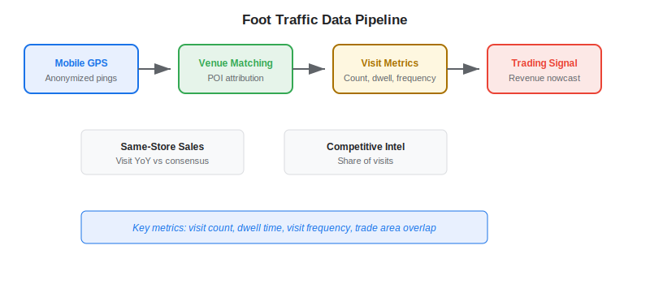
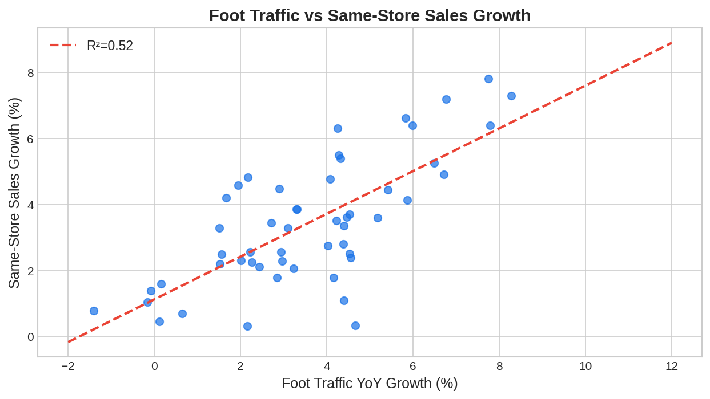

Geolocation and foot traffic data has become one of the most accessible and intuitive forms of [alternative data](https://paperswithbacktest.com/wiki/best-alternative-data) for algorithmic trading. By tracking the movement of anonymized mobile devices, traders can measure real-world consumer activity — how many people visit a store, a restaurant, or a mall — and translate those physical flows into predictions about company revenues and stock prices.

## What Is Foot Traffic Data in Trading?

Foot traffic data refers to aggregated, anonymized measurements of human movement patterns derived from mobile phone GPS signals, Wi-Fi pings, and beacon sensors. Data providers collect location pings from mobile apps (with user consent), aggregate them by venue, and sell the resulting foot traffic metrics to hedge funds and asset managers.

The core trading thesis is direct: more visitors to a company's locations typically means more revenue. If foot traffic at Chipotle restaurants is running 12% above last year while analyst consensus expects 8% same-store sales growth, a trader can position for a likely earnings beat.

Unlike [satellite imagery](https://paperswithbacktest.com/wiki/satellite-imagery-trading) which counts cars in parking lots, geolocation data captures individual device visits, enabling richer metrics: visit frequency, dwell time, visit duration, cross-shopping patterns, and trade area analysis.



## How Foot Traffic Data Creates Trading Signals

### Same-Store Sales Prediction

The primary use case mirrors [credit card transaction data](https://paperswithbacktest.com/wiki/credit-card-transaction-data-trading) but measures visits rather than dollars spent. For retailers, restaurants, and entertainment venues, visit counts are a strong leading indicator of reported same-store sales.

Key metrics traders extract:

$$\text{YoY Visit Growth} = \frac{\text{Visits}_{current} - \text{Visits}_{prior\_year}}{\text{Visits}_{prior\_year}}$$

$$\text{Dwell Time Index} = \frac{\text{Avg. Minutes in Store}_{current}}{\text{Avg. Minutes in Store}_{baseline}}$$

A rising visit count combined with increasing dwell time suggests not just more customers but more engaged customers — a strong bullish signal.

### New Store Performance

Foot traffic data can assess how well a newly opened location is performing relative to the chain's mature stores. If a retailer announces aggressive expansion plans, traders can verify within weeks whether new locations are attracting the expected traffic levels.

### Competitive Intelligence

By comparing foot traffic across competing brands — McDonald's vs. Burger King, Target vs. Walmart, Peloton showrooms vs. gym chains — traders build relative strength signals. A company gaining foot traffic share is likely gaining market share.

## Key Foot Traffic Data Vendors

| Vendor | Data Source | Coverage | Key Metrics |
|---|---|---|---|
| Placer.ai | Mobile GPS, Wi-Fi | US, 13M+ venues | Visits, dwell time, trade area |
| SafeGraph (Dewey) | Mobile GPS | US, 9M+ POIs | Visit counts, foot traffic patterns |
| Advan Research | Mobile GPS | US, real-time | Custom panels, brand-level |
| Unacast | Mobile GPS, SDK | US + international | Visit trends, migration |
| Near (formerly Teemo) | Mobile GPS | Global, 1.6B devices | Cross-channel insights |

## Python Implementation: Visit-Based Revenue Estimator

```python
import numpy as np
import pandas as pd

def estimate_revenue_signal(
    weekly_visits: pd.Series,
    prior_year_visits: pd.Series,
    avg_ticket_size: float = 35.0,
    consensus_growth: float = 0.06
) -> dict:
    """
    Estimate revenue signal from foot traffic data.
    
    Parameters:
    - weekly_visits: Current period weekly visit counts
    - prior_year_visits: Same-period prior year visits
    - avg_ticket_size: Average transaction value ($)
    - consensus_growth: Analyst expected YoY growth
    """
    weeks_observed = len(weekly_visits)
    
    current_total = weekly_visits.sum()
    prior_total = prior_year_visits[:weeks_observed].sum()
    visit_growth = (current_total - prior_total) / prior_total
    
    # Revenue estimate = visits × average ticket × conversion rate
    implied_revenue_growth = visit_growth  # simplified: assumes stable conversion
    surprise = implied_revenue_growth - consensus_growth
    
    return {
        "weeks_observed": weeks_observed,
        "visit_yoy_growth": f"{visit_growth:.1%}",
        "implied_revenue_growth": f"{implied_revenue_growth:.1%}",
        "consensus": f"{consensus_growth:.1%}",
        "surprise": f"{surprise:+.1%}",
        "signal": "LONG" if surprise > 0.015 else "SHORT" if surprise < -0.015 else "NEUTRAL",
    }

# Example: Restaurant chain foot traffic
np.random.seed(42)
current = pd.Series(np.random.normal(15000, 800, 8))   # 8 weeks of visits
prior = pd.Series(np.random.normal(13800, 750, 13))     # full prior quarter

result = estimate_revenue_signal(current, prior, avg_ticket_size=32.0, consensus_growth=0.06)
for k, v in result.items():
    print(f"  {k}: {v}")
```



## Limitations and Risks

**Panel representativeness** is the primary concern. Foot traffic vendors typically capture 5–15% of all mobile devices, and the panel may skew toward certain demographics (younger, more tech-savvy users who install apps that share location data).

**Indoor accuracy** remains imperfect. GPS signals degrade inside buildings, making it hard to distinguish between a customer in a Target store and one in an adjacent shop within the same mall. Wi-Fi and beacon data improve this but are not universally available.

**Privacy regulations** are tightening. GDPR in Europe and state-level privacy laws in the US (CCPA, Virginia, Colorado) impose strict requirements on location data collection. Some vendors have reduced data granularity in response, which can affect signal quality.

**Seasonality and weather effects** require careful normalization. Foot traffic drops during holidays, extreme weather, and construction. Raw visit counts must be seasonally adjusted and weather-normalized to produce clean trading signals.

## Conclusion

Geolocation and foot traffic data provides one of the most intuitive alternative data signals: more people visiting a business means more revenue. For algo traders focused on consumer equities — retail, restaurants, entertainment, fitness — foot traffic data offers a 2–4 week lead on quarterly earnings. The key is careful panel normalization, seasonal adjustment, and combining foot traffic with complementary signals like [transaction data](https://paperswithbacktest.com/wiki/credit-card-transaction-data-trading) for higher-conviction trades.

---

**Explore further on PapersWithBacktest:**
- Browse [backtested consumer strategies](https://paperswithbacktest.com/strategies) with Python code and performance metrics
- Access [clean historical market data](https://paperswithbacktest.com/datasets) for equities, crypto, and futures
- Take the [algo trading course](https://paperswithbacktest.com/course) — 60+ video lessons and notebooks
- Related wiki pages: [Consumer Alternative Data](https://paperswithbacktest.com/wiki/consumer-alternative-data) · [Best Alternative Data Sources](https://paperswithbacktest.com/wiki/best-alternative-data)
