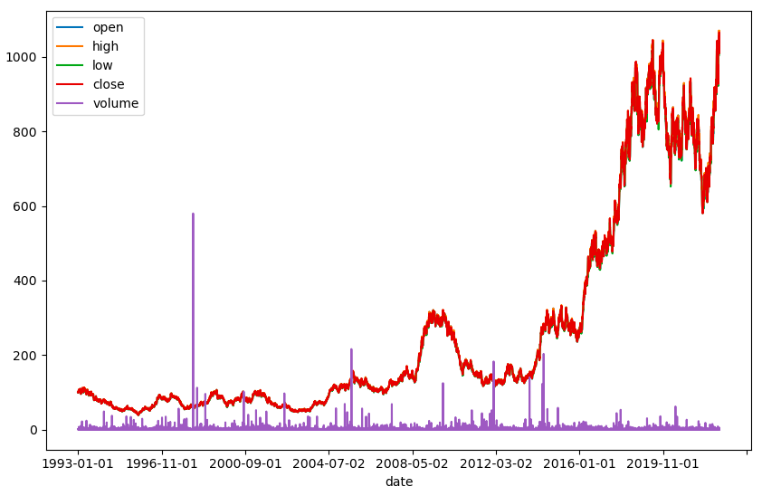

## Table of Contents

## What is Geometric Brownian Motion (GBM) and why is it important in finance?

Geometric Brownian Motion (GBM) is a mathematical model used to predict the future price of stocks or other financial instruments. It assumes that the price of a stock follows a random walk, but with a twist: the percentage change in the price over time is normally distributed. This means that the price can go up or down, but the changes are more likely to be small than large. GBM is described by two main parameters: the drift, which represents the average rate of growth, and the volatility, which measures how much the price tends to fluctuate.

GBM is important in finance because it helps investors and analysts make predictions about future stock prices. It is widely used in option pricing models, like the Black-Scholes model, which helps determine the fair price of options. By understanding how stock prices might move in the future, investors can make better decisions about buying or selling stocks and managing their portfolios. Even though GBM is a simplified model and real stock prices can behave differently, it remains a fundamental tool in financial analysis and risk management.

## How does GBM differ from regular Brownian Motion?

Geometric Brownian Motion (GBM) and regular Brownian Motion are both used to model random movements, but they do so in different ways. Regular Brownian Motion, also known as standard Brownian Motion, describes a process where the changes in position are normally distributed and the steps are independent of each other. This means that if you were watching a particle moving randomly, each step it takes would be a random amount, and knowing where it was at one moment wouldn't help you predict where it would be next.

GBM, on the other hand, is used specifically to model things like stock prices, where the changes are also random but are based on percentages rather than absolute values. In GBM, if a stock price is high, the same percentage change will result in a larger absolute change than if the stock price were low. This means that GBM keeps the value positive and reflects how stock prices tend to grow or shrink over time. While regular Brownian Motion can go negative, GBM is designed to stay positive, making it more suitable for modeling financial assets.

## What are the basic mathematical equations that define GBM?

Geometric Brownian Motion (GBM) can be described using a simple equation that shows how a stock price changes over time. The basic equation for GBM is: dS = μS dt + σS dW, where S is the stock price, μ is the drift or average rate of growth, σ is the volatility, dt is a small time step, and dW is a small random movement from a standard normal distribution. This equation means that the change in the stock price (dS) depends on its current price (S), the drift (μ), the volatility (σ), and a random part (dW).

To solve this equation and predict future stock prices, we use another equation called the solution to the stochastic differential equation. The solution for GBM is: S(t) = S(0) * exp((μ - 0.5σ^2)t + σW(t)), where S(t) is the stock price at time t, S(0) is the initial stock price, exp is the exponential function, t is time, and W(t) is the standard Brownian Motion at time t. This equation shows that the future stock price is the initial price multiplied by an exponential term that includes the drift, volatility, time, and the random movements from Brownian Motion.

## What are the key parameters needed to simulate GBM in Python?

To simulate Geometric Brownian Motion (GBM) in Python, you need four main parameters: the initial stock price, the drift, the volatility, and the time steps. The initial stock price is the starting point for your simulation. The drift represents the average rate at which the stock price is expected to grow over time. The volatility shows how much the stock price is expected to fluctuate. The time steps are the intervals at which you want to calculate the stock price, and they help determine how often the stock price changes during the simulation.

In Python, you'll use these parameters in a loop to calculate the stock price at each time step. You'll use random numbers to represent the random movements in the stock price, which are part of the GBM model. By setting these parameters correctly, you can create a simulation that closely matches how real stock prices might move over time. This can help you understand how a stock might behave in the future based on its past performance and expected growth.

## How can one generate random numbers to simulate GBM in Python?

To simulate Geometric Brownian Motion (GBM) in Python, you need to generate random numbers that follow a normal distribution. These random numbers help you mimic the unpredictable movements of stock prices. In Python, you can use the `numpy` library to create these random numbers. Specifically, you use the `numpy.random.normal` function, which lets you generate numbers that have a mean of zero and a standard deviation of one. These numbers represent the "dW" part of the GBM equation, which is the random component that makes the stock price move up or down.

Once you have these random numbers, you can plug them into the GBM formula to calculate how the stock price changes over time. You'll start with your initial stock price and then use a loop to go through each time step. At each step, you'll use the random number to figure out the new stock price based on the drift, volatility, and the time step. By doing this over and over, you create a path that shows how the stock price might move in the future. This helps you see the possible ups and downs of the stock price over time.

## What Python libraries are commonly used for GBM simulations?

The main Python library used for Geometric Brownian Motion (GBM) simulations is `numpy`. This library is great because it helps you do math quickly and easily. With `numpy`, you can create arrays to store your stock prices and use the `numpy.random.normal` function to generate random numbers. These random numbers are important because they help you mimic the unpredictable changes in stock prices over time.

Another useful library is `matplotlib`, which you can use to make graphs of your GBM simulations. Seeing the results in a graph helps you understand how the stock price might move in the future. You can plot the stock price over time and see all the ups and downs that the random numbers create. Together, `numpy` and `matplotlib` make it easy to simulate and visualize GBM in Python.

## How do you set up a basic GBM simulation in Python?

To set up a basic Geometric Brownian Motion (GBM) simulation in Python, you first need to import the `numpy` library. This library helps you do math and generate random numbers. You'll start by setting up your parameters: the initial stock price, the drift (which is like the average growth rate), the volatility (which shows how much the price can change), and the time steps (which are the points in time where you'll check the stock price). You'll use these parameters in a loop to calculate how the stock price changes over time. In each step of the loop, you'll use a random number from `numpy` to figure out the new stock price based on the GBM formula.

Once you have your simulation running, you can use the `matplotlib` library to make a graph of the stock price over time. This graph will show you all the ups and downs that the random numbers create, helping you see how the stock price might move in the future. By running the simulation many times, you can get a good idea of the different paths the stock price could take. This can be really helpful for understanding how stocks might behave and making better decisions about buying or selling them.

## What are some common techniques to validate the results of a GBM simulation?

To make sure your Geometric Brownian Motion (GBM) simulation is working right, you can compare it to what you know about how stocks usually move. One way to do this is to look at the average return of your simulated stock prices. If your simulation is set up correctly, the average return should be close to the drift you used. You can also check the ups and downs of your simulated prices by looking at the standard deviation. If the standard deviation matches the volatility you set, that's a good sign your simulation is on track.

Another way to check your GBM simulation is to run it many times and see how the results look overall. When you do this, you should see a pattern that looks like a bell curve, which means most of your results are close to the average, and fewer results are far away from it. This is called a normal distribution, and it's what you expect from GBM. If your results don't look like this, you might need to check your code or your parameters to make sure everything is set up correctly. By using these checks, you can feel more confident that your GBM simulation is giving you good information about how stock prices might move in the future.

## How can you modify a GBM simulation to account for dividends or other adjustments?

To change a Geometric Brownian Motion (GBM) simulation to include dividends or other adjustments, you need to tweak the formula you use to calculate the stock price. Dividends are payments companies give to their shareholders, and they can affect the stock price. So, you'll need to take dividends out of the stock price at the right times. If a company pays a dividend, you subtract it from the stock price after you've figured out the new price using the GBM formula. This way, your simulation will show how the stock price changes after the dividend is paid.

Besides dividends, other adjustments like stock splits or mergers can also change the stock price. A stock split means the company gives more shares to its shareholders, which usually makes the price per share go down. To include this in your simulation, you'd adjust the stock price at the time of the split. For example, if it's a 2-for-1 split, you'd cut the stock price in half. Mergers or acquisitions can also affect stock prices, so you might need to change the stock price based on the terms of the merger. By adding these adjustments to your GBM simulation, you can make it more realistic and closer to how real stock prices move.

## What are some advanced techniques for improving the accuracy of GBM simulations?

To make Geometric Brownian Motion (GBM) simulations more accurate, you can use something called Monte Carlo simulations. This means you run the GBM simulation many, many times, each time using different random numbers. By doing this, you get a lot of different paths that the stock price could take. Then, you can look at all these paths together to see what's most likely to happen. This helps you understand the possible ups and downs of the stock price better than if you just ran the simulation once. Monte Carlo simulations give you a fuller picture of how the stock price might move in the future.

Another way to improve GBM simulations is to use more advanced models that take into account things like changing volatility or jumps in the stock price. Regular GBM assumes that volatility stays the same over time, but in real life, it can change. So, you can use models like the Heston model, which lets volatility change over time. Also, stock prices can sometimes jump suddenly because of big news or events. Models like the Merton jump-diffusion model can include these jumps. By using these more detailed models, your GBM simulations can better match how real stock prices move, making your predictions more accurate.

## How can GBM simulations be used in option pricing models like Black-Scholes?

Geometric Brownian Motion (GBM) simulations are really important for figuring out the price of options using models like Black-Scholes. An option is like a bet on whether a stock price will go up or down. The Black-Scholes model helps you find out how much that bet should cost. It uses GBM to guess how the stock price might change in the future. By running GBM simulations, you can see all the different ways the stock price could move and then use that information to figure out the option's price. This helps investors know if the option is a good deal or not.

To use GBM in the Black-Scholes model, you start by setting up the GBM simulation with the right numbers for the stock's starting price, how fast it grows on average (drift), and how much it can jump around (volatility). Then, you run the simulation many times to see all the possible paths the stock price could take. Each path gives you a different possible ending price for the stock. The Black-Scholes model takes these ending prices and uses them to calculate the option's value. By doing this, you get a good idea of what the option should be worth, which helps you make smarter choices about buying or selling options.

## What are the limitations and potential pitfalls of using GBM for financial modeling?

Using Geometric Brownian Motion (GBM) for financial modeling has some big limitations. GBM assumes that stock prices move in a smooth, continuous way and that the percentage changes in price are normally distributed. But in real life, stock prices can jump suddenly because of news or events, and they might not follow a normal distribution. Also, GBM assumes that the average growth rate (drift) and the amount of ups and downs (volatility) stay the same over time. In reality, these can change, which means GBM might not be as accurate as we need it to be for making good predictions about stock prices.

Another problem with using GBM is that it doesn't take into account other things that can affect stock prices, like dividends, stock splits, or big company events like mergers. If you're not careful to include these in your model, your predictions could be way off. Also, running GBM simulations can be tricky because the results can be different every time you run them, depending on the random numbers you use. This means you have to run the simulations many times to get a good picture of what might happen, which can be a lot of work. So, while GBM is a helpful tool, it's important to know its limits and use it carefully when making financial decisions.

## What is Geometric Brownian Motion and how can it be understood?

Geometric Brownian Motion (GBM) is a widely used stochastic process for modeling the dynamics of financial markets, particularly stock prices. It represents the continuous time, random nature of asset price movements and is a crucial part of quantitative finance.

Mathematically, GBM is defined by the stochastic differential equation:

$$

dS_t = \mu S_t \, dt + \sigma S_t \, dW_t 
$$

where:
- $S_t$ denotes the asset price at time $t$.
- $\mu$ is the drift coefficient, representing the expected return rate.
- $\sigma$ is the volatility, indicating the standard deviation of the asset's returns.
- $dW_t$ is a Wiener process, representing the Brownian motion component.

GBM is significant in modeling stock prices for several reasons. Its underlying assumptions of continuous compounding, constant percentage changes in price, and normality in the distribution of returns make it mathematically tractable and analytically useful. Moreover, GBM naturally accommodates the path-dependent nature of stock prices, providing a realistic portrayal of their random walk-like characteristics observed in real markets.

However, the use of GBM comes with assumptions that may not hold true in all market environments, leading to certain limitations. These assumptions include a constant drift ($\mu$) and [volatility](/wiki/volatility-trading-strategies) ($\sigma$), and logarithmic returns being normally distributed. In reality, markets often experience jumps, stochastic volatility, and correlations ignored by the basic GBM model. Additionally, GBM assumes that markets are efficient and do not account for factors such as transaction costs or market microstructures.

The historical context of GBM is significantly tied to the Black-Scholes model, which popularized its use in finance. Introduced in the early 1970s, the Black-Scholes model utilized GBM to derive a closed-form solution for European option pricing, transforming the financial landscape. This breakthrough brought attention to GBM as a fundamental tool in not only option pricing but various aspects of financial modeling, including risk management and strategic asset allocation.

Overall, despite its assumptions and inherent limitations, GBM remains a cornerstone of financial modeling due to its simplicity and foundational role in derivative pricing models. It serves as an essential building block in understanding and simulating market behaviors, providing a base upon which more complex models can be developed.

## What is the relevance of GBM in algorithmic trading?

Geometric Brownian Motion (GBM) plays a significant role in [algorithmic trading](/wiki/algorithmic-trading) due to its capacity to model the stochastic behavior of asset prices. GBM is favored in algorithmic trading strategies because it captures the essential characteristics of risky asset returns, namely the continuous compounding and proportionality of returns over time. The mathematical representation of price $S(t)$ under GBM is defined by the stochastic differential equation:

$$
dS(t) = \mu S(t) dt + \sigma S(t) dW(t)
$$

where $\mu$ is the drift coefficient, $\sigma$ is the volatility of the asset, and $W(t)$ represents a Wiener process or standard Brownian motion.

### Application in Option Pricing and Risk Management

GBM is central to the Black-Scholes option pricing model, which evaluates the fair value of options. The model uses the log-normal distribution of asset prices, a direct implication of GBM, to estimate the likelihood of an option finishing in-the-money at expiration. The incorporation of GBM into the Black-Scholes framework aids traders in calculating the Greeks, which are crucial for risk management. Sensitivities such as delta, gamma, and vega derive from the GBM assumptions and provide critical insights for hedging strategies.

### Integration with Other Quantitative Models

Traders often integrate GBM with other quantitative models to enhance predictive accuracy and trading performance. For example, mean-reverting models such as Ornstein-Uhlenbeck processes or stochastic volatility models may be combined with GBM to account for additional market dynamics like volatility clustering or mean reversion, which are not captured by a standalone GBM.

### Benefits and Challenges in Real-life Trading Systems

GBM offers simplicity and analytic tractability, making it a popular choice for initial modeling and analysis. It provides a baseline framework for understanding price fluctuations and evaluating the potential range of future price movements. However, several challenges arise when implementing GBM in real-world trading:

1. **Assumptions about Market Behavior**: GBM assumes constant volatility and drift, which doesn't hold in turbulent markets. Real markets exhibit volatility smiles and jumps, requiring adjustments or alternative models like jump-diffusion or GARCH models.

2. **Ignoring Transaction Costs and Market Impact**: GBM-based strategies may not account for transaction costs and market impact, which can significantly affect actual returns. Optimizing trade execution and considering these factors are essential for realistic strategy development.

3. **Model Calibration**: Accurately estimating the parameters $\mu$ and $\sigma$ is critical but challenging due to market fluctuations. The calibration process must be dynamic and adaptive to changing market conditions.

Despite these challenges, GBM remains a foundational tool in quantitative finance, facilitating the development and [backtesting](/wiki/backtesting) of trading strategies. Its simplicity and integration potential with more complex models enable traders to devise robust and adaptable algorithmic systems.

## What are the advanced considerations and enhancements?

Geometric Brownian Motion (GBM) is a widely used model in financial mathematics for simulating the behavior of asset prices. Despite its popularity, GBM has limitations that can hamper the accuracy of predictions in dynamic financial markets. This section explores some advanced considerations and enhancements that can improve the robustness of financial models by addressing these limitations.

### Limitations of Geometric Brownian Motion

GBM assumes constant volatility and a log-normal distribution of asset prices. This simplification neglects important aspects such as jumps in price, stochastic changes in volatility, and other market phenomena that can lead to inaccurate modeling of real-world financial markets. GBM's assumption of continuous paths also fails to account for sudden market moves, commonly observed as market shocks or crashes.

### Alternative Models for More Accurate Predictions

To address GBM's limitations, financial practitioners often employ alternative models that account for irregularities such as volatile changes and price jumps.

1. **Stochastic Volatility Models**: These models incorporate time-varying volatility, which is a more realistic assumption when dealing with real market data. The Heston model is one such example, characterized by a stochastic process where volatility is another stochastic differential equation:
$$
   dV_t = \kappa (\theta - V_t) dt + \xi \sqrt{V_t} dW_t

$$
   Here, $V_t$ is the volatility at time $t$, $\kappa$ is the rate of mean reversion, $\theta$ is the long-term mean volatility, $\xi$ is the volatility of volatility, and $dW_t$ is a Brownian motion.

2. **Jump-Diffusion Models**: These models introduce a jump component to the price process, combining a GBM with a Poisson jump process. The Merton's Jump-Diffusion model is a popular example:
$$
   dS_t = \mu S_t dt + \sigma S_t dW_t + J S_t dN_t

$$
   In this equation, $dN_t$ is a Poisson process with intensity $\lambda$, and $J$ represents the percentage jump size.

### Impact of Real-World Market Factors

Financial models often underperform due to unmodeled real-world constraints such as market microstructure and transaction costs. Market microstructure involves the frictions and mechanisms of trading, which can influence price formation and subsequently, model predictions. Similarly, transaction costs such as brokerage fees can erode theoretical profits predicted by models.

To account for these factors, traders can incorporate realistic transaction cost models and adjust their trading strategies to minimize cost impacts. This might involve optimizing the frequency and size of trades or using execution algorithms that seek [liquidity](/wiki/liquidity-risk-premium).

### Machine Learning Algorithms as Enhancements

Machine learning (ML) offers an advanced toolkit for enhancing financial models like GBM. ML algorithms can identify complex patterns in vast datasets that traditional models might miss, allowing for more nuanced predictions. Techniques such as supervised learning, neural networks, and [reinforcement learning](/wiki/reinforcement-learning) are becoming valuable in the development and refinement of trading strategies.

In Python, integrating ML with GBM simulations could involve using libraries such as scikit-learn, TensorFlow, or PyTorch. A simple example could look like:

```python
from sklearn.ensemble import RandomForestRegressor
import numpy as np

# Assuming X_train, y_train, X_test are predefined datasets
model = RandomForestRegressor(n_estimators=100)
model.fit(X_train, y_train)
predictions = model.predict(X_test)
```

This code snippet demonstrates how a Random Forest model can be trained on historical data to predict asset prices, potentially serving as an additional signal to complement GBM-based strategies.

In conclusion, while GBM serves as a foundational model in quantitative finance, its efficacy can be greatly enhanced by incorporating advanced techniques and real-world considerations. Exploring alternative models and leveraging [machine learning](/wiki/machine-learning) methods offer promising avenues for developing robust, adaptive trading strategies in a complex market environment.

## References & Further Reading

[1]: Hull, J. C. (2012). ["Options, Futures, and Other Derivatives,"](https://www.semanticscholar.org/paper/Options%2C-Futures%2C-and-Other-Derivatives-Hull/89bdee500c8623864fc9eb7a471546aa713acc44) 9th Edition. Pearson Education. 

[2]: Shreve, S. E. (2004). ["Stochastic Calculus for Finance I: The Binomial Asset Pricing Model"](https://link.springer.com/book/10.1007/978-0-387-22527-2) and ["Stochastic Calculus for Finance II: Continuous-Time Models"](https://link.springer.com/book/10.1007/978-0-387-22527-2). Springer Finance.

[3]: Black, F., & Scholes, M. (1973). ["The Pricing of Options and Corporate Liabilities."](https://www.cs.princeton.edu/courses/archive/fall09/cos323/papers/black_scholes73.pdf) The Journal of Political Economy, 81(3), 637-654.

[4]: Christoffersen, P. (2012). ["Elements of Financial Risk Management,"](https://www.sciencedirect.com/book/9780123744487/elements-of-financial-risk-management) 2nd Edition. Academic Press.

[5]: Lopez de Prado, M. (2018). ["Advances in Financial Machine Learning."](https://books.google.com/books/about/Advances_in_Financial_Machine_Learning.html?id=oU9KDwAAQBAJ) Wiley.

[6]: Coursera. ["Financial Engineering and Risk Management Part I,"](https://www.coursera.org/specializations/financialengineering) offered by Columbia University.

[7]: EdX. ["Computational Investing, Part I,"](https://www.classcentral.com/course/compinvesting1-406) offered by Georgia Tech.

[8]: DataCamp. ["Importing & Managing Financial Data in Python."](https://www.datacamp.com/courses/importing-and-managing-financial-data-in-python)