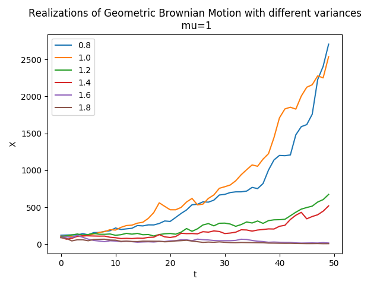

## Table of Contents

## What is Geometric Brownian Motion (GBM)?

Geometric Brownian Motion (GBM) is a mathematical model used to describe the movement of stock prices or other financial instruments over time. It assumes that the price of a stock follows a random walk, where the percentage change in the price is normally distributed. This means that the price can go up or down by a certain percentage, and the likelihood of these changes follows a bell-shaped curve. GBM is widely used in finance because it captures the idea that stock prices can grow exponentially, and it helps in pricing options and other derivatives.

In GBM, the future price of a stock is determined by its current price, the expected rate of return, the volatility of the stock, and a random component. The expected rate of return is the average growth rate of the stock, while volatility measures how much the stock price fluctuates. The random component introduces uncertainty, making the model more realistic. By using GBM, financial analysts can simulate different scenarios to see how a stock might perform in the future, which is useful for making investment decisions and managing risk.

## How does GBM differ from regular Brownian Motion?

Regular Brownian Motion, also known as standard Brownian Motion, is a simple model where a particle moves randomly in space. The movement is described by a normal distribution, meaning the particle can move up or down by a certain amount, and the likelihood of these movements follows a bell-shaped curve. The key feature of regular Brownian Motion is that the changes in position are additive. If a particle moves up by 1 unit in one step and then down by 1 unit in the next step, it ends up back where it started.

Geometric Brownian Motion (GBM) is different because it models the movement of a stock price, which can't be negative. Instead of adding or subtracting fixed amounts, GBM multiplies the current price by a random factor. This means the changes are multiplicative, not additive. If a stock price goes up by 10% in one period and then down by 10% in the next, it doesn't end up back at the original price; it ends up lower. This reflects how stock prices grow or shrink over time, making GBM a better fit for financial modeling than regular Brownian Motion.

## What are the key components of the GBM equation?

The GBM equation has a few important parts that help predict how a stock price might change over time. The first part is the current price of the stock. This is the starting point for figuring out where the price might go next. The second part is the expected rate of return, which is like guessing how much the stock will grow on average. This number helps the model know if the stock is likely to go up or down.

The third part is the volatility of the stock, which tells us how much the stock price might jump around. A stock with high volatility can have big price swings, while a stock with low volatility changes more slowly. The last part is a random factor, which adds uncertainty to the model. This random factor is what makes the stock price move in unpredictable ways, just like in real life. Together, these parts help the GBM equation show how a stock price might change in the future.

## How is GBM used in financial modeling?

Geometric Brownian Motion (GBM) is a tool that helps people in finance guess how stock prices might change over time. They use it to make models that show what could happen to a stock's price in the future. By putting in the current price of the stock, how fast it usually grows, and how much it jumps around, the model can create different scenarios. This helps people see if a stock might go up or down and by how much.

In financial modeling, GBM is really useful for figuring out the price of options and other tricky financial products. An option gives someone the right to buy or sell a stock at a certain price in the future. To know how much an option should cost, you need to guess what the stock price might be when the option is used. GBM helps with this by showing many possible future prices, so people can make better guesses about the option's value. This way, they can make smarter choices about buying or selling options.

## What is the significance of the drift and volatility parameters in GBM?

The drift parameter in GBM is like the average speed at which a stock price is expected to grow. It's the part of the model that tells us if the stock is likely to go up or down over time. If the drift is positive, it means the stock is expected to increase in value on average. If it's negative, the stock is expected to decrease. This parameter is important because it helps investors understand the long-term trend of the stock, which can guide their investment decisions.

The volatility parameter in GBM shows how much the stock price might jump around. It's a measure of how unpredictable the stock's movements are. A high volatility means the stock price can change a lot in a short time, making it riskier but also potentially more rewarding. A low volatility means the stock price changes more slowly and predictably. This parameter is crucial because it helps investors assess the risk of investing in the stock. By understanding both the drift and volatility, investors can better predict how a stock might behave in the future and make more informed choices.

## Can you explain the mathematical derivation of the GBM formula?

The GBM formula comes from a special kind of math called stochastic calculus. It starts with the idea that a stock price changes over time in a way that's a bit random but also follows some rules. Imagine you have a stock price at a certain time, and you want to know what it might be a little later. The GBM formula says that the new price is the old price times a factor that depends on three things: the time that's passed, the average growth rate of the stock (called the drift), and how much the stock price jumps around (called the volatility). There's also a random part that makes the stock price unpredictable, like rolling a dice.

To write this down, we use a special kind of equation called a stochastic differential equation. The formula looks like this: dS/S = μdt + σdW, where S is the stock price, μ is the drift, σ is the volatility, dt is a tiny bit of time, and dW is a tiny random change. The left side, dS/S, means the change in the stock price divided by the current stock price, which gives us the percentage change. The right side has two parts: μdt, which is the expected growth over a tiny time step, and σdW, which is the random part that makes the stock price jump around. By solving this equation, we can figure out how the stock price might change over time, which is really useful for making predictions in finance.

## How do you simulate GBM paths using programming?

To simulate GBM paths using programming, you start by setting up the initial conditions like the starting price of the stock, the time period you want to simulate, the average growth rate (drift), and how much the stock price might jump around (volatility). You'll need to use a programming language like Python or R, and you'll use a loop to go through many small time steps. In each step, you calculate the new stock price by multiplying the current price by a factor. This factor includes the drift and volatility, plus a random number to make the stock price move in unpredictable ways.

In Python, you can use libraries like NumPy to help with the math and random number generation. You start by importing NumPy and setting up your initial values. Then, you create an array to store the stock prices over time. In a loop, you update the stock price for each time step using the GBM formula: the new price is the old price times e^(drift * time step - 0.5 * volatility^2 * time step + volatility * random number * sqrt(time step)). After the loop finishes, you'll have a list of stock prices that show how the stock might move over time according to the GBM model.

## What are the limitations and assumptions of using GBM in modeling?

Using GBM to model stock prices has some limitations and assumptions that you should know about. One big assumption is that stock prices follow a normal distribution, which means they can move up or down by a certain percentage, and these movements are likely to follow a bell-shaped curve. But in real life, stock prices can have big jumps or stay the same for a long time, which doesn't fit well with the normal distribution idea. Another assumption is that the drift and volatility stay the same over time, but in reality, these can change a lot. For example, a company's news or the overall market can make a stock's growth rate or how much it jumps around change quickly.

GBM also assumes that stock prices can't be negative, which makes sense because you can't have a stock worth less than zero. But this model doesn't account for things like dividends, which can affect a stock's price. Also, GBM doesn't consider other factors that can influence stock prices, like interest rates, inflation, or big events like economic crises. These limitations mean that while GBM is a useful tool for understanding how stock prices might move, it's not perfect and should be used carefully, especially when making important financial decisions.

## How does GBM relate to the Black-Scholes option pricing model?

GBM and the Black-Scholes option pricing model are closely connected. The Black-Scholes model uses GBM to figure out how stock prices might change over time. This is important because an option's value depends on what the stock price might be when the option is used. GBM helps the Black-Scholes model predict these future stock prices by assuming the stock's growth rate and how much it jumps around stay the same. This lets the model calculate the option's price by considering all the possible future prices of the stock.

The Black-Scholes model takes the GBM equation and turns it into a formula that gives the fair price of an option. It uses the current stock price, the option's strike price, the time until the option expires, the risk-free interest rate, and the stock's volatility. By plugging these numbers into the formula, which comes from the GBM idea, the Black-Scholes model can tell you what an option should cost. This is really helpful for people who buy and sell options because it gives them a way to make sure they're not paying too much or selling too cheaply.

## What are some real-world applications of GBM outside of finance?

Geometric Brownian Motion (GBM) isn't just used in finance; it's also helpful in other areas like biology and environmental science. In biology, scientists use GBM to study how populations of animals or bacteria grow over time. They can predict how many animals or bacteria there might be in the future by using GBM to model their growth, which can help with things like managing wildlife or controlling disease outbreaks. For example, if you know how fast a certain type of bacteria grows and how much that growth can vary, you can use GBM to guess how many bacteria there will be in a few days or weeks.

In environmental science, GBM can be used to model how pollutants spread in the air or water. If you know how fast a pollutant spreads and how much that spread can change, you can use GBM to predict where the pollutant might go and how much there will be in different places. This is important for figuring out how to clean up pollution or protect certain areas from it. By using GBM, scientists can make better plans to keep the environment safe and healthy.

## How can GBM be extended to include mean reversion or jumps?

GBM can be made more realistic by adding mean reversion, which means the stock price tends to go back to a certain level over time. Imagine a rubber band: if you stretch it, it wants to go back to its normal shape. In GBM with mean reversion, the stock price might go up or down a lot, but it's pulled back toward a middle point. This is useful for modeling things like interest rates or commodity prices, which don't just keep growing but instead hover around a certain value. To add mean reversion, you change the GBM formula to include a term that pulls the price back to the mean, making the model more accurate for these kinds of things.

GBM can also be improved by adding jumps, which are sudden big changes in the stock price. Think of a stock price as usually moving smoothly, but sometimes it can jump up or down a lot because of big news or events. Adding jumps to GBM helps the model capture these sudden changes better, making it more realistic for stocks that can have big price swings. To do this, you add a part to the GBM formula that allows for these jumps, which can happen at random times and sizes. This makes the model better at showing how stock prices can behave in real life, especially during times of big market movements.

## What advanced statistical methods can be used to estimate GBM parameters from data?

To estimate the parameters of a Geometric Brownian Motion (GBM) model from data, one common method is Maximum Likelihood Estimation (MLE). MLE works by finding the values of the drift and volatility that make the observed data most likely to happen. You start by writing down the GBM equation and then use a special math formula to see how likely it is to get the stock prices you see in real life. By changing the drift and volatility a little bit at a time and checking how the likelihood changes, you can find the best values that fit the data well. This method is powerful because it uses all the information in the data, but it can be tricky to do because it involves a lot of math and computer calculations.

Another method is the Method of Moments, which is simpler but still effective. This method looks at the average and the spread of the stock prices over time. You calculate these numbers from your data and then use them to find the drift and volatility that match these numbers in the GBM model. For example, the average growth rate of the stock gives you the drift, and how much the stock prices jump around gives you the volatility. This method is easier to understand and do because it doesn't need as much math, but it might not use all the information in the data as well as MLE does. Both methods help you figure out how a stock might move in the future based on what you've seen in the past.

## What is Understanding Geometric Brownian Motion?

Brownian motion, named after the botanist Robert Brown, describes the random movement of particles suspended in a fluid. This concept was mathematically formalized by Albert Einstein in 1905. In the financial context, Brownian motion is applied to model the erratic behavior of asset prices over time.

Geometric Brownian motion (GBM) extends this idea to model stock prices. GBM is defined by the stochastic differential equation (SDE):

$$
dS_t = \mu S_t \, dt + \sigma S_t \, dW_t
$$

where:
- $S_t$ is the stock price at time $t$,
- $\mu$ is the drift coefficient, representing the expected return,
- $\sigma$ is the volatility of the stock,
- $dW_t$ is a Wiener process, representing the random market shocks.

GBM assumes that stock prices change exponentially, reflecting real-world compounding effects. This results in prices following a log-normal distribution, meaning prices can't become negative.

A key assumption of GBM is constant [volatility](/wiki/volatility-trading-strategies) $\sigma$ and drift $\mu$, which simplifies modeling but doesn't necessarily reflect real-world market variations. Additionally, the model presumes that price changes are continuous without jumps, an assumption often challenged by sudden market news or events.

Compared to other stochastic processes like the Ornstein-Uhlenbeck process or the Cox-Ingersoll-Ross model, GBM is straightforward and computationally less demanding. However, these alternatives sometimes provide more realistic interpretations in specific conditions. For example, models accounting for mean-reversion, where prices tend to move towards a long-term average, may better capture some asset classes' behaviors than GBM.

GBM faces criticism for its simplification of real-world phenomena. Markets exhibit features like volatility clustering, where periods of high volatility are followed by more high volatility, which GBM does not consider. Thus, while GBM is a foundational tool in financial modeling, it is essential to evaluate whether its assumptions hold in different market scenarios.

Despite these limitations, the simplicity and intuitive appeal of GBM make it a popular choice in finance for analyzing and simulating stock price behavior.

## How is GBM applied in algorithmic trading?

Algorithmic trading, often synonymous with [quantitative trading](/wiki/quantitative-trading), relies heavily on mathematical and statistical models to automate trading decisions. This sophisticated approach allows traders to execute orders with minimal human intervention, aiming to optimize trading efficiency and effectiveness. Geometric Brownian Motion (GBM) is a central component in these models due to its ability to simulate realistic stock price movements over time.

### Modeling Stock Prices with GBM

GBM is widely used in finance to model stock prices due to its stochastic nature, capturing the random behavior of markets. The mathematical representation of GBM is expressed by the stochastic differential equation:

$$
dS_t = \mu S_t dt + \sigma S_t dW_t
$$

where $S_t$ is the stock price at time $t$, $\mu$ is the drift coefficient representing expected return, $\sigma$ is the volatility, and $dW_t$ is a Wiener process representing the random market shock. In algorithmic trading, this model aids in forecasting asset returns, allowing the formulation of strategies based on predicted price paths.

### Trading Strategies Utilizing GBM

**Monte Carlo Simulations:** GBM is often employed in Monte Carlo methods to simulate numerous potential future price paths of an asset. This technique helps in estimating the probability distribution of future values, thus facilitating risk assessment and decision-making processes under uncertainty.

**Option Pricing Models:** In options trading, GBM is fundamental to the Black-Scholes model, which provides analytical solutions for pricing European call and put options. The assumption of GBM allows traders to estimate fair option prices, making it an invaluable tool in derivative markets.

### Advantages of Using GBM

GBM's ability to produce continuous price paths with log-normal distribution of returns mirrors real-world market behaviors, which is beneficial for several reasons:

1. **Risk Assessment:** By simulating numerous asset trajectories, traders can assess the likelihood of different outcomes, helping manage risk more effectively.

2. **Strategy Optimization:** Algorithmic strategies using GBM can be backtested against historical data, optimizing parameters to enhance performance and predictability.

### Successful Implementations

Several trading firms and financial institutions have successfully implemented GBM-based models. For instance, high-frequency trading firms leverage GBM to quickly react to price changes, enhancing market [liquidity](/wiki/liquidity-risk-premium) and efficiency. Moreover, hedge funds utilize such models to forecast asset prices over longer horizons, aiding in the development of strategic investment portfolios.

In conclusion, GBM's application in [algorithmic trading](/wiki/algorithmic-trading) provides robust frameworks for modeling stock prices and asset returns, contributing to more informed trading decisions. By supporting risk management and strategy refinement, GBM remains a cornerstone in the sophisticated domain of quantitative finance.

## References & Further Reading

[1]: Samuelson, P.A. (1965). ["Proof That Properly Anticipated Prices Fluctuate Randomly."](https://www.proquest.com/docview/1302995663) *Industrial Management Review*, 6(2), 41-49.

[2]: Hull, J. (2018). ["Options, Futures, and Other Derivatives"](https://www.pearson.com/nl/en_NL/higher-education/subject-catalogue/finance/Options-Futures-and-Other-Derivatives-Hull.html), 9th Edition. Pearson.

[3]: Black, F., & Scholes, M. (1973). ["The Pricing of Options and Corporate Liabilities."](https://www.cs.princeton.edu/courses/archive/fall09/cos323/papers/black_scholes73.pdf) *Journal of Political Economy*, 81(3), 637-654.

[4]: Merton, R.C. (1973). ["Theory of Rational Option Pricing."](https://www.semanticscholar.org/paper/Theory-of-Rational-Option-Pricing-Merton/f22256599cc513be281a2a82082d4bac7031def2) *Bell Journal of Economics and Management Science*, 4(1), 141-183.

[5]: Noble, M. (2020). ["Machine Learning for Asset Managers."](https://www.cambridge.org/core/elements/machine-learning-for-asset-managers/6D9211305EA2E425D33A9F38D0AE3545) Cambridge University Press.

[6]: Chan, E. (2009). ["Quantitative Trading: How to Build Your Own Algorithmic Trading Business."](https://github.com/ftvision/quant_trading_echan_book) Wiley.

[7]: Wilmott, P. (1998). ["Derivatives: The Theory and Practice of Financial Engineering."](https://www.amazon.com/Derivatives-Practice-Financial-Engineering-Frontiers/dp/0471983896) Wiley.