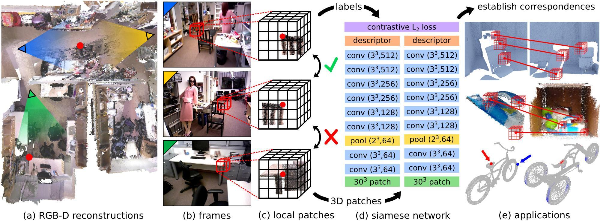

## Table of Contents

## What is geometric matching in the context of machine learning?

Geometric matching in machine learning is a technique used to find similarities between different shapes or objects by comparing their geometric properties. This method is particularly useful in fields like computer vision, where it helps in tasks such as object recognition and image registration. By analyzing features like edges, corners, and curves, geometric matching algorithms can determine how well two shapes align with each other. This is often done by transforming one shape to see if it can be made to match another shape more closely.

For example, imagine you have two images of a car taken from different angles. Geometric matching can help you understand if these images represent the same car by looking at the geometric features of the car in both images. Algorithms might use techniques like rotation, scaling, and translation to align these features. Once aligned, the algorithm can calculate a similarity score to decide if the shapes are a match. This process is crucial in applications like robotics, where identifying and navigating around objects in the environment relies heavily on understanding their geometric properties.

## How does geometric matching differ from other matching techniques?

Geometric matching focuses on the shapes and structures of objects, looking at things like edges, corners, and curves. It tries to see if one shape can be transformed to match another shape by using moves like rotation, scaling, and shifting. This is different from other matching techniques that might look at color, texture, or other non-geometric features. For example, in image recognition, while some methods might focus on the color patterns of an object, geometric matching would pay more attention to the outline and shape of the object.

Other matching techniques might use different approaches. For instance, feature-based matching might look at specific points of interest in an image, like keypoints, without necessarily considering the overall shape. Another method, like template matching, involves sliding a small image (template) over a larger image to find regions that match the template as closely as possible, often focusing on pixel intensity rather than geometric properties. Geometric matching, on the other hand, is more about understanding the spatial relationships and transformations between shapes, which makes it particularly useful in applications where the exact shape and orientation of objects matter.

## What are the basic principles behind geometric matching algorithms?

Geometric matching algorithms work by comparing the shapes of objects. They look at features like edges, corners, and curves to see if one shape can be transformed to match another shape. This transformation can involve rotating, scaling, or shifting the shape. The goal is to find a way to align the shapes so they look as similar as possible. Once aligned, the algorithm calculates a score to decide how well the shapes match. This score helps determine if the shapes are the same object seen from different angles or if they are different objects altogether.

These algorithms use mathematical methods to find the best way to align shapes. For example, they might use a technique called the Iterative Closest Point (ICP) algorithm. This method starts by guessing how to align two shapes and then keeps adjusting the alignment to make the shapes match better. Another important idea in geometric matching is the concept of distance between shapes. Algorithms often use a distance metric like the Hausdorff distance, which measures how far apart the shapes are after transformation. This helps the algorithm decide if the shapes are close enough to be considered a match.

## Can you explain the process of feature extraction in geometric matching?

Feature extraction in geometric matching involves identifying key points or characteristics of an object that help in comparing shapes. These features are usually things like edges, corners, or curves. The process starts by analyzing an image or a 3D model to find these features. For example, in an image of a car, the algorithm might look for the edges of the car's body, the corners where the doors meet, and the curves of the wheels. These features are important because they can be used to understand the shape of the object and how it might be transformed to match another object.

Once these features are identified, they are often described mathematically to make them easier to compare. For instance, a corner might be described by its position in the image and the angle it forms. The algorithm might use a method like the Harris corner detector to find these corners. After extracting these features, the next step is to compare them between different objects. This comparison helps determine if the objects have similar shapes, even if they are viewed from different angles or are slightly different in size. By focusing on these key features, geometric matching can effectively match objects based on their shapes.

## What role does transformation estimation play in geometric matching?

Transformation estimation is a key part of geometric matching. It helps figure out how to move, resize, or turn one shape so it matches another shape as closely as possible. Think of it like trying to fit a puzzle piece into a puzzle. You might need to rotate the piece, move it a bit, or even make it bigger or smaller to see if it fits. In geometric matching, the computer does the same thing with shapes, using math to find the best way to align them.

The process involves calculating the best transformation that makes the shapes look similar. This can include rotation, scaling, and translation. For example, if you have two images of a car taken from different angles, the algorithm will try different transformations to see if it can make the car in one image look like the car in the other image. Once it finds the best transformation, it can then measure how well the shapes match using a similarity score. This score helps decide if the shapes are the same object seen from different views or if they are different objects altogether.

## How is geometric consistency used to improve matching accuracy?

Geometric consistency helps make matching more accurate by checking if the shapes fit together well after they are moved or changed. Imagine you are trying to match two puzzle pieces. You move them around, turn them, and maybe make them bigger or smaller. Geometric consistency looks at how well these pieces fit together after you do all that. If they fit well, it means the match is probably right. If they don't fit well, it means the match might be wrong, and you need to try again.

In computer terms, geometric consistency uses math to see if the shapes line up correctly. For example, after moving and turning the shapes, the computer checks if the points on one shape are close to the points on the other shape. If they are close, it means the shapes are consistent, and the match is good. This helps the computer be more sure that the shapes it is matching are really the same object, even if they look a bit different because of the angle or size.

## What are some common applications of geometric matching in machine learning?

Geometric matching is used a lot in computer vision, which is about teaching computers to understand pictures and videos. One common use is in object recognition, where the computer tries to find and name objects in a picture. For example, if you take a photo of your living room, the computer can use geometric matching to spot your sofa and chairs by looking at their shapes, even if they are seen from different angles. This is also helpful in robotics, where robots need to move around and pick up things. By using geometric matching, a robot can figure out where objects are and how to grab them, making it easier to do tasks like cleaning or assembling things.

Another important use of geometric matching is in medical imaging. Doctors use it to compare scans of the body, like X-rays or MRIs, to see if there are any changes over time. For example, geometric matching can help match up two scans of a patient's brain to see if a tumor has grown. This helps doctors make better decisions about treatment. Also, in the world of 3D modeling and animation, geometric matching helps artists and designers line up different parts of a model to make sure everything fits together nicely. This makes the models look more realistic and helps in creating smooth animations.

## What challenges are typically encountered when implementing geometric matching?

One big challenge in using geometric matching is dealing with changes in how objects look. For example, if you're trying to match two pictures of a car, one taken from the front and one from the side, the shapes will look very different. This makes it hard for the computer to figure out if they are the same car. Another problem is noise in the images. Noise is like little mistakes or extra bits in the picture that can make it harder for the computer to find the right shapes. The computer needs to be smart enough to ignore this noise and focus on the main shapes.

Another challenge is the time it takes to match shapes. Geometric matching can be slow because it involves trying lots of different ways to move and change the shapes until they match. This can be a problem if you need quick results, like in a robot that needs to move around fast. Also, sometimes the computer might find a match that looks good but is actually wrong. This is called a false positive. To avoid this, the computer needs to be very careful and check the matches in many different ways to make sure they are correct.

## How can one evaluate the performance of a geometric matching algorithm?

Evaluating the performance of a geometric matching algorithm involves looking at how well it can match shapes correctly. One way to do this is by using a measure called accuracy. Accuracy tells you how often the algorithm gets the right match. You can test this by giving the algorithm lots of pairs of shapes, some that should match and some that shouldn't. Then, you count how many times it gets it right and divide that by the total number of pairs. This gives you a percentage that shows how accurate the algorithm is. Another important measure is the false positive rate, which tells you how often the algorithm says two shapes match when they really don't. A good algorithm should have a high accuracy and a low false positive rate.

Another way to evaluate performance is by looking at how fast the algorithm works. This is called the runtime or speed of the algorithm. You can measure this by timing how long it takes to match a set of shapes. A faster algorithm is better because it can handle more data in less time, which is important for applications like real-time robotics or video processing. You might also want to check how well the algorithm handles noise or changes in the shapes, like different angles or sizes. This is called robustness. A robust algorithm can still match shapes correctly even when they are not perfect or are seen from different views. By looking at accuracy, speed, and robustness, you can get a good idea of how well a geometric matching algorithm performs.

## What advanced techniques can enhance the robustness of geometric matching?

One advanced technique to make geometric matching more robust is using something called RANSAC, which stands for Random Sample Consensus. RANSAC helps the computer find the best way to match shapes even when there is a lot of noise or when the shapes are not perfect. It does this by trying many different ways to match the shapes and then [picking](/wiki/asset-class-picking) the one that works the best. This is really helpful in real-world situations where pictures might have extra stuff in them or the objects might be seen from different angles. By using RANSAC, the computer can be more sure that the shapes it matches are really the same object.

Another technique is called feature descriptors, which are like special labels that the computer puts on different parts of a shape. These labels help the computer understand the shape better and match it more accurately. For example, a feature descriptor might describe a corner by its position and the angle it makes. By using these descriptors, the computer can match shapes even if they are a bit different in size or turned at different angles. This makes the matching more robust because the computer can focus on the important parts of the shape and ignore small differences that don't matter.

## How does geometric matching integrate with deep learning models?

Geometric matching can be integrated with [deep learning](/wiki/deep-learning) models to improve the accuracy and robustness of shape recognition tasks. Deep learning models, like convolutional neural networks (CNNs), are good at finding patterns in images. They can learn to recognize shapes by looking at lots of examples. By combining deep learning with geometric matching, the computer can use the strengths of both methods. The deep learning part can help find important features in the images, like edges and corners, while the geometric matching part can use these features to match shapes more accurately. This combination can make the system better at recognizing objects, even when they are seen from different angles or in different conditions.

One way to integrate geometric matching with deep learning is by using a technique called feature extraction. In this approach, a deep learning model first processes an image to find key points or features, like edges or corners. These features are then used by the geometric matching algorithm to compare and align shapes. For example, a CNN might identify the corners of a car in two different images, and then the geometric matching algorithm can use these corners to figure out if the images show the same car from different angles. By working together, deep learning and geometric matching can make the whole system more powerful and able to handle complex real-world scenarios.

## What are the latest research trends and future directions in geometric matching?

The latest research in geometric matching is focusing a lot on making it work better with deep learning. Scientists are trying to use deep learning models to find important features in images, like edges and corners, and then use geometric matching to compare and match these shapes more accurately. This mix of deep learning and geometric matching can help computers understand objects better, even when they are seen from different angles or in different conditions. Researchers are also looking at ways to make geometric matching faster and more able to handle noise in images. This is important for real-world uses, like in robots that need to move around quickly and correctly identify objects.

Future directions in geometric matching are likely to focus on improving its robustness and speed. One exciting area is the development of new algorithms that can match shapes even when they are partly hidden or seen from very different angles. Another direction is making geometric matching work better with other types of data, like 3D models or point clouds. This could help in fields like medical imaging, where doctors need to compare scans of the body to see changes over time. As computers get more powerful and new techniques are developed, geometric matching will become even more useful in helping us understand and work with the world around us.

## References & Further Reading

[1]: Besl, P. J., & McKay, N. D. (1992). ["A Method for Registration of 3-D Shapes."](https://ieeexplore.ieee.org/document/121791) IEEE Transactions on Pattern Analysis and Machine Intelligence, 14(2), 239-256.

[2]: Fischler, M. A., & Bolles, R. C. (1981). ["Random Sample Consensus: A Paradigm for Model Fitting with Applications to Image Analysis and Automated Cartography."](https://dl.acm.org/doi/10.1145/358669.358692) Communications of the ACM, 24(6), 381-395.

[3]: Huttenlocher, D. P., Klanderman, G. A., & Rucklidge, W. J. (1993). ["Comparing Images Using the Hausdorff Distance."](https://ieeexplore.ieee.org/abstract/document/232073) IEEE Transactions on Pattern Analysis and Machine Intelligence, 15(9), 850-863.

[4]: Lowe, D. G. (1999). ["Object Recognition from Local Scale-Invariant Features."](https://ieeexplore.ieee.org/document/790410) Proceedings of the International Conference on Computer Vision, 1150-1157.

[5]: Szeliski, R. (2010). ["Computer Vision: Algorithms and Applications."](https://link.springer.com/book/10.1007/978-3-030-34372-9) Springer.

[6]: Ma, Y., Soatto, S., Kosecka, J., & Sastry, S. S. (2003). ["An Invitation to 3-D Vision: From Images to Geometric Models."](https://link.springer.com/book/10.1007/978-0-387-21779-6) Springer.

[7]: Zitova, B., & Flusser, J. (2003). ["Image Registration Methods: A Survey."](https://www.sciencedirect.com/science/article/pii/S0262885603001379) Image and Vision Computing, 21(11), 977-1000.

[8]: Hartley, R., & Zisserman, A. (2003). ["Multiple View Geometry in Computer Vision."](https://www.cambridge.org/core/books/multiple-view-geometry-in-computer-vision/0B6F289C78B2B23F596CAA76D3D43F7A) Cambridge University Press.