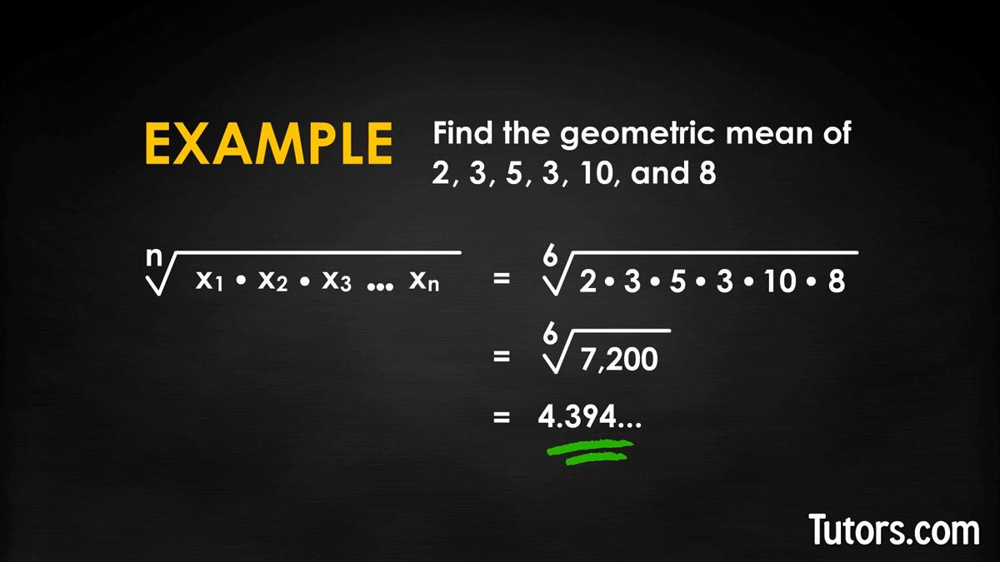

## Table of Contents

## What is the geometric mean and how is it different from the arithmetic mean?

The geometric mean is a way to find the average of a set of numbers by multiplying them together and then taking the nth root, where n is the number of values. For example, if you have the numbers 2, 4, and 8, you would multiply them to get 64, and then take the cube root (because there are three numbers) to find the geometric mean, which is about 4. This method is useful when dealing with rates of change or proportional growth, like in finance or population studies.

The arithmetic mean, on the other hand, is what most people think of as the "average." You find it by adding up all the numbers and then dividing by how many numbers there are. Using the same example of 2, 4, and 8, you would add them to get 14, and then divide by 3 to get an arithmetic mean of about 4.67. The key difference is that the arithmetic mean gives more weight to larger numbers, while the geometric mean balances out the values more evenly, making it better for certain types of data.

## How do you calculate the geometric mean of a set of numbers?

To calculate the geometric mean of a set of numbers, first multiply all the numbers together. For example, if you have the numbers 3, 6, and 9, you would multiply them to get 3 times 6 times 9, which equals 162. After you have the product, you need to find the nth root of that number, where n is how many numbers you started with. In this case, since there are three numbers, you would take the cube root of 162. The cube root of 162 is about 5.46, so that's the geometric mean of 3, 6, and 9.

The geometric mean is different from the arithmetic mean, which is what most people think of as the "average." To find the arithmetic mean, you add up all the numbers and then divide by how many numbers there are. Using the same example of 3, 6, and 9, you would add them to get 18, and then divide by 3 to get an arithmetic mean of 6. The geometric mean is useful when you're dealing with numbers that grow or change at different rates, like in finance or population studies, because it balances out the values more evenly than the arithmetic mean does.

## Can you provide a simple example of calculating the geometric mean with two numbers?

Let's say you have two numbers, 4 and 16, and you want to find their geometric mean. First, you multiply these two numbers together. So, 4 times 16 equals 64. 

Next, because you started with two numbers, you need to find the square root of 64. The square root of 64 is 8. So, the geometric mean of 4 and 16 is 8.

## What is the formula for the geometric mean when dealing with more than two numbers?

To find the geometric mean of a set of numbers, you first multiply all the numbers together. If you have the numbers 2, 3, and 6, you would multiply them to get 2 times 3 times 6, which equals 36. This step is the same no matter how many numbers you have.

After you have multiplied all the numbers, you need to take the nth root of the result. The "n" is the number of values you started with. For example, with the numbers 2, 3, and 6, you would take the cube root of 36 because you started with three numbers. The cube root of 36 is about 3.3, so the geometric mean of 2, 3, and 6 is about 3.3. This method works for any number of values, whether it's two, three, or more.

## How does the geometric mean apply to real-world scenarios, such as investment returns?

The geometric mean is really useful when you want to figure out the average growth rate over time, like for investment returns. Let's say you invest money and it grows by different percentages each year. If you want to know the average growth rate, the geometric mean is the best way to do it. It takes into account the compounding effect, which means that each year's growth builds on the previous year's growth. So, if your investment grows by 10% one year, 20% the next, and then drops by 5% the third year, the geometric mean will give you a better idea of the overall average growth rate than the arithmetic mean would.

For example, imagine you have an investment that grows by 10% in the first year, 20% in the second year, and then drops by 5% in the third year. To find the geometric mean, you would take the product of these growth rates (1.10 * 1.20 * 0.95) and then take the cube root of that product because there are three years. The result would be about 1.077, which means the average annual growth rate is about 7.7%. This is different from the arithmetic mean, which would be (10% + 20% - 5%) / 3 = 8.33%. The geometric mean gives you a more accurate picture of how your investment is growing over time because it considers the effect of compounding.

## What are the advantages of using the geometric mean over the arithmetic mean in certain situations?

The geometric mean is better than the arithmetic mean when you are looking at things that grow over time, like investments or populations. It takes into account how each change builds on the last one, which is called compounding. For example, if you have a bank account that grows by different percentages each year, the geometric mean will give you a truer average growth rate because it considers how each year's growth affects the next year's growth.

Another advantage of the geometric mean is that it balances out the numbers more evenly. If you have a set of numbers where some are very big and some are very small, the arithmetic mean can be pulled towards the bigger numbers. But the geometric mean treats all the numbers more equally, so it's less affected by extreme values. This makes it useful in fields like biology, where you might be looking at the sizes of different organisms, or in finance, where you might be comparing the performance of different investments.

## How do you calculate the geometric mean for data sets that include zero or negative numbers?

The geometric mean can't be calculated directly if your data set has zeros or negative numbers because you can't take the logarithm or the root of zero or a negative number. If you have zeros, you could add a small number to all your data points before calculating the geometric mean. This small number is called a "constant" and it helps you avoid the problem with zeros. For example, if your data set is 0, 2, and 4, you could add 1 to each number to get 1, 3, and 5. Then, you can calculate the geometric mean of these new numbers.

If you have negative numbers, things get a bit trickier. One way to deal with negative numbers is to use the concept of the "signed geometric mean." You can do this by taking the absolute value of all your numbers, calculating the geometric mean of those absolute values, and then putting the sign back in based on whether the product of all the original numbers was positive or negative. For example, if your data set is -2, 3, and -4, the absolute values are 2, 3, and 4. The geometric mean of 2, 3, and 4 is about 2.7, and since the product of -2, 3, and -4 is positive, the signed geometric mean would also be about 2.7. If the product had been negative, you would use -2.7 instead.

## What is the relationship between the geometric mean and logarithms?

The geometric mean and logarithms are closely connected because logarithms help us calculate the geometric mean more easily. When you want to find the geometric mean of a bunch of numbers, you can use logarithms to turn the multiplication into addition, which is simpler to work with. For example, if you have numbers like 2, 4, and 8, you take the logarithm of each number, add those logarithms together, and then divide by how many numbers you have. After that, you take the antilog (which is the opposite of a logarithm) of the result to get the geometric mean.

This method works because the logarithm of a product is the sum of the logarithms. So, if you want to find the geometric mean of numbers a, b, and c, you can use the formula: geometric mean = antilog((log(a) + log(b) + log(c))/3). This approach is especially helpful when you're dealing with a lot of numbers or when you're using a calculator or computer, because it simplifies the calculations.

## How can the geometric mean be used in statistical analysis, such as in the calculation of geometric standard deviation?

The geometric mean is useful in statistical analysis, especially when you want to look at data that grows or changes over time. It helps you understand how things like investment returns or population growth are doing on average. For example, if you're studying how fast a population is growing each year, the geometric mean gives you a better idea of the average growth rate than the regular average (arithmetic mean) because it takes into account how each year's growth builds on the last year's growth.

In statistics, the geometric mean also helps in calculating the geometric standard deviation, which is a way to measure how spread out your data is. To find the geometric standard deviation, you first find the geometric mean of your data. Then, you take the logarithm of each data point, find the standard deviation of these logarithms, and finally, you convert that back to the original scale by taking the antilog. This method is really helpful when you're working with data that can't be negative, like sizes of things or rates of growth, because it gives you a way to see how much these values vary around their average growth rate.

## Can you explain how the geometric mean is used in finance, particularly in the context of portfolio performance?

The geometric mean is really important in finance, especially when you want to figure out how well a portfolio is doing over time. If you have a bunch of investments that grow at different rates each year, the geometric mean helps you find the average growth rate. It does this by taking into account how each year's growth builds on the last year's growth, which is called compounding. So, if your portfolio grows by 10% one year, 20% the next, and then drops by 5% the third year, the geometric mean will give you a better idea of the overall average growth rate than the regular average (arithmetic mean) would.

For example, let's say you have an investment that grows by 10% in the first year, 20% in the second year, and then drops by 5% in the third year. To find the geometric mean, you would multiply these growth rates together (1.10 * 1.20 * 0.95) and then take the cube root of that product because there are three years. The result would be about 1.077, which means the average annual growth rate is about 7.7%. This is different from the arithmetic mean, which would be (10% + 20% - 5%) / 3 = 8.33%. The geometric mean gives you a more accurate picture of how your investment is growing over time because it considers the effect of compounding.

## How does the geometric mean help in understanding the growth rates of populations or biological processes?

The geometric mean is really helpful when you want to understand how populations or things in biology grow over time. Let's say you're studying how fast a certain type of bacteria grows each day. The bacteria might grow by different percentages each day, like 10% one day, 20% the next, and then maybe only 5% the day after that. The geometric mean helps you figure out the average growth rate over these days. It does this by considering how each day's growth builds on the last day's growth, which is called compounding. This way, you get a better idea of how fast the bacteria are growing on average.

For example, if you have a population of animals that grows by 5% one year, 10% the next year, and then 15% the year after that, the geometric mean will tell you the average yearly growth rate. You would multiply these growth rates together (1.05 * 1.10 * 1.15) and then take the cube root of that product because there are three years. The result would give you the average annual growth rate, which is more accurate than just adding up the growth rates and dividing by three (the arithmetic mean). This method helps scientists and researchers understand how populations or biological processes are growing over time in a more realistic way.

## What are some advanced applications of the geometric mean in fields like engineering or computer science?

In engineering, the geometric mean is used to analyze data that grows or changes over time, like the strength of materials or the efficiency of systems. For example, if engineers are testing how strong a new type of metal is, they might measure its strength at different points and use the geometric mean to find the average strength. This helps them understand how the metal's strength changes under different conditions. In another case, engineers might use the geometric mean to look at how efficient a machine is over time. If the machine's efficiency changes from day to day, the geometric mean can help them see the average efficiency more accurately than just using a regular average.

In computer science, the geometric mean is used to measure the performance of algorithms or systems. For example, if you're comparing how fast different computer programs can solve a problem, you might run each program multiple times and use the geometric mean to find the average speed. This is helpful because it gives a better idea of how the program performs overall, taking into account how each run builds on the last one. The geometric mean can also be used in data compression, where it helps to find the average size of data after it's been compressed. This way, computer scientists can see how well their compression methods are working on average.

## What is the Understanding of Geometric Mean?

The geometric mean is a fundamental mathematical concept that is particularly significant in fields such as finance and [statistics](/wiki/bayesian-statistics). It provides a way to determine the central tendency of a set of numbers by using their product, rather than their sum. Unlike the arithmetic mean, which sums values and divides by the count, the geometric mean multiplies the values and takes the nth root, where n represents the number of values. Mathematically, for a set of positive numbers $x_1, x_2, \ldots, x_n$, the geometric mean is defined as:

$$
\text{Geometric Mean} = \left( \prod_{i=1}^{n} x_i \right)^{\frac{1}{n}} = \sqrt[n]{x_1 \times x_2 \times \cdots \times x_n}
$$

A key advantage of the geometric mean is its ability to account for the compounding effect of returns, making it especially useful in financial contexts. This is because financial returns are usually multiplicative processes. The geometric mean provides a better measure of the average rate of return over multiple periods when the returns are expressed as percentages or ratios. For example, if an investment grows by 10% in the first year, decreases by 5% in the second year, and increases by 15% in the third year, the geometric mean would give a more accurate measure of the average yearly growth rate compared to the arithmetic mean.

The geometric mean is often applied in calculating compound annual growth rates (CAGR), which is a popular metric for measuring investment performance over time. The CAGR can be defined using the geometric mean as follows:

$$
\text{CAGR} = \left( \frac{\text{Ending Value}}{\text{Beginning Value}} \right)^{\frac{1}{n}} - 1
$$

Another common application of the geometric mean is in calculating the average return on a portfolio or investment over several time periods. This is useful because it accounts for the effects of [volatility](/wiki/volatility-trading-strategies) and varying rates of return, providing a more nuanced understanding of long-term investment performance compared to the arithmetic mean.

Given these properties, the geometric mean is an indispensable tool for financial analysts and traders who need to evaluate and compare different growth rates and investments more accurately. Its focus on compounding makes it better suited than the arithmetic mean for analyzing investments over time, particularly in contexts where proportional growth or decay is involved.

## How is the Geometric Mean Calculated?

The geometric mean is a vital statistical measure that is used to understand the average performance of a set of numbers, particularly when dealing with products or exponential growth rates. It is defined as the nth root of the product of n numbers. Mathematically, the geometric mean $G$ of a dataset $x_1, x_2, ..., x_n$ is given by:

$$
G = \left( \prod_{i=1}^{n} x_i \right)^{\frac{1}{n}} = \sqrt[n]{x_1 \times x_2 \times \cdots \times x_n}
$$

This measure is especially useful in finance and investment where we often deal with compounded growth rates, as it accurately accounts for the effects of negative and positive percentage changes over time.

### Step-by-Step Example

To illustrate the calculation of the geometric mean, consider a scenario where an investment has returns of 10%, -5%, and 15% over three consecutive years. First, these percentages should be expressed as growth factors:

- Year 1: $1 + 0.10 = 1.10$
- Year 2: $1 - 0.05 = 0.95$
- Year 3: $1 + 0.15 = 1.15$

The geometric mean of these growth factors is:

$$
G = (1.10 \times 0.95 \times 1.15)^{\frac{1}{3}}
$$

Calculating this:

1. Multiply the factors: $1.10 \times 0.95 \times 1.15 = 1.20125$
2. Take the cubic root: $G = 1.20125^{\frac{1}{3}} \approx 1.063$

Thus, the geometric mean growth rate is approximately 6.3%, representing the average annual growth rate over the period.

### Using Spreadsheet Tools

Calculating the geometric mean can be expedited using spreadsheet programs like Excel or Google Sheets, which have built-in functions for this purpose.

In Excel:
- Input your data in a column, for example, from cells A1 to A3.
- Use the formula `=GEOMEAN(A1:A3)` to compute the geometric mean. This will directly give you the result by applying the aforementioned formula under the hood.

In Google Sheets, the process is similar:
- Enter data in a column, such as A1 through A3.
- Use the formula `=GEOMEAN(A1:A3)`.

Using these tools allows for efficient and accurate computation of the geometric mean, facilitating quick analysis of large datasets often encountered in financial scenarios.

## What is the importance of geometric mean in algorithmic trading?

The geometric mean is particularly valuable in [algorithmic trading](/wiki/algorithmic-trading) because it provides a more nuanced and comprehensive measure of investment returns than the arithmetic mean. In finance, the arithmetic mean can often misrepresent the true performance of an investment portfolio, especially in the presence of volatility. This discrepancy arises because the arithmetic mean does not account for the compounding effects of returns, which is crucial for accurate financial analysis. 

The formula for geometric mean is expressed as:

$$

G = \left( \prod_{i=1}^{n} (1 + r_i) \right)^{\frac{1}{n}} - 1 
$$

where $r_i$ represents each period's rate of return and $n$ is the number of periods. This formula inherently considers the compounding nature of growth, which aligns more closely with real-world investment scenarios where returns are typically reinvested.

In the context of algorithmic trading, the geometric mean is instrumental in optimizing portfolio performance. By factoring in compounding effects, traders can better assess the average rate of growth over multiple periods. This approach ensures that trading strategies are evaluated more realistically, taking into account how small fluctuations in returns can compound over time to significantly impact the overall performance of a strategy.

Algorithmic trading strategies can significantly benefit from the insights provided by the geometric mean during the development and [backtesting](/wiki/backtesting) phases. For instance, backtesting requires historical data analysis to evaluate a strategy’s potential effectiveness. If performance is gauged using geometric means, traders obtain a more accurate picture of potential returns, leading to strategy optimization before deployment in real markets.

Consider a hypothetical case study: A trading algorithm is developed based on a geometric approach to measure and compare the returns of two strategies over a decade. By calculating returns using the geometric mean, the research shows that Strategy A, with a consistent annual return of 10%, outperforms Strategy B, which alternates between 5% and 15% annually. While both strategies have an arithmetic average return of 10%, the geometric mean reveals that Strategy A indeed yields higher compounded returns over the same period.

In practice, implementing geometric means into algorithms can involve leveraging programming languages such as Python. Using libraries like NumPy, traders can easily calculate geometric means over large datasets, facilitating real-time analysis and strategy adjustment. Here is a simple Python example illustrating how the geometric mean can be calculated:

```python
import numpy as np

# List of periodic returns, expressed as decimal values
returns = [0.05, 0.1, 0.02, 0.08]

# Calculate geometric mean
geometric_mean = np.prod([1 + r for r in returns])**(1/len(returns)) - 1

print("Geometric Mean: {:.2%}".format(geometric_mean))
```

As demonstrated, the geometric mean is paramount in creating realistic, effective algorithmic trading strategies. It helps not just in measuring returns more accurately but also in guiding the development of trading systems that maximize the compounding benefits of investment performance. This ensures that traders are better prepared for the volatility and complexity inherent in financial markets, ultimately leading to improved trading outcomes.

## What is Geometric Moving Average and why is it a key indicator in trading?

A geometric moving average offers a unique method for analyzing trading patterns by focusing on compounded growth rates rather than simple average values. Unlike traditional averages, which might skew the interpretation of data due to large and abrupt fluctuations, geometric moving averages provide a smoothed perspective that better accounts for proportional changes.

### Calculation and Application

To calculate the geometric moving average, consider a dataset of n returns expressed as percentages or growth factors. The geometric moving average is calculated using the nth root of the product of these growth factors. This calculation underscores the importance of compounding in financial growth. The formula is expressed as:

$$
GMA = \left( \prod_{i=1}^{n} (1 + r_i) \right)^{\frac{1}{n}} - 1
$$

where $r_i$ represents each return over the period.

For instance, assume a series of daily returns: 2%, -1%, and 3%. The growth factors would be 1.02, 0.99, and 1.03. Plugging these into the formula, the geometric mean is calculated as:

$$
GMA = \left(1.02 \times 0.99 \times 1.03\right)^{\frac{1}{3}} - 1
$$

$$
GMA = (1.042694)^{\frac{1}{3}} - 1 \approx 0.0140 \text{ or } 1.40\%
$$

Traders use geometric moving averages to identify trends by smoothing out short-term volatility and highlighting longer-term [momentum](/wiki/momentum). It's particularly effective in strategies where the compounding of returns plays a significant role, such as in algorithmic trading, where the cumulative performance of assets affects decision-making.

### Comparison with Other Moving Averages

Geometric moving averages are distinct from arithmetic moving averages, which simply take the average of data points without considering the effects of compounding. An arithmetic moving average might not accurately reflect the performance of investment strategies involving high volatility or leveraged assets.

For example, consider the same series of returns mentioned earlier. The arithmetic average would be calculated as:

$$
\text{Arithmetic Average} = \frac{2\% - 1\% + 3\%}{3} = \frac{4\%}{3} \approx 1.33\%
$$

Compared to the geometric average of 1.40%, the arithmetic average provides a slightly different perspective, indicating how geometric calculations can be more reliable in reflecting true investment growth over time.

Selecting a moving average type depends on the strategy's objectives. Geometric moving averages are preferable when the focus is on multiplicative growth scenarios. In contrast, arithmetic moving averages might be used in simpler contexts where understanding the basic average performance over time suffices.

In conclusion, geometric moving averages are crucial for traders aiming to incorporate the effects of compounding into their analyses, offering a more nuanced view of market trends and aiding in making informed trading decisions.

## References & Further Reading

[1]: Bernstein, P. L. (1996). ["Against the Gods: The Remarkable Story of Risk"](https://books.google.com/books/about/Against_the_Gods.html?id=uTje6PYAijUC) by Peter L. Bernstein.

[2]: Lo, A. W., & Mackinlay, A. C. (1999). ["A Non-Random Walk Down Wall Street"](https://www.jstor.org/stable/j.ctt7tccx) by Andrew W. Lo and Archie Craig Mackinlay.

[3]: Sharpe, W. F. (1994). ["The Sharpe Ratio"](https://web.stanford.edu/~wfsharpe/art/sr/SR.htm). The Journal of Portfolio Management, 21(1), 49-58.

[4]: Campbell, J. Y., & Shiller, R. J. (1988). ["The Dividend-Price Ratio and Expectations of Future Dividends and Discount Factors"](https://www.jstor.org/stable/2961997). The Review of Financial Studies, 1(3), 195-228.

[5]: Hull, J. C. (2009). ["Options, Futures, and Other Derivatives"](https://www.semanticscholar.org/paper/Options%2C-Futures%2C-and-Other-Derivatives-Hull/89bdee500c8623864fc9eb7a471546aa713acc44) (7th Edition). Pearson.