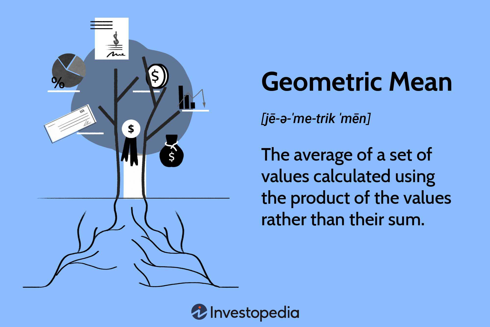

In the world of investing and trading, the geometric mean is essential in accurately assessing investment performance over time. Unlike the arithmetic mean, which simply averages returns by adding them together and dividing by the number of periods, the geometric mean accounts for the compounding effect, a critical aspect of financial growth. This compounding effect is essential for understanding true investment returns, especially when dealing with multiple periods or fluctuating rates of return.

Algorithmic trading and investment analysis depend heavily on precise performance metrics, and the geometric mean provides a robust measure to gauge the average rates of return. It describes the central tendency of a set of numbers by finding the nth root of the product of n numbers, which is particularly useful in dealing with multiplicative processes such as investment returns. For example, if an investment has annual returns of 10%, 15%, and -5%, the geometric mean will provide a more accurate measure of the average return than the arithmetic mean.



This article examines the significance of the geometric mean in investment analysis and algorithmic trading, offering insights into its calculation and application. Its relevance in various trading strategies stems from its ability to offer a true reflection of investment performance over extended periods, considering both the volatility of returns and the overarching impact of compounding. By incorporating the geometric mean, financial analysts and traders enhance accuracy and effectiveness in measuring and forecasting investment outcomes.

## Table of Contents

## Understanding Geometric Mean

The geometric mean is a mathematical tool used to determine the central tendency of a set of positive numbers, specifically emphasizing multiplicative relationships. It is calculated by multiplying all the values together and then taking the nth root of the resulting product, where n represents the total count of the numbers in the set. Mathematically, if you have a set of numbers $a_1, a_2, \ldots, a_n$, the geometric mean $G$ is given by:

$$
G = \left( \prod_{i=1}^{n} a_i \right)^{1/n}
$$

In the context of finance, the geometric mean becomes an indispensable metric due to the nature of investment returns, which are often compounded over time. Unlike the arithmetic mean, which simply adds up the values and divides by the number of values, the geometric mean captures the effects of compounding. This is critical in financial applications because it provides a more accurate representation of average performance, especially when dealing with investment returns that can vary significantly from one period to another.

Consider an investment that experiences different returns over multiple periods; the arithmetic mean could potentially overestimate average returns because it fails to account for the compounding nature of investment growth. For example, an investment that grows by 50% in the first year and declines by 50% in the second year does not result in a net zero change when simply averaged arithmetically. Instead, using the geometric mean provides an accurate reflection of the investment's performance.

Unlike the arithmetic mean that is heavily influenced by extreme values, the geometric mean is robust against such distortions. This robustness comes from its foundation in multiplicativity—by considering the overall product of the values rather than individual differences. Thus, the geometric mean is particularly advantageous for evaluating datasets with significant variability or [volatility](/wiki/volatility-trading-strategies), which are common in financial markets.

The geometric mean's suitability extends beyond investment analysis to other multiplicative processes in finance, such as portfolio diversification and risk management. When assessing the performance of investment portfolios or the efficiency of trading strategies, the geometric mean offers a consistent measure that aligns with the goals of maximizing compounded growth and minimizing the impact of volatility.

In summary, the geometric mean is more appropriate than the arithmetic mean for financial analysis involving returns that exhibit variability, as it accurately captures the essence of compounding. Its application allows for a true measure of an investment's average growth rate over time, providing valuable insights for investors and financial analysts.

## Calculating the Geometric Mean

Calculating the geometric mean involves a systematic approach, essential for evaluating the compounded growth of an investment. The geometric mean is derived by multiplying a series of numbers and then taking the nth root, where n represents the total number of figures. This method is particularly beneficial in financial analysis, where investments often exhibit variability in returns across different periods.

### Step-by-Step Example:

Consider an investment that yields different returns over three years. For example, assume the following annual returns: 10%, -5%, and 15%.

1. **Convert Percentages to Decimal Representation**: 
   - Year 1: 10% becomes 1.10
   - Year 2: -5% becomes 0.95
   - Year 3: 15% becomes 1.15

2. **Multiply the Returns**: 
   Find the product of these growth factors:
$$
   \text{Product} = 1.10 \times 0.95 \times 1.15 = 1.20175

$$

3. **Compute the nth Root**:
   Since there are three values, take the cube root:
$$
   \text{Geometric Mean} = (1.20175)^{1/3} \approx 1.062

$$

4. **Convert Back to Percentage**:
   Convert the result back to percentage form to interpret the average annual return:
$$
   \text{Geometric Mean} - 1 = 0.062 \rightarrow 6.2\%

$$

Thus, the geometric mean indicates an average annual compound return of 6.2% over the three years.

### Using Spreadsheet Tools:

In tools like Excel or Google Sheets, calculating the geometric mean is streamlined through built-in functions:

- **Excel**: Utilize the `GEOMEAN` function. For the dataset \{1.10, 0.95, 1.15\}, input:
  ```
  =GEOMEAN(1.10, 0.95, 1.15)
  ```
  This will directly yield the geometric mean of the data set.

- **Google Sheets**: Similarly, use the `GEOMEAN` function:
  ```
  =GEOMEAN(1.10, 0.95, 1.15)
  ```
  The function works identically to provide the compounded average return.

The geometric mean offers a nuanced perspective of investment performance by incorporating the effects of compounding. This makes it a more reliable metric compared to the arithmetic mean, especially in contexts where returns are volatile or non-uniform across periods.

## Importance of Geometric Mean in Algo Trading

The geometric mean plays a crucial role in [algorithmic trading](/wiki/algorithmic-trading) by providing a precise measurement of an investment's compounded growth rate over time. Unlike the arithmetic mean, which can be skewed by extreme values, the geometric mean considers the multiplicative nature of financial returns, making it a reliable means for assessing the effectiveness of trading strategies.

In algorithmic trading, traders utilize the geometric mean to evaluate and backtest various trading strategies. By examining the compounded annual growth rates of returns, traders can optimize their strategies to ensure consistent performance even under varying market conditions.

One practical way to apply the geometric mean in algo trading is through [backtesting](/wiki/backtesting). This method involves applying a trading strategy to historical data to determine its viability and optimize parameters before real-time implementation. For instance, let us consider an algorithm that generates annual returns, $R_1, R_2, \ldots, R_n$. The geometric mean $G$ of the returns is defined as:

$$
G = \left( \prod_{i=1}^{n} (1 + R_i) \right)^{\frac{1}{n}} - 1
$$

This formula captures the compounded nature of investment returns, providing a more accurate picture of average gains or losses over the given period.

To illustrate, suppose an algorithm yields annual returns of 10%, -5%, and 15%. The geometric mean is calculated as follows:

```python
returns = [1.10, 0.95, 1.15]
geometric_mean = (np.prod(returns)**(1/len(returns))) - 1
print(f"Geometric Mean: {geometric_mean:.2%}")
```

Python, a favorite tool among algo traders, offers libraries like NumPy to easily handle these computations. By consistently using the geometric mean, traders can enhance the reliability of their performance analyses.

In real-time financial data analysis, the geometric mean enables traders to make informed decisions by smoothing out anomalies and capturing the true growth trajectory of trading systems. For example, when assessing an algorithm's efficacy across multiple tests or varying market conditions, the geometric mean helps in identifying strategies that maintain consistent growth rates, reducing the risk of overfitting to historical data.

Ultimately, the application of the geometric mean in algorithmic trading leads to a robust evaluation of strategies, reinforcing their potential for sustained performance in real-market situations. This approach not only mitigates uncertainties but also paves the way for refining strategies that capitalize on compounding effects, ensuring that traders can maximize their long-term investment returns.

## Geometric Moving Average: A Key Indicator

The geometric moving average (GMA) is a valuable indicator in trading, designed to smooth out price data while accounting for the compounded effect of returns. This feature makes it particularly effective for identifying long-term trends and [momentum](/wiki/momentum). Unlike the traditional arithmetic moving average (AMA), which simply calculates the average of a set of data points, the GMA considers the geometric mean of prices over a specified period. By doing so, it provides a more accurate reflection of investment performance over time, especially in markets with significant volatility or when leveraging assets.

The formula for the geometric moving average is:

$$
\text{GMA}_n = \left( P_1 \times P_2 \times \cdots \times P_n \right)^{\frac{1}{n}}
$$

where $P_1, P_2, \ldots, P_n$ are the price points over the chosen period and $n$ is the number of periods. The GMA is inherently more stable in comparison to the AMA because it reduces the impact of extreme values, making it particularly useful for assets with large price fluctuations. This capacity to smoothen volatility helps traders better pinpoint persistent trends and signals, facilitating more informed trading decisions.

The benefits of using the GMA over the AMA are pronounced in scenarios involving volatile or leveraged assets. In such instances, the compounded nature of returns can significantly distort results when using the AMA, leading to misleading averages that might suggest apparent trends or pricing errors. The GMA mitigates this issue by offering an average that inherently accounts for these compounding effects, thereby presenting a clearer picture of the asset's trajectory over time.

For practical application, GMA can be implemented easily using programming tools such as Python. A simple code snippet to calculate the GMA in Python for a list of daily prices could look like this:

```python
import numpy as np

# Sample price data
prices = [100, 102, 101, 104, 107, 110]

# Function to calculate geometric moving average
def geometric_moving_average(prices, period):
    gma = []
    for i in range(len(prices) - period + 1):
        subset = prices[i:i+period]
        geom_mean = np.prod(subset) ** (1.0 / period)
        gma.append(geom_mean)
    return gma

gma_values = geometric_moving_average(prices, 3)
print("Geometric Moving Average:", gma_values)
```

This example calculates the geometric moving average over a 3-day period, highlighting how easily this concept can be integrated into trading algorithms to enhance the analytical power of investment strategies. By incorporating the GMA, traders can develop a more nuanced understanding of market movements and allocate resources more effectively in rapidly changing environments.

## Advantages and Drawbacks

The geometric mean is a powerful tool in financial analysis, particularly for measuring investment performance. One of its key advantages is its ability to reflect true growth by accounting for the compounding effect. This property makes it especially useful in evaluating the performance of investments over time, where returns can vary significantly from one period to the next. By taking the nth root of the product of returns, the geometric mean provides a more accurate representation of average growth rates compared to the arithmetic mean, which can distort results when returns are volatile.

Another advantage of the geometric mean is its capability to minimize the impact of extreme values. In datasets where returns are highly variable, extreme values can skew results if arithmetic averages are used. The geometric mean, however, tempers the effects of these outliers by focusing on the multiplicative essence of growth processes.

Despite these benefits, the geometric mean is not without limitations. One significant challenge is its difficulty handling non-positive numbers. Since the geometric mean involves multiplying values together, the presence of zero or negative numbers in the dataset can pose computational problems. This is because taking the root of a negative product is not defined within real numbers, rendering it incompatible with datasets containing such values. To address this issue, non-positive returns are often adjusted or treated separately from the computation.

Furthermore, when used in moving averages, the geometric mean can introduce a time lag, which may delay the representation of trend changes. This happens because the geometric moving average (GMA) considers past data over a particular period, leading to a slower response to recent market changes compared to shorter period moving averages. Traders can mitigate this effect by choosing an optimal averaging window that balances sensitivity and stability, depending on their trading strategy.

In summary, while the geometric mean is an effective tool for providing a true representation of compounded growth and reducing the impact of outliers, it is essential for practitioners to be mindful of its limitations. Adjusting for non-positive numbers and carefully selecting averaging periods can help overcome these challenges, ensuring accurate and relevant financial analysis.

## Conclusion

The geometric mean stands out as a critical tool for investment performance analysis due to its ability to accurately depict compounded growth, something other averages like the arithmetic mean cannot achieve. This distinguishes the geometric mean as essential for evaluating investment returns over multiple periods, providing a more authentic picture of growth despite the variability in rates of return.

Algorithmic traders and financial analysts can significantly benefit from incorporating geometric mean calculations into their strategies. By doing so, they enhance the precision and reliability of performance evaluations in algorithmic trading systems. Tools like Python and Excel offer accessible and powerful platforms for these calculations, allowing professionals to automate the process and integrate it seamlessly into their workflow.

For instance, Python libraries such as NumPy facilitate straightforward computation of the geometric mean. Here is a simple code snippet demonstrating its calculation:

```python
import numpy as np

def geometric_mean(returns):
    return np.exp(np.mean(np.log(returns)))

# Example usage:
returns = [0.05, 0.07, -0.02, 0.03]  # These are decimal form returns (5%, 7%, etc.)
geo_mean = geometric_mean(np.array(returns) + 1) - 1
print(f"The geometric mean of the returns is {geo_mean:.2%}")
```

Leveraging such computational tools enables traders to continuously assess and refine their strategies, ensuring decisions are informed by robust mathematical measures. This not only enhances performance analysis but also supports the creation of more resilient financial models capable of adapting to market changes. By embedding the geometric mean into their analysis toolkit, financial professionals can achieve a more nuanced understanding of investment dynamics and improve overall strategy effectiveness.

## References & Further Reading

Bernstein, P. L. (1996). *Against the Gods: The Remarkable Story of Risk*. This book provides insight into the history and conceptual development of risk assessment, which is fundamental for understanding investment analysis and decision-making processes.

For a deeper comprehension of geometric means and their application in finance, the following resources are recommended:

1. Bodie, Z., Kane, A., & Marcus, A. J. (2014). *Investments*. This textbook offers a thorough exploration of investment theory and practice, including quantitative methods such as geometric and arithmetic means.

2. Wilmott, P. (2006). *Paul Wilmott Introduces Quantitative Finance*. This book is particularly useful for understanding the mathematical foundations of financial instruments, including algorithmic trading processes and performance metrics.

3. Hull, J. C. (2018). *Options, Futures, and Other Derivatives*. This reference provides detailed explanations of financial derivatives and their pricing, often requiring calculations involving geometric mean rates of return.

4. Shreve, S. E. (2004). *Stochastic Calculus for Finance I: The Binomial Asset Pricing Model*. Ideal for those interested in the quantitative methods underpinning financial models, including the use of geometric means in stochastic calculus.

For practical applications in algorithmic trading and investment analysis:

1. Lopez de Prado, M. (2018). *Advances in Financial Machine Learning*. This book outlines machine learning techniques applied to finance, where geometric mean calculations frequently appear in backtesting and strategy evaluation.

2. Chan, E. (2009). *Quantitative Trading: How to Build Your Own Algorithmic Trading Business*. This guide provides insights into creating and testing algorithmic trading strategies, often implying the use of geometric means for performance assessment.

Additionally, exploring online resources such as financial data analysis libraries in Python (like `pandas` and `numpy`) can be beneficial for implementing geometric mean calculations in real-world scenarios. These tools offer various functions and methods to streamline financial data processing and investment strategy simulation.

