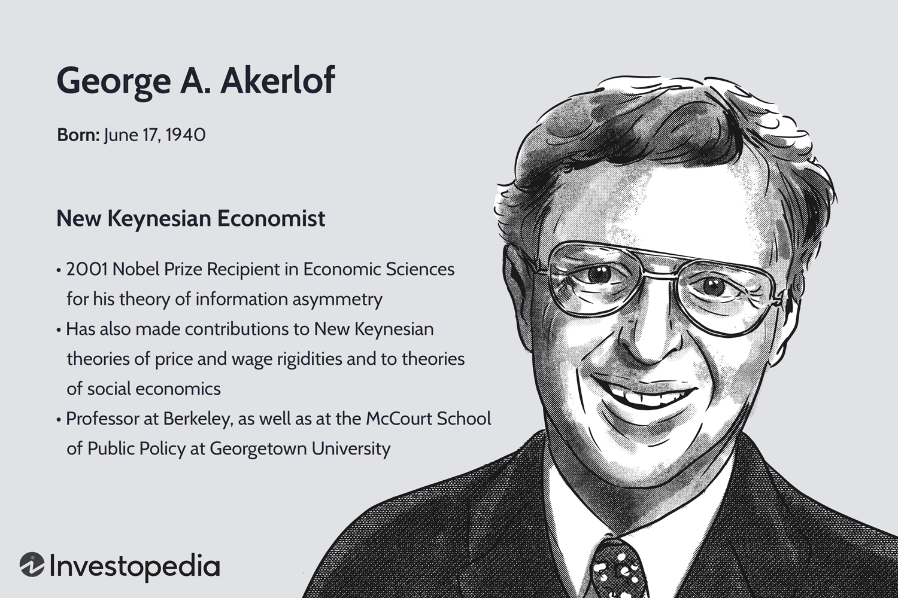

George Akerlof, a Nobel laureate and esteemed economist, has profoundly influenced economic theory through his exploration of information asymmetry. His seminal work, "The Market for Lemons," published in 1970, fundamentally altered how economists and policymakers understand the role of information in market transactions. In this paper, Akerlof examines how asymmetric information—where sellers possess more knowledge about a product's quality than buyers—can lead to significant market inefficiencies.

Using the used car market as a primary illustration, Akerlof demonstrates how the presence of uneven information distribution can cause adverse selection, ultimately driving high-quality products, or "peaches," out of the market, leaving behind only low-quality ones, or "lemons." This concept has broad implications, not only highlighting potential market failures but also emphasizing the necessity for mechanisms such as warranties and certification to mitigate the adverse effects of information asymmetry.



The insights derived from Akerlof's work are particularly pertinent to modern financial markets. As financial systems grow more complex, the discrepancies in information access and interpretation have increased, influencing market dynamics significantly. This is especially evident in algorithmic trading, where the speed and efficiency of data processing and analysis can create and exploit information asymmetries. In exploring Akerlof's theories, this article will examine their ongoing relevance and potential application in crafting algorithmic trading strategies that can efficiently harness market inefficiencies while mitigating inherent risks.

## Table of Contents

## Understanding 'The Market for Lemons'

George Akerlof's seminal paper, "The Market for Lemons: Quality Uncertainty and the Market Mechanism," published in 1970, investigates into the concept of asymmetric information, a situation in which one party in a transaction has more or superior information compared to the other. This disparity can lead to market inefficiencies and failures. Akerlof illustrates this phenomenon through the used car market, where the disparity in information between sellers and buyers significantly impacts the market's function.

In the used car market, sellers often possess more information about the vehicle's condition than potential buyers. This imbalance creates a situation where sellers with low-quality vehicles, or "lemons," are incentivized to sell their cars at the price of higher-quality vehicles, or "peaches." As buyers cannot distinguish between lemons and peaches, they are unwilling to pay a premium price, forcing the market price down to a level closer to that of the lemons, effectively driving the higher-quality vehicles out of the market.

This phenomenon demonstrates how markets can spiral into inefficiency as high-quality goods are systematically sidelined by lower-quality alternatives. Akerlof's analysis concluded that without some form of intervention or guarantee, such as warranties or certification systems, markets cannot self-regulate to achieve optimal efficiency. Trusted information sources or warranties can help mitigate the effects of asymmetric information by providing assurance about the quality, thus helping maintain diversity and efficiency in the market.

Understanding this theory is fundamental to comprehending modern market dynamics, as information asymmetry is pervasive across various sectors beyond the used car example. In financial markets, for instance, asymmetric information can lead to mispricing and suboptimal investment decisions, necessitating mechanisms like transparency requirements and regulatory oversight to maintain market integrity. Akerlof's insights provide a foundation for analyzing how information flows affect market dynamics and pricing structures, emphasizing the necessity of reliable information and mechanisms to prevent market failures due to quality uncertainty.

## The Theory's Implications for Financial Markets

Information asymmetry, as articulated in George Akerlof's seminal work "The Market for Lemons," holds profound implications for financial markets. Akerlof demonstrated how an imbalance of information—where one party to a transaction possesses more or better information than the other—can lead to adverse selection and market inefficiencies. In financial markets, this phenomenon can skew stock prices, bond valuations, and the broader functioning of the markets.

Akerlof’s insights underscore the critical role of transparency and regulation in maintaining market stability. In cases where some market participants have access to superior information, those without such access might base decisions on incomplete or misleading data, increasing the risk of asset mispricing and market distortions. This is why regulatory frameworks aim to ensure a level playing field where all parties have equal access to information, reducing information asymmetries that could lead to market collapse.

For traders and investors, recognizing and understanding these asymmetries is key to making informed decisions and managing risk effectively. By identifying where asymmetries exist, they can adjust their strategies to mitigate potential disadvantages. This is particularly salient in the context of [algorithmic trading](/wiki/algorithmic-trading), where algorithms can process and react to market data at exceptional speeds, conferring a significant competitive advantage. 

Algorithmic trading platforms harness vast datasets and leverage high-frequency trading capabilities to spot minute market inefficiencies that human traders might overlook. Access to comprehensive and timely data, coupled with rapid processing speeds, can help algorithms identify and capitalize on information asymmetries, potentially leading to more profitable trading strategies. An algorithm might, for example, use [machine learning](/wiki/machine-learning) to predict market movements based on data that indicate asymmetries, thereby executing trades with precision.

However, it is crucial for traders using algorithmic systems to ensure that their data analysis is robust, distinguishing between genuine market signals and mere noise. The balance between accessing sufficient data and processing it accurately impacts an algorithm's ability to function effectively in asymmetrical information environments.

In conclusion, Akerlof's examination of information asymmetry provides invaluable insights for financial markets, particularly in the domain of algorithmic trading. A strong grasp of these concepts can facilitate better regulatory practices and empower market participants to make informed, strategic decisions that navigate and exploit market inefficiencies effectively.

## Algorithmic Trading and Information Asymmetry

Algorithmic trading utilizes computer algorithms to execute trades in financial markets, offering the potential to leverage information asymmetry for profitable outcomes. Akerlof's theories, particularly those concerning asymmetric information, provide a foundational framework for developing algorithms capable of identifying and exploiting these market inefficiencies. Algorithms are crafted to detect discrepancies in information distribution—situations where one party possesses more or better information than its counterpart—thus enabling advantageous trading positions.

In financial markets, information asymmetry can manifest through varied data access speed, insider information, or differences in market analysis capabilities. Algorithms designed with Akerlof's principles in mind would emphasize the identification of such asymmetries within large datasets. For example, by analyzing historical trading data or news sentiment, these algorithms can infer patterns and predict future price movements that others might overlook.

Integrating diverse datasets is another critical strategy to mitigate the risks associated with asymmetric information. By combining data from multiple sources such as news feeds, social media sentiment, and financial reports, algorithmic trading systems can generate a comprehensive view of the market. This integration helps in distinguishing genuine trading signals from anomalies, reducing the probability of making erroneous trades based on incomplete or misleading information.

To achieve these objectives, robust data analysis capabilities are essential. Algorithms must parse through vast quantities of data to derive meaningful insights. Here is a basic example of a Python algorithm that uses a simple moving average crossover strategy, which is a common method to identify trading opportunities:

```python
import pandas as pd

# Load market data
data = pd.read_csv('market_data.csv')

# Calculate short-term and long-term moving averages
short_window = 40
long_window = 100

data['Short_MA'] = data['Close'].rolling(window=short_window, min_periods=1).mean()
data['Long_MA'] = data['Close'].rolling(window=long_window, min_periods=1).mean()

# Generate trade signals: Buy when short MA crosses above long MA, sell when opposite
data['Signal'] = 0
data['Signal'][short_window:] = np.where(
    data['Short_MA'][short_window:] > data['Long_MA'][short_window:], 1, 0)

data['Position'] = data['Signal'].diff()

# Print the first few rows to verify
print(data[['Close', 'Short_MA', 'Long_MA', 'Signal', 'Position']].head())
```

The algorithm above computes short-term and long-term moving averages from historical stock price data, generating buy and sell signals based on the crossover between these averages. Although simplistic, it illustrates how algorithms can automate trading decisions by exploiting observed market patterns.

Ultimately, the success of algorithmic trading strategies depends significantly on the quality and breadth of data analysis. It is essential for traders to constantly refine their algorithms to adapt to evolving market conditions and continued shifts in information symmetry dynamics.

## Challenges in Applying Akerlof's Theories to Algorithmic Trading

The intersection of Akerlof's theories on information asymmetry and algorithmic trading presents several significant challenges that necessitate careful consideration. One of the primary challenges is data quality and access. Algorithms, which are the backbone of algorithmic trading, need high-quality and comprehensive data to function effectively. Poor data quality can lead to incorrect inferences, suboptimal trading strategies, and financial losses. As Akerlof elucidated in his theory, markets can become inefficient when information is asymmetrically distributed. This inefficiency magnifies in algorithmic trading, where algorithms operate on the assumption of accurate and complete data. 

Furthermore, the swift pace of algorithmic trading can exacerbate existing information asymmetries. Trades are executed in fractions of a second, leaving human traders and slower systems at a disadvantage. This speed can distort market prices, often creating a temporary information disparity that algorithmic strategies exploit to the detriment of market stability. These rapid transactions amplify the risks associated with asymmetric information, potentially resulting in market disruptions such as "flash crashes."

Additionally, existing regulatory frameworks often struggle to keep pace with the advancements in algorithmic trading technologies. These frameworks were primarily designed for traditional trading approaches and may not adequately account for the nuances of algorithms operating in markets characterized by Akerlof's described asymmetries. Regulations must evolve to encompass the unique risks posed by algorithmic trading, such as ensuring fair information access and maintaining orderly markets. Adopting measures like real-time monitoring and mandatory disclosures could help mitigate the adverse effects while preserving the marketplace's integrity.

In conclusion, while Akerlof’s theories offer valuable insight, directly applying them to the complex landscape of algorithmic trading requires overcoming critical challenges related to data, speed, and regulation. Addressing these challenges is vital to harness the full potential of algorithmic trading while safeguarding market efficiency and stability.

## Conclusion

George Akerlof’s exploration of information asymmetry has enduring significance in the financial markets, highlighting the complexities introduced when parties possess unequal information. This fundamental insight is crucial for modern trading environments, particularly in algorithmic trading, which seeks to leverage inefficiencies to optimize market operations. Akerlof's theories provide a framework for understanding how disparities in information can distort market dynamics, and this understanding is vital for designing effective algorithmic strategies.

Algorithmic trading, by utilizing advanced algorithms, aims to identify and exploit these inefficiencies, potentially aligning with Akerlof's observations on market distortions due to asymmetric information. Algorithms can be tailored to detect subtle information disparities and react to them faster than human traders, thus gaining a competitive edge. However, translating Akerlof’s theoretical insights into practical algorithmic applications requires continuous adaptation due to the ever-evolving nature of financial markets.

The complexity inherent in modern markets demands a constant re-evaluation of trading strategies. Market conditions, technology, and data sources are in a state of perpetual flux, necessitating adaptive algorithms that can handle these dynamic variables. Therefore, Akerlof’s insights on information mismatches require integration with ongoing empirical research and technological advancements in data analysis and machine learning to maintain their applicability.

Moreover, future advances in algorithmic trading can be significantly enhanced by deeper insights into market dynamics and information structures. This calls for sustained research efforts and the development of sophisticated models capable of interpreting a more comprehensive array of market signals. By understanding and addressing the nuances of information asymmetry, market participants can build more resilient strategies that not only exploit opportunities but also mitigate risks associated with adverse selection and moral hazard.

In summary, Akerlof’s seminal work offers a valuable lens through which the challenges of information asymmetry in financial markets can be understood and addressed. Algorithmic trading stands to gain considerably from these insights, yet the journey necessitates a robust, adaptive approach to maintain relevancy and safeguard market efficacy in the face of continual change.

## References & Further Reading

[1]: Akerlof, G. A. (1970). ["The Market for Lemons: Quality Uncertainty and the Market Mechanism."](https://www.jstor.org/stable/1879431) The Quarterly Journal of Economics, 84(3), 488-500.

[2]: Bergstra, J., Bardenet, R., Bengio, Y., & Kégl, B. (2011). ["Algorithms for Hyper-Parameter Optimization."](https://dl.acm.org/doi/10.5555/2986459.2986743) Advances in Neural Information Processing Systems 24.

[3]: Lopez de Prado, M. (2018). ["Advances in Financial Machine Learning."](https://www.amazon.com/Advances-Financial-Machine-Learning-Marcos/dp/1119482089) Wiley.

[4]: Aronson, D. (2007). ["Evidence-Based Technical Analysis: Applying the Scientific Method and Statistical Inference to Trading Signals."](https://www.amazon.com/Evidence-Based-Technical-Analysis-Scientific-Statistical/dp/0470008741) Wiley.

[5]: Jansen, S. (2020). ["Machine Learning for Algorithmic Trading: Predictive models to extract signals from market and alternative data for systematic trading strategies with Python."](https://www.amazon.com/Machine-Learning-Algorithmic-Trading-alternative/dp/1839217715) Packt Publishing.

[6]: Chan, E. P. (2008). ["Quantitative Trading: How to Build Your Own Algorithmic Trading Business."](https://github.com/ftvision/quant_trading_echan_book) Wiley.