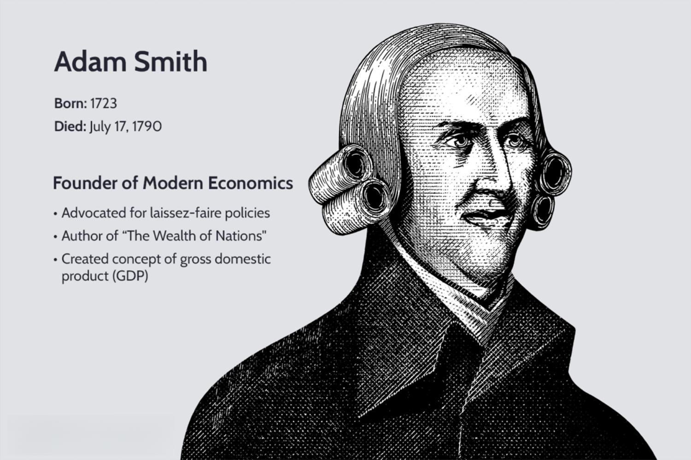

In the world of trading and finance, few names shine as brightly as George Hanley. He is known for his innovative contributions to the trading industry and his philanthropic endeavors. Hanley’s journey reflects resilience and impactful achievements in the dynamic field of algorithmic trading. This article examines the life of George Hanley, emphasizing his significant contributions to algo trading, entrepreneurial ventures, and dedication to education and philanthropy. By analyzing his career, readers can understand how Hanley has shaped modern trading practices and influenced future traders through his visionary approach and charitable efforts.

## Table of Contents

## Early Life and Education

George Hanley's trajectory in the financial world was sparked by familial influence and solidified through formal education. Growing up, Hanley was profoundly influenced by his father, who worked as a trader at the Chicago Board of Trade. This early exposure to the intricacies of trading markets fostered a keen interest in financial systems and investments.

Hanley pursued an academic path that would prepare him for a career in business and trading, enrolling in the University of Dayton. There, he studied business management, a discipline that offered him insights into organizational dynamics, financial principles, and strategic decision-making. The curriculum at the University laid a comprehensive foundation, equipping Hanley with both theoretical knowledge and practical skills essential for navigating the complex world of trading.

During his time in college, Hanley took his first steps into the trading domain. Engaging with trading activities while still a student not only provided him with hands-on experience but also ignited a passion that would define his professional journey. This combination of academic preparation and early practical exposure played a pivotal role in shaping Hanley's subsequent career, leading to his innovative contributions to the field of algorithmic trading and his successful ventures in the business world.

## Pioneering Algo Trading

In the early 2000s, George Hanley emerged as a pivotal figure in [algorithmic trading](/wiki/algorithmic-trading). This discipline leverages computer algorithms to facilitate the execution of trades, aiming to optimize speed and conditions. Hanley co-founded Infinium Capital Management in 2001, a key venture that underscored his commitment to integrating advanced technology within trading practices. Infinium Capital Management quickly became a trailblazer in using algorithms to accomplish high-frequency trades, reflecting Hanley's foresight in identifying the potential of computational methods to transform financial markets.

Algorithmic trading, at its core, involves creating complex algorithms and programs capable of making trading decisions in fractions of a second. For example, traders implement mathematical models to determine the optimal buy and sell points, based on historical and real-time data inputs. The introduction of such systems allows for executing trades at speeds unattainable by human traders. This is crucial in competitive markets where milliseconds can be determinative of profitability. Hanley's work in developing these systems paved the way for a new era of market transactions that prioritized efficiency and accuracy.

Through innovations at Infinium Capital Management, Hanley played a substantial role in advancing the sophistication of automated trading systems. These innovations included not only the speed of transactions but also strategies that enhanced decision-making processes. Techniques such as statistical [arbitrage](/wiki/arbitrage) and market sentiment analysis became feasible through algorithmic trading, enabling traders to handle extensive market data swiftly and derive actionable insights. This transformation underlined a significant shift in trading paradigms, illustrating an increased reliance on technology-driven strategies.

The ripple effect of Hanley's contributions can be observed in the subsequent proliferation of algorithmic trading across global markets. Many financial institutions and trading firms adopted similar technological frameworks, aspiring to replicate the success found through Hanley's methodologies. His pioneering efforts demonstrated the vital advantages of incorporating technology into trading, fostering a landscape where algorithmic trading is now a standard practice among industry professionals.

## Entrepreneurial Ventures

In 1986, George Hanley founded The Hanley Group, an organization that significantly impacted the futures market. Under his leadership, The Hanley Group was instrumental in enhancing the efficiency and [liquidity](/wiki/liquidity-risk-premium) of trading futures. This venture was pivotal in responding to the growing demands of the futures market, which required innovative approaches to trading and risk management for both individual and institutional traders.

In addition to The Hanley Group, Hanley's entrepreneurial spirit manifested in his co-founding of Blink Trading. Blink Trading emerged as a key player in the nascent field of electronic trading. The company's focus on speed and efficiency positioned it uniquely during a period when electronic trading platforms were gaining traction over traditional floor trading mechanisms. In 2002, Blink Trading was acquired by GETCO, one of the leading electronic trading firms worldwide, which underscored the strategic value and foresight embodied in Hanley’s venture.

Further showcasing his commitment to advancing trading technologies, Hanley founded Level 5 Trading. This endeavor cemented his reputation as a forward-thinking entrepreneur who not only recognized but also capitalized on the technological advancements within financial markets. Level 5 Trading represented the evolution of Hanley’s vision—to leverage algorithmic strategies and develop cutting-edge trading systems that could effectively navigate the complex and dynamic market conditions.

Together, these entrepreneurial ventures illustrate George Hanley's ability to identify and execute opportunities at the forefront of trading innovation, reinforcing his significant influence on modern trading methodologies. His ventures not only contributed to the development of trading technologies but also served as foundational steps for subsequent advancements in electronic and algorithmic trading.

## Philanthropy and Education

George Hanley is as devoted to philanthropy as he is to trading. His commitment to charitable endeavors is encapsulated in the Hanley Foundation, an organization he established to support a variety of educational initiatives. This foundation plays a significant role in developing academic programs by collaborating with institutions to create centers that focus on sustainability and trading.

One notable partnership is with the University of Dayton, where Hanley's contributions have had a transformative impact. Through his philanthropy, the university has been able to establish real-world trading centers, providing students with practical, hands-on experience in trading environments. These centers are equipped with modern tools and resources that mirror the facilities found in professional trading floors, thus bridging the gap between theoretical learning and practical application. This approach not only enhances the educational experience for students but also prepares them for successful careers in the financial sector.

The Hanley Foundation's work extends beyond mere financial backing, encouraging educational institutions to develop curricula that incorporate contemporary issues such as sustainability, thereby aligning academic pursuits with real-world challenges. By doing so, Hanley ensures that future generations are equipped with the knowledge and skills necessary to navigate and address these issues.

Overall, George Hanley's philanthropic efforts exemplify a commitment to education and the empowerment of future leaders in both trading and sustainability. His legacy in this domain is marked by a strategic vision that not only advances individual institutions but also enriches the broader educational landscape.

## Legacy in Trading

George Hanley has left a profound impact on the trading industry through his role as a mentor and leader. He is esteemed for providing guidance and resources to emerging traders, fostering a culture of support and development. His leadership style, noted for its humility and commitment to learning, has been particularly influential, inspiring many within the trading community to adopt similar values. 

Hanley's humility is reflected in his approach to mentorship, where he prioritizes listening and understanding, ensuring that his advice is both relevant and impactful. His commitment to continuous learning is evident in his openness to new ideas and technologies, which has encouraged those he mentored to remain adaptable and innovative. This ethos has contributed to his reputation as a forward-thinking leader who champions progress and growth in trading practices.

Even after stepping down from active trading, Hanley's influence in the industry persists. His contributions to the evolution of trading practices are seen in the widespread adoption of algorithmic trading techniques and the establishment of academic centers focused on trading and sustainability. These initiatives not only ensure the continued advancement of trading technologies but also prepare future generations of traders to navigate and innovate within an ever-changing financial landscape.

By emphasizing education and ethical trading practices, Hanley has ingrained a sense of responsibility and excellence in the industry, ensuring that his legacy endures in the principles and practices of future traders.

## Conclusion

George Hanley's life is a testament to innovation, resilience, and commitment to community development. His pioneering work in algorithmic trading has reshaped financial markets, driving them toward more efficient and technologically advanced operations. By co-founding Infinium Capital Management and The Hanley Group, Hanley set a precedent for what trading firms could achieve through strategic innovation and the incorporation of cutting-edge technologies.

Beyond his professional achievements, Hanley's dedication to philanthropy has created significant impacts in education and sustainability. His foundation actively supports educational initiatives, providing resources and opportunities for students keen on understanding the complexities of trading and finance. Through collaborations with universities and the funding of trading centers, Hanley has ensured that the next generation of traders is well-equipped with practical knowledge and insights into the financial industry.

As the trading sector continues to evolve, marked by rapid technological changes and the rise of new financial instruments, Hanley's legacy remains significant. His emphasis on mentorship, innovation, and giving back to the community serves as an inspirational model for both traders and philanthropists. The impact of his contributions will undoubtedly influence financial markets and educational landscapes for years to come, guiding aspiring individuals in their pursuit of excellence and social responsibility.

## References & Further Reading

[1]: ["Advances in Financial Machine Learning"](https://www.amazon.com/Advances-Financial-Machine-Learning-Marcos/dp/1119482089) by Marcos Lopez de Prado

[2]: ["Evidence-Based Technical Analysis: Applying the Scientific Method and Statistical Inference to Trading Signals"](https://books.google.com/books/about/Evidence_Based_Technical_Analysis.html?id=MeoJAQAAMAAJ) by David Aronson

[3]: ["Machine Learning for Algorithmic Trading"](https://github.com/stefan-jansen/machine-learning-for-trading) by Stefan Jansen

[4]: ["Quantitative Trading: How to Build Your Own Algorithmic Trading Business"](https://www.amazon.com/Quantitative-Trading-Build-Algorithmic-Business/dp/1119800064) by Ernest P. Chan

[5]: Aldridge, I. (2013). ["High-Frequency Trading: A Practical Guide to Algorithmic Strategies and Trading Systems."](https://onlinelibrary.wiley.com/doi/pdf/10.1002/9781119203803.fmatter) Wiley. 

[6]: "Introduction to High-Frequency Trading: Concepts and Execution" by Irene Aldridge - [Wiley Online Library](https://www.experience.molex.com/_v/pdf/link?TEXT=Trading+the+Measured+Move:+A+Path+to+Trading+Success+in+a+World+of+Algos+and+High+Frequency+Trading+(Wiley+Trading).pdf)