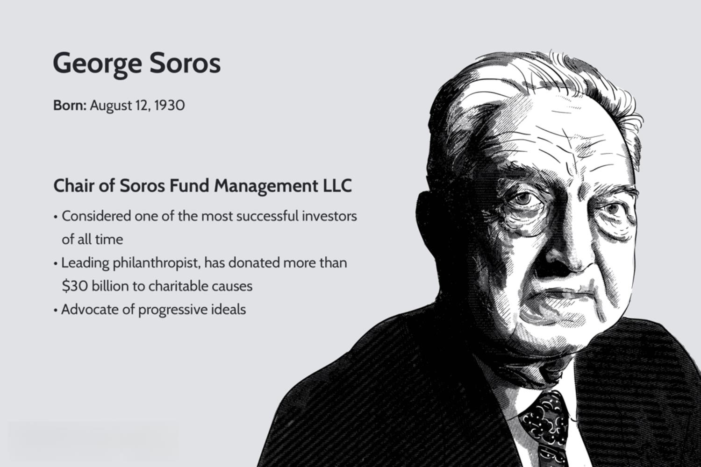

## Table of Contents

## Who is George Soros and what is his background in finance?

George Soros is a famous investor and businessman from Hungary. He was born in 1930 and moved to England when he was young. There, he studied at the London School of Economics. After finishing his studies, he started working in finance in London. Later, he moved to the United States and became very successful in the world of finance.

Soros is best known for starting the Quantum Fund with Jim Rogers in 1970. This fund made a lot of money and made Soros very rich. He became famous for making big bets on currencies. One of his most famous bets was against the British pound in 1992, which earned him over a billion dollars in one day. This made him known as "the man who broke the Bank of England." Soros has also written many books about finance and economics, and he is known for his ideas about how markets work.

## What is the basic concept behind George Soros' trading strategy?

George Soros' trading strategy is based on a concept he calls "reflexivity." This idea says that the beliefs and actions of people in the market can affect the prices of things, and those price changes can then change what people believe and do next. It's like a feedback loop. Soros uses this idea to look for times when the market's beliefs might be wrong or exaggerated, and he tries to make money by betting against those beliefs.

For example, if everyone thinks a currency will go up in value and they all start buying it, the price might go up a lot. But Soros might see that this belief is too strong and not based on real value. So, he might bet that the currency will go down instead. This is what he did with the British pound in 1992. He saw that the market's belief in the pound was too high, so he bet against it and made a lot of money when the pound fell.

## How does George Soros use reflexivity in his trading approach?

George Soros uses the idea of reflexivity to guide his trading decisions. Reflexivity means that what people think about the market can change the market, and then those changes can make people think differently. So, it's like a cycle. Soros looks for times when people's beliefs about the market are too strong or not based on reality. He thinks these beliefs can push prices up or down in ways that don't make sense. When he sees this happening, he tries to bet against what everyone else is doing.

For example, in 1992, Soros saw that everyone believed the British pound was strong. People were buying it, and the price was going up. But Soros thought this belief was wrong. He believed the pound was actually weaker than people thought. So, he bet against the pound, selling it short. When the pound did fall, Soros made a lot of money because he went against what everyone else was doing. This is how reflexivity helps him find opportunities to make big profits by going against the crowd.

## What role do macroeconomic factors play in Soros' trading decisions?

George Soros pays a lot of attention to big economic factors when he makes his trading decisions. He looks at things like how strong a country's economy is, what the government is doing with money and taxes, and how other countries are doing. These big economic factors can change how people think about money and markets. Soros tries to understand these factors to see if people's beliefs about the market are right or wrong.

For example, if a country's economy is not doing well but people still think it is strong, Soros might bet that the country's money will go down in value. He did this with the British pound in 1992. He saw that the UK's economy was weaker than people thought, so he bet against the pound. When the pound fell, he made a lot of money. So, understanding big economic factors helps Soros find times when the market's beliefs might be wrong, and he uses this to make his trading decisions.

## Can you explain the 'Quantum Fund' and its significance in Soros' trading career?

The Quantum Fund is a big part of George Soros' success in trading. He started it in 1970 with Jim Rogers. The fund is known for making a lot of money by betting on different things, like currencies and stocks. It uses a lot of borrowed money to make these bets bigger, which can lead to big wins but also big risks. The Quantum Fund became very famous because it made so much money, especially from big bets like the one against the British pound in 1992.

This fund was very important for Soros because it showed the world how good he was at trading. It helped him become one of the richest people in the world and made him famous as a smart investor. The success of the Quantum Fund also let Soros try out his ideas about reflexivity and how markets work. This made him not just a trader, but also someone who changed how people think about finance.

## What was the famous trade George Soros made against the British pound in 1992?

In 1992, George Soros made a famous bet against the British pound. He believed that the pound was too strong and that the UK's economy was not doing well. So, he sold a lot of pounds, betting that the price would go down. This was called a short sale. When the pound did fall, Soros made over a billion dollars in one day. This trade made him known as "the man who broke the Bank of England."

The trade was important because it showed how Soros used his ideas about the market. He saw that people thought the pound was strong, but he believed it was weak. By betting against the pound, he went against what everyone else was doing. This trade made him a lot of money and showed the world how smart he was at trading. It also helped make the Quantum Fund famous, which he used to make many more big bets.

## How does Soros manage risk and leverage in his trading strategy?

George Soros manages risk and uses leverage in a very smart way. He knows that trading can be risky, so he tries to understand the big picture of the market. He looks at things like how strong an economy is and what people believe about it. If he thinks those beliefs are wrong, he might make a big bet against what everyone else is doing. This is risky, but Soros tries to make it less risky by understanding the market very well. He doesn't just guess; he uses a lot of information to make his decisions.

Soros also uses leverage, which means he borrows money to make his bets bigger. This can make him a lot of money if he's right, but it can also lose him a lot if he's wrong. To manage this, Soros makes sure his bets are based on solid ideas and not just feelings. He tries to keep his risks under control by not betting too much on one thing. Even with big bets like the one against the British pound, he uses his knowledge and understanding of the market to make smart choices.

## What are some key principles Soros follows when entering and exiting trades?

George Soros follows some important principles when he decides to enter and [exit](/wiki/exit-strategy) trades. One big principle is that he looks at the big picture of the market. He tries to understand what's happening in the economy and what people believe about it. If he thinks those beliefs are wrong, he might enter a trade that goes against what everyone else is doing. For example, if everyone thinks a currency is strong but Soros thinks it's weak, he might sell that currency. He uses a lot of information to make these decisions, not just guesses.

Another principle is that Soros is careful about when to exit a trade. He knows that markets can change quickly, so he watches his trades closely. If he sees that the market is moving in a way he didn't expect, he might decide to get out of the trade to avoid losing too much money. He also uses stop-loss orders, which are like safety nets that automatically sell his investment if it goes down too much. This helps him manage risk and protect his money.

## How has George Soros' strategy evolved over the years in response to changing market conditions?

Over the years, George Soros has changed his trading strategy to keep up with the changing markets. In the beginning, he focused a lot on currencies and used big bets to make money. He became famous for trades like the one against the British pound in 1992. But as markets changed, Soros started looking at other things too, like stocks and commodities. He also paid more attention to how technology and global events were affecting the markets. By adapting his strategy, Soros was able to keep making money even as the world changed around him.

Soros also became more careful about managing risk as he got older. He used to take very big risks, but he learned that markets can be unpredictable. So, he started using more tools to protect his money, like stop-loss orders and diversifying his investments. He also began to focus more on understanding the big economic trends that could affect his trades. By staying flexible and learning from his experiences, Soros was able to keep his trading strategy strong even as the markets kept changing.

## What are some criticisms or controversies surrounding Soros' trading methods?

Some people don't like George Soros' way of trading because they think it's too risky. Soros uses a lot of borrowed money to make his bets bigger. This can make him a lot of money if he's right, but it can also lose him a lot if he's wrong. Critics say this kind of trading can make markets go up and down a lot, which can be bad for other people who are trying to invest their money safely. They also think that Soros' big bets can hurt countries' economies, like what happened with the British pound in 1992.

Another criticism is that Soros' ideas about how markets work, like reflexivity, are hard to prove. Some people think his theories are more like guesses than real science. They say that it's hard to know if Soros is just lucky or if he really understands the market better than others. Also, Soros has been involved in some political controversies because of his donations to different causes. Some people think he uses his money to influence politics, which they don't like.

## How can individual traders apply elements of George Soros' strategy to their own trading?

Individual traders can learn from George Soros by paying attention to the big picture of the market. Soros looks at things like how strong an economy is and what people believe about it. If you think those beliefs are wrong, you might want to make a trade that goes against what everyone else is doing. For example, if everyone thinks a stock will go up but you think it's too high, you might sell that stock. To do this, you need to do a lot of research and understand the market well. Don't just guess; use information to make smart choices.

Another thing individual traders can do is be careful about managing risk. Soros uses tools like stop-loss orders to protect his money. These orders automatically sell your investment if it goes down too much, which can help you avoid losing a lot. You should also think about not putting all your money into one trade. Spread your money around different investments to be safer. By understanding the market and managing risk well, you can try to make smart trades like Soros does.

## What advanced techniques does Soros use that might be challenging for novice traders to implement?

George Soros uses some advanced techniques that can be hard for new traders to use. One big thing he does is use a lot of borrowed money to make his bets bigger. This is called leverage. Leverage can make you a lot of money if you're right, but it can also make you lose a lot if you're wrong. It takes a lot of experience to know how much leverage to use without taking too much risk. New traders might find it hard to manage this kind of risk because they don't have the same level of experience and understanding of the market.

Another advanced thing Soros does is make big bets on things like currencies and global economic trends. He looks at the big picture of the economy and tries to understand what's going on. This takes a lot of research and understanding of how different parts of the economy work together. It's not easy for new traders to do this because it requires a lot of time and knowledge. Also, Soros uses his theory of reflexivity, which says that what people think about the market can change the market. This is a complex idea that can be hard for new traders to understand and use in their trading.

## References & Further Reading

[1]: ["Soros: The Unauthorized Biography, the Life, Times and Trading Secrets of the World's Greatest Investor"](https://www.amazon.com/SOROS-Unauthorized-Biography-Greatest-Investor/dp/0786312475) by Robert Slater

[2]: ["The Alchemy of Finance: Reading the Mind of the Market"](https://www.wiley.com/en-us/The+Alchemy+of+Finance%3A+Reading+the+Mind+of+the+Market-p-9780471043133) by George Soros

[3]: ["Reflexivity in the Stock Market"](https://www.investopedia.com/terms/r/reflexivity.asp) by George Soros

[4]: ["Dynamic Hedging: Managing Vanilla and Exotic Options"](https://www.amazon.com/Dynamic-Hedging-Managing-Vanilla-Options/dp/0471152803) by Nassim Nicholas Taleb

[5]: MacKenzie, D. (2006). ["An Engine, Not a Camera: How Financial Models Shape Markets."](https://academic.oup.com/mit-press-scholarship-online/book/20588) The MIT Press.

[6]: ["The Man Who Broke the Bank of England: How George Soros Singlehandedly Engaged and Triumphed Over the British Financial Establishment"](https://www.amazon.com/Who-Broke-Bank-England-Singlehandedly/dp/1539835719) by Bruce Johnson

[7]: ["Adaptive Markets: Financial Evolution at the Speed of Thought"](https://www.jstor.org/stable/j.ctvc7778k) by Andrew W. Lo