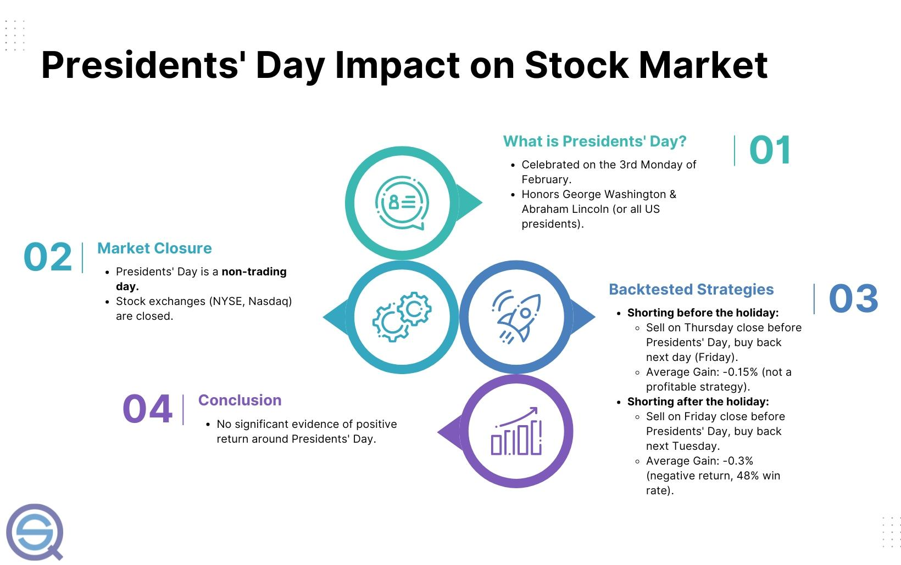

Presidents' Day, commemorated in the United States on the third Monday of February, carries significance that transcends its historical context. While primarily meant to honor the legacies of past U.S. presidents, such as George Washington and Abraham Lincoln, this federal holiday also influences the financial landscape, particularly affecting stock market operations. Notably, U.S. financial markets, including the New York Stock Exchange (NYSE) and Nasdaq, remain closed on Presidents' Day. This cessation of trading activities presents a unique scenario worth exploring, especially concerning trading strategies like algorithmic trading.

Algorithmic trading, characterized by its use of computer programs to execute trades based on pre-established criteria and algorithms, is an area where the impact of Presidents' Day could be particularly interesting. This section addresses whether this holiday can create notable patterns or strategies that traders might exploit. Additionally, we will evaluate how algorithmic trading might adjust to such calendar events to optimize performance.



Understanding how Presidents' Day might affect trading dynamics involves examining whether any historical market effects exist around this holiday. Could such a pause in trading lead to shifts that traders might anticipate or capitalize on once markets reopen? The primary consideration lies in identifying whether this break results in any repeatable market phenomena that could be integrated into algorithmic trading models.

As we probe into these dynamics, one essential inquiry is whether recognizable trading patterns exist during this period and how adaptive strategies can be formulated within algorithmic trading frameworks. This involves scrutinizing historical data for any elusive edge around Presidents' Day and understanding how automated systems can potentially adapt or refine themselves in response to such calendar-based market closures. By doing so, traders can better strategize for similar holidays and enhance their algorithmic trading to remain agile and informed.

## Table of Contents

## Understanding Presidents' Day and Its Market Impact

Presidents' Day, observed on the third Monday of February, is a federal holiday in the United States that honors the birthdays of George Washington and Abraham Lincoln, as well as other U.S. presidents. This holiday, originally established in 1885 in recognition of President George Washington's birthday, has evolved to be a day that celebrates the legacy and leadership of all American presidents. On this day, U.S. financial markets, including the New York Stock Exchange (NYSE) and Nasdaq, are closed, allowing traders and investors a pause from their activities.

The closure of the markets on Presidents' Day provides an opportunity to examine historical market data around this period. Such analysis aims to reveal any trading patterns or anomalies that may be present. One approach to understand potential market behavior around Presidents' Day is through the technique of backtesting. Backtesting involves simulating a trading strategy using historical data to evaluate its potential effectiveness. Specifically, traders might investigate whether trading strategies focused on the days immediately preceding or following the holiday exhibit any consistent and exploitable patterns.

However, historical data analysis around Presidents' Day trading has consistently shown random results. This suggests there is no discernible advantage or pattern that could be utilized in trading strategies around this holiday. This randomness in outcomes underscores the broader finding that Presidents' Day does not have a significant systemic effect on market behavior or trading success. Consequently, strategies tailored specifically for this holiday often lack the predictive power traders seek to gain an edge.

In summary, while Presidents' Day is significant from a cultural and historical perspective, its impact on market dynamics remains minimal. For traders and algorithmic models, the absence of clear trading advantages around this holiday implies that other factors such as broader economic indicators or company-specific developments may be more critical to consider.

## Algorithmic Trading: A Brief Overview

Algorithmic trading involves utilizing computer algorithms to automate the trading process, executing trades based on predefined criteria without continuous human intervention. The fundamental advantage of this technology is its ability to process vast quantities of financial data rapidly, allowing traders to make informed decisions and execute trades at speeds unattainable by humans. This capability is essential in high-frequency trading environments where milliseconds can influence profitability.

Algorithmic trading typically employs strategies like trend-following or mean reversion. Trend-following strategies identify and exploit upward or downward market trends, while mean-reversion strategies assume that prices will revert to their historical average over time. Both strategies benefit from the objectivity and precision of algorithms, which minimize the impact of emotional biases on trading decisions.

The primary benefits of [algorithmic trading](/wiki/algorithmic-trading) include improved accuracy, where trades are executed precisely as the algorithm stipulates; better execution rates, as trades can be executed at optimal prices by continuously scanning multiple markets; and reduced transaction costs, achieved by minimizing the market impact of large trades. These characteristics have rendered algorithmic trading an essential tool for modern traders, enhancing their ability to compete effectively in today's fast-paced financial markets. Furthermore, the use of algorithmic trading supports enhanced risk management capabilities by allowing for real-time monitoring and adjustment of trading conditions based on market dynamics.

## The Role of Seasonality in Algo Trading

Seasonality in financial markets refers to recurrent patterns or trends that emerge at specific periods within the calendar year. These patterns can arise due to various influences such as fiscal year-end activities, tax considerations, and recurring economic cycles. Seasonality can significantly affect market prices and trading volumes, providing an opportunity for traders to anticipate and benefit from expected market movements. 

In algorithmic trading, incorporating seasonal patterns into trading algorithms can enhance trading performance. Traders often seek to capitalize on predictable price changes by analyzing historical data to identify consistent patterns that occur during specific times of the year. This analysis might involve calculating averages or employing statistical methods to identify trends within the data.

While Presidents' Day itself does not exhibit a consistent pattern or confer specific trading benefits, analyzing broader seasonal trends remains a cornerstone of strategic development for many algorithmic traders. For instance, by [backtesting](/wiki/backtesting) strategies around different holidays or times of the year, traders can evaluate the impact of seasonality on their portfolios.

Algorithmic strategies often attempt to exploit the predictability of seasonal effects. These strategies might analyze average returns around holiday periods to gauge potential advantages. For instance, a simple algorithm could be designed to calculate the average return for specific time frames, such as $k$ days before and after a holiday. If a pattern is detected, the algorithm could adjust position sizing or entry and [exit](/wiki/exit-strategy) points accordingly.

In Python, a basic implementation to test seasonal patterns might look like this:

```python
import pandas as pd
import numpy as np

# Example function to analyze returns around a holiday
def calculate_average_return(data, holiday_date, k=5):
    """
    Calculate average returns k days before and after a holiday.

    :param data: Pandas DataFrame containing 'Date' and 'Returns'.
    :param holiday_date: The holiday date to analyze (datetime).
    :param k: Number of days before and after to consider.
    :return: Tuple containing average returns before and after the holiday.
    """
    holiday_idx = data.index.get_loc(holiday_date)
    before_returns = data['Returns'].iloc[max(0, holiday_idx-k):holiday_idx].mean()
    after_returns = data['Returns'].iloc[holiday_idx+1:min(len(data), holiday_idx+k+1)].mean()
    return before_returns, after_returns

# Example DataFrame with mock returns data
data = pd.DataFrame({
    'Date': pd.date_range(start='2023-02-10', periods=20, freq='D'),
    'Returns': np.random.normal(loc=0.01, scale=0.02, size=20)
})
data.set_index('Date', inplace=True)

# Date of Presidents' Day for analysis
holiday_date = pd.to_datetime('2023-02-20')

# Calculate average returns
average_before, average_after = calculate_average_return(data, holiday_date)

print(f"Average return before: {average_before}")
print(f"Average return after: {average_after}")
```

This simple approach allows traders to systematically evaluate seasonal patterns around specific times, forming the basis for more sophisticated modeling and strategy refinement. However, the effectiveness of incorporating seasonality in trading strategies depends on the consistency and predictability of the identified patterns. Presidents' Day, due to its variability and market closure, does not offer a straightforward seasonal advantage, but the broader consideration of seasonality remains valuable in a trader’s arsenal.

## Backtesting and Strategy Development Around Presidents' Day

Backtesting is a crucial process in the development of any trading strategy, including those related to Presidents' Day. It involves simulating the performance of a trading algorithm using historical market data to assess its potential effectiveness. For algo traders, backtesting is a vital step in understanding how a strategy might perform and in identifying areas for improvement.

Initial backtests focused on Presidents' Day, specifically assessing trading strategies that operate immediately before and after the holiday, reveal that this period does not offer the significant gains seen with other holidays like Thanksgiving or Christmas. The absence of substantial market activity around Presidents' Day contributes to the negligible difference in trading outcomes, as U.S. financial markets, including the New York Stock Exchange (NYSE) and the Nasdaq, are closed. Consequently, algorithmic strategies targeting this specific early-year holiday have not demonstrated a distinct trading edge.

However, the lack of a distinguishable Presidents' Day effect should not deter further testing. Exploring alternative algorithms during this time can help traders refine their strategies. For instance, traders can modify parameters and test different assumptions, potentially uncovering hidden opportunities within broader market trends. This iterative process is indispensable for enhancing the robustness of trading models.

Algorithmic traders must thus continuously adjust their strategies in response to new data insights and changing market conditions. Incorporating a diverse set of rules helps in adjusting to various market anomalies and minimizing risk. Strategies involving calculations of average returns, [volatility](/wiki/volatility-trading-strategies) analysis, or [liquidity](/wiki/liquidity-risk-premium) conditions around the holiday period, even in the absence of predictable patterns, can yield useful insights into market behavior.

Overall, it is imperative for traders to embrace a systematic approach to strategy development, using backtesting to validate hypothetical models and to ensure strategies are adaptable to varied market conditions, including those surrounding Presidents' Day. In Python, tools such as pandas for data manipulation, [backtrader](/wiki/backtrader) for backtesting, and NumPy for numerical calculations, are commonly employed in these tasks. For example, a basic backtesting script might look like this:

```python
import backtrader as bt

class SimpleStrategy(bt.Strategy):
    def __init__(self):
        self.sma = bt.indicators.SimpleMovingAverage(self.data.close, period=10)

    def next(self):
        if self.data.close[-1] < self.sma[0] and not self.position:
            self.buy(size=10)
        elif self.data.close[-1] > self.sma[0] and self.position:
            self.sell(size=10)

cerebro = bt.Cerebro()
cerebro.addstrategy(SimpleStrategy)
data = bt.feeds.YahooFinanceData(dataname='AAPL', fromdate=datetime(2022, 1, 1), todate=datetime(2023, 1, 1))
cerebro.adddata(data)
cerebro.run()
```
Such tools enable traders to devise complex strategies and test various scenarios, enhancing their ability to make informed decisions regardless of specific holiday effects.

## Conclusion

Presidents' Day holds historical importance in the United States, but its effect on stock market activity is minimal due to market closure. For algorithmic traders, it is essential to recognize public holidays like Presidents' Day for effective operational and risk management. However, they should not anticipate distinct trading advantages during this period. The absence of trading on such holidays means there are no direct opportunities arising specifically because of the Presidents' Day event itself.

Instead of focusing solely on this holiday, traders should develop a comprehensive set of strategies that take into account various factors, including seasonal patterns, economic indicators, and market sentiment. Seasonality, while occasionally offering insights, should not be the only consideration in trading strategies. By adopting a more holistic approach that encompasses a range of variables, traders can better position themselves for consistent success.

A successful algorithmic trading strategy relies heavily on continuous evaluation, backtesting, and adaptation. Traders should regularly test their algorithms against historical market data to identify potential improvements or necessary changes to their strategies. For instance, a Python backtesting framework, such as the one using pandas, can be employed:

```python
import pandas as pd

def backtest_strategy(data, strategy_function):
    data['Signal'] = strategy_function(data)
    data['Returns'] = data['Signal'].shift(1) * data['Close'].pct_change()
    cumulative_returns = (1 + data['Returns']).cumprod() - 1
    return cumulative_returns.iloc[-1]

# Example of a simple strategy function
def example_strategy(data):
    return (data['Close'] > data['Close'].rolling(window=20).mean()) * 1

# Sample dataframe `df` with datetime index and 'Close' price series
result = backtest_strategy(df, example_strategy)
```

By refining their algorithms and incorporating lessons learned from backtests, traders can enhance their trading models' robustness and effectiveness, ensuring they remain adaptable to ever-evolving market conditions. In conclusion, while Presidents' Day itself does not significantly affect trading activities, recognizing its relevance as part of a broader strategic approach remains beneficial for algorithmic traders.

## References & Further Reading

[1]: ["Advances in Financial Machine Learning"](https://www.amazon.com/Advances-Financial-Machine-Learning-Marcos/dp/1119482089) by Marcos Lopez de Prado

[2]: ["Evidence-Based Technical Analysis: Applying the Scientific Method and Statistical Inference to Trading Signals"](https://www.amazon.com/Evidence-Based-Technical-Analysis-Scientific-Statistical/dp/0470008741) by David Aronson

[3]: ["Machine Learning for Algorithmic Trading"](https://github.com/stefan-jansen/machine-learning-for-trading) by Stefan Jansen

[4]: ["Quantitative Trading: How to Build Your Own Algorithmic Trading Business"](https://books.google.com/books/about/Quantitative_Trading.html?id=j70yEAAAQBAJ) by Ernest P. Chan

[5]: ["Backtesting Strategies with Python: Successful Stock Trading"](https://www.quantifiedstrategies.com/python-trading-strategy/) by Yong Liu