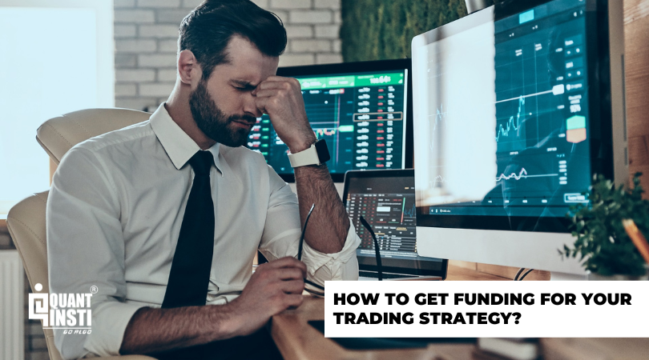

## Table of Contents

## What is trading strategy funding and why is it important?

Trading strategy funding is when people or companies give money to traders or trading firms so they can use specific trading strategies. This money helps traders to buy and sell things like stocks, currencies, or commodities, following a set plan to try to make a profit. It's like giving someone the tools they need to do their job well.

Funding is important because it lets traders try out new ideas and strategies without using their own money. This can lead to finding better ways to make money in the markets. Also, having enough money to trade means traders can take bigger positions, which might lead to bigger profits. Without funding, traders might not be able to fully test their strategies or grow their trading business.

## How can beginners start seeking funding for their trading strategies?

Beginners can start seeking funding for their trading strategies by first developing a clear and well-documented trading plan. This plan should outline the strategy, the markets they plan to trade, the expected returns, and the risk management techniques they will use. It's important for beginners to have a track record, even if it's just from a demo account, to show potential funders that their strategy works. They can also join trading communities or online forums where they can share their ideas and get feedback, which can help improve their strategy and make it more attractive to investors.

Once they have a solid plan and some results to show, beginners can look for funding opportunities. They might start by approaching friends and family who believe in their abilities and are willing to invest. Another option is to look for trading contests or platforms that offer funding in exchange for a share of the profits. Some companies specialize in funding traders and will provide capital if the trader meets certain performance criteria. It's important for beginners to carefully read the terms and conditions of any funding they receive, as they may need to share profits or meet specific performance goals to keep the funding.

## What are the common sources of funding for trading strategies?

One common source of funding for trading strategies is from friends and family. If you have a good trading plan and can show that your strategy works, people close to you might be willing to give you money to trade. They trust you and believe in your skills. This can be a good way to start, but it's important to be clear about how you will share any profits and what will happen if you lose money.

Another source is trading contests and platforms that offer funding. Some websites run competitions where traders can win money to use in their trading. Others will give you money to trade if you agree to share your profits with them. These platforms often have strict rules about how much money you can lose and how well you need to do to keep the funding. It's a good way to get started without using your own money, but you need to read the rules carefully.

Lastly, there are companies that specialize in funding traders. These firms will give you money to trade if you can show that you have a good strategy and can manage risk well. They might ask for a cut of your profits, but they can provide a lot of capital to help you grow your trading. It's important to do your research and choose a reputable firm that has a good track record of supporting traders.

## What criteria do funders typically look for in a trading strategy?

Funders usually look for a few key things in a trading strategy. First, they want to see that the strategy has been tested and works well. This means having a good track record, even if it's just from a demo account. They also want to see that the strategy makes sense and fits with the market you are trading in. A clear plan that explains what you will do and why is very important.

Another thing funders care about is how you manage risk. They want to know that you won't lose all their money quickly. So, they look for good risk management rules, like setting stop-losses and not putting all your money into one trade. They also want to see that you can handle losing trades without getting too upset or making bad decisions. A strategy that balances risk and reward well is more likely to get funding.

Lastly, funders want to see that you are serious and committed to trading. This means being organized, keeping good records, and showing that you are always learning and improving. They also want to know that you will stick to your plan and not change it all the time. A trader who shows discipline and a strong work ethic is more likely to get the funding they need.

## How can you prepare a compelling pitch for your trading strategy?

To prepare a compelling pitch for your trading strategy, start by clearly explaining your strategy in simple terms. Talk about what you will trade, how you will make decisions, and why you think your strategy will work. Use examples or stories to make it easy to understand. It's important to show that you have tested your strategy and have some results to back it up. Even if you only used a demo account, showing a track record can help build trust.

Next, focus on how you will manage risk. Explain the rules you will follow to protect the money you are given. This could be setting stop-losses, not risking too much on any single trade, and having a plan for when things go wrong. Funders want to know that you won't lose all their money quickly. Also, talk about your goals and what you hope to achieve with their funding. Show that you are serious about trading and committed to sticking to your plan. A clear, honest pitch that shows you understand the markets and can manage risk well is more likely to get you the funding you need.

## What are the differences between funding options for retail and institutional traders?

Retail traders usually have fewer and smaller funding options compared to institutional traders. For retail traders, common sources of funding include friends and family, trading contests, and platforms that offer funding in exchange for a share of the profits. These options often come with strict rules and smaller amounts of money. Retail traders might also use their own savings or take out personal loans, but these can be risky if the trading doesn't go well. The key for retail traders is to show a solid trading plan and some proof that their strategy works, even if it's just from a demo account.

Institutional traders, on the other hand, have access to much larger and more diverse funding options. They can get money from big investors like hedge funds, banks, and other financial institutions. These investors are looking for traders who can handle large amounts of money and have a proven track record of success. Institutional traders often have to meet strict performance goals and follow detailed risk management rules. The funding they receive can be in the millions or even billions of dollars, which allows them to take bigger positions and potentially make bigger profits.

## How do you assess the risks associated with your trading strategy when seeking funding?

When seeking funding for your trading strategy, it's important to show how you assess the risks involved. Start by explaining how you understand the markets you trade in and what can go wrong. This includes knowing about things like market volatility, economic news, and how other traders might act. You should also talk about the specific risks of your strategy, like how often you might lose money and how big those losses could be. It's good to use numbers or examples to show this, like saying you expect to lose money on 40% of your trades but your average loss will be small.

Next, explain the steps you take to manage these risks. This means talking about your risk management rules, like setting stop-losses to limit how much you can lose on each trade. You should also mention how you spread out your money across different trades to avoid losing everything at once. It's important to show that you have a plan for when things go wrong, like having enough money saved up to keep trading even after a few losses. By clearly explaining these risks and how you handle them, you can make funders feel more confident in your strategy.

## What are the legal and regulatory considerations when seeking funding for trading?

When seeking funding for trading, it's important to know about the legal and regulatory rules that apply. Different countries have different rules about who can give money to traders and how they can do it. For example, in some places, you need a special license to take money from investors. You also need to be honest and clear about what you plan to do with the money and how you will share any profits or losses. If you don't follow these rules, you could get in trouble with the law, like getting fines or even going to jail.

Another thing to think about is the paperwork and agreements you need. When you take money from someone, you usually need to sign a contract that says what you will do with the money and how you will report back to them. This contract can also say how much of the profits you will share with them and what happens if you lose money. It's a good idea to have a lawyer look over these agreements to make sure they are fair and follow the law. By understanding and following these legal and regulatory rules, you can avoid problems and build trust with your funders.

## How can advanced traders leverage their track record to attract funding?

Advanced traders can use their track record to attract funding by showing a history of successful trades. They should put together a clear report that shows how much money they made, how often they traded, and how well they managed risk. This report can include things like their win rate, average profit per trade, and how they handled losing streaks. By sharing this information, advanced traders can prove to potential funders that they know what they are doing and can make money in the markets. They can also talk about specific trades that worked well and explain why their strategy is good.

Another way advanced traders can use their track record is by getting endorsements or testimonials from other traders or investors they have worked with before. If someone else can say good things about their trading skills, it can make funders feel more confident. Advanced traders can also join trading communities or forums where they can share their results and get feedback. This not only helps them improve but also shows that they are serious about their trading and willing to learn. By using their track record in these ways, advanced traders can make a strong case for why they should get funding.

## What role does technology and data analytics play in securing funding for trading strategies?

Technology and data analytics are really important when you want to get money for your trading strategy. Traders can use special computer programs and data tools to study the markets and find good trading chances. These tools help them test their trading ideas before they use real money. By showing funders that they use technology to make smart choices, traders can make their pitch stronger. They can also use data to show how well their strategy has worked in the past, which makes funders feel more sure about giving them money.

Also, technology helps traders keep track of their trades and manage their risks better. They can use software to set up rules that stop them from losing too much money on one trade. This is something funders really care about because they don't want to lose all their money quickly. By using technology and data to show that they can handle risks well and make good trading decisions, traders can make a strong case for why they should get funding.

## How can you negotiate the best terms when securing funding for your trading strategy?

When you want to get the best terms for funding your trading strategy, start by knowing what you want and what you can offer. Think about how much money you need, how long you need it for, and what you are willing to give in return, like a share of your profits. It's good to have a clear idea of what is fair and what you can live with. When you talk to funders, be ready to explain why your strategy is good and why they should trust you with their money. Show them your track record and how you manage risk. This can help you get better terms because they will see that you know what you are doing.

Next, be ready to talk and listen. Funders might have their own ideas about what they want, so be open to finding a middle ground. If they want a bigger share of the profits than you planned, you could offer to give them more updates on your trading or agree to certain performance goals. It's important to keep the conversation friendly and respectful. If you can't agree on everything, try to focus on the most important things for you. By being clear about what you want and being willing to work together, you can often get better terms for your funding.

## What are the emerging trends in trading strategy funding for expert traders?

One big trend in trading strategy funding for expert traders is the use of technology and data analytics. More and more, traders are using computer programs and data tools to study the markets and find good trading chances. This helps them test their ideas before using real money. By showing funders that they use technology to make smart choices, expert traders can get better funding deals. They can also use data to show how well their strategy has worked in the past, which makes funders feel more sure about giving them money.

Another trend is the rise of specialized funding platforms and trading contests. These platforms offer money to expert traders in exchange for a share of the profits. They often have strict rules about how much money can be lost and what performance goals need to be met. Trading contests are also popular, where traders can win money to use in their trading. These trends give expert traders more options to get the funding they need, but they need to be careful to read the rules and understand what they are agreeing to.

## How can you evaluate your trading strategy?

Evaluating your trading strategy is a critical step in securing funding for algorithmic trading. A thorough assessment using key performance metrics can determine the robustness and potential of your trading strategy, making it more attractive to investors and funders.

Understanding and optimizing several key performance metrics can offer valuable insights into the strengths and weaknesses of your trading strategy. These metrics are essential for convincing potential funders of the viability and profitability of your approach.

### Maximum Drawdown

Maximum drawdown (MDD) is a metric that represents the maximum observed loss from a peak to a trough of a portfolio, before a new peak is achieved. It is an indicator of downside risk over a specified time period.

$$
\text{MDD} = \frac{\text{Trough Value} - \text{Peak Value}}{\text{Peak Value}} \times 100\%
$$

A lower drawdown indicates a more stable performance, which is preferable to investors looking for consistent returns with minimal risk.

### Volatility

Volatility measures the degree of variation of a trading strategy over time, providing insight into the risk associated with the strategy. High [volatility](/wiki/volatility-trading-strategies) suggests a higher risk, where returns can vary dramatically.

Volatility is often calculated as the standard deviation of the returns:

$$
\sigma = \sqrt{\frac{1}{N-1} \sum_{i=1}^{N} (R_i - \overline{R})^2}
$$

Where $R_i$ is the return and $\overline{R}$ is the average return over $N$ periods.

### Sharpe Ratio

The Sharpe ratio is used to understand the return of an investment compared to its risk. The higher the Sharpe ratio, the better the investment's returns have been relative to the amount of risk taken.

$$
\text{Sharpe Ratio} = \frac{\overline{R} - R_f}{\sigma}
$$

Where $\overline{R}$ is the average return, $R_f$ is the risk-free rate, and $\sigma$ is the standard deviation of the return. This metric is crucial in demonstrating the superiority of a trading strategy based on risk-adjusted returns.

### Sortino Ratio

The Sortino ratio differentiates downside volatility from overall volatility, focusing on negative deviations. It is considered a better measure of risk-adjusted return than the Sharpe ratio in cases where only downside risk is of concern.

$$
\text{Sortino Ratio} = \frac{\overline{R} - R_f}{\text{Downside Deviation}}
$$

The downside deviation only considers periods with returns below the target or minimum acceptable return.

### Presenting a Comprehensive Analysis

A comprehensive analysis of your strategy's historical performance should be presented to potential funders. This includes [backtesting](/wiki/backtesting) results, forward testing results, and statistical analysis using the above metrics. It is essential to provide a detailed evaluation demonstrating the strategy's consistency and adaptability in various market conditions.

Here is a simple Python example to calculate these metrics:

```python
import numpy as np

def calculate_metrics(returns, risk_free_rate=0.01):
    # Calculate average return
    avg_return = np.mean(returns)

    # Calculate volatility (standard deviation)
    volatility = np.std(returns)

    # Calculate Sharpe Ratio
    sharpe_ratio = (avg_return - risk_free_rate) / volatility

    # Calculate maximum drawdown
    peak = np.maximum.accumulate(returns)
    drawdown = (returns - peak) / peak
    max_drawdown = np.min(drawdown)

    # Calculate downside deviation
    downside_deviation = np.std([min(0, r - risk_free_rate) for r in returns])

    # Calculate Sortino Ratio
    sortino_ratio = (avg_return - risk_free_rate) / downside_deviation

    return {
        "Average Return": avg_return,
        "Volatility": volatility,
        "Sharpe Ratio": sharpe_ratio,
        "Maximum Drawdown": max_drawdown,
        "Sortino Ratio": sortino_ratio
    }

# Example usage
returns = np.array([0.01, 0.02, -0.01, 0.005, 0.015, -0.02, 0.03])
metrics = calculate_metrics(returns)
print(metrics)
```

Presenting a strategy's historical performance using these metrics offers a clear and quantifiable measure of its capability, making it easier for potential investors to understand the potential risks and rewards of funding your trading strategy.

## References & Further Reading

[1]: Bergstra, J., Bardenet, R., Bengio, Y., & Kégl, B. (2011). ["Algorithms for Hyper-Parameter Optimization."](https://papers.nips.cc/paper/4443-algorithms-for-hyper-parameter-optimization) Advances in Neural Information Processing Systems 24.

[2]: ["Advances in Financial Machine Learning"](https://www.amazon.com/Advances-Financial-Machine-Learning-Marcos/dp/1119482089) by Marcos Lopez de Prado

[3]: ["Evidence-Based Technical Analysis: Applying the Scientific Method and Statistical Inference to Trading Signals"](https://www.amazon.com/Evidence-Based-Technical-Analysis-Scientific-Statistical/dp/0470008741) by David Aronson

[4]: ["Machine Learning for Algorithmic Trading"](https://github.com/PacktPublishing/Machine-Learning-for-Algorithmic-Trading-Second-Edition) by Stefan Jansen

[5]: ["Quantitative Trading: How to Build Your Own Algorithmic Trading Business"](https://books.google.com/books/about/Quantitative_Trading.html?id=j70yEAAAQBAJ) by Ernest P. Chan