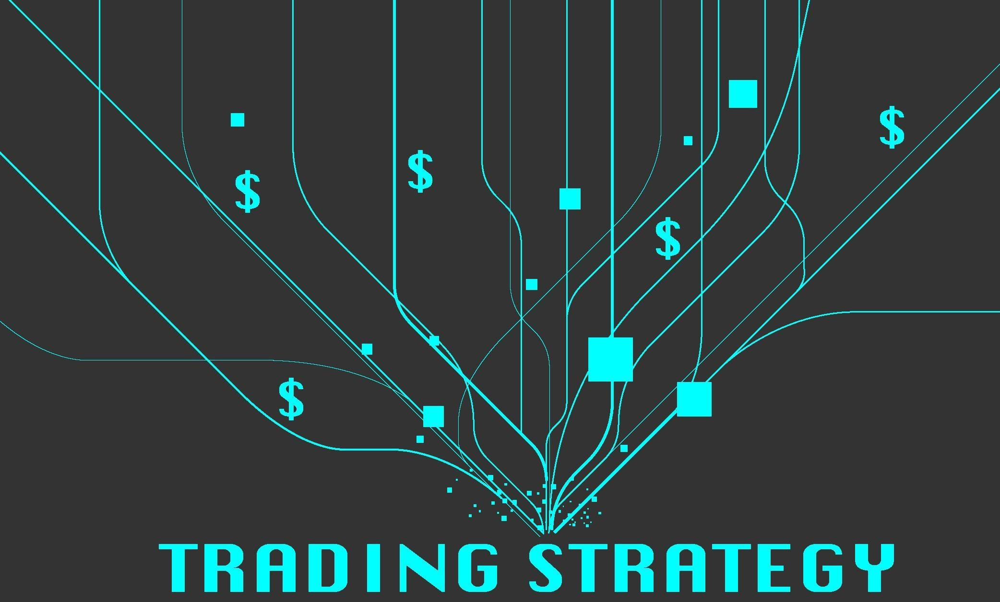

Algorithmic trading (algo trading) has increasingly become a cornerstone in modern financial markets, offering traders the ability to automate their trading strategies for enhanced efficiency and improved performance metrics. Through the use of complex algorithms, traders can execute orders at speeds and frequencies impossible for human traders. This computational power allows for the exploitation of small price discrepancies at a rapid pace, significantly increasing the potential for profit. Despite the technological advancements, transforming an algorithmic trading strategy into a prosperous endeavor requires sufficient capital. Adequate funding is not only necessary for covering operational costs but also crucial in maximizing the return on investment by leveraging more significant positions, accessing diverse markets, and employing sophisticated risk management techniques.

In this article, we will examine various strategies that traders can employ to secure the necessary funding to implement their algorithmic strategies successfully. By exploring these financing options, traders can enhance their market presence and improve their financial outcomes. Whether through partnerships with proprietary trading firms, engaging with brokers, or leveraging online platforms tailored for algorithmic traders, understanding the avenues available for securing funds is essential for any trader aiming to optimize their algorithmic trading capabilities.



## Table of Contents

## Understanding the Need for Funding in Algo Trading

Algorithmic trading, often referred to as algo trading, necessitates adequate funding to realize its full potential. Funding is paramount for achieving trading success due to several core reasons:

1. **Maximizing Returns with Increased Capital**: In financial markets, larger capital investments can lead to proportionally larger returns. By utilizing increased capital, traders can take advantage of more significant market opportunities and potentially enhance their profit margins. This effect is often referred to through the concept of leverage, where greater capital enables the trader to magnify their positions and, subsequently, their returns. The risk remains aligned with higher exposure, but with algorithmic precision, these risks can be meticulously managed to optimize gains. 

2. **Leveraging Opportunities**: A well-funded trading strategy allows traders to capitalize on fleeting market inefficiencies. Algorithmic trading is built on executing trades at high speed and precision, often capitalizing on minute price discrepancies. Adequate funding supports the scalability required for these strategies, enabling traders to operate across multiple assets or markets simultaneously. It empowers traders to deploy algorithms that can react instantaneously to market conditions, ensuring they do not miss lucrative opportunities due to capital constraints.

3. **Sustained Success through Diverse Strategies**: A well-capitalized trading endeavor can weather market volatility more effectively. Traders can diversify portfolios, hedge positions, and allocate risk appropriately. This diversity is crucial for maintaining a resilient trading operation that can withstand adverse market conditions and still emerge profitable. Funding supports the development and maintenance of diverse strategies, which can include market-making, statistical arbitrage, and trend-following approaches. Such strategies often require backup capital to activate when the market dynamics align favorably.

In conclusion, adequate funding acts as the backbone for [algorithmic trading](/wiki/algorithmic-trading) strategies, providing the necessary resources to exploit various market opportunities effectively. It is essential not only for maximizing returns and exploiting market inefficiencies but also for ensuring long-term trading success through strategic diversification and risk management.

## Prerequisites for Attracting Funding

A strong educational background and expertise in finance, mathematics, and computer science are crucial for attracting funding in algorithmic trading. These fields form the foundational pillars that enable traders to design sophisticated trading algorithms and effectively analyze market data. A deep understanding of financial markets aids in identifying trading opportunities, while proficiency in mathematics and [statistics](/wiki/bayesian-statistics) is essential for developing models that can predict price movements. Additionally, expertise in computer science is vital for implementing these models efficiently and for managing large datasets.

Moreover, developing a consistent and profitable track record through real-world trading experience is indispensable. This track record serves as a tangible proof of a trader's capability to generate returns and manage risk effectively. Prospective funders often scrutinize historical performance to gauge the potential success of investing in a trader's strategy. A steady track record not only builds confidence but also demonstrates the trader's ability to adapt strategies to changing market conditions.

Assessing risk is another critical component in the funding process. Traders must present a clear risk management plan that outlines how they intend to mitigate potential losses. This includes defining risk metrics such as Value at Risk (VaR) and Conditional Value at Risk (CVaR), and detailing their approaches to diversify investments and limit exposure. For instance, employing risk assessment tools like the Sharpe Ratio helps in evaluating the risk-adjusted return of a strategy. A high Sharpe Ratio indicates that the strategy returns more per unit of risk, which is attractive to investors.

```python
# Example: Calculating Sharpe Ratio
import numpy as np

# Sample returns and risk-free rate
returns = np.array([0.10, 0.05, 0.12, 0.07])
risk_free_rate = 0.02

# Calculate excess returns
excess_returns = returns - risk_free_rate

# Calculate mean and standard deviation of excess returns
mean_excess_return = np.mean(excess_returns)
std_excess_return = np.std(excess_returns)

# Calculate Sharpe Ratio
sharpe_ratio = mean_excess_return / std_excess_return
print(f"Sharpe Ratio: {sharpe_ratio:.2f}")
```

In summary, securing funding for algorithmic trading necessitates a combination of robust education, a proven track record, and meticulous risk management. These elements collectively enhance a trader's appeal to potential investors, facilitating access to the resources needed for scaling algorithmic trading strategies.

## Evaluating Your Trading Strategy

Evaluating your trading strategy is a critical step in securing funding for algorithmic trading. A thorough assessment using key performance metrics can determine the robustness and potential of your trading strategy, making it more attractive to investors and funders.

Understanding and optimizing several key performance metrics can offer valuable insights into the strengths and weaknesses of your trading strategy. These metrics are essential for convincing potential funders of the viability and profitability of your approach.

### Maximum Drawdown

Maximum drawdown (MDD) is a metric that represents the maximum observed loss from a peak to a trough of a portfolio, before a new peak is achieved. It is an indicator of downside risk over a specified time period.

$$
\text{MDD} = \frac{\text{Trough Value} - \text{Peak Value}}{\text{Peak Value}} \times 100\%
$$

A lower drawdown indicates a more stable performance, which is preferable to investors looking for consistent returns with minimal risk.

### Volatility

Volatility measures the degree of variation of a trading strategy over time, providing insight into the risk associated with the strategy. High [volatility](/wiki/volatility-trading-strategies) suggests a higher risk, where returns can vary dramatically.

Volatility is often calculated as the standard deviation of the returns:

$$
\sigma = \sqrt{\frac{1}{N-1} \sum_{i=1}^{N} (R_i - \overline{R})^2}
$$

Where $R_i$ is the return and $\overline{R}$ is the average return over $N$ periods.

### Sharpe Ratio

The Sharpe ratio is used to understand the return of an investment compared to its risk. The higher the Sharpe ratio, the better the investment's returns have been relative to the amount of risk taken.

$$
\text{Sharpe Ratio} = \frac{\overline{R} - R_f}{\sigma}
$$

Where $\overline{R}$ is the average return, $R_f$ is the risk-free rate, and $\sigma$ is the standard deviation of the return. This metric is crucial in demonstrating the superiority of a trading strategy based on risk-adjusted returns.

### Sortino Ratio

The Sortino ratio differentiates downside volatility from overall volatility, focusing on negative deviations. It is considered a better measure of risk-adjusted return than the Sharpe ratio in cases where only downside risk is of concern.

$$
\text{Sortino Ratio} = \frac{\overline{R} - R_f}{\text{Downside Deviation}}
$$

The downside deviation only considers periods with returns below the target or minimum acceptable return.

### Presenting a Comprehensive Analysis

A comprehensive analysis of your strategy's historical performance should be presented to potential funders. This includes [backtesting](/wiki/backtesting) results, forward testing results, and statistical analysis using the above metrics. It is essential to provide a detailed evaluation demonstrating the strategy's consistency and adaptability in various market conditions.

Here is a simple Python example to calculate these metrics:

```python
import numpy as np

def calculate_metrics(returns, risk_free_rate=0.01):
    # Calculate average return
    avg_return = np.mean(returns)

    # Calculate volatility (standard deviation)
    volatility = np.std(returns)

    # Calculate Sharpe Ratio
    sharpe_ratio = (avg_return - risk_free_rate) / volatility

    # Calculate maximum drawdown
    peak = np.maximum.accumulate(returns)
    drawdown = (returns - peak) / peak
    max_drawdown = np.min(drawdown)

    # Calculate downside deviation
    downside_deviation = np.std([min(0, r - risk_free_rate) for r in returns])

    # Calculate Sortino Ratio
    sortino_ratio = (avg_return - risk_free_rate) / downside_deviation

    return {
        "Average Return": avg_return,
        "Volatility": volatility,
        "Sharpe Ratio": sharpe_ratio,
        "Maximum Drawdown": max_drawdown,
        "Sortino Ratio": sortino_ratio
    }

# Example usage
returns = np.array([0.01, 0.02, -0.01, 0.005, 0.015, -0.02, 0.03])
metrics = calculate_metrics(returns)
print(metrics)
```

Presenting a strategy's historical performance using these metrics offers a clear and quantifiable measure of its capability, making it easier for potential investors to understand the potential risks and rewards of funding your trading strategy.

## Exploring Funding Avenues

Securing funding is a pivotal aspect of scaling an algorithmic trading strategy. Various avenues exist to raise capital, each with its unique advantages and challenges. To ensure success, traders need to demonstrate reliability, potential, and a compelling strategy.

### Raising Capital from Family and Friends

A common initial step for many traders is to seek capital from family and friends. This requires demonstrating both the potential of the trading strategy and the trader's competence. Establishing trust is crucial, and can often be facilitated through transparent communication and regular updates on trading performance. Success in this avenue depends heavily on personal relationships and the ability to clearly articulate the benefits and risks involved.

### Partnering with Proprietary Trading Firms

Proprietary trading firms offer traders the opportunity to access both capital and sophisticated trading resources. These organizations often look for individuals with robust strategies and proven track records. Typically, proprietary firms operate on a profit-sharing model, where traders earn a percentage of the profits they generate. To attract such partners, traders should be prepared to present detailed performance metrics and risk management plans. This partnership not only provides capital but also offers an environment enriched with data-driven insights and the latest trading technologies.

### Engaging with Brokers and the General Public

Brokers can also be a source of funding, either directly or by facilitating access to the general public. Retail brokers might offer programs that allow successful traders to attract followers or subscribers who can invest alongside them. These symbiotic strategies, such as copy trading or social trading platforms, can extend a trader's reach to a broad audience. However, it requires stringent compliance with regulatory requirements and maintaining ethical transparency with the public investors.

### Leveraging Online Investor Marketplaces

Online platforms have emerged as a novel way for algorithmic traders to connect with investors. Marketplaces such as QuantConnect and Collective2 allow traders to showcase their strategies to a global audience, facilitating connections with potential investors. These platforms often provide automated mechanisms for performance tracking and risk assessment, ensuring investors can make informed decisions. For instance, traders can programmatically display their strategy's historical performance metrics, using Python scripts to automate the calculation and visualization of key indicators such as the Sharpe ratio or maximum drawdown.

By exploring these funding avenues, algorithmic traders can significantly enhance their trading capacity. However, success in acquiring funding lies in the strength of the trading strategy, a demonstrated history of performance, and the ability to communicate effectively with potential funders.

## Ethical and Regulatory Considerations

Ethical and regulatory considerations play a crucial role in algorithmic trading, particularly when managing external funds. Understanding and adhering to the regulatory requirements is essential to maintaining trust and legitimacy in the financial markets. Various regulatory bodies, such as the U.S. Securities and Exchange Commission (SEC) and the Financial Conduct Authority (FCA) in the UK, stipulate guidelines that govern trading activities when handling other people's money. These regulations are designed to protect investors from fraudulent activities and ensure that trading practices maintain financial integrity.

A key regulatory requirement involves registration with the respective authority before managing external funds. For instance, in the United States, individuals or entities managing above a certain threshold of assets are required to register as Investment Advisers under the Investment Advisers Act of 1940. They must comply with fiduciary obligations, which include providing full disclosure of their trading strategy and associated risks, maintaining transparency, and acting in the best interest of their clients.

From an ethical standpoint, managing external funds entails a high level of responsibility. Traders must ensure that they are not only compliant with legal obligations but also operate with integrity and fairness. This includes implementing robust risk management strategies to protect investors' capital, avoiding conflicts of interest, and ensuring that the investment strategy aligns with the investors' objectives and risk tolerance.

Additionally, ethical considerations extend to the accurate reporting of performance metrics. It is imperative that traders do not engage in the manipulation of trading results or the omission of unfavorable data to attract new clients. Misrepresentation can lead to significant financial consequences and damage to reputation.

Finally, maintaining confidentiality of investors' data and providing them with regular, clear, and truthful communications are essential ethical practices. This transparency fosters trust and helps to build a sustainable relationship with investors.

In conclusion, while the pursuit of funding can enhance algorithmic trading capabilities, it is crucial for traders to understand the ethical and regulatory responsibilities that accompany the management of external funds. By prioritizing compliance and ethical practices, traders not only protect their clients but also contribute positively to the greater financial ecosystem.

## Associated Restrictions and Challenges

Securing external funding for algorithmic trading strategies often involves navigating a range of restrictions and terms imposed by funders. These conditions typically aim to safeguard investors' capital and ensure traders maintain a disciplined approach to risk management. Common restrictions may include predefined risk limits, mandated use of specific trading platforms, or periodic performance evaluation checkpoints. Adhering to these constraints necessitates that traders regularly communicate their strategy's status and results to funders, maintaining transparency in all operations.

Managing expectations is paramount when collaborating with external funders. Funders may have differing views on acceptable risk levels, expected returns, or the time horizon for investments, potentially leading to misalignment with the trader's strategy objectives. To address this, a clear articulation of the trading strategy, including its expected performance metrics such as the Sharpe ratio or maximum drawdown, is essential. Providing historical data through comprehensive backtesting can help align these expectations, offering funders a detailed understanding of potential risks and returns.

Potential challenges may also arise from the iterative nature of algorithmic strategies. As market conditions evolve, traders often need to adjust their algorithms, which may conflict with the terms set by funders. For instance, a funder might impose restrictions on strategy modifications, requiring pre-approval for any changes to the algorithm. In such scenarios, fostering an open line of communication and educating funders on the necessity and impact of these adjustments can be beneficial.

Moreover, contractual obligations such as lock-up periods—where investors are barred from withdrawing funds for a certain timeframe—can also introduce challenges. Traders must plan [liquidity](/wiki/liquidity-risk-premium) carefully to accommodate these terms while meeting operational needs. Potential disagreements over fee structures, such as performance or management fees, are additional hurdles that require negotiation and clarity. By anticipating these issues and maintaining transparent, continuous dialogue, traders can better navigate the complexities of working with external funding sources, ensuring a more harmonious and successful partnership.

## Conclusion

Securing funding for algorithmic trading strategies involves a series of deliberate steps, each critical to transforming a conceptual trading model into a fully operational and successful financial endeavor. The process begins with constructing a robust foundation in education, covering disciplines such as finance, mathematics, and computer science. Such knowledge enhances the trader’s ability to devise sophisticated trading strategies, often making their proposals more attractive to potential investors.

Developing a consistent and demonstrable track record is imperative. This not only showcases the reliability and profitability of the trading strategy over time but also reassures potential backers of the trader’s competence and the strategy's viability. Key performance indicators such as maximum drawdown, volatility, Sharpe ratio, and Sortino ratio should be optimized and clearly presented to potential funders, allowing them to make informed decisions.

Aspiring algo traders must persistently refine their trading strategies and skills. Markets evolve, which necessitates continuous learning and adaptation. Educational courses, particularly those specialized in algorithmic trading like those offered by QuantInsti, play a significant role in advancing knowledge and skill sets, subsequently enhancing the appeal of the trader to funders.

Furthermore, being aware of ethical and regulatory considerations is crucial. Managing external funds carries with it responsibilities and obligations that must be respected and adhered to, ensuring trustworthiness and integrity in all operations.

The culmination of educational attainment, demonstrable success in trading, thorough risk management, and ethical compliance forms the backbone of a compelling proposition for securing funding. Encouraging continual improvement and strategic innovation will place aspiring algo traders on a path to not only secure funding but to sustain and grow their trading endeavors over the long term.

## Further Learning Resources

For aspiring algo traders looking to enhance their skills, a variety of educational resources are available to deepen their understanding and improve their trading strategies. Programs like those offered by QuantInsti provide comprehensive courses focused on algorithmic trading. QuantInsti's Executive Programme in Algorithmic Trading (EPAT) is designed to equip traders with insights into financial markets, quantitative strategies, and the nuances of trading with algorithms.

In addition to structured courses, numerous webinars and tutorials are available online, catering to different aspects of algorithmic trading. These resources often cover the latest industry practices, technical indicators, and emerging technologies in trading. Industry articles, readily available on platforms like Medium, Seeking Alpha, and finance-focused news websites, help traders stay informed about trends and developments.

For practical learning, algorithmic trading enthusiasts can explore open-source platforms such as QuantConnect and AlgoTrader. These platforms provide users with the tools to code and test trading strategies using historical data, thereby allowing them to gain hands-on experience.

To enhance programming skills, particularly in Python, traders can benefit from platforms like Coursera and edX, which offer courses in Python programming, data analysis, and [machine learning](/wiki/machine-learning). Such skills are invaluable in backtesting trading strategies and optimizing trading models for better performance.

Furthermore, online communities and forums such as Stack Exchange and GitHub are excellent places to share knowledge, seek advice, and collaborate with others in the field. Engaging with a community can spur new insights and foster a supportive network of peers and experts.

Overall, continuous learning and development through these educational resources can significantly aid traders in mastering the art of algorithmic trading and adapting to the ever-evolving financial markets.

## References & Further Reading

[1]: Bergstra, J., Bardenet, R., Bengio, Y., & Kégl, B. (2011). ["Algorithms for Hyper-Parameter Optimization."](https://papers.nips.cc/paper/4443-algorithms-for-hyper-parameter-optimization) Advances in Neural Information Processing Systems 24.

[2]: ["Advances in Financial Machine Learning"](https://www.amazon.com/Advances-Financial-Machine-Learning-Marcos/dp/1119482089) by Marcos Lopez de Prado

[3]: ["Evidence-Based Technical Analysis: Applying the Scientific Method and Statistical Inference to Trading Signals"](https://www.amazon.com/Evidence-Based-Technical-Analysis-Scientific-Statistical/dp/0470008741) by David Aronson

[4]: ["Machine Learning for Algorithmic Trading"](https://github.com/PacktPublishing/Machine-Learning-for-Algorithmic-Trading-Second-Edition) by Stefan Jansen

[5]: ["Quantitative Trading: How to Build Your Own Algorithmic Trading Business"](https://books.google.com/books/about/Quantitative_Trading.html?id=j70yEAAAQBAJ) by Ernest P. Chan