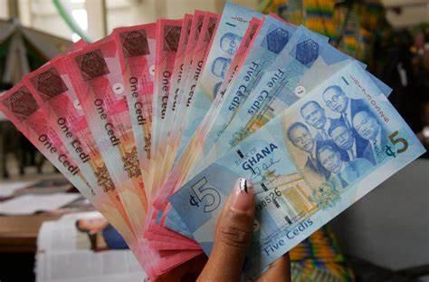

## Table of Contents

## What is the Ghanaian Cedi?

The Ghanaian Cedi is the official currency of Ghana, a country in West Africa. It is used every day by people in Ghana to buy things like food, clothes, and other goods. The symbol for the Cedi is ¢, and it is divided into smaller units called pesewas. One Cedi is equal to 100 pesewas.

The Cedi was first introduced in 1965, replacing the Ghanaian pound. Over the years, the value of the Cedi has changed, and it has been redenominated a few times. The most recent redenomination was in 2007, when the old Cedi was replaced by the new Cedi at a rate of 10,000 old Cedis to 1 new Cedi. This made it easier for people to handle money and understand its value.

## How is the Ghanaian Cedi abbreviated and symbolized?

The Ghanaian Cedi is abbreviated as GHS. This is used when writing amounts of money in Ghana. For example, if you see GHS 50, it means 50 Cedis.

The symbol for the Ghanaian Cedi is ¢. This symbol is used to show the currency in a shorter way. So, ¢50 is another way to write 50 Cedis.

## When was the Ghanaian Cedi first introduced?

The Ghanaian Cedi was first introduced in 1965. Before that, people in Ghana used the Ghanaian pound. The Cedi was made to replace the pound and to be the new money for the country.

When the Cedi was first introduced, it was a big change for everyone in Ghana. They had to learn about the new money and how to use it. The Cedi was divided into smaller parts called pesewas, with 100 pesewas making one Cedi.

## What are the different denominations of the Ghanaian Cedi?

The Ghanaian Cedi comes in different amounts of money, both as coins and paper money. The coins are worth 1 pesewa, 5 pesewas, 10 pesewas, 20 pesewas, 50 pesewas, and 1 Cedi. These coins help people buy small things or give exact change.

The paper money, or banknotes, come in bigger amounts. You can find banknotes worth 1 Cedi, 2 Cedis, 5 Cedis, 10 Cedis, 20 Cedis, 50 Cedis, 100 Cedis, and 200 Cedis. These notes make it easier for people to [carry](/wiki/carry-trading) around larger amounts of money without needing too many coins.

## How does the Ghanaian Cedi function as a currency?

The Ghanaian Cedi is used every day by people in Ghana to buy things like food, clothes, and other goods. It works as money that people can exchange for goods and services. When someone wants to buy something, they give Cedis to the seller, and the seller gives them the item. The Cedi is accepted everywhere in Ghana, so people trust it and use it to do business with each other.

The Cedi comes in different amounts, called denominations. There are coins for small amounts like 1 pesewa, 5 pesewas, 10 pesewas, 20 pesewas, 50 pesewas, and 1 Cedi. For bigger amounts, there are paper notes called banknotes, which are worth 1 Cedi, 2 Cedis, 5 Cedis, 10 Cedis, 20 Cedis, 50 Cedis, 100 Cedis, and 200 Cedis. This way, people can use the right amount of money for what they are buying, whether it's something small or something more expensive.

## What role does the Bank of Ghana play in managing the Cedi?

The Bank of Ghana is like the boss of all money in Ghana. It makes sure the Ghanaian Cedi works well as the country's money. The Bank of Ghana decides how many Cedis should be made and used in the country. It also looks after the value of the Cedi to make sure it stays good for buying things. If the Cedi starts to lose value too much, the Bank of Ghana can do things to help it get better.

The Bank of Ghana also keeps an eye on the banks and other places that use money in Ghana. It makes rules for them to follow, so they handle the Cedi the right way. This helps to keep the money safe and trusted by everyone. By doing all these things, the Bank of Ghana helps the Cedi work well so people can use it easily every day.

## How does the Ghanaian Cedi impact the daily lives of Ghanaians?

The Ghanaian Cedi is what people in Ghana use to buy things every day. When someone goes to the market to buy food, or to a shop to get clothes, they use Cedis to pay for it. If someone wants to take a taxi or pay for school fees, they use Cedis too. So, the Cedi is very important because it helps people get the things they need to live their lives.

The value of the Cedi can also affect how much things cost. If the Cedi becomes weaker, the price of things might go up, and people might not be able to buy as much with the same amount of money. But if the Cedi gets stronger, people can buy more with the same amount of money. This means the Cedi can change how much people can afford and how they plan their spending.

## What are the key economic factors that influence the value of the Ghanaian Cedi?

The value of the Ghanaian Cedi can change because of many things. One big thing is how much Ghana sells to other countries, like gold, cocoa, and oil. If Ghana sells a lot of these things, it can make the Cedi stronger because more money comes into the country. But if Ghana doesn't sell as much, the Cedi might get weaker. Another thing is how much money people in Ghana want to spend on things from other countries. If they want to buy a lot of things from outside, it can make the Cedi weaker because money is going out of the country.

The government and the Bank of Ghana also play a big role in the value of the Cedi. The Bank of Ghana can change interest rates, which is like the cost of borrowing money. If they make interest rates higher, it can make the Cedi stronger because people might want to keep their money in Ghana instead of spending it in other countries. The government's spending and how it manages the country's money can also affect the Cedi. If the government spends too much without making enough money, it can make the Cedi weaker.

## How has the Ghanaian Cedi performed against major world currencies in the past decade?

Over the past decade, the Ghanaian Cedi has had ups and downs when compared to major world currencies like the US Dollar, the Euro, and the British Pound. Generally, the Cedi has been weaker against these currencies. For example, in 2014, one US Dollar was worth about 3 Cedis, but by 2023, one US Dollar was worth around 11 Cedis. This means that the Cedi lost a lot of its value over the years, making things from other countries more expensive for people in Ghana.

There are many reasons why the Cedi has performed this way. One big reason is that Ghana imports a lot of things, like food and fuel, which means a lot of Cedis are being used to buy things from other countries. Also, the price of gold and cocoa, which Ghana sells a lot of, can go up and down, affecting how much money comes into the country. The government and the Bank of Ghana have tried to help the Cedi by changing interest rates and managing how much money is in the country, but it's been hard to keep the Cedi strong all the time.

## What are the historical events that have significantly affected the Ghanaian Cedi?

The Ghanaian Cedi has been through many big changes since it was first introduced in 1965. One important event was in 1972 when Ghana had a military coup. This led to economic problems and the Cedi started to lose value quickly. The government had to change the way money worked, and in 1979, they introduced a new type of Cedi, called the "new Cedi," to try and fix the problems. This was a big change for everyone in Ghana because they had to use new money.

Another big event was in 2007 when the government did something called a redenomination. This meant they changed the old Cedi into a new one at a rate of 10,000 old Cedis to 1 new Cedi. They did this to make the money easier to use and understand. Before the redenomination, prices were very high because the Cedi had lost so much value. After the redenomination, prices became smaller numbers again, which helped people feel more comfortable with their money. These events show how the Cedi has had to change over time to keep working well for the people of Ghana.

## How do international trade and foreign investment affect the Ghanaian Cedi?

International trade and foreign investment have a big impact on the Ghanaian Cedi. When Ghana sells things like gold, cocoa, and oil to other countries, it brings money into the country. This can make the Cedi stronger because more foreign money is coming in. But if Ghana buys a lot of things from other countries, like food and fuel, it means more Cedis are going out. This can make the Cedi weaker because there's less money staying in Ghana.

Foreign investment also plays a role. When companies from other countries want to start businesses or invest money in Ghana, they bring in foreign money. This can help the Cedi get stronger because more money is coming into the country. But if these companies take their money out of Ghana, it can make the Cedi weaker. So, how much Ghana trades with other countries and how much foreign money comes in or goes out can really change the value of the Cedi.

## What are the current challenges and future prospects for the Ghanaian Cedi?

The Ghanaian Cedi faces several challenges right now. One big challenge is that Ghana buys a lot of things from other countries, like food and fuel. When Ghana spends a lot of money on these things, it can make the Cedi weaker because more money is leaving the country. Another challenge is that the price of things Ghana sells, like gold and cocoa, can go up and down. If these prices go down, it can make the Cedi weaker too. Also, if the government spends more money than it has, it can cause problems for the Cedi.

In the future, there are some good things that could help the Cedi. If Ghana can sell more of its goods to other countries, it could bring more money into the country and make the Cedi stronger. Also, if more companies from other countries want to invest in Ghana, that could help too. The government and the Bank of Ghana are trying to make the Cedi stronger by changing interest rates and managing the money in the country. If they can keep doing this well, it could help the Cedi in the future. But it will take time and good planning to make these changes work.

## What are the key economic factors influencing the Ghanaian Cedi?

Ghana's economic landscape is intricately tied to its dependence on commodities, foreign direct investment (FDI), public debt, and susceptibility to economic shocks. These factors significantly influence the value of the Ghanaian Cedi, creating a dynamic environment for currency trading.

**Ghana’s Dependence on Commodities**

Commodities form the backbone of Ghana's economy, contributing over 80% of the nation's export revenues. Gold, cocoa, and oil are pivotal to the country's financial health. Gold, for instance, is a major export, and its global price fluctuations can directly affect the Cedi's valuation. If the price of gold rises internationally, Ghana's export revenues increase, potentially strengthening the Cedi. Conversely, a drop in gold prices can lead to diminished revenues and subsequently, Cedi depreciation. Similarly, cocoa, being a significant agricultural export, subjects the Cedi to global supply and demand trends. To model this dependence mathematically, one could utilize the formula:

$$
\text{Cedi Value Change} = \alpha (\frac{\Delta \text{Commodity Price}}{\text{Base Commodity Price}})
$$

where $\alpha$ represents the sensitivity of the Cedi to commodity price changes.

**Foreign Direct Investment**

FDI is a crucial driver of economic growth, providing capital for development projects and creating employment. In recent years, declines in FDI inflows have been linked to the depreciation of the Cedi. Reduced confidence in the Ghanaian market, coupled with global economic uncertainties, can lead to divestment, increasing demand for foreign currencies and exacerbating Cedi depreciation. Monitoring and predicting FDI trends can therefore be integral to understanding currency movements.

**Public Debt and Fiscal Policies**

Rising public debt and loosened fiscal policies considerably affect the Cedi. Ghana's public debt has grown over the years, resulting in increased borrowing costs and reduced fiscal space for infrastructure investments. Additionally, when the government engages in excessive money printing to finance deficits, it can lead to inflation, further depreciating the currency. The debt-to-GDP ratio is a crucial indicator here:

$$
\text{Debt-to-GDP Ratio} = \frac{\text{Total Public Debt}}{\text{GDP}} \times 100
$$

A higher ratio indicates potential economic distress, prompting investors to seek safer assets, thus affecting the Cedi.

**External and Domestic Economic Shocks**

The Cedi is susceptible to both external and domestic economic shocks. Geopolitical tensions, such as trade disputes or regional conflicts, can alter investor sentiment and capital flow, affecting the currency's stability. Domestically, policy changes or economic reforms can either bolster or destabilize the Cedi. For instance, a significant policy shift aimed at tightening fiscal control might initially strain the economy but eventually stabilize the currency if confidence is regained. Understanding these shocks requires continuous monitoring of international news and domestic policy announcements.

By recognizing and integrating these economic factors—commodities, FDI, public debt, and economic shocks—traders can better anticipate movements in the Ghanaian Cedi and strategize accordingly.

## References & Further Reading

[1]: Bergstra, J., Bardenet, R., Bengio, Y., & Kégl, B. (2011). ["Algorithms for Hyper-Parameter Optimization."](https://papers.nips.cc/paper/4443-algorithms-for-hyper-parameter-optimization) Advances in Neural Information Processing Systems 24.

[2]: ["Advances in Financial Machine Learning"](https://www.amazon.com/Advances-Financial-Machine-Learning-Marcos/dp/1119482089) by Marcos Lopez de Prado

[3]: ["Evidence-Based Technical Analysis: Applying the Scientific Method and Statistical Inference to Trading Signals"](https://www.amazon.com/Evidence-Based-Technical-Analysis-Scientific-Statistical/dp/0470008741) by David Aronson

[4]: ["Machine Learning for Algorithmic Trading"](https://github.com/stefan-jansen/machine-learning-for-trading) by Stefan Jansen

[5]: ["Quantitative Trading: How to Build Your Own Algorithmic Trading Business"](https://www.amazon.com/Quantitative-Trading-Build-Algorithmic-Business/dp/1119800064) by Ernest P. Chan