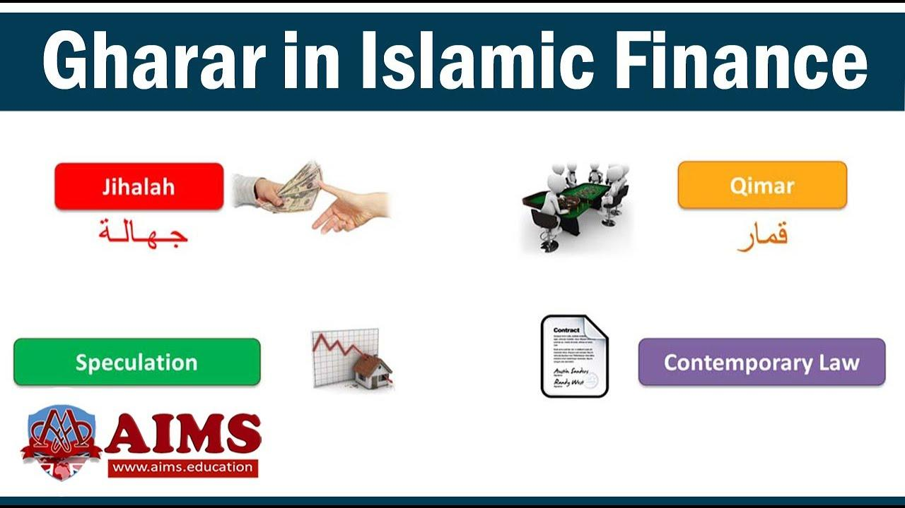

## Table of Contents

## What is the basic definition of Gharar in Islamic finance?

Gharar is a concept in Islamic finance that refers to uncertainty, ambiguity, or deception in a contract. It is considered harmful because it can lead to disputes and unfairness between the parties involved. In Islamic law, contracts that contain a high level of gharar are prohibited because they go against the principles of fairness and transparency that are central to Islamic finance.

To avoid gharar, Islamic financial transactions must be clear and certain. This means that all terms of the contract should be fully disclosed and understood by all parties. For example, selling goods that do not exist yet or selling something without knowing its price or quality would be considered gharar and thus not allowed in Islamic finance. By ensuring clarity and fairness, Islamic finance aims to promote ethical and just economic practices.

## How does Gharar differ from uncertainty in conventional finance?

In Islamic finance, Gharar is a specific type of uncertainty that is considered harmful and is therefore prohibited. It refers to situations where there is too much ambiguity or deception in a contract, which can lead to unfairness. For example, selling something you don't own yet or not knowing the price or quality of what you're buying is seen as Gharar. The goal in Islamic finance is to make sure all deals are clear and fair, so everyone knows exactly what they're getting into.

In conventional finance, uncertainty is a normal part of many transactions and is not automatically seen as a problem. People often deal with risks and uncertainties, like investing in stocks where the future value is unknown. As long as the risks are understood and agreed upon, these transactions are considered okay. The main difference is that while conventional finance accepts a certain level of uncertainty, Islamic finance tries to avoid it to ensure fairness and transparency in all dealings.

## Can you provide examples of Gharar in everyday transactions?

Gharar can show up in everyday transactions in ways that might seem normal but are not allowed in Islamic finance. For example, imagine you buy a mystery box at a store where you don't know what's inside. You pay money, but you have no idea if you'll get something valuable or just junk. This is Gharar because it's too uncertain and unfair. You're spending money without knowing what you're really getting.

Another everyday example is selling a future crop that hasn't been planted yet. If a farmer agrees to sell next year's harvest before it's even grown, this is Gharar. The buyer doesn't know if the crop will actually grow or what its quality will be. It's too risky and unclear, which goes against the fairness that Islamic finance wants to keep in all deals.

## What are the types of Gharar recognized in Islamic finance?

In Islamic finance, Gharar is divided into two main types: Gharar Fahish and Gharar Yasir. Gharar Fahish is the serious kind of uncertainty that is not allowed in contracts. It's when a deal is so unclear or risky that it can lead to big problems or unfairness. For example, selling something you don't own yet or selling a fish in the sea without knowing if you'll catch it. This type of Gharar is strictly forbidden because it goes against the principles of fairness and transparency.

Gharar Yasir is the minor kind of uncertainty that is usually tolerated in Islamic finance. It's the small, everyday uncertainties that don't cause major harm or unfairness. For instance, selling fruits on a tree where you can estimate the quantity and quality but can't be 100% sure until they're picked. This type of Gharar is seen as acceptable because it doesn't disrupt the fairness of the transaction too much. The key is to keep these minor uncertainties to a minimum and ensure they don't affect the overall fairness of the contract.

## How does the concept of Gharar impact Islamic financial contracts?

The concept of Gharar has a big impact on Islamic financial contracts. It means that all deals need to be clear and fair so no one is tricked or unsure about what they're getting. For example, if you want to buy something, you need to know exactly what it is, how much it costs, and when you'll get it. If there's too much uncertainty, like not knowing if the seller even owns the thing they're selling, the contract won't be allowed in Islamic finance. This rule helps make sure everyone is treated fairly and knows what they're agreeing to.

Because of Gharar, Islamic financial contracts often look different from regular ones. They can't have big risks or unclear parts that might cause problems later. For instance, you can't buy a future crop that hasn't been planted yet because nobody knows if it will grow. Instead, Islamic finance encourages deals where everything is clear from the start. This way, both the buyer and the seller feel safe and trust that the deal is fair. By avoiding Gharar, Islamic finance aims to keep all transactions honest and straightforward.

## What are the consequences of Gharar in Islamic law?

In Islamic law, if a contract has too much Gharar, it's not allowed. This means the contract won't be valid and can't be enforced. The main reason is to keep things fair and clear for everyone involved. If someone tries to make a deal with a lot of uncertainty or risk, like selling something they don't own yet, the deal won't hold up in Islamic law. This helps protect people from being tricked or losing money because of unclear agreements.

The consequences of Gharar also affect how people do business in Islamic finance. Because Gharar is not allowed, people have to be very careful to make sure their contracts are clear and honest. This means they can't sell things that are too uncertain, like a future crop that hasn't been planted yet. By avoiding Gharar, Islamic finance aims to create a fair and trustworthy system where everyone knows what they're getting into and can feel safe doing business.

## How do Islamic financial institutions mitigate Gharar in their products?

Islamic financial institutions work hard to keep Gharar out of their products. They do this by making sure all their deals are clear and fair. For example, when they offer a loan or an investment, they make sure everyone knows exactly what they're getting and what they have to pay back. They don't allow contracts where the price or the thing being sold is not known. This way, people can trust that they're not being tricked or taking big risks.

Another way they handle Gharar is by avoiding deals that are too uncertain. For instance, they won't let someone sell something they don't own yet or sell a crop before it's even planted. Instead, they focus on products where everything is clear from the start. By doing this, Islamic financial institutions make sure their products follow Islamic law and help people feel safe and confident in their financial dealings.

## Can you discuss a case study where Gharar was a significant issue in an Islamic financial product?

In 2007, a case involving a Malaysian Islamic bank called Bank Islam Malaysia Berhad (BIMB) highlighted the issue of Gharar. The bank offered a product called "Bai' Inah," where they sold an asset to a customer on credit and then immediately bought it back at a lower price for cash. The problem was that the asset was not clearly defined, and the transaction involved a lot of uncertainty about the real value and ownership of the asset. This led to a legal dispute because the product was seen as having too much Gharar, which goes against Islamic finance principles.

The case went to the Malaysian Shariah Advisory Council, which ruled that the Bai' Inah product did indeed contain significant Gharar. They said that the unclear nature of the asset and the way the transaction was structured made it unfair and not transparent. As a result, the bank had to change how they offered the product to make sure it followed Islamic law better. This case showed how important it is for Islamic financial institutions to avoid Gharar and keep their products clear and fair.

## What are the scholarly debates surrounding the definition and application of Gharar?

Scholars in Islamic finance often debate about what exactly counts as Gharar and how it should be applied in financial deals. Some scholars think Gharar is any kind of uncertainty that might lead to unfairness, no matter how small. They say that even small risks should be avoided to keep things fair. Other scholars believe that only big uncertainties should be considered Gharar. They think that everyday risks, like not knowing the exact quality of a fruit on a tree, are okay as long as they don't cause big problems.

Another big debate is about how strict Islamic finance should be when it comes to Gharar. Some scholars argue for very strict rules, saying that any deal with even a little bit of uncertainty should not be allowed. They want to make sure that Islamic finance stays true to its principles of fairness and transparency. On the other hand, some scholars believe that a bit of flexibility is needed. They say that if a deal has only minor uncertainties and is still fair overall, it should be allowed. This way, Islamic finance can be more practical and help more people while still following Islamic law.

## How has the interpretation of Gharar evolved in modern Islamic finance?

The interpretation of Gharar in modern Islamic finance has changed over time to fit today's financial world. In the past, Islamic scholars were very strict about what counted as Gharar. They thought any kind of uncertainty, even small ones, should be avoided to keep things fair. But as Islamic finance grew and became more common around the world, scholars started to see that being too strict could make it hard for people to use Islamic financial products. So, they began to think more about what kinds of uncertainties are really harmful and which ones are okay in everyday deals.

Now, many scholars agree that not all uncertainty should be seen as Gharar. They say that small, everyday risks, like not knowing the exact quality of a fruit on a tree, are fine as long as they don't cause big problems. This new way of thinking helps Islamic finance be more practical and useful for people. But, they still agree that big uncertainties, like selling something you don't own yet, are not allowed because they can lead to unfairness. By understanding Gharar better, Islamic finance can grow while still following its core values of fairness and transparency.

## What role does Gharar play in the development of new Islamic financial instruments?

Gharar plays a big role in making new Islamic financial instruments. When people want to create new products, they have to think about Gharar a lot. They need to make sure that the new product doesn't have too much uncertainty or risk. If it does, it won't be allowed in Islamic finance. So, when creating new instruments, they have to be very careful to keep things clear and fair. For example, they can't make a product where people don't know what they're buying or how much they have to pay. By avoiding Gharar, they can make sure the new product follows Islamic law and helps people feel safe using it.

Because of Gharar, Islamic financial institutions have to be creative but careful when they develop new instruments. They often come up with new ways to do things that are clear and fair. For instance, instead of selling a future crop that hasn't been planted yet, they might create a product where the crop is already grown and everyone knows what they're getting. This way, they can offer new financial options that people need while still following the rules of Islamic finance. By understanding and managing Gharar, they can keep growing and helping more people with their financial needs.

## How can understanding Gharar help in creating Sharia-compliant financial solutions?

Understanding Gharar is really important for making financial solutions that follow Sharia law. Gharar is about avoiding big uncertainties and risks in deals. When people know what Gharar is, they can make sure their financial products are clear and fair. For example, they won't sell things that don't exist yet or where the price isn't known. By keeping things straightforward, they can create products that people can trust and that follow Islamic rules.

This understanding helps in coming up with new ways to offer financial help while still following Sharia. Instead of selling a future crop that hasn't been planted, they might sell one that's already grown. This way, everyone knows what they're getting and there's no big risk. By thinking about Gharar, Islamic financial institutions can make products that are useful and safe for people, helping them meet their financial needs without breaking Islamic law.

## References & Further Reading

[1]: El-Gamal, M. A. (2006). ["Islamic Finance: Law, Economics, and Practice."](https://iefpedia.com/english/wp-content/uploads/2009/12/Islamin-Finance-Low-Economics-practice.pdf) Cambridge University Press.

[2]: Usmani, M. I. A. (2002). ["An Introduction to Islamic Finance."](https://archive.org/details/AnIntroductionToIslamicFinanceByShaykhMuftiTaqiUsmani) Idaratul Ma'arif.

[3]: Hasan, Z. (2010). ["Shariah Compliant Equity Trading Framework."](https://www.researchgate.net/profile/Zulkifli-Hasan/publication/256043882_Regulatory_Framework_of_Shari'Ah_Governance_System_in_Malaysia_GCC_Countries_and_the_UK/links/6034b8af92851c4ed58e43c1/Regulatory-Framework-of-ShariAh-Governance-System-in-Malaysia-GCC-Countries-and-the-UK.pdf) International Journal of Islamic and Middle Eastern Finance and Management.

[4]: Abedifar, P., Molyneux, P., & Tarazi, A. (2013). ["Risk in Islamic Banking."](https://academic.oup.com/rof/article-abstract/17/6/2035/1590691) Review of Finance, 18(1), 45-83.

[5]: Kammer, A., Norat, M., Piñón, M., Prasad, A., & Towe, C. (2015). ["Islamic Finance: Opportunities, Challenges, and Policy Options."](https://www.imf.org/external/pubs/ft/sdn/2015/sdn1505.pdf) International Monetary Fund.