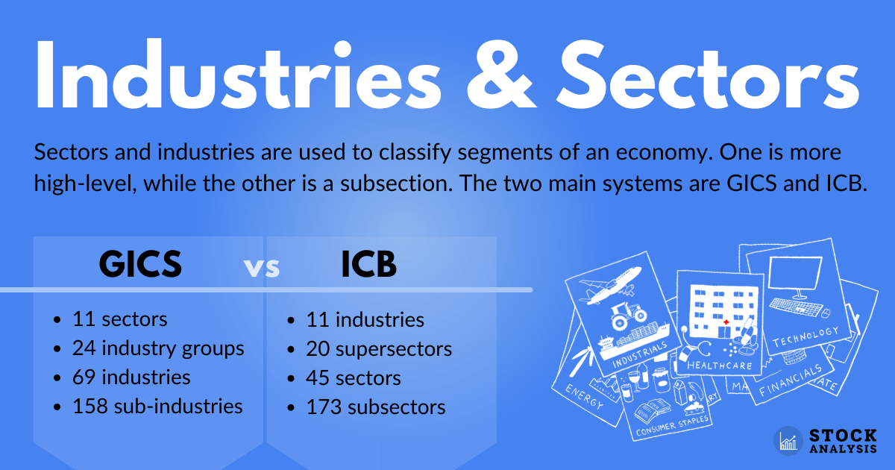

## Table of Contents

## What are the GICS and ICB stock classification systems?

The GICS, or Global Industry Classification Standard, is a system used to group companies into sectors and industries based on their main business activities. It was created by MSCI and Standard & Poor's. GICS helps investors and analysts understand and compare companies more easily. It divides the economy into 11 sectors, like Energy or Information Technology, and then breaks these sectors down into more specific industry groups, industries, and sub-industries.

The ICB, or Industry Classification Benchmark, is another system for classifying companies. It was developed by FTSE Russell and Dow Jones. ICB also groups companies into sectors and industries but uses a slightly different approach. It divides the economy into 10 industries, such as Oil & Gas or Technology, and further categorizes them into supersectors, sectors, and subsectors. This system helps investors and analysts look at companies in a structured way, similar to GICS, but with some differences in how the categories are defined.

Both GICS and ICB are important tools for investors because they provide a standardized way to analyze and compare companies across different markets and regions. While they share the goal of organizing companies by their business activities, the specific categories and structures can differ, which might influence how investors view and make decisions about their investments.

## Who developed the GICS and ICB systems?

The GICS system was made by MSCI and Standard & Poor's. They wanted to help people understand companies better by grouping them into different categories based on what they do. This system sorts companies into 11 big groups, called sectors, like Energy or Information Technology, and then into smaller groups within those sectors.

The ICB system was created by FTSE Russell and Dow Jones. They also wanted to help people see how companies are similar or different by putting them into categories. ICB uses 10 big groups, called industries, such as Oil & Gas or Technology, and then breaks these down into even smaller groups. Both systems help investors look at companies in an organized way, but they do it a bit differently.

## What is the primary purpose of using GICS and ICB in stock classification?

The main reason we use GICS and ICB in stock classification is to help investors and analysts understand and compare companies more easily. Both systems group companies into categories based on what they do. This makes it simpler for people to see how companies in the same category are doing, and to make choices about where to invest their money. By using these systems, investors can quickly find out which companies are similar and how they might perform in the future.

GICS and ICB are important because they give everyone a standard way to look at companies. This means that when people talk about stocks or make investment decisions, they are all using the same categories. This helps avoid confusion and makes it easier to share ideas and information. Even though GICS and ICB do things a bit differently, they both help people see the big picture of the economy and how different companies fit into it.

## How are stocks categorized under GICS?

Stocks are categorized under the Global Industry Classification Standard (GICS) by grouping them into sectors based on what the companies do. GICS divides the economy into 11 big groups called sectors, like Energy, Materials, and Information Technology. Each sector is then broken down into smaller groups. These smaller groups are called industry groups, industries, and sub-industries. For example, the Information Technology sector includes an industry group called Software & Services, which is further divided into industries like Software and IT Services, and then into sub-industries like Application Software or IT Consulting & Other Services.

This way of organizing stocks helps investors and analysts see how companies are similar or different. By looking at the GICS categories, people can compare companies within the same sub-industry or industry to understand their performance and potential. For example, if someone wants to invest in technology, they can look at all the companies in the Information Technology sector and then focus on the specific sub-industries that interest them the most. This makes it easier to make informed decisions about where to put their money.

## How are stocks categorized under ICB?

Stocks are categorized under the Industry Classification Benchmark (ICB) by grouping them into different levels based on what the companies do. ICB divides the economy into 10 big groups called industries, like Oil & Gas, Basic Materials, and Technology. Each industry is then broken down into smaller groups. These smaller groups are called supersectors, sectors, and subsectors. For example, the Technology industry includes a supersector called Technology, which is further divided into sectors like Software & Computer Services and Technology Hardware & Equipment, and then into subsectors like Software or Computer Services.

This way of organizing stocks helps people understand and compare companies more easily. By looking at the ICB categories, investors and analysts can see how companies within the same subsector or sector are doing. This helps them make better choices about where to invest their money. For example, if someone is interested in investing in technology, they can look at all the companies in the Technology industry and then focus on the specific subsectors that interest them the most. This makes it easier to see which companies are similar and how they might perform in the future.

## What are the main structural differences between GICS and ICB?

The main structural difference between GICS and ICB is how they organize the economy into categories. GICS divides the economy into 11 sectors, like Energy or Information Technology. Each sector is then broken down into industry groups, industries, and sub-industries. For example, the Information Technology sector includes an industry group called Software & Services, which is further divided into industries like Software and IT Services, and then into sub-industries like Application Software. On the other hand, ICB divides the economy into 10 industries, such as Oil & Gas or Technology. Each industry is broken down into supersectors, sectors, and subsectors. For instance, the Technology industry includes a supersector called Technology, which is further divided into sectors like Software & Computer Services and then into subsectors like Software.

Another difference is the terminology and the number of levels used in each system. GICS uses four levels: sectors, industry groups, industries, and sub-industries. This structure allows for a detailed breakdown of companies into very specific categories. ICB, however, uses a slightly different approach with four levels as well: industries, supersectors, sectors, and subsectors. The names of the levels are different, which can affect how people think about the categories. For example, in ICB, the term "supersector" is used instead of "industry group" in GICS, and "subsector" is used instead of "sub-industry." These differences in terminology and structure can lead to different ways of analyzing and comparing companies, even though both systems aim to help investors understand the economy better.

## How often are GICS and ICB classifications updated?

GICS classifications are updated every year. This helps keep the categories up-to-date with changes in the economy and how companies work. Sometimes, if there are big changes in the market or new kinds of businesses, GICS might update more often than once a year. This way, investors and analysts always have the newest information to help them make good choices about where to invest their money.

ICB classifications are also updated every year. Like GICS, this helps make sure the categories match what's happening in the economy. But ICB can also change its categories more often if there are big shifts in industries or new types of companies. This keeps the system useful for investors who want to understand and compare companies in a clear way.

## Can you explain the hierarchical levels in GICS and ICB?

The Global Industry Classification Standard (GICS) has four levels to organize companies. At the top, there are 11 big groups called sectors, like Energy or Information Technology. Each sector is divided into smaller groups called industry groups. For example, the Information Technology sector has an industry group called Software & Services. These industry groups are then split into industries, like Software or IT Services. Finally, each industry is broken down into the smallest groups called sub-industries, such as Application Software. This way, GICS helps people see how companies are similar or different by putting them into very specific categories.

The Industry Classification Benchmark (ICB) also uses four levels to categorize companies. At the top level, there are 10 big groups called industries, like Oil & Gas or Technology. Each industry is divided into smaller groups called supersectors. For example, the Technology industry has a supersector called Technology. These supersectors are then split into sectors, like Software & Computer Services. Finally, each sector is broken down into the smallest groups called subsectors, such as Software. ICB's structure helps investors and analysts understand and compare companies by organizing them into detailed categories, similar to GICS but with different names for the levels.

## What are the advantages of using GICS over ICB for investors?

Using GICS can be really helpful for investors because it's very detailed. GICS breaks down the economy into 11 big groups called sectors, and then keeps dividing them into smaller groups like industry groups, industries, and sub-industries. This means investors can look at companies in a very specific way. For example, if you're interested in tech, you can go from the Information Technology sector to the Software & Services industry group, then to the Software industry, and finally to the Application Software sub-industry. This helps you see exactly which companies do similar things and how they're doing, making it easier to pick where to invest your money.

Another advantage of GICS is that it's widely used, especially in the United States. Many big investment companies and financial services use GICS, so if you're working with these groups or following their advice, it's easier to understand and talk about stocks using GICS. Also, because GICS updates its categories every year, and sometimes more often if there are big changes in the market, you're always working with the most current information. This can be really important for making smart investment choices, as you can see how new types of businesses fit into the economy.

## What are the advantages of using ICB over GICS for investors?

Using ICB can be helpful for investors because it's used a lot in Europe and other places around the world. This means if you're investing in companies outside the U.S., ICB might be more familiar to you and the people you work with. It also helps you talk about stocks in a way that others understand easily. ICB breaks down the economy into 10 big groups called industries, and then into smaller groups like supersectors, sectors, and subsectors. This can be good if you want to look at companies in a slightly different way than GICS, which might help you find new investment opportunities.

Another advantage of ICB is that it updates its categories every year, just like GICS, but it can also change more often if there are big shifts in industries or new types of companies. This means you can always have the latest information to help you make good choices about where to invest your money. Even though ICB and GICS are pretty similar, the way ICB organizes companies into supersectors and subsectors might be easier for some investors to understand and use when they're looking at different markets and regions.

## How do GICS and ICB classifications impact investment strategies?

GICS and ICB classifications help investors make smart choices about where to put their money. By organizing companies into categories, these systems make it easier to see which companies are similar and how they're doing. For example, if you're interested in tech companies, you can use GICS to look at all the companies in the Information Technology sector and then focus on the specific sub-industries that interest you the most. This helps you compare companies and pick the ones that might be good investments. GICS is widely used in the U.S., so if you're working with American companies or financial services, it can be really helpful.

ICB works in a similar way but is more popular in Europe and other places around the world. If you're investing in companies outside the U.S., using ICB might be better because it's more familiar to people in those regions. ICB breaks down the economy into industries, supersectors, sectors, and subsectors, which can help you see companies in a slightly different way than GICS. This might help you find new investment opportunities that you wouldn't see with GICS. Both systems update their categories every year, so you always have the latest information to help you make good choices about where to invest your money.

## What are some case studies or examples where the choice between GICS and ICB significantly affected investment decisions?

One example where the choice between GICS and ICB significantly affected investment decisions was when an investor wanted to focus on the renewable energy sector. Using GICS, the investor would look at the Utilities sector and then dive into the Electric Utilities industry, which includes companies involved in renewable energy. However, this might miss out on companies in other sectors like Industrials or Materials that also have significant renewable energy operations. On the other hand, using ICB, the investor could look at the Oil & Gas industry and the Alternative Energy supersector, which directly includes renewable energy companies. This broader approach with ICB helped the investor find more companies involved in renewable energy, leading to a more diversified and potentially more profitable investment portfolio.

Another case involved a global investment firm that needed to compare companies across different regions. The firm chose to use ICB because it's more commonly used outside the U.S., making it easier to communicate with international partners and clients. For instance, when looking at technology companies, ICB's Technology industry and its supersectors, sectors, and subsectors provided a clear and familiar framework for the firm's European and Asian clients. This choice helped the firm build trust and make better-informed investment decisions in those markets. If they had used GICS, which is more U.S.-centric, it might have been harder to align their strategies with their global partners, potentially leading to missed opportunities or misunderstandings.

## References & Further Reading

[1]: di Florio, M., & Rosa, F. (2014). ["Algorithmic trading and the GICS classification system."](https://pubmed.ncbi.nlm.nih.gov/25031441/) Wiley Finance.

[2]: MSCI. (2021). ["Global Industry Classification Standard (GICS)."](https://www.msci.com/our-solutions/indexes/gics) MSCI.

[3]: FTSE Russell. (2021). ["Industry Classification Benchmark (ICB)."](https://www.lseg.com/en/ftse-russell/industry-classification-benchmark-icb) FTSE Russell.

[4]: Chan, Ernest P. (2008). ["Quantitative Trading: How to Build Your Own Algorithmic Trading Business."](https://github.com/ftvision/quant_trading_echan_book) John Wiley & Sons.

[5]: Lopez de Prado, M. (2018). ["Advances in Financial Machine Learning."](https://www.amazon.com/Advances-Financial-Machine-Learning-Marcos/dp/1119482089) Wiley.

[6]: Jansen, S. (2020). ["Machine Learning for Algorithmic Trading."](https://github.com/stefan-jansen/machine-learning-for-trading) 2nd Edition.