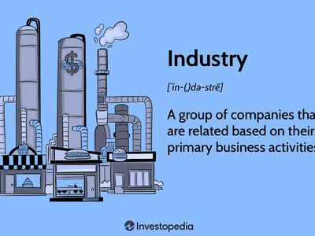

Understanding the nuances of the stock market is crucial for anyone involved in trading, particularly for those employing algorithmic strategies. As trading evolves with advancements in technology, it becomes increasingly important to have structured frameworks for categorizing financial data. This is where stock classification systems such as the Industry Classification Benchmark (ICB) and the Global Industry Classification Standard (GICS) play a pivotal role.

In the digital age, these two prominent systems have emerged to provide a standardized approach to categorizing companies and industries. ICB and GICS each offer a comprehensive framework that segments the vast landscape of the stock market into manageable sectors. Such structured classification is vital for the organization and analysis of financial data, ensuring that investors and traders can effectively assess and compare different companies and sectors.



Algorithmic trading, which employs pre-programmed instructions based on market conditions and historical data, stands to benefit tremendously from these classification systems. By leveraging ICB and GICS, traders can design algorithms that not only analyze past performance but also anticipate future market trends according to specific industries. This capability allows for more refined trading strategies that align with sector-specific insights, ultimately optimizing investment outcomes.

This article intends to explore the ways in which ICB and GICS stock classifications can be integrated into algorithmic trading frameworks. By examining these classification systems and understanding their application within trading algorithms, traders can enhance their strategy development process and maintain a competitive edge in the fast-paced world of financial markets.

## Table of Contents

## Understanding Stock Classification Systems

Stock classification systems are essential tools for organizing and analyzing financial markets by categorizing businesses into sectors and industries. This helps investors and traders make informed decisions. Two predominant classification systems globally recognized in this context are the Industry Classification Benchmark (ICB) and the Global Industry Classification Standard (GICS). These systems offer structured approaches that are invaluable when developing strategies in algorithmic trading, as they present various perspectives on market structures.

ICB, developed by FTSE Russell, provides a hierarchical classification framework that divides companies into 11 major industries, which are further segmented into 20 supersectors, 45 sectors, and 173 subsectors. This detailed stratification enables a granular analysis of market activities, aiding traders and investors in gaining deeper insights into specific areas of the economy.

In contrast, GICS, established by MSCI and S&P Dow Jones Indices, structures the market into 11 sectors, 24 industry groups, 69 industries, and 158 sub-industries. GICS focuses on grouping stocks based on their principal business activities, which facilitates a broader approach to understanding market trends and economic cycles.

From an [algorithmic trading](/wiki/algorithmic-trading) perspective, understanding these systems is fundamental. Algorithms often rely on historical and real-time data analysis. By categorizing stocks into defined sectors or industries, traders can enhance the precision of their trading algorithms. For instance, a trading algorithm might use GICS or ICB classifications to identify trends within a particular sector, improving forecasts and facilitating data-driven decision-making.

Both ICB and GICS provide different viewpoints of market structures, allowing investors and traders to choose according to their specific needs and strategies. Whether the focus is on a macro-level understanding of broader sectors or a micro-level analysis of niche market segments, these classification systems serve as crucial components in the toolkit of modern financial analysis.

## The Role of ICB and GICS in Algorithmic Trading

Algorithmic trading utilizes sophisticated computer algorithms to execute trades automatically based on pre-determined criteria. It fundamentally relies on the analysis of extensive market data to function effectively. The integration of stock classification systems such as the Industry Classification Benchmark (ICB) and the Global Industry Classification Standard (GICS) into algorithmic trading provides robust frameworks that add significant precision to algorithmic models.

ICB and GICS classifications offer deep insights into market segments which are crucial for the identification of trends within specific sectors. These classifications allow algorithms to perform sector-based analyses, refining the forecasting and decision-making processes. For example, by classifying companies into specific sectors and industries, traders can program algorithms to focus on historical performance patterns of these sectors. This capability enhances the algorithm's forecasting accuracy and can result in more informed trading decisions.

One practical application of these classification systems in algorithmic trading is in sector rotation strategies. These strategies involve reallocating investments across various sectors based on the phases of the economic cycle. By leveraging ICB and GICS, traders can dynamically adjust their portfolios. For instance, during an economic expansion, a strategy might favor sectors like technology or consumer discretionary, while shifting to more defensive sectors such as utilities or healthcare during downturns. This dynamic allocation helps in optimizing the return on investment over time.

Furthermore, utilizing ICB and GICS frameworks aids in risk mitigation through diversification. By categorizing stocks into different industries and sectors, traders can strategically spread their investments. This diversification reduces exposure to systematic risks associated with a single sector, thereby stabilizing returns even when certain parts of the market underperform.

In summary, the adoption of ICB and GICS classifications empowers algorithmic trading by enhancing market analysis capabilities, improving forecasting, and facilitating dynamic asset allocation. These systems not only bolster the resilience of trading algorithms against market [volatility](/wiki/volatility-trading-strategies) but also optimize investment strategies to align with varying economic conditions.

## Comparative Analysis: ICB vs GICS

Both the Industry Classification Benchmark (ICB) and the Global Industry Classification Standard (GICS) serve as essential tools for stock classification within the financial market, each offering unique perspectives that cater to different trading strategies and goals.

The ICB system is characterized by its finer granularity. This is due to its structure, which includes 11 industries, 20 supersectors, 45 sectors, and 173 subsectors. This detailed breakdown allows traders to implement more precise, sector-specific strategies. For instance, investors aiming to focus on highly specialized market segments may find ICB classifications beneficial. The greater detail in ICB can facilitate niche market analyses and enable traders to align their algorithmic strategies closely with specific sectors and subsectors. This can be particularly advantageous for those seeking to capitalize on detailed sectoral insights or emerging market trends.

Conversely, the GICS provides broader industry groupings, organizing stocks into 11 sectors, 24 industry groups, 69 industries, and 158 sub-industries. This system's structure is favored by traders seeking the stability and predictability offered by larger sector categories. GICS can be particularly useful for macro-level strategies that focus on significant market movements across broader sectors. The system provides a relatively straightforward framework for tracking global economic trends and implementing strategies that benefit from large-scale sectoral shifts.

The decision to use ICB or GICS often hinges upon specific trading objectives. Traders with a focus on detailed market segments may prefer ICB due to its nuanced classification capabilities. In contrast, those aiming for a holistic view of market dynamics might find GICS more suitable. Moreover, algorithmic traders can tailor the utilization of either classification system to fine-tune their models, enhancing the performance of their trading strategies according to the nature of their investment goals.

Ultimately, both ICB and GICS present flexible frameworks that, when leveraged effectively, can significantly enhance the decision-making processes within algorithmic trading. By aligning these classification systems with their trading strategies, traders can optimize investment outcomes and navigate the complexities of global financial markets with greater precision.

## Implementing Stock Classifications in Trading Algorithms

Integrating ICB and GICS classifications into trading algorithms begins with data acquisition, a crucial step where traders gather both historical and real-time stock data. This data must be meticulously structured according to either the ICB or GICS frameworks, allowing for enhanced analytical capabilities. By organizing the data in these classification systems, algorithms gain the ability to better analyze sector trends, stock performance, and market volatility, enabling a more nuanced understanding of market dynamics.

Once the data is appropriately classified, developers can program their algorithms to respond to specific industry indicators or economic conditions, which are inherently linked to particular classifications. For instance, an algorithm might be programmed to adjust its trading strategy based on changes in the consumer discretionary sector within the GICS structure. This adaptability is essential for capitalizing on sector-specific movements and optimizing trade execution.

Backtesting becomes an integral component of this process, enabling traders to evaluate the algorithm's performance under varying market conditions. By simulating trades over historical data that has been categorized using the ICB or GICS systems, developers can assess the efficacy of their strategies before deploying them in live markets. Backtesting helps in identifying potential weaknesses in the algorithm and provides insights into necessary adjustments.

Here's a simple example in Python, illustrating how [backtesting](/wiki/backtesting) might be structured using categorized data:

```python
import pandas as pd

# Load historical data
data = pd.read_csv('historical_stock_data.csv')

# Filter data based on ICB classification
icb_sector_data = data[data['ICB_Sector'] == 'Technology']

# Define a simple moving average strategy
def moving_average_strategy(data, short_window=40, long_window=100):
    signals = pd.DataFrame(index=data.index)
    signals['Signal'] = 0.0
    signals['Short_MA'] = data['Close'].rolling(window=short_window, min_periods=1, center=False).mean()
    signals['Long_MA'] = data['Close'].rolling(window=long_window, min_periods=1, center=False).mean()
    signals['Signal'][short_window:] = np.where(signals['Short_MA'][short_window:] > signals['Long_MA'][short_window:], 1.0, 0.0)
    signals['Positions'] = signals['Signal'].diff()
    return signals

# Apply the strategy
signals = moving_average_strategy(icb_sector_data)

# Evaluate performance
initial_capital = 100000.0
positions = pd.DataFrame(index=signals.index).fillna(0.0)
positions['Stock'] = 10 * signals['Signal']
portfolio = positions.multiply(icb_sector_data['Close'], axis=0)
pos_diff = positions.diff()
portfolio['Holdings'] = (positions.multiply(icb_sector_data['Close'], axis=0)).sum(axis=1)
portfolio['Cash'] = initial_capital - (pos_diff.multiply(icb_sector_data['Close'], axis=0)).sum(axis=1).cumsum()
portfolio['Total'] = portfolio['Holdings'] + portfolio['Cash']
portfolio['Returns'] = portfolio['Total'].pct_change()
```

Continuous refinement is necessary to ensure that trading algorithms remain effective and responsive to evolving market environments and classification updates. As market conditions change and industries evolve, so must the algorithms, requiring ongoing adjustments to maintain alignment with the most current market data and classification standards. Advanced techniques such as [machine learning](/wiki/machine-learning) can also be incorporated to enhance the adaptability and performance of trading algorithms, leveraging patterns identified within classification-based datasets to make predictions.

In summary, the integration of ICB and GICS stocks classifications into trading algorithms is a sophisticated process that enhances the ability to execute informed and precise trades. The initial steps of structuring data according to these classifications lay the groundwork for robust analysis, while the iterative process of programming, backtesting, and refining ensures that algorithms continue to deliver optimal performance in real-world trading scenarios.

## Case Studies and Real-world Applications

Numerous traders and financial institutions have successfully integrated ICB and GICS classifications into their algorithmic trading platforms, demonstrating their practical applications in the financial markets. For instance, some hedge funds have effectively utilized GICS classifications to enhance their quantitative models, particularly in developing sector rotation strategies. These strategies involve shifting investments between different sectors based on predictive analytics and economic indicators. By leveraging GICS, these hedge funds are able to categorize stocks clearly and identify sector-specific trends, allowing for more precise asset allocation decisions. 

Additionally, retail trading platforms have increasingly offered customizable algorithmic strategies using ICB classifications to cater to niche investor interests. These platforms harness the granularity offered by ICB to allow users to tailor their investment strategies towards specific industry segments, such as renewable energy or technology improvements. This customization is achieved by structuring algorithmic strategies that focus on subsectors identified within the ICB framework, providing traders with the flexibility to align their portfolios with personal investment goals or thematic trends.

These real-world applications underscore the potential of stock classifications like ICB and GICS to significantly augment algorithmic trading performance by improving the accuracy and effectiveness of investment strategies. As technology and data analysis techniques continue to evolve, even more sophisticated uses of these classification systems are anticipated. For example, advancements in machine learning and [artificial intelligence](/wiki/ai-artificial-intelligence) could further refine how these classifications are utilized in predicting market movements and optimizing portfolio compositions. 

The continuous development and innovation within algorithmic trading promise that ICB and GICS will remain instrumental in offering structured, data-driven insights into industry-specific dynamics, enhancing trading strategies' overall accuracy and profitability.

## Conclusion

ICB and GICS classifications provide pivotal frameworks that enrich the efficacy of algorithmic trading. By categorizing stocks into well-defined sectors, these systems enable algorithms to make informed, data-driven decisions. By utilizing these robust classification standards, traders and developers can accurately assess market trends and sector-specific dynamics, thereby tailoring their trading strategies with precision.

The implementation of ICB and GICS classifications into trading algorithms showcases notable potential for optimizing investment strategies across diverse market situations. Algorithms harness the structured data from these classifications to perform detailed analyses, leading to enhanced forecasting and decision-making capabilities. As a result, trading strategies not only gain from increased accuracy but also from the agility to adapt to fluctuating market conditions.

With continuous advancements in trading technologies, the strategic use of stock classifications like ICB and GICS will remain crucial to successful algorithmic trading. Emerging technologies such as machine learning and artificial intelligence are set to integrate even more seamlessly with these classification systems, offering insights that were previously unattainable. This integration underscores the importance for developers to ensure that their algorithms are both flexible and robust, capable of absorbing updates and improvements in classification methodologies.

Ultimately, for traders aiming to maintain a competitive edge, comprehending and leveraging ICB and GICS classifications is an essential part of their toolkit. Mastery of these systems equips traders with the ability to navigate the complexities of modern stock markets, thus securing their position in an increasingly data-driven financial arena.

## References & Further Reading

[1]: di Florio, M., & Rosa, F. (2014). ["Algorithmic trading and the GICS classification system."](https://pubmed.ncbi.nlm.nih.gov/25031441/) Wiley Finance.

[2]: MSCI. (2021). ["Global Industry Classification Standard (GICS)."](https://www.msci.com/our-solutions/indexes/gics) MSCI.

[3]: FTSE Russell. (2021). ["Industry Classification Benchmark (ICB)."](https://www.lseg.com/en/ftse-russell/industry-classification-benchmark-icb) FTSE Russell.

[4]: Chan, Ernest P. (2008). ["Quantitative Trading: How to Build Your Own Algorithmic Trading Business."](https://github.com/ftvision/quant_trading_echan_book) John Wiley & Sons.

[5]: Lopez de Prado, M. (2018). ["Advances in Financial Machine Learning."](https://www.amazon.com/Advances-Financial-Machine-Learning-Marcos/dp/1119482089) Wiley.

[6]: Jansen, S. (2020). ["Machine Learning for Algorithmic Trading."](https://github.com/stefan-jansen/machine-learning-for-trading) 2nd Edition.