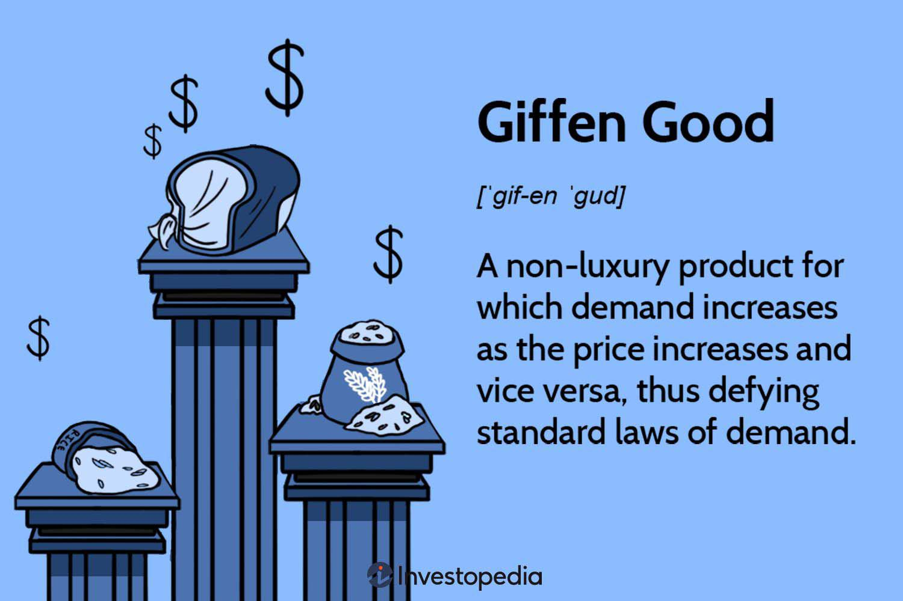

Giffen goods constitute a fascinating anomaly within economic theory, challenging traditional assumptions about consumer behavior and demand. Named after the Scottish economist Sir Robert Giffen, these goods defy the typical law of demand, which states that as the price of a good rises, the quantity demanded generally falls. For Giffen goods, an increase in price results in an increase in quantity demanded, illustrating a direct violation of the conventional downward-sloping demand curve. This paradox predominantly occurs under specific economic conditions, where consumers, constrained by limited income, prioritize the consumption of inferior goods over superior alternatives.

Consumer behavior in economics is studied through the lens of various theories, focusing on how individuals allocate their resources to maximize utility. The concept of utility refers to the satisfaction or benefit derived by consumers from consuming goods and services. Standard economic models propose that consumers seek to optimize their utility within their budget constraints, leading to the conventional classification of goods as normal or inferior based on income and substitution effects. While normal goods experience increased demand with rising income, inferior goods exhibit the opposite trend. However, the peculiar behavior of Giffen goods challenges these traditional categorizations by showcasing how, under certain circumstances, higher prices can lead to increased consumption.



Algorithmic trading, commonly referred to as algo trading, is a pivotal development in modern financial markets. It involves using complex algorithms and computational power to automate trading processes, enabling rapid execution of trades with minimal human intervention. This approach enhances efficiency and allows traders to manage large volumes of transactions while capitalizing on minute discrepancies in price movements. Algo trading has revolutionized finance by providing speed, precision, and the capacity to process vast data, shaping how financial strategies are conceived and executed.

This article aims to examine the intersection of Giffen goods, consumer behavior, and algorithmic trading, exploring the nuances of how these concepts interact. By understanding the unique nature of Giffen goods and the behavioral patterns of consumers, we can better appreciate the potential influences on algo trading strategies. As financial markets increasingly leverage algorithmic systems, recognizing the implications of atypical consumer behavior becomes crucial in formulating robust and adaptive trading algorithms. This exploration is significant for economists, traders, and policymakers, as it offers insights into the complex dynamics of economic anomalies and their potential impact on market efficiency and stability.

## Table of Contents

## Understanding Giffen Goods

Giffen goods represent a fascinating anomaly in economic theory, defying conventional demand laws. Unlike standard goods, where demand decreases as prices rise, Giffen goods exhibit an upward-sloping demand curve—meaning demand may increase when prices rise. This paradox is named after Sir Robert Giffen, who suggested that such goods existed based on observations of the bread consumption habits of poor households in 19th-century Britain [Marshall, 1895].

Historical and theoretical examples of Giffen goods often illustrate this counterintuitive concept. Bread and rice are commonly cited instances. For very low-income consumers, these staples constitute a significant portion of daily calories, with few if any, affordable substitutes available. When the price of bread or rice rises, these households may reduce consumption of more expensive alternatives (like meat) to maintain their caloric intake, thereby increasing their demand for the cheaper staple despite its higher price.

The emergence of Giffen goods can be explained through the concepts of income and substitution effects. Normally, when a good's price rises, the substitution effect leads consumers to purchase other goods instead. Conversely, the income effect reduces the overall purchasing power, leading to decreased consumption of normal goods. For Giffen goods, the income effect dominates the substitution effect. Considering a simple model:

$$

\text{Change in demand} = \text{Income effect} + \text{Substitution effect}
$$

For a Giffen good, the income effect is sufficiently large and negative, eclipsing the substitution effect.

Giffen goods play a significant role in consumer theory and market analysis. They challenge the typical assumptions about consumer rationality and demand elasticity. In practical terms, understanding these goods aids economists and market analysts in identifying situations where typical demand models may not apply. This necessitates more comprehensive models that can incorporate these anomalies, which often appear under conditions of extreme poverty or limited consumer choice.

In summary, Giffen goods challenge traditional economic paradigms, particularly those relating to demand theory. By considering the income and substitution effects, especially in socioeconomically constrained environments, economists can better anticipate consumer behavior that deviates from typical demand patterns. This deeper understanding is crucial not just for academic purposes but also for constructing more accurate economic models and informing policy decisions in economically disadvantaged regions.

## Consumer Behavior in Economics

Consumer behavior is a fundamental aspect of economic analysis, as it provides insights into how individuals make decisions about resource allocation. This behavior is largely driven by utility, a concept that represents the satisfaction or benefit derived from consuming goods and services. In economics, consumers are typically assumed to act rationally, seeking to maximize their utility given budget constraints.

To analyze consumer behavior, economists use demand curves, which graphically represent the relationship between the price of a good and the quantity demanded by consumers. Typically, demand curves slope downward, indicating an inverse relationship between price and quantity demanded. This reflects the law of demand: as the price of a good increases, the quantity demanded decreases, and vice versa. Elasticity further quantifies this relationship, measuring how sensitive the quantity demanded is to changes in price. Price elasticity of demand is given by the formula:

$$
E_d = \frac{\%\ \text{change in quantity demanded}}{\%\ \text{change in price}}
$$

Elasticity can vary across different goods. Goods with elastic demand experience significant changes in quantity demanded with price changes, while inelastic goods show little change. Giffen goods are a paradoxical exception, as they are inferior goods for which demand increases as price rises, due to the dominating income effect over the substitution effect in certain circumstances.

Consumer preferences can shift due to various factors—changes in income, tastes, or the prices of related goods, such as substitutes or complements. These shifts can affect the classification of goods. For instance, a good considered a luxury at low income levels could become a necessity if consumer income rises.

Different economic environments also impact consumer behavior, including the demand for Giffen goods. In subsistence economies, where consumers allocate most income to basic necessities, price increases for staple goods may lead to increased consumption of those goods, exemplifying the Giffen behavior. Conversely, in more developed economies with diverse consumption opportunities, such behavior might be less prevalent due to a higher ability to substitute goods.

Understanding these dynamics is crucial for economic analysis and policy-making, as they influence market strategies and the allocation of resources. Insights into consumer behavior help predict responses to market changes, inform the design of effective economic policies, and contribute to a comprehensive understanding of market mechanisms, including those involving exceptional cases like Giffen goods.

## Algorithmic Trading Basics

Algorithmic trading, often referred to as algo trading, involves the use of pre-programmed instructions or algorithms to execute trades in financial markets. These algorithms are capable of making trading decisions at speeds and frequencies that a human trader cannot match. The primary role of [algorithmic trading](/wiki/algorithmic-trading) in financial markets is to enhance the execution of trades, improve market [liquidity](/wiki/liquidity-risk-premium), and ensure market efficiency by reducing the discrepancies between trading prices and true market values.

At its core, algorithmic trading relies on computational power to process large amounts of financial data and execute trades based on pre-defined criteria. The basic mechanics involve setting up algorithms that analyze market data such as price, [volume](/wiki/volume-trading-strategy), and timing, and execute trades automatically when certain conditions are met. Algorithms can be programmed to follow simple logic like moving average crossovers or more complex patterns involving [machine learning](/wiki/machine-learning) techniques. Here is a simple example of an algorithmic trading strategy using a moving average crossover in Python:

```python
import pandas as pd

# Load historical data
data = pd.read_csv('historical_data.csv')
data['MA50'] = data['Close'].rolling(window=50).mean()
data['MA200'] = data['Close'].rolling(window=200).mean()

# Generate trading signals
data['Signal'] = 0
data['Signal'][50:] = np.where(data['MA50'][50:] > data['MA200'][50:], 1, 0) 
data['Position'] = data['Signal'].diff()

# Display the signals
print(data[['Date', 'Signal', 'Position']].head())
```

Algorithmic trading offers several advantages. Speed is a critical [factor](/wiki/factor-investing), as algorithms can execute trades in fractions of a second (often in milliseconds), allowing traders to take advantage of even the smallest market movements. Efficiency is another benefit, as these automated systems can simultaneously track numerous markets and trading instruments. Moreover, algo trading enables the handling of large trade volumes with minimal human intervention, reducing the risk of manual error.

Developing algorithmic trading strategies involves a thorough understanding of both financial markets and programming. Traders develop strategies based on historical data analysis and [backtesting](/wiki/backtesting) to ensure that they can generate a desired outcome. These strategies are typically built on various data types, including real-time and historical price data, economic indicators, and other quantitative measures. Advanced strategies may also incorporate news sentiment analysis, pattern recognition, and forecasting models driven by [artificial intelligence](/wiki/ai-artificial-intelligence) and machine learning.

The success of an algorithmic trading strategy hinges on the quality of data and the robustness of the algorithms used. With advancements in data analytics and computational methods, algo trading continues to evolve, offering sophisticated solutions for market participants seeking to optimize their trading performance.

## Intersection of Giffen Goods and Algorithmic Trading

Algorithmic trading (algo trading) platforms have the potential to identify market anomalies associated with Giffen goods by leveraging sophisticated data analysis techniques and real-time data processing capabilities. Giffen goods, which defy the traditional law of demand by increasing in quantity demanded as prices rise, present unique challenges and opportunities for algo trading systems. Understanding the anomalies associated with Giffen goods requires an in-depth analysis of consumer behavior and economic conditions, which can be capitalized upon by these platforms.

One of the primary challenges in programming trading algorithms to account for unique consumer behaviors, such as those observed with Giffen goods, is the need for these algorithms to comprehend the underlying economic drivers that result in the non-standard demand patterns. Algo trading relies heavily on historical data, statistical models, and machine learning techniques to predict market movements and execute trades. However, Giffen goods necessitate incorporating non-linear and counterintuitive demand responses into algorithms.

To illustrate, consider a basic python snippet that models a typical demand curve. For a Giffen good, the demand function might look contrary to expected economic behavior:

```python
import numpy as np
import matplotlib.pyplot as plt

# Assume a simplistic model for demonstration
prices = np.linspace(1, 10, 100)
demand_normal = 10 / prices  # Normal good demand decreases with price
demand_giffen = prices  # Giffen good, demand increases with price

plt.plot(prices, demand_normal, label="Normal Good")
plt.plot(prices, demand_giffen, label="Giffen Good", linestyle='--')
plt.xlabel('Price')
plt.ylabel('Demand')
plt.title('Demand Curves')
plt.legend()
plt.show()
```

Incase of Giffen goods, strategies that algo trading could apply include using regression models that adjust for income and substitution effects under specific socioeconomic conditions. Moreover, simulations and case studies have explored how algo trading might adapt in scenarios with Giffen goods or similarly inelastic products. For instance, during economic downturns or sharp income adjustments, populations may increase consumption of certain basic goods despite price increases. Algorithms designed to recognize these market settings not only enhance trading efficiency but also allow for better hedging strategies and improved asset allocations.

Large-scale algo trading on markets with a high presence of Giffen goods can lead to significant market impacts, primarily through increased price [volatility](/wiki/volatility-trading-strategies) and shifts in market dynamics. Algo trading could theoretically exploit the predictive power of identifying Giffen goods in specific markets, potentially leading to an altered understanding of market equilibrium as trading activity becomes more responsive to the unique demand characteristics of Giffen goods. Therefore, asset managers and traders may need to consider the broader implications and develop contingent strategies to mitigate unintended consequences of market manipulation.

To address these challenges in algo trading, continuous research is necessary to improve algorithm design with richer economic models encapsulating consumer behavior anomalies like Giffen goods. Integrating real-time socio-economic data and advanced behavioral models can enhance an algorithm's capability to adapt to various market scenarios swiftly and efficiently. Understanding and implementing constraints due to consumer behavior dynamics remain key to unlocking further improvements and achieving more robust algo trading systems in related financial markets.

## Future Implications and Considerations

Potential future developments in integrating consumer behavior analysis into algorithmic trading hold significant promise for enhancing market efficiency and understanding. As trading technologies advance, incorporating detailed consumer behavior models could enable algorithms to discern patterns indicative of Giffen goods and other non-standard economic phenomena. Algorithms could be programmed to analyze detailed consumption data, enhancing their ability to detect shifts in consumer behavior that prelude price movements, particularly in markets exhibiting atypical demand patterns.

For policymakers and economists, the ability to monitor markets with Giffen goods through a combination of comprehensive data analysis and algorithmic trading offers a powerful tool. By understanding how these goods react uniquely to changing economic conditions, policymakers can make more informed decisions regarding market interventions and subsidies. Economists can also leverage this understanding to refine economic models and better predict macroeconomic trends.

There are ethical and practical concerns associated with allowing automated systems to dominate markets characterized by complex economic dynamics, such as those with a high volume of Giffen goods. Algorithmic trading can exacerbate market volatility if not carefully managed, and the rapid execution speed may outpace the market's ability to absorb shock. Moreover, the opacity of algorithmic decision-making poses a risk to transparency and fairness. Regulators will need to establish frameworks that ensure ethical and equitable market participation, protecting against potential abuses of automated trading systems.

Future research should focus on several areas to enhance our understanding and management of these dynamics. First, developing algorithms that can process real-time data on consumer behavior with high accuracy will be crucial. This may involve advances in machine learning and data analytics that can parse large datasets effectively. Additionally, research should examine how algorithms can quantify and respond to the income and substitution effects that characterize Giffen goods. Exploring hybrid models that combine algorithmic insights with human expertise might offer a balanced approach that mitigates the risks of pure automation.

In conclusion, while the integration of consumer behavior analysis into algorithmic trading systems presents opportunities for advancing economic understanding and strategy execution, it also raises challenges that must be navigated carefully. Future work in this area promises to reshape financial markets, ensuring they function more effectively and equitably in the face of complex economic phenomena.

## Conclusion

This article has explored the distinct yet interconnected areas of Giffen goods, consumer behavior, and algorithmic trading, each offering unique insights into economic dynamics. Giffen goods challenge conventional economic theories by presenting scenarios where demand increases as prices rise, highlighting the paradoxical nature of economic behavior that defies traditional models of supply and demand. This anomaly underscores the intricate nature of consumer preferences and the influences that drive market demands, often linked to the concepts of income and substitution effects.

Understanding consumer behavior is foundational in economic analysis, focusing on how individuals make purchasing decisions based on utility, demand curves, and elasticity. The shifting nature of consumer preferences can have significant implications for market behavior, particularly when traditional classifications of goods, such as Giffen goods, come into play. The adaptability of consumer behavior in response to varying economic conditions further emphasizes the need for a nuanced approach in economic predictions and planning.

Algorithmic trading represents a fundamental shift in financial markets, leveraging computational algorithms and vast data analysis to execute trades with unprecedented speed and precision. This technological advancement brings the potential for higher efficiency and accuracy in managing trades, handling large volumes with minimal human intervention. The integration of such technology with the understanding of complex economic phenomena, like the behavior of Giffen goods, presents both opportunities and challenges for the financial markets.

The complexity inherent in these concepts is significant, as each adds layers of depth to our understanding of market operations within the broader financial ecosystem. As markets become increasingly automated, it remains crucial to explore how insights from consumer behavior can be utilized to refine algorithmic trading strategies and improve market outcomes. This encourages continued dialogue and research aimed at deciphering the intricacies of economic interactions and leveraging technology for enhanced market intelligence.

Looking ahead, the ongoing evolution of economic theories and trading technologies will undoubtedly shape financial landscapes. Exploring the synergy between economic behaviors, peculiar goods like Giffen goods, and advanced trading systems is vital for economists, policymakers, and financial analysts. These explorations offer pathways to more resilient and adaptable economic frameworks capable of withstanding the dynamic challenges of modern markets.

## References & Further Reading

[1]: Marshall, A. (1895). "Principles of Economics." London: Macmillan and Co., Ltd. - A foundational text discussing the concept of Giffen goods and consumer behavior in economic theory.

[2]: Bergstra, J., Bardenet, R., Bengio, Y., & Kégl, B. (2011). ["Algorithms for Hyper-Parameter Optimization."](https://dl.acm.org/doi/10.5555/2986459.2986743) Advances in Neural Information Processing Systems 24.

[3]: ["Advances in Financial Machine Learning"](https://www.amazon.com/Advances-Financial-Machine-Learning-Marcos/dp/1119482089) by Marcos Lopez de Prado - Discusses how machine learning can be integrated into algorithmic trading strategies to handle complex market phenomena.

[4]: Jensen, R. T., & Miller, N. H. (2008). "Giffen behavior and subsistence consumption." American Economic Review, 98(4), 1553-1577. - A study exploring empirical examples of Giffen behavior and its implications.

[5]: Arnuk, Sal, and Joseph Saluzzi. "Broken Markets: How High Frequency Trading and Predatory Practices on Wall Street are Destroying Investor Confidence and Your Portfolio." - An analysis of the impact of algorithmic trading on market efficiency and stability.

[6]: ["Quantitative Trading: How to Build Your Own Algorithmic Trading Business"](https://github.com/LucindaYa/quant-resources/blob/master/Quantitative%20Trading%20How%20to%20Build%20Your%20Own%20Algorithmic%20Trading%20Business.pdf) by Ernest P. Chan - Provides insights into creating and managing algorithmic trading strategies.