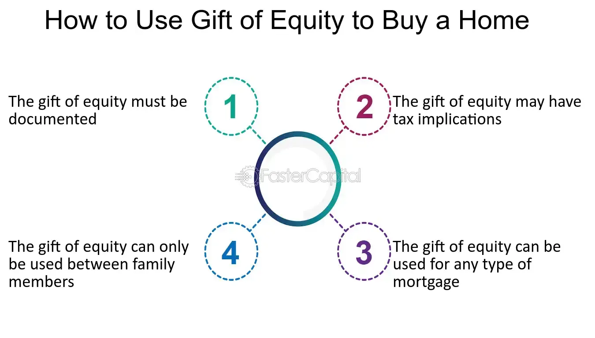

## Table of Contents

## What is a Gift of Equity?

A Gift of Equity is when someone sells their home to a family member or friend for less than what the home is worth. The difference between the sale price and the home's actual value is called the "gift of equity." This gift can help the buyer because it acts like a down payment, making it easier for them to get a mortgage.

For example, if a home is worth $200,000 and it is sold to a family member for $150,000, the gift of equity is $50,000. This $50,000 can be used as the down payment on the mortgage. This way, the buyer doesn't need to save up as much money before buying the home. It's a helpful way for family members to support each other in buying a home.

## How does a Gift of Equity work in real estate transactions?

A Gift of Equity happens when someone sells their home to a family member or friend for less than its market value. The difference between the sale price and the home's actual value is called the gift of equity. This gift helps the buyer because it can be used as a down payment on the mortgage. For example, if a house is worth $200,000 but is sold to a family member for $150,000, the gift of equity is $50,000. The buyer can use this $50,000 to make the down payment, which means they don't need to save up as much money before buying the home.

To use a Gift of Equity in a real estate transaction, the seller needs to provide a letter stating the gift amount and that no repayment is expected. This letter is important for the mortgage lender to approve the loan. The lender will also need an appraisal to confirm the home's value. Once everything is in order, the buyer can use the gift of equity to help secure their mortgage. This makes it easier for family members to help each other buy a home by reducing the upfront costs for the buyer.

## Who can give a Gift of Equity?

A Gift of Equity can be given by someone who owns a home and wants to sell it to a family member or close friend. This person is usually a parent, grandparent, or another relative who wants to help their loved one buy a home. They decide to sell the home for less than what it's worth, and the difference becomes the gift of equity.

The person giving the gift needs to write a letter saying how much the gift is and that they don't expect any money back. This letter is important because it helps the bank understand the deal. The bank will also check the home's value to make sure everything is fair. This way, the buyer can use the gift to help pay for the home and make buying it easier.

## Who can receive a Gift of Equity?

A Gift of Equity can be received by family members or close friends of the person who owns the home. Usually, it's someone like a child, grandchild, or a close relative who wants to buy a home but might not have enough money for a big down payment. The person giving the gift decides to sell their home to this family member or friend for less than what it's worth.

The person receiving the Gift of Equity can use the difference between the sale price and the home's actual value as a down payment on their mortgage. This makes it easier for them to buy the home because they don't need to save up as much money. The buyer just needs to make sure they have a letter from the seller stating the gift amount and that no repayment is expected, which helps the bank approve the loan.

## What documentation is required for a Gift of Equity?

For a Gift of Equity, the main document you need is a gift letter. This letter should be written by the person selling the home. It needs to say how much the gift of equity is and that the seller doesn't expect any money back from the buyer. This letter is important because it helps the bank understand the deal and approve the loan.

Another important document is the appraisal of the home. The bank will want to check the home's value to make sure the gift of equity is fair. The appraisal helps show that the home is worth what the seller says it is, and it helps the bank feel comfortable with the loan. With these documents, the buyer can use the gift of equity to help pay for the home and make buying it easier.

## How is a Gift of Equity different from a traditional gift?

A Gift of Equity is different from a traditional gift because it happens when someone sells their home to a family member or friend for less than its market value. The difference between what the home is worth and what it's sold for is the gift of equity. This gift can be used by the buyer as a down payment to help them buy the home. It's like a special kind of help that makes it easier for family members to buy a house because they don't need to save up as much money.

A traditional gift, on the other hand, is usually something like money, a present, or a service given without expecting anything back. It doesn't involve buying a home or a big purchase like a Gift of Equity does. While both types of gifts are given to help someone, a Gift of Equity is specifically tied to real estate and helping someone buy a home. It requires special paperwork, like a gift letter and an appraisal, to make sure everything is done correctly and legally.

## What are the tax implications of giving a Gift of Equity?

When someone gives a Gift of Equity, they need to think about taxes. If the gift is more than $18,000 in 2024, the person giving the gift might have to pay a gift tax. The IRS lets you give away a certain amount of money each year without paying taxes on it, and this amount is called the annual exclusion. If the Gift of Equity is bigger than this, the giver needs to file a gift tax return. But, they usually don't have to pay the tax right away because they can use their lifetime gift tax exemption, which is much bigger.

Also, if the home was the giver's main home and they made a profit when they sold it, they might not have to pay capital gains tax on that profit. The IRS lets you not pay taxes on up to $250,000 of profit if you're single, or $500,000 if you're married and filing taxes together. This rule only works if you lived in the home for at least two of the last five years. So, giving a Gift of Equity can be a smart way to help family buy a home and save on taxes too.

## What are the tax implications for the recipient of a Gift of Equity?

For the person receiving a Gift of Equity, there usually aren't any big tax issues to worry about. When someone gives you a home for less than it's worth, and you use that gift as a down payment, you don't have to pay taxes on it. The IRS sees this as a gift, and gifts aren't taxed for the person getting them. So, you can use the Gift of Equity to help buy your home without worrying about paying extra taxes.

However, it's a good idea to keep good records of everything. This includes the gift letter that says how much the gift was and that no repayment is expected. If you ever sell the home, the Gift of Equity might affect how much profit you make. When you sell, you might have to pay capital gains tax on the profit, but the Gift of Equity doesn't change your tax situation right away when you get it.

## What are the advantages of using a Gift of Equity in a property transaction?

Using a Gift of Equity can make it easier for someone to buy a home. When a family member or friend sells their home for less than it's worth, the buyer can use the difference as a down payment. This means the buyer doesn't need to save up as much money before they can buy the home. It's a big help, especially for young people or others who might not have a lot of money saved up yet.

Another advantage is that it can help keep the home in the family. Instead of selling the home to a stranger, a parent or grandparent can pass it on to their child or grandchild. This way, the home stays with loved ones, and everyone feels good about it. It's a way to share wealth and help family members without having to pay a lot of extra taxes right away.

## What are the potential disadvantages or risks associated with a Gift of Equity?

One risk of using a Gift of Equity is that it can affect the seller's finances. If the seller gives away a big part of their home's value, they might not get as much money from the sale. This can be a problem if they need that money for retirement or other important things. Also, if the gift is more than the annual gift tax exclusion, the seller might need to file a gift tax return, which can be complicated and might lead to tax issues down the road.

Another disadvantage is that it can create family tension. If one child gets a Gift of Equity and others don't, it might cause jealousy or arguments. It's important for families to talk openly about these things to avoid hurt feelings. Also, if the home's value goes down after the buyer gets it, they might end up owing more on their mortgage than the home is worth, which is a risky situation called being "underwater" on the loan.

## How does a Gift of Equity affect the mortgage process?

When someone uses a Gift of Equity to buy a home, it can make the mortgage process easier. The gift of equity acts like a down payment, which means the buyer doesn't need to save up as much money before they can get a loan. This is really helpful because it can make it possible for family members to buy a home when they might not have been able to otherwise. The buyer needs to show the bank a gift letter that says how much the gift is and that the seller doesn't expect any money back. This letter helps the bank feel comfortable about the loan.

However, the bank will also want to check the home's value with an appraisal. They need to make sure the home is worth what the seller says it is. If everything looks good, the bank will use the gift of equity as part of the down payment and approve the mortgage. But, if the gift is too big, it might affect the seller's taxes, so they need to be careful about that. Overall, a Gift of Equity can make buying a home easier, but it's important to do everything right to keep the bank happy and avoid any tax problems.

## Are there any legal considerations or restrictions when using a Gift of Equity?

When using a Gift of Equity, there are some legal things to think about. The person giving the gift needs to write a gift letter that says how much the gift is and that they don't expect any money back. This letter is important because it helps the bank understand the deal and approve the loan. Also, the bank will want to check the home's value with an appraisal to make sure everything is fair. If the gift is more than $18,000 in 2024, the person giving the gift might need to file a gift tax return, but they usually won't have to pay the tax right away because they can use their lifetime gift tax exemption.

There are also some rules about who can give and receive a Gift of Equity. Usually, it's family members or close friends who do this. The person giving the gift needs to own the home and want to sell it to their loved one for less than it's worth. The buyer can then use the gift as a down payment to help buy the home. It's a good idea to talk to a lawyer or a tax advisor to make sure everything is done right and to avoid any problems later on.

## References & Further Reading

[1]: Fishman, J. J. (2020). ["Real Estate Investing for Beginners: How to Invest Wisely and Maximize Your Profit"](https://www.businessinsider.com/personal-finance/investing/how-to-invest-in-real-estate-make-money).

[2]: Hatch, D. (2016). ["Real Estate Transfer, Finance, and Development: Cases and Materials"](https://www.amazon.com/Real-Estate-Transfer-Finance-Development/dp/0314288600).

[3]: Lopez de Prado, M. (2018). ["Advances in Financial Machine Learning."](https://www.amazon.com/Advances-Financial-Machine-Learning-Marcos/dp/1119482089)

[4]: Jansen, S. (2020). ["Machine Learning for Algorithmic Trading: Predictive Models to Extract Signals from Market and Alternative Data for Systematic Trading Strategies with Python."](https://github.com/stefan-jansen/machine-learning-for-trading)

[5]: Chan, E. P. (2009). ["Quantitative Trading: How to Build Your Own Algorithmic Trading Business"](https://github.com/ftvision/quant_trading_echan_book).

[6]: Aronson, D. R. (2007). ["Evidence-Based Technical Analysis: Applying the Scientific Method and Statistical Inference to Trading Signals"](https://www.amazon.com/Evidence-Based-Technical-Analysis-Scientific-Statistical/dp/0470008741).