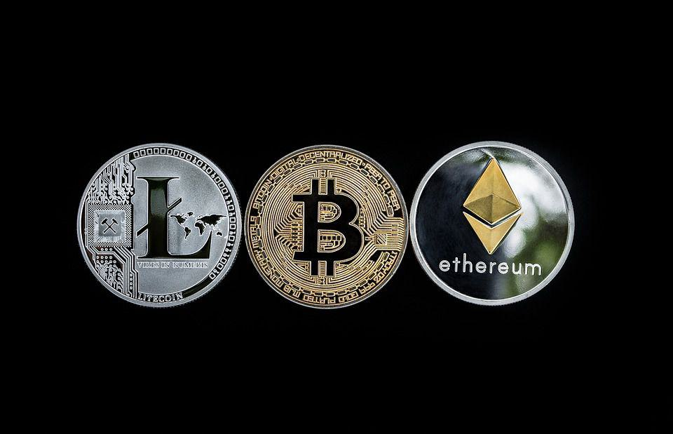

Cryptocurrency is no longer a fringe investment but has become an integrated part of modern financial ecosystems. As the acceptance of digital currencies grows, they are emerging as a mainstream gift choice, offering a novel way to introduce friends and family to cryptocurrency investments.

Gifting digital currency is not merely a speculative gesture but an invitation to participate in the dynamic world of crypto investments. This form of gifting can serve not only as a financial asset but also as an educational opportunity. Recipients can gain firsthand experience in managing digital currencies, understanding market dynamics, and potentially benefiting from asset appreciation.



This article aims to explore the various facets of gifting cryptocurrencies. The analysis will cover a wide array of topics, including the selection of the appropriate digital currency to gift, navigating various gifting methods and tools, and securing the gifted assets effectively. Furthermore, understanding the tax implications associated with gifting crypto is essential to ensure compliance with legal requirements.

Algorithmic trading (algo trading) emerges as a crucial strategy in this domain, allowing effective management of digital gifts. Algo trading involves using computer programs to execute trades at high speeds and efficiencies, making it particularly advantageous for handling cryptocurrencies, which are often characterized by volatility and rapid market changes. By leveraging algorithmic trading, one can optimize the growth and management of gifted digital assets over time.

In conclusion, as digital currency transforms into a mainstream gift choice, it is vital to approach the process with careful consideration and informed decision-making. By doing so, you offer a gift that extends beyond its monetary value, potentially setting the stage for future financial literacy and investment opportunities.

## Table of Contents

## Why Gift Digital Currency?

Cryptocurrencies have emerged as a notable asset class in modern finance, providing a unique and innovative gift idea that carries the potential for future value appreciation. The intrinsic appeal of cryptocurrencies as gifts lies in their dual nature as both a speculative investment and an introduction to the digital financial world, particularly for tech-savvy individuals.

The speculative allure of cryptocurrencies lies primarily in their market [volatility](/wiki/volatility-trading-strategies) and potential for significant returns. For recipients who are comfortable with digital and technological innovations, receiving a gift in the form of [cryptocurrency](/wiki/cryptocurrency) can be particularly attractive. Cryptocurrencies like Bitcoin and Ethereum have demonstrated considerable growth over the past decade, presenting an opportunity for substantial financial gain. This speculative edge makes them an appealing gift option, especially for those interested in exploring new financial frontiers.

Beyond their speculative characteristics, digital assets serve a broader purpose as educational tools. Gifting cryptocurrency can introduce recipients to the intricacies of blockchain technology and digital finance. It provides an experiential learning opportunity, equipping beginners with practical skills in managing and understanding digital currencies. As the financial world increasingly leans toward digitalization, such knowledge can be invaluable. Gifting digital currency conveys not just a present, but a chance to engage with the ongoing fintech revolution.

Moreover, the process of receiving and managing a cryptocurrency gift necessitates learning about digital wallets, security protocols, and potentially even blockchain technology, depending on the depth of engagement. This engagement fosters a deeper understanding of modern financial systems, which are becoming more integral to everyday transactions and investments.

In conclusion, gifting digital currency is a thoughtful option that aligns with contemporary financial trends and offers the recipient both the excitement of potential financial growth and the educational benefits of navigating an evolving digital landscape.

## Choosing the Right Cryptocurrency to Gift

When deciding to gift a cryptocurrency, it is essential to consider well-established digital currencies like Bitcoin and Ethereum, along with stable altcoins. Bitcoin, the first and most prominent cryptocurrency, is often perceived as a store of value akin to digital gold. Ethereum, on the other hand, offers a robust platform for decentralized applications and smart contracts, which expands its utility beyond simple transactions. These two examples provide a solid foundation due to their extensive adoption and [liquidity](/wiki/liquidity-risk-premium).

### Key Considerations:

#### Research and Trends
When selecting a cryptocurrency to gift, researching current market trends is crucial. For instance, Bitcoin and Ethereum have consistently shown resilience and growth potential, attracting both retail and institutional investors. Tools like CoinMarketCap and CoinGecko can be valuable resources for analyzing market performance, including historical charts and metrics such as market capitalization and trading [volume](/wiki/volume-trading-strategy).

#### Ease of Accessibility
Ease of access is another vital [factor](/wiki/factor-investing). Cryptocurrencies that are widely available across numerous exchanges, such as Coinbase, Binance, and Kraken, provide more flexibility and security for both the gifter and recipient. Accessibility also involves ensuring that the recipient can easily set up and use a wallet to manage their gifted assets effectively.

#### Recipient Interests
Consider the recipient's interests in the broader ecosystem of digital assets. For example, if they have an interest in decentralized finance (DeFi), Ethereum or related ERC-20 tokens may be more appealing. Alternatively, for environmentally-conscious individuals, cryptocurrencies with a focus on sustainability, like Cardano or Algorand, might be better suited.

### Evaluating Market Volatility and Growth Potential
Cryptocurrencies are known for their volatility, characterized by rapid and significant price fluctuations. Before selecting a cryptocurrency to gift, assess the volatility and growth potential of the options:

1. **Volatility Analysis**:
   Utilize standard deviation and average true range (ATR) to measure past price volatility. Higher volatility implies both potential for significant gains and risks of losses.
   ```python
   import numpy as np

   def volatility(prices):
       log_returns = np.diff(np.log(prices))
       return np.std(log_returns)

   prices = [45000, 47000, 46500, 48000, 47000]  # Example price list
   vol = volatility(prices)
   print(f"Volatility: {vol:.2%}")
   ```

2. **Growth Evaluation**:
   Examine the potential growth of a cryptocurrency by analyzing its development roadmap and technological advancements. Cryptocurrencies with active development teams and strong use cases are likely to provide better long-term growth opportunities.

By carefully selecting a cryptocurrency based on these considerations, you can ensure that your digital currency gift is not only meaningful but also positions the recipient to potentially benefit from its future growth.

## How to Gift Cryptocurrencies: Methods and Tools

Gifting cryptocurrencies involves various methods and tools, each tailored to different levels of familiarity and access to digital assets. The process begins with selecting a platform for purchasing or transferring cryptocurrencies. Popular exchanges like Coinbase and Binance offer user-friendly interfaces for buying digital currencies and transferring them to others. These platforms often provide reliable security measures, making them suitable for both novices and experienced users.

An alternative to direct buying and transferring through exchanges is using cryptocurrency gift cards. Platforms offering digital asset gift cards convert the purchase into redeemable codes. These codes can then be sent to recipients, who can redeem them on the respective platform to receive the cryptocurrency. This method simplifies the process and can be particularly useful for those unfamiliar with online exchanges and digital wallets.

Once the gift method is selected, it is essential to ensure the recipient has the necessary knowledge and tools to manage their newly acquired digital asset. For digital wallet transfers, the recipient must have a compatible wallet. Digital wallets can be broadly classified as hot wallets, which are connected to the internet, and cold wallets, which are not. Hot wallets like those available on mobile applications or desktop software provide convenient access but require adherence to security protocols to protect against breaches. Cold wallets, including hardware and paper wallets, offer increased security by keeping the assets offline.

Before finalizing the gift, encourage the recipient to gain a basic understanding of how to secure their cryptocurrency. This includes generating secure private keys, a critical component of wallet security. The storage and security mechanisms they choose will significantly impact their ability to protect their cryptocurrency from theft or loss. Providing guidance on setting up these security measures can be vital if the recipient is not already knowledgeable about cryptocurrency management.

Ensuring that the recipient is equipped with the knowledge of how to redeem, store, and secure their digital currencies enhances the utility of the gift and reduces the risk of losing the asset. Proper guidance can transform the gifting of cryptocurrency into not only an innovative present but also an educational experience that introduces the recipient to the burgeoning world of digital assets.

## Storing and Securing Cryptocurrency Gifts

Securing cryptocurrencies is fundamental to safeguarding the value of digital currency gifts. The decentralized and digital nature of cryptocurrencies makes them vulnerable to cyber threats, emphasizing the need for robust storage options and practices.

### Importance of Secure Storage Solutions

1. **Paper Wallets**: A paper wallet is a printed document containing the public and private keys used for accessing cryptocurrencies. It is considered secure because it is offline and immune to hacking attempts. However, it requires careful handling to prevent physical damage or loss.

2. **Hardware Wallets**: These are physical devices designed to store cryptocurrency offline, providing high-level security against online threats. Hardware wallets, such as Ledger and Trezor, keep private keys within the device, isolating them from internet-connected systems and minimizing exposure to malware.

3. **Protected Digital Wallets**: Software-based wallets that provide convenience and flexibility by allowing easy access to cryptocurrencies through computers or smartphones. It's crucial to use wallets with strong encryption and password protection. Utilizing two-factor authentication (2FA) adds an additional security layer.

### Best Practices for Offline Storage

- **Cold Storage**: This involves keeping cryptocurrency assets in an offline environment. Cold storage methods, like hardware and paper wallets, significantly reduce the risk of unauthorized access since they are not connected to the internet.

- **Secure Backup**: Regularly backing up private keys and important details is vital. Store backups in multiple safe locations to mitigate risks from theft or natural disasters.

- **Encryption**: Encrypt any digital files storing private keys or seed phrases to add an extra security layer. Strong encryption algorithms ensure that even if data is compromised, it remains inaccessible without the correct decryption key.

### Multi-Signature Authentication

Multi-signature (multi-sig) authentication enhances security by requiring multiple signatures (or approvals) before a transaction can occur. This means multiple keys are needed to authorize a transfer of funds. Multi-sig wallets provide an additional security layer, ensuring that unauthorized transactions are less likely and funds remain secure.

Implementing these secure storage solutions and practices helps protect cryptocurrency gifts from external threats and unauthorized access, thereby safeguarding their potential investment value.

## Understanding the Tax Implications of Gifting Crypto

Cryptocurrency gifts are treated under current tax laws in a manner similar to traditional assets and cash gifts. In the United States, the Internal Revenue Service (IRS) categorizes cryptocurrencies as property. Thus, the tax implications when gifting crypto are governed by rules applicable to gifting property. It's essential to understand both the annual gift tax exclusion and the reporting requirements to avoid unforeseen liabilities.

### Annual Gift Tax Exclusion

The annual gift tax exclusion allows individuals to give away a certain amount of money or property, including cryptocurrency, to others without incurring gift tax. As of 2023, the exclusion limit is $17,000 per year per recipient. This means an individual can gift up to $17,000 worth of cryptocurrency to any number of recipients without triggering the gift tax. For a married couple, this exclusion doubles, allowing them to jointly gift $34,000 per recipient annually.

The total gifted amount that remains under these limits does not necessitate the filing of a gift tax return (IRS Form 709). When the value of the gifted cryptocurrency exceeds these thresholds, the donor is required to file Form 709, although it may not immediately result in a gift tax liability due to the lifetime gift and estate tax exemption. As of 2023, the lifetime exemption is set at $12.92 million.

### Reporting Requirements and Tax Implications

When gifting cryptocurrency, the fair market value (FMV) at the time of the gift is essential for determining potential tax obligations. The donor should document the FMV of the cryptocurrency on the date of transfer, as this becomes the recipient's cost basis for any future sale or exchange of the cryptocurrency.

#### For Donors:

1. **Below Exclusion Limit**: If the crypto gift's value falls below the annual exclusion thresholds, no further action is required from the donor in terms of gift tax.

2. **Above Exclusion Limit**: The donor must file Form 709 if the gift's value surpasses the exclusion limit. However, no gift tax is owed unless the cumulative lifetime gifts exceed the lifetime exemption.

#### For Recipients:

Recipients of cryptocurrency gifts are not liable for receiving the gift, whether it is below or above the exclusion limit. However, they must consider tax implications when selling or converting the cryptocurrency. 

- The recipient's basis for capital gain tax is typically the lower of the donor’s basis or the FMV on the date of the gift, adjusted for any gift tax paid. 
- If the crypto is sold for more than this basis, the recipient may incur capital gains tax, subject to short-term or long-term tax rates, depending on the holding period.

### Potential Considerations

The dynamic nature of cryptocurrency values and regulatory policies complicates the gift tax landscape. Taxpayers should monitor legal updates and consult with tax professionals to ensure compliance. Moreover, proper documentation of transactions and understanding market volatility's impact on asset value at the time of gifting are crucial. By comprehensively grasping these guidelines, individuals can navigate the complexities of crypto gifting responsibly and efficiently.

## The Role of Algorithmic Trading in Cryptocurrency Management

Algorithmic trading has emerged as a pivotal method for managing digital assets, offering a systematic approach to trading cryptocurrencies. Also known as algo trading, this utilizes computer programs to execute trades based on predefined criteria. This method enhances the decision-making process, reduces human error, and can operate 24/7, which is particularly beneficial given the round-the-clock nature of cryptocurrency markets. 

One of the primary advantages of [algorithmic trading](/wiki/algorithmic-trading) in the context of managing gifted cryptocurrency is its potential for asset growth. Algo trading allows traders to capitalize on market inefficiencies and execute strategies that are not feasible manually due to the speed and complexity involved. By using statistical models and complex algorithms, it can assess and act on market conditions faster than a human trader. For instance, algorithms can be designed to conduct high-frequency trading ([HFT](/wiki/high-frequency-trading-strategies)), benefiting from small price imbalances with minimal time scale.

For beginners, there are several tools and platforms available to facilitate algorithmic trading in cryptocurrencies. Binance and Coinbase, for example, offer API access, enabling users to connect their trading bots and algorithms to their accounts. Additionally, platforms like 3Commas and Kryll provide user-friendly interfaces that allow users to create and test trading strategies using a drag-and-drop editor, without requiring extensive coding knowledge. These platforms often offer [backtesting](/wiki/backtesting) functionality, allowing users to test their algorithms against historical data to gauge performance before deploying them live.

In summary, algorithmic trading can significantly enhance cryptocurrency management by leveraging advanced technologies to exploit market opportunities that are otherwise inaccessible through manual trading. This enables individuals, particularly those new to the crypto world, to maintain and potentially grow their crypto gifts efficiently. As the technology and accessibilities expand, more beginners can access these sophisticated tools, ultimately democratizing the process of cryptocurrency trading.

## Conclusion

Digital currency stands as a progressive and insightful gift choice, symbolizing both personal affection and forward-thinking investment opportunity. As the world increasingly shifts towards digitization and decentralized finance, gifting cryptocurrency represents a prudent way for individuals to engage with these transformative economic frameworks. 

Through this act, recipients are not only presented with a potentially valuable asset but are also afforded the opportunity to engage with the burgeoning financial technology revolution. This participation encompasses understanding blockchain technology, exploring decentralized applications, and potentially benefiting from the appreciation of digital currencies.

Moreover, the process of gifting cryptocurrencies requires careful consideration in the selection of digital assets, as well as thoughtful planning in their transfer and secure storage. By choosing established cryptocurrencies and utilizing secure methods for their transfer and storage, givers can help ensure that these gifts serve their intended purpose without unforeseen security risks.

It is crucial to ensure that digital assets are gifted in a way that allows recipients to fully realize their potential benefits. This involves providing resources or guidance on how to manage and leverage this new form of currency effectively. This not only enhances the utility and security of the gift but also educates recipients as they navigate this innovative financial landscape. 

Ultimately, gifting cryptocurrency is more than just a transfer of digital wealth; it is an invitation to participate actively in a rapidly evolving economic system.

## References & Further Reading

[1]: Antonopoulos, A. M. (2014). ["Mastering Bitcoin: Unlocking Digital Cryptocurrencies."](https://books.google.com/books/about/Mastering_Bitcoin.html?id=IXmrBQAAQBAJ) O'Reilly Media.

[2]: Narayanan, A., Bonneau, J., Felten, E., Miller, A., & Goldfeder, S. (2016). ["Bitcoin and Cryptocurrency Technologies: A Comprehensive Introduction."](https://press.princeton.edu/books/hardcover/9780691171692/bitcoin-and-cryptocurrency-technologies) Princeton University Press.

[3]: De Filippi, P., & Wright, A. (2018). ["Blockchain and the Law: The Rule of Code."](https://www.jstor.org/stable/j.ctv2867sp) Harvard University Press.

[4]: Vigna, P., & Casey, M. J. (2016). ["The Age of Cryptocurrency: How Bitcoin and the Blockchain Are Challenging the Global Economic Order."](https://www.amazon.com/Age-Cryptocurrency-Blockchain-Challenging-Economic/dp/1250081556) St. Martin's Griffin.

[5]: Swanson, T. (2014). ["Great Chain of Numbers: A Guide to Smart Contracts, Smart Property and Trustless Asset Management."](https://s3-us-west-2.amazonaws.com/chainbook/Great+Chain+of+Numbers+A+Guide+to+Smart+Contracts%2C+Smart+Property+and+Trustless+Asset+Management+-+Tim+Swanson.pdf) CreateSpace Independent Publishing Platform.