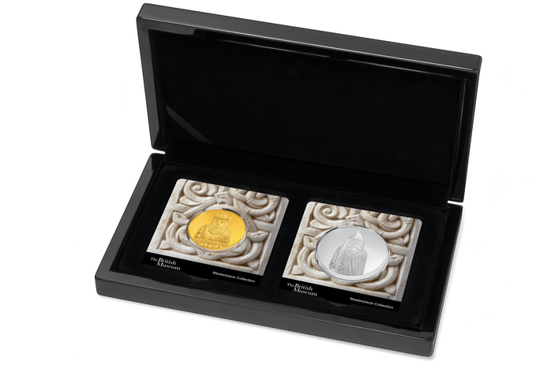

## Table of Contents

## What are the benefits of gifting gold and silver?

Gifting gold and silver is a great idea because these metals are valuable and keep their worth over time. When you give someone gold or silver, you're giving them something that can be worth a lot of money in the future. It's like giving a gift that keeps on giving. People often see gold and silver as safe investments, so it's a thoughtful and smart choice for a present.

Another benefit is that gold and silver are beautiful and can be made into jewelry or other nice things. When you give someone a gold or silver item, they can wear it or display it in their home. This makes the gift special and personal. It's not just about the money; it's also about the beauty and the joy it brings to the person receiving it.

Overall, gifting gold and silver combines the best of both worlds: it's a valuable investment and a beautiful, lasting gift. Whether it's for a birthday, wedding, or any special occasion, gold and silver make wonderful presents that the receiver will appreciate for years to come.

## How do gold and silver prices affect their value as gifts?

Gold and silver prices can change a lot, and this affects how much they are worth as gifts. When the prices go up, the gift becomes more valuable because it costs more money. This means the person getting the gift might be able to sell it for more money later if they need to. But if the prices go down, the gift might not be worth as much money as when it was given. So, the value of the gift can change over time based on what is happening with gold and silver prices.

Even though the prices can change, gold and silver are still seen as good gifts because they usually keep their value over the long term. People trust that gold and silver will always be worth something, even if the prices go up and down. This makes them special gifts because they are not just pretty to look at, but they also have a lasting value that can help the person receiving the gift in the future.

## What are the different forms of gold and silver that can be gifted?

Gold and silver come in many different forms that you can give as gifts. One common form is jewelry, like necklaces, bracelets, rings, and earrings. These are popular because they are beautiful and can be worn every day. Another form is coins, which are often collected by people who like history or investing. Gold and silver coins are usually made by governments and have special designs on them. Bars are another option; these are big pieces of gold or silver that are usually bought by people who want to invest in the metals.

You can also give gold and silver in the form of rounds, which are like coins but are not made by governments. Rounds often have designs that people like, such as animals or famous people. Another interesting form is gold or silver in jewelry that has special meaning, like a locket with a picture inside or a charm bracelet with charms that tell a story. For a more personal touch, you can get gold or silver items that are engraved with names or dates. All these different forms make gold and silver great gifts for many different occasions.

## How can one determine the purity of gold and silver gifts?

To find out how pure gold and silver gifts are, you can look at the markings on them. Gold usually has a number like 24K, 22K, 18K, or 14K. The K stands for karat, and it tells you how much of the item is pure gold. For example, 24K means the item is pure gold, while 18K means it is 75% gold. Silver items often have a stamp like 925, which means the item is 92.5% pure silver. These stamps help you know how much of the metal is real.

If you want to be sure about the purity, you can take the gift to a jeweler or a place that tests metals. They have special tools and machines that can check the metal and tell you exactly how pure it is. This is a good idea if you are not sure about the markings or if you want to be extra careful. Knowing the purity can help you understand the value of the gift and make sure you are getting what you paid for.

## What are the cultural significances of gifting gold and silver in different countries?

In many countries, gold and silver are seen as very special gifts because they are valuable and beautiful. In India, for example, gold is often given at weddings because it is a symbol of wealth and good luck. People give gold jewelry to the bride and groom to wish them a happy and prosperous life together. In China, gold is also a popular gift, especially during the Chinese New Year. It is believed to bring good fortune and happiness. Silver is sometimes given too, but gold is more common because it is seen as the color of wealth.

In the Middle East, gold is a traditional gift for many celebrations like weddings and births. It shows respect and love for the person receiving the gift. In some countries like Mexico, silver is very important because of its history and culture. People often give silver jewelry or items as gifts to remember their traditions and to honor their heritage. No matter where you are, giving gold and silver shows that you care a lot about the person you are giving it to, and it can bring joy and good wishes for the future.

## What are the tax implications of gifting gold and silver?

When you give gold or silver as a gift, you need to think about taxes. In the United States, if you give someone gold or silver worth more than $17,000 in a year, you have to report it on a gift tax return. This doesn't mean you have to pay tax right away, but it does count against your lifetime gift tax exemption, which is a lot of money. So, if you give away a lot of gold or silver over your lifetime, you might have to pay gift tax at some point.

In other countries, the rules can be different. For example, in India, if you give gold or silver as a gift, the person receiving it might have to pay tax if the gift is worth a lot of money. The rules depend on how much the gift is worth and who is getting it. It's a good idea to check the tax laws in your country before you give gold or silver as a gift, so you know what to expect.

## How should gold and silver gifts be stored and maintained?

To keep gold and silver gifts safe and shiny, you should store them in a cool, dry place. A good choice is a jewelry box with separate compartments so the pieces don't scratch each other. You can also use special cloth bags or pouches made for storing jewelry. These help protect the metal from air and dust, which can make it tarnish or lose its shine. If you have a lot of gold or silver, you might want to keep it in a safe or a safe deposit box at a bank to make sure it stays secure.

To keep your gold and silver looking nice, clean them regularly. You can use a soft cloth to gently wipe away any dirt or fingerprints. For silver, you can use a special silver polish to remove tarnish and bring back the shine. Gold usually doesn't tarnish, but if it gets dirty, you can clean it with a mild soap and water solution. Just make sure to dry it well after cleaning. By storing and cleaning your gold and silver gifts properly, you can enjoy them for a long time and keep them looking their best.

## What are the best practices for buying gold and silver as gifts?

When buying gold and silver as gifts, it's important to choose a trusted seller. Look for well-known jewelers or dealers who have good reviews. This helps make sure you are getting real gold and silver. Also, check the purity of the metal. Gold should have a stamp like 24K or 18K, and silver should have a stamp like 925. This tells you how much of the metal is pure. It's a good idea to ask for a certificate of authenticity, which can prove the gift is real and valuable.

Think about what the person you are buying for might like. Gold and silver come in many forms like jewelry, coins, and bars. Jewelry is nice because it can be worn and enjoyed every day. Coins and bars might be better for someone who likes to invest or collect things. Make sure to keep your budget in mind. Gold and silver can be expensive, so decide how much you want to spend before you start shopping. By following these simple steps, you can find a beautiful and meaningful gift that the person will love.

## How can one personalize gold and silver gifts?

Personalizing gold and silver gifts makes them even more special. One way to do this is by engraving the gift with a name, date, or a short message. For example, you could engrave a wedding date on a gold bracelet or a special message on a silver locket. This makes the gift unique and shows the person you care a lot about them. Another way to personalize is by choosing jewelry that matches the person's style. If they like simple designs, a plain gold chain might be perfect. If they like more detailed pieces, a silver necklace with a special charm could be a great choice.

You can also make the gift personal by choosing the right form of gold or silver. For someone who loves history, a gold or silver coin with a historical figure or event on it can be a meaningful gift. For someone who enjoys investing, a gold or silver bar might be the best option. By thinking about what the person likes and what is important to them, you can find a gold or silver gift that they will treasure for a long time.

## What are the investment aspects of gifting gold and silver?

Gifting gold and silver can be a smart move because they are good investments. These metals usually keep their value over time, which means the person getting the gift might be able to sell it later for a good price. Gold and silver are seen as safe investments because they don't lose their worth easily, even when other things like stocks or money go up and down. By giving someone gold or silver, you are giving them something that could help them in the future if they need money.

Another good thing about gifting gold and silver is that they can grow in value. Sometimes, the prices of gold and silver go up, which means the gift becomes worth more money. This can happen because of things like more people wanting to buy them or because the amount of gold and silver available goes down. So, when you give someone gold or silver, you are giving them a gift that might be worth even more later on. This makes it a thoughtful and helpful present that can benefit them for years to come.

## How does the market for gold and silver gifts fluctuate seasonally?

The market for gold and silver gifts changes during different times of the year. During big holidays like Christmas, Valentine's Day, and weddings, more people buy gold and silver gifts. This is because people want to give special presents to their loved ones. When a lot of people want to buy these gifts, the prices might go up because there is more demand. Also, during these times, shops might have sales or special deals to attract more buyers, which can affect the prices too.

But not all times of the year are the same. After the big holidays, the market might slow down a bit. Fewer people are buying gifts, so the prices might go down because there is less demand. This can be a good time to buy gold and silver if you want to save some money. It's important to keep an eye on the market and know when the busy and slow times are, so you can make smart choices about when to buy these gifts.

## What are the latest trends in gold and silver gifting?

People are now choosing more unique and personal gold and silver gifts. Instead of just giving plain jewelry, they are [picking](/wiki/asset-class-picking) pieces that can be engraved with special messages or names. This makes the gift feel more special and thoughtful. Another trend is giving gold and silver in forms like coins or bars, especially for people who like to collect or invest. These gifts are not just pretty to look at but also have a value that can grow over time.

Another big trend is eco-friendly and sustainable gold and silver gifts. More people want to know where their gold and silver come from and how they are made. They like to buy from companies that care about the environment and use fair practices. This makes the gift feel more meaningful because it supports good causes. Also, mixing gold and silver with other materials like wood or leather is becoming popular. These mixed pieces look different and can match many styles, making them great gifts for anyone.

## References & Further Reading

[1]: Bogle, G. (2011). ["Gold and Silver as Portfolio Diversifiers: The Case of US and UK Stocks."](https://www.bogleheads.org/forum/viewtopic.php?t=322342) Applied Financial Economics.

[2]: Levin, E.J., Montagnoli, A., & Wright, R.E. (2006). ["Short-run and Long-run Determinants of the Price of Gold."](https://strathprints.strath.ac.uk/7215/6/strathprints007215.pdf) World Gold Council.

[3]: McCown, J.R., & Zimmerman, J.R. (2006). ["Is Gold a Zero-Beta Asset? Analysis of the Investment Potential of Precious Metals."](https://papers.ssrn.com/sol3/papers.cfm?abstract_id=920496) The Journal of Investing.

[4]: Shapiro, C. (1988). ["Algorithmic Trading and the Impact on the Stock Market."](https://www.researchgate.net/publication/378548435_Algorithmic_Trading_and_AI_A_Review_of_Strategies_and_Market_Impact) The Journal of Finance, Vol. 43, No. 3.

[5]: Pavabutr, P., & Sirodom, K. (2010). ["The Role of Gold in Inflation-Hedging Portfolio."](https://scholar.google.com/citations?user=-Nyu6C8AAAAJ) Asian Academy of Applied Business Conference.