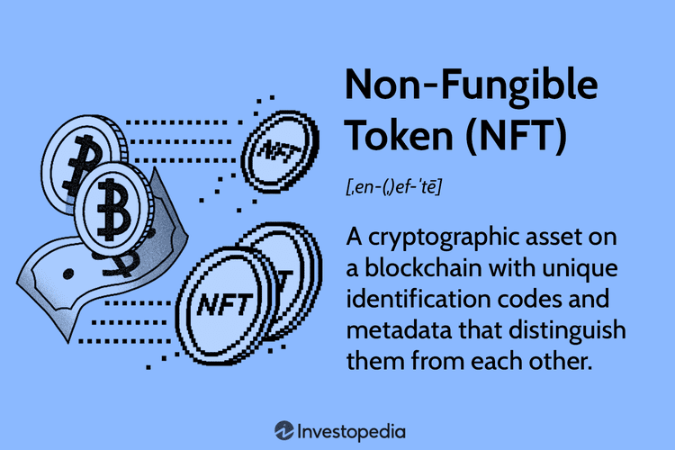

Digital gifts are transforming traditional concepts of gifting, with non-fungible tokens (NFTs) leading this innovative shift. NFTs provide a distinctive gifting experience through exclusive ownership embedded in the digital realm. Unlike conventional gifts that are tangible, NFTs represent ownership and authenticity of digital items such as art, music, and collectibles. This unique attribute of exclusivity and originality in the digital space offers a fresh and creative way to celebrate special occasions, appealing to tech-savvy individuals and collectors alike.

The convergence of algorithmic trading and digital currencies has introduced a modern twist to gift-giving, making it an exciting and sometimes speculative venture. Algorithmic trading, a method that uses algorithms to execute trading decisions, can enhance the experience by optimizing the buying and selling process of NFTs. This technological integration facilitates a more informed and strategic approach to gifting digital assets, aligning with contemporary trends in digital finance and investment.

This article examines the dynamic world of digital gifts, placing emphasis on NFTs as a medium for gift-giving. It further explores the intersection of NFT gifting with algorithmic trading, illustrating how these concepts can enrich the digital economy and the gifting experience. By understanding how NFTs function, their significance in the digital economy, and the intricacies involved in gifting them, individuals can make informed decisions that align with both personal preferences and the evolving digital landscape.

## Table of Contents

## What Are NFTs?

Non-fungible tokens (NFTs) are digital assets securely stored on a blockchain, serving as representations of ownership for unique items. Unlike cryptocurrencies such as Bitcoin or Ethereum, which are fungible and interchangeable, NFTs are distinct assets, each with its own unique properties and identity. This non-fungibility makes NFTs ideal for representing a wide array of unique digital items, including digital art, videos, music, virtual real estate, and even in-game items.

The primary characteristic of NFTs is that each token carries a unique identifier, essentially a digital certificate of authenticity, which differentiates it from any other token. This unique identifier is embedded within the NFT’s metadata, enabling it to hold specific information that distinguishes it from all others. This is what allows NFTs to cater to digital collectors who value originality, scarcity, and exclusivity.

The value of an NFT is largely determined by factors such as demand, scarcity, and the perceived value of the digital item it represents. Due to the intrinsic uniqueness of each NFT, the market for these tokens is highly speculative. Their prices can vary greatly based on trends, artist reputation, or the popularity of the content being tokenized. This demand-driven nature often results in wide price fluctuations, as seen in high-profile transactions where digital artworks and other NFTs have been sold for substantial sums.

NFTs operate on blockchain networks like Ethereum, which provide the necessary infrastructure to ensure the transparency and security of transactions. This decentralization means that ownership and transaction history are openly verifiable, adding an element of trust and integrity which is crucial in the digital economy.

The growing popularity of NFTs is attributed to their role in providing creators with new monetization avenues while offering buyers an opportunity to own verified, unique digital assets. Consequently, NFTs have carved out a particular niche within the digital economy, blending technology, art, and finance to create a dynamic market space.

## How to Gift an NFT

To gift an NFT, one must first acquire the digital asset from a reputable marketplace such as OpenSea, Rarible, or Foundation. These marketplaces offer a wide array of NFTs, enabling purchasers to choose from digital art, music, video clips, and more. After selecting an NFT, the buyer needs a digital wallet compatible with cryptocurrencies and blockchain operations. This wallet functions similarly to a physical wallet but in the digital domain, securely storing the purchased NFT alongside [cryptocurrency](/wiki/cryptocurrency) used for transactions.

Once the NFT is safely stored in the buyer's wallet, the next step is transferring it to the recipient's wallet address. This process demands precision since blockchain transactions are immutable—an incorrect address could result in irretrievable loss. Users must copy the recipient’s wallet address accurately, ensuring the correctness of each character in the alphanumeric sequence.

Considerations should also be given to the recipient’s interests. NFT gifting can be more meaningful when the digital asset aligns with the recipient’s preferences, whether in digital art, gaming assets, or other collectible items. Understanding what type of NFTs the recipient values can enhance the gift's personal touch.

Some NFT marketplaces simplify the gifting process by offering specific gifting features. These features automate the transfer process and reduce the chances of human error, ensuring a smooth transition of ownership. By utilizing these tools, one can efficiently transfer NFTs, making the process both seamless and secure for the giver and the recipient.

## Key Considerations for NFT Gifting

When gifting an NFT, there are several critical considerations to ensure a smooth and secure transaction. Firstly, it is imperative to verify the recipient's wallet address accurately. Blockchain transactions are immutable, meaning once an NFT is transferred, it cannot be undone. A simple error in the wallet address can lead to a permanent loss of the digital asset. Double-checking the address will help mitigate this risk.

Transaction fees, also known as gas fees in the context of Ethereum-based NFTs, play a significant role in the overall cost of your digital gift. These fees fluctuate based on network congestion and can occasionally be high. Tools like Ethereum Gas Tracker can provide real-time insights into current fees, allowing you to decide on the optimal time for transactions without incurring unnecessary costs.

Understanding the legal and tax implications of NFT transactions is crucial, particularly with regards to IRS regulations. As NFTs are considered taxable digital assets, gifting them can have associated tax consequences. It's advisable to consult a tax professional or familiarize yourself with the relevant tax laws to avoid potential liabilities. In the U.S., for example, gifts exceeding a certain value may require the filing of a gift tax return.

NFTs offer substantial creative potential, enabling the personalization of gifts to enhance their sentimental value. You can select NFTs that align with the recipient's interests, such as digital art, music, or virtual real estate. Some platforms allow customization or the creation of new NFTs, offering a unique personalized experience.

Security is paramount when dealing with NFTs. Both the giver and the recipient must adopt stringent security practices to safeguard digital wallets and private keys from unauthorized access. This involves using hardware wallets, activating two-[factor](/wiki/factor-investing) authentication, and staying informed about phishing scams and other security threats. Educating the recipient about these measures ensures that the NFT remains a secure and cherished possession. 

Overall, attention to detail in verifying details, understanding associated costs and legal obligations, and prioritizing security will enhance the NFT gifting process.

## NFT Gifting and Algorithmic Trading

The intersection of NFTs and [algorithmic trading](/wiki/algorithmic-trading) introduces a dynamic landscape for digital investors, combining the uniqueness of digital collectibles with the precision and speed of automated trading strategies. Algorithmic trading employs computer algorithms to determine optimal buying and selling times by analyzing market data and trends. In the case of NFTs, these algorithms can process large volumes of data including historical prices, transaction volumes, and even sentiment analysis from social media or news sources to make informed decisions.

Investors leverage these algorithms to automate trades, which increases efficiency and potentially enhances profitability. Automation minimizes human error and adds consistency to trading strategies, leading to better execution in markets that are often volatile and can change rapidly. For NFTs, where values can fluctuate significantly based on factors like scarcity and demand spikes driven by hype or new collaborations, algorithmic trading can pinpoint the right moments for executing trades, thereby optimizing returns.

Gifting NFTs embodies a novel way to acquaint loved ones with these sophisticated investment strategies. By gifting digital assets, one not only offers a unique collectible but also introduces the recipient to concepts of digital asset management and algorithmic trading. This can spark interest in the broader digital economy and encourage further exploration of digital investments.

Understanding the interaction between algorithmic trading and NFT pricing and sales is critical as the digital marketplace expands. As NFTs continue to gain popularity, the implementation of algorithmic trading could play a pivotal role in defining their market dynamics. For potential investors and gift givers, grasping these relationships will be essential for participating effectively in the evolving digital economy.

## Conclusion

Digital gifts, particularly non-fungible tokens (NFTs), represent a modern and distinctive approach to gifting that contrasts with traditional methods. Unlike conventional gifts, NFTs provide unique experiences due to their inherent rarity and digital exclusivity. This distinctiveness makes them an increasingly favored option among tech-savvy individuals and art enthusiasts alike, as they allow for the gifting of exclusive digital art, music, and collectibles with verifiable ownership status.

The merging of algorithmic trading with NFT gifting introduces a new layer of excitement by offering strategic insights into digital asset transactions. Through sophisticated algorithms, investors and gifters can optimize the timing and profitability of NFT purchases and sales, thus enhancing the potential impact and value of their gifts. This intersection not only adds a speculative element but also broadens the appeal of NFTs as gifts that can appreciate over time.

As the digital landscape continues to evolve, staying informed about trends and technological advances is crucial for making informed decisions, whether for gifting or investing purposes. Keeping abreast of these changes ensures that individuals can leverage the latest innovations to their advantage, enhancing the overall experience and potential benefits of digital gifting.

By embracing NFTs as digital gifts, one opens up a world of endless possibilities for enriching digital portfolios and sharing innovative and meaningful presents. As these assets continue to gain popularity and integration into the digital economy, they represent an exciting frontier in the future of gifting, offering creative and investment opportunities in equal measure.

## References & Further Reading

[1]: Ethereum. ["Non-Fungible Tokens (NFTs)."](https://ethereum.org/en/nft/) Ethereum.org.

[2]: Janson, M. (2021). ["NFTs and the Future of Art."](https://dl.acm.org/doi/10.1145/3474355) The Harvard Gazette.

[3]: Lopez de Prado, M. (2018). ["Advances in Financial Machine Learning."](https://www.amazon.com/Advances-Financial-Machine-Learning-Marcos/dp/1119482089) John Wiley & Sons.

[4]: Greenspan, D. (2021). ["Mastering Bitcoin: Unlocking Digital Cryptocurrencies."](https://books.google.com/books/about/Mastering_Bitcoin.html?id=IXmrBQAAQBAJ) O'Reilly Media.

[5]: Antonio, M. (2021). ["The NFT Handbook: A Detailed Guide on How One Can Create, Sell and Buy Non-Fungible Tokens Without Stress."](https://www.amazon.com/NFT-Handbook-Create-Non-Fungible-Tokens/dp/111983838X) Independently Published.

[6]: Chan, E. (2008). ["Quantitative Trading: How to Build Your Own Algorithmic Trading Business."](https://github.com/ftvision/quant_trading_echan_book) John Wiley & Sons.