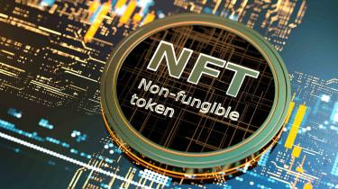

## Table of Contents

## What are Non-Fungible Tokens (NFTs)?

Non-Fungible Tokens, or NFTs, are special digital items that you can own and trade online. Unlike regular money or cryptocurrencies like Bitcoin, which are all the same and can be swapped one for another, each NFT is unique. This means that if you own an NFT, you have something that no one else has, kind of like owning a one-of-a-kind piece of art.

NFTs are used to represent things like art, music, videos, and even virtual real estate. They are stored on a blockchain, which is a secure way to keep track of who owns what. Because NFTs are on a blockchain, it's easy to prove who owns them and they can be bought and sold easily online. This has made them popular in the world of digital art and collectibles, where people want to own unique items and show them off.

## How do NFTs work as gifts?

NFTs can be great gifts because they are unique and can be easily sent to someone else. If you want to give an NFT as a gift, you just need to transfer it from your digital wallet to the recipient's wallet. This is like sending an email, but instead of words, you're sending a special digital item. The person receiving the NFT will then own it and can keep it or even sell it if they want to.

When you give an NFT as a gift, it's important to make sure the person you're giving it to knows how to use it. They'll need a digital wallet to receive and store the NFT. You might need to help them set this up or explain how it works. Once they have the NFT, they can show it off to their friends or use it in online games and communities where NFTs are popular. It's a cool way to give something that's both personal and part of the digital world.

## What platforms can be used to gift NFTs?

You can use different websites and apps to give NFTs as gifts. Some popular places are OpenSea, Rarible, and Foundation. These platforms let you pick an NFT you want to give, and then you can send it to your friend's digital wallet. It's like sending a digital birthday card, but instead of a card, you're sending a unique piece of art or something else cool.

To use these platforms, you'll need to have a digital wallet set up. This is like a special online account where you can keep your NFTs. Once you have your wallet ready, you can go to the platform, choose the NFT you want to gift, and send it to your friend's wallet address. It's easy and fun, and your friend will get a special surprise that they can keep or share with others.

## What are the benefits of gifting NFTs?

Gifting NFTs is a cool way to give someone something special. Each NFT is one-of-a-kind, so when you give one as a gift, you're giving something that no one else has. It's like giving a unique piece of art or a special collectible. Your friend can keep it forever or even sell it if they want to. It's a fun way to share something from the digital world that they can show off to their friends.

Another good thing about gifting NFTs is that it's easy to do. You just need to send the NFT from your digital wallet to your friend's wallet. It's like sending an email, but instead of words, you're sending a cool digital item. Plus, it can be a great way to introduce someone to the world of NFTs and digital art. They might even start collecting their own NFTs after getting one as a gift.

## What types of NFTs are suitable for gifting?

When you're thinking about gifting an NFT, art NFTs are a great choice. These are digital pictures or designs that can be really beautiful or funny. They're like owning a special piece of art that you can show to your friends online. Art NFTs can be anything from paintings to cool graphics, and they're perfect for someone who loves art or wants something unique to keep or show off.

Another type of NFT that makes a good gift is music NFTs. These are songs or albums that you can own as a digital item. If your friend loves music, they'll be excited to get a song or album that they can keep forever. It's like giving them a special record that they can listen to and share with others.

You can also think about gifting gaming NFTs. These are items you can use in video games, like special weapons or characters. If your friend loves playing games, they'll be thrilled to get something they can use in their favorite game. It's a fun way to give them something they can enjoy while playing.

## How can someone create an NFT to gift?

Creating an NFT to gift is pretty easy. First, you need to make the digital item you want to turn into an NFT. This could be a drawing, a piece of music, or even a video. Once you have your item ready, you'll need to use a special website or app called an NFT marketplace, like OpenSea or Rarible. You'll need to set up a digital wallet to store your NFT and some [cryptocurrency](/wiki/cryptocurrency) to pay for the fees. Then, you can upload your digital item to the marketplace and follow the steps to turn it into an NFT.

After you've created your NFT, you can gift it to your friend. You do this by sending the NFT from your digital wallet to your friend's wallet. It's like sending an email, but instead of words, you're sending your special digital item. Make sure your friend has a digital wallet set up so they can receive the NFT. Once they get it, they'll have a unique gift that they can keep or even sell if they want to. It's a fun way to share something personal and special from the digital world.

## What are the costs associated with gifting NFTs?

Gifting NFTs can come with some costs. First, you need to pay for the gas fees when you create the NFT. Gas fees are what you pay to use the blockchain, kind of like paying for gas to drive a car. These fees can change depending on how busy the blockchain is, but they can be a few dollars or more. Also, if you're buying an NFT to gift, you'll need to pay for the NFT itself, which can cost anywhere from a few dollars to thousands, depending on what it is.

Another cost to think about is the fee for transferring the NFT to your friend's wallet. This is usually a small amount, but it's another gas fee you'll need to pay. So, when you're planning to gift an NFT, remember to think about these costs. It's a good idea to check the current gas fees and the price of the NFT you want to gift so you know what you'll be spending.

## What are the legal considerations when gifting NFTs?

When you gift an NFT, it's important to think about the legal stuff. First, you need to make sure you actually own the NFT you're giving away. If you created it, that's usually not a problem, but if you bought it, double-check that you have the right to give it away. Also, some NFTs might have special rules or licenses that say what you can and can't do with them. It's a good idea to read these rules before you gift the NFT to make sure you're not breaking any laws.

Another thing to think about is taxes. In some places, giving an NFT as a gift might be seen as a taxable event. This means you might have to pay taxes on the value of the NFT, especially if it's worth a lot of money. It's smart to check the tax laws in your country or talk to a tax expert to make sure you're doing everything right. Remember, laws about NFTs can be different in different places, so it's always good to do a little research before you gift one.

## How can the value of an NFT gift be assessed?

The value of an NFT gift can be assessed by looking at a few things. First, you can check what similar NFTs have sold for recently. Websites like OpenSea or Rarible show past sales, so you can see if other NFTs like yours sold for a lot or a little. Also, think about who made the NFT. If it's by a famous artist or a popular creator, it might be worth more. The story behind the NFT, like if it's part of a special collection or has a cool history, can also make it more valuable.

Another way to figure out the value of an NFT gift is to look at how much people want it. If lots of people are trying to buy the same kind of NFT, it might be worth more because it's in high demand. You can also see if the NFT has any special features or uses, like if it can be used in a game or gives you access to something exclusive. All these things can help you understand how much your NFT gift might be worth.

## What are the environmental impacts of gifting NFTs?

Gifting NFTs can have an impact on the environment because they use a lot of energy. NFTs are stored on something called a blockchain, which needs computers to work. These computers use a lot of electricity, and making that electricity can create pollution. The more NFTs people create and gift, the more energy is used, which can be bad for the environment.

But, there are ways to make gifting NFTs better for the environment. Some blockchains use less energy than others, so if you choose one of those, it can help. Also, some people are working on new ways to make NFTs that don't use as much energy. So, if you want to gift an NFT and care about the environment, you can look for these greener options.

## How can NFTs be integrated into traditional gift-giving occasions?

NFTs can be a cool addition to traditional gift-giving occasions like birthdays or holidays. Imagine giving someone a unique piece of digital art or a special song as an NFT. It's like giving them a one-of-a-kind gift that they can keep forever or even sell if they want to. You just need to make sure they have a digital wallet to receive the NFT, and then you can send it to them easily online. It's a fun way to mix the old tradition of gift-giving with something new and exciting from the digital world.

For occasions like weddings or graduations, NFTs can be a memorable gift too. You could create a personalized NFT, like a digital portrait or a video message, to celebrate the special day. This kind of gift shows that you put thought and effort into it, making it even more meaningful. Plus, since NFTs are stored on a blockchain, they are safe and can be passed down as a keepsake for years to come. It's a modern twist on traditional gift-giving that can make any occasion extra special.

## What are the future trends in gifting NFTs?

In the future, gifting NFTs might become even more popular as more people learn about them. They could become a common way to give special gifts for birthdays, holidays, or other celebrations. As technology gets better, it might be easier to create and send NFTs, making them a fun and easy choice for gifts. People might also start using NFTs to give personalized gifts, like digital art or music, that are unique to the person receiving them. This could make gift-giving more special and meaningful.

Another trend could be that NFTs become more eco-friendly. Right now, they use a lot of energy, which can be bad for the environment. But as people find new ways to make NFTs that use less energy, gifting them might become more popular because it's better for the planet. This could mean more people feel good about giving NFTs as gifts, knowing they're not harming the environment. It's exciting to think about how NFTs might change the way we give gifts in the future, making them more personal, easier, and greener.

## References & Further Reading

[1]: Ethereum. ["Non-Fungible Tokens (NFTs)."](https://ethereum.org/en/nft/) Ethereum.org.

[2]: Janson, M. (2021). ["NFTs and the Future of Art."](https://dl.acm.org/doi/10.1145/3474355) The Harvard Gazette.

[3]: Lopez de Prado, M. (2018). ["Advances in Financial Machine Learning."](https://www.amazon.com/Advances-Financial-Machine-Learning-Marcos/dp/1119482089) John Wiley & Sons.

[4]: Greenspan, D. (2021). ["Mastering Bitcoin: Unlocking Digital Cryptocurrencies."](https://books.google.com/books/about/Mastering_Bitcoin.html?id=IXmrBQAAQBAJ) O'Reilly Media.

[5]: Antonio, M. (2021). ["The NFT Handbook: A Detailed Guide on How One Can Create, Sell and Buy Non-Fungible Tokens Without Stress."](https://www.amazon.com/NFT-Handbook-Create-Non-Fungible-Tokens/dp/111983838X) Independently Published.

[6]: Chan, E. (2008). ["Quantitative Trading: How to Build Your Own Algorithmic Trading Business."](https://github.com/ftvision/quant_trading_echan_book) John Wiley & Sons.