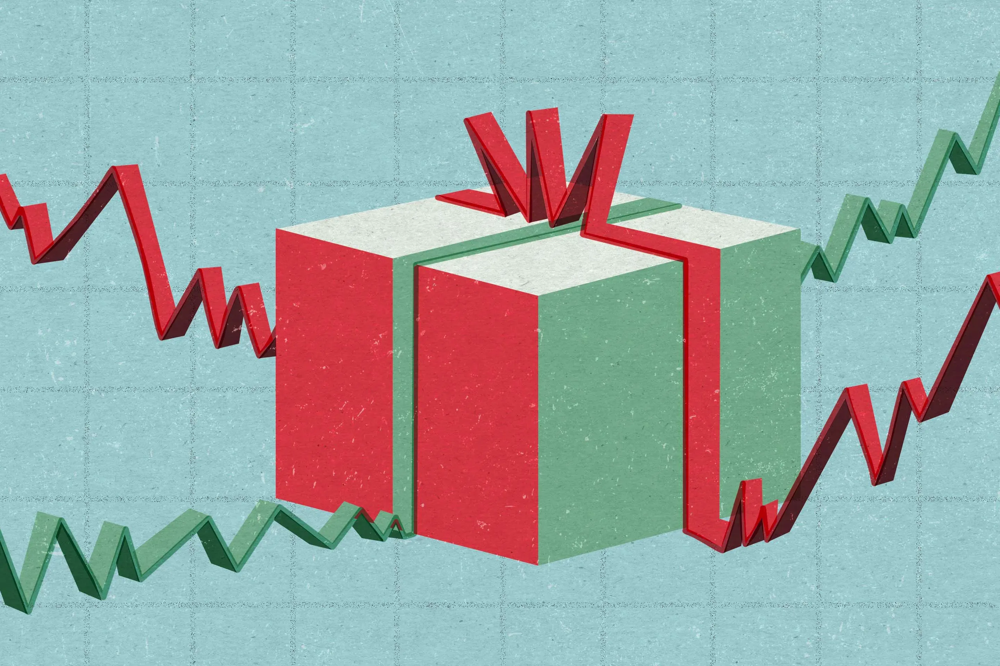

## Table of Contents

## What are stocks and how do they work as gifts?

Stocks are pieces of ownership in a company. When you buy a stock, you are buying a small part of that company. The price of a stock can go up or down based on how well the company is doing and what people think about it. If the company does well, the stock price usually goes up, and if the company does poorly, the stock price usually goes down. People buy stocks hoping that the price will go up so they can sell them for more money than they paid.

Stocks can also be given as gifts. If you want to give someone a stock as a gift, you can buy the stock and then transfer it into their name. This can be a special way to share in the success of a company you believe in. For example, if you think a company like Apple or Disney will do well in the future, you might buy some of their stock and give it to a friend or family member. It's a unique gift because it could grow in value over time, making it both thoughtful and potentially profitable.

## Why might someone consider gifting stocks during the holidays?

Gifting stocks during the holidays can be a special way to give a present that keeps on giving. Instead of giving something that might be used up or forgotten, a stock can grow in value over time. This means the person you give it to might get more money in the future if the company does well. It's like planting a seed that could turn into a bigger gift later on.

Also, giving stocks can be a way to teach someone about money and investing. If you give a stock to a young person, it can help them learn how businesses work and how to save and invest money. It's a thoughtful gift because it shows you care about their future and want to help them learn important life skills. Plus, it can be fun to watch a company you believe in together and see if it does well over time.

## How can stocks be gifted to someone who is new to investing?

Gifting stocks to someone new to investing is a great way to introduce them to the world of finance. You can buy the stock through a brokerage account and then transfer it to their name. This means you'll need to set up an account for them if they don't already have one. It's a bit like giving them a piece of a company that they can watch grow over time. It's a thoughtful gift because it can help them learn about how businesses work and how to save and invest money.

When you give stocks as a gift, you can choose a company that you think will do well in the future. Maybe it's a company like Disney or Apple that makes things they love. You can explain to them that if the company does well, the value of the stock might go up. This can be exciting for them to see their gift grow in value. It's also a good way to start talking about money and investing, which can be really helpful for their future.

## What are the steps to gift stocks during the holiday season?

Gifting stocks during the holiday season can be a special way to give a present that might grow in value over time. To start, you'll need to buy the stock you want to give. You can do this through a brokerage account, which is like a bank account but for buying and selling stocks. Once you've bought the stock, you'll need to transfer it into the name of the person you're giving it to. This means you might need to set up a brokerage account for them if they don't already have one. You can usually do this online or by calling the brokerage company.

After you've transferred the stock, you can tell the person about their new gift. You can explain that they now own a little piece of a company, and if that company does well, the value of their stock might go up. This can be a fun way to teach them about investing and how businesses work. It's a thoughtful gift because it shows you care about their future and want to help them learn important life skills. Plus, it can be exciting for both of you to watch the company and see if the stock grows in value over time.

## What are the tax implications of gifting stocks?

When you gift stocks, there can be tax things to think about. If the stock has gone up in value since you bought it, you might have to pay a tax called capital gains tax if you sell it. But if you give the stock as a gift instead of selling it, you don't have to pay that tax right away. The person who gets the stock might have to pay the tax later if they decide to sell it and it has gone up in value.

There's also something called the gift tax to think about. In the United States, if you give someone a gift worth more than a certain amount in a year, you might have to pay a gift tax. For 2023, that amount is $17,000 per person. So if you give someone stocks worth more than $17,000 in one year, you might have to pay a gift tax on the amount over $17,000. But most people don't have to worry about this because they don't give gifts that big. It's a good idea to talk to a tax person if you're not sure about the rules.

## How can one choose the right stocks to gift based on the recipient's interests?

Choosing the right stocks to gift can be fun if you think about what the person likes. If they love technology and always have the latest gadgets, you might think about giving them stocks from a company like Apple or Microsoft. These companies make things that they use every day, so they might be excited to own a little piece of them. Or if they are into video games, stocks from a company like Nintendo or Electronic Arts could be a great choice. By [picking](/wiki/asset-class-picking) a stock that matches their interests, you're giving them something that feels personal and exciting.

Another way to choose stocks is to think about what the person might want to learn about. If they are interested in the environment, you could give them stocks from a company that focuses on green energy, like Tesla or NextEra Energy. This way, they can learn about how businesses are trying to help the planet while also watching their gift grow in value. It's important to pick a company that you think will do well in the future, so the person you're gifting to can feel good about their new investment.

## What are the potential risks and rewards of gifting stocks?

Gifting stocks can be exciting because they might grow in value over time. If the company does well, the price of the stock can go up, which means the person you gave it to could make money if they decide to sell it later. It's like giving a gift that could keep on giving. Plus, it's a great way to teach someone about how businesses work and how to invest money. They can learn a lot by watching their stock and seeing how the company does over time.

But there are also risks to think about. The value of the stock can go down if the company doesn't do well. This means the person you gave it to could lose money if they sell it when the price is low. Stocks can be unpredictable, so it's important to understand that they might not always go up in value. It's a good idea to explain these risks to the person you're gifting to, so they know what they're getting into. This way, they can be ready for whatever happens with their stock.

## How can gifting stocks be used as a tool for financial education within the family?

Gifting stocks can be a great way to teach family members about money and investing. When you give someone a stock, you can explain how it works and why you picked that company. Maybe it's a company they like, or one that's doing something good for the world. You can talk about how the stock price might go up if the company does well, and how they can watch it over time. This helps them learn about how businesses work and how to save and invest money. It's like giving them a fun lesson that could also grow in value.

It's important to talk about the risks too. Stocks can go down in value if the company doesn't do well, so the person you give it to might lose money if they sell it at the wrong time. By explaining this, you help them understand that investing can be risky, but it can also be rewarding. This kind of open talk about money and investing can make them feel more comfortable with financial decisions in the future. It's a way to share knowledge and help them build a strong foundation for their financial future.

## What are the differences between gifting stocks directly versus through a custodial account?

When you gift stocks directly, you buy the stocks and then transfer them into the name of the person you're giving them to. This means they own the stocks right away and can decide what to do with them. It's a good way to give someone a gift that might grow in value over time. But, if the person you're giving to is under 18, they might not be able to manage the stocks themselves. You'll need to make sure they have a way to handle the stocks, like setting up a brokerage account in their name.

Gifting stocks through a custodial account is different. A custodial account is a special type of account where an adult manages the money or stocks for a child until they're old enough to take over. When you gift stocks this way, you put the stocks into the custodial account, and the adult in charge can make decisions about them until the child reaches the age of majority, which is usually 18 or 21, depending on the state. This can be a good choice if you want to give stocks to a younger family member because it helps them learn about investing while making sure the stocks are looked after until they're ready to manage them on their own.

## How can one monitor and manage gifted stocks after they have been given?

Once you've given stocks as a gift, it's important to keep an eye on how they're doing. You can do this by checking the stock price online through a website or app that shows stock prices. If you set up a brokerage account for the person you gave the stocks to, they can log into their account to see how the stocks are doing. You can also set up alerts to get emails or notifications when the stock price changes a lot. This way, you can both watch the stocks together and talk about what's happening with the company.

Managing gifted stocks means deciding what to do with them over time. If the stock price goes up a lot, the person who got the stocks might want to sell them to make some money. Or, if the stock price goes down, they might want to keep them and wait for the price to go back up. You can help them learn about these choices by talking about what's happening with the company and why the stock price is changing. It's a good way to teach them about investing and help them make smart decisions about their stocks.

## What are advanced strategies for gifting stocks, such as using dividend reinvestment plans (DRIPs)?

When you gift stocks, you can use something called a Dividend Reinvestment Plan, or DRIP, to help the stocks grow even more over time. A DRIP is a way to automatically use the money a company pays out as dividends to buy more shares of the same stock. This means that instead of getting cash from the dividends, the money is used to buy more stock. If you set up a DRIP for the stocks you gift, the person getting the stocks can slowly own more and more of the company without having to do anything. It's like a way to help their gift grow on its own.

Using a DRIP can be a smart move because it helps the person you're gifting to build up their investment over time. Let's say you give someone stocks in a company that pays good dividends. With a DRIP, those dividends are used to buy more shares, which can then pay more dividends, and so on. This can make the value of their gift go up faster than if they just kept the original shares. It's an advanced way to help someone learn about investing and see how their money can grow over the years.

## How do regulations and compliance affect the process of gifting stocks internationally?

When you want to gift stocks to someone who lives in another country, you have to think about the rules and laws of both your country and their country. Different countries have different rules about giving and getting stocks. For example, some countries might have special taxes or fees that you need to pay when you give stocks to someone there. You might also need to fill out special forms or get permission from the government to make sure everything is done the right way. It's important to check these rules before you give the stocks so you don't have any surprises later.

Another thing to think about is how the stock market works in the other country. Some countries have their own stock markets, and the stocks you want to give might not be easy to buy or sell there. You might need to work with a special kind of broker who knows how to handle stocks in different countries. This can make things a bit more complicated, but it's worth it if you want to give a special gift that could help someone learn about investing in their own country. Always make sure to talk to a financial expert who knows about international rules to help you through the process.

## References & Further Reading

[1]: ["The Little Book of Common Sense Investing: The Only Way to Guarantee Your Fair Share of Stock Market Returns"](https://www.amazon.com/Little-Book-Common-Sense-Investing/dp/1119404509) by John C. Bogle

[2]: ["The Intelligent Investor: The Definitive Book on Value Investing. A Book of Practical Counsel"](https://www.amazon.com/Intelligent-Investor-Definitive-Investing-Essentials/dp/0060555661) by Benjamin Graham

[3]: ["The Investor's Guide to Economic Fundamentals"](https://www.amazon.com/Investors-Guide-Economic-Fundamentals-Finance/dp/0470846909) by John Lankford

[4]: ["Algorithmic Trading: Winning Strategies and Their Rationale"](https://onlinelibrary.wiley.com/doi/pdf/10.1002/9781118676998.fmatter) by Ernest P. Chan

[5]: ["Common Stocks and Uncommon Profits"](https://www.amazon.com/Common-Stocks-Uncommon-Profits-Writings/dp/0471445509) by Philip A. Fisher

[6]: ["A Random Walk Down Wall Street: The Time-Tested Strategy for Successful Investing"](https://yourknowledgedigest.org/wp-content/uploads/2020/04/a-random-walk-down-wall-street.pdf) by Burton G. Malkiel