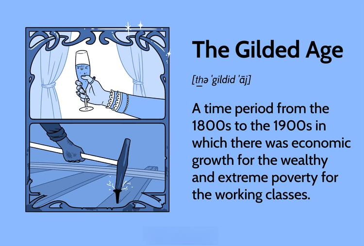

## Table of Contents

## What is the Gilded Age?

The Gilded Age was a time in American history from the 1870s to about 1900. It was called the Gilded Age because things looked shiny and rich on the outside, but there were many problems underneath. During this time, the country grew a lot. Big businesses and industries, like railroads and steel, became very powerful. People like Andrew Carnegie and John D. Rockefeller became very rich and were called "robber barons" because some people thought they got their money unfairly.

But not everyone was rich. Many people worked in factories for long hours and got paid very little. Cities grew quickly, and they were often dirty and crowded. There were big differences between the rich and the poor. Some people, like journalists and writers, started to talk about these problems. They were called "muckrakers" because they dug up the dirt on society. Eventually, these issues led to calls for changes, which helped start the Progressive Era, a time when people tried to fix these problems.

## When did the Gilded Age occur?

The Gilded Age happened from the 1870s to around 1900. It was a time when America was growing a lot. Big businesses and industries, like railroads and steel, were getting bigger and making a lot of money. People like Andrew Carnegie and John D. Rockefeller became very rich during this time. They were called "robber barons" because some people thought they got their money in unfair ways.

But not everyone was rich. Many people worked in factories and had to work long hours for little pay. Cities were growing fast, but they were often dirty and crowded. There was a big difference between the rich and the poor. Some people, called "muckrakers," started writing about these problems. They wanted to show the bad things happening in society. This led to people wanting changes, which helped start the Progressive Era, when people tried to fix these problems.

## What were the main economic activities during the Gilded Age?

During the Gilded Age, the main economic activities were centered around big businesses and industries. Railroads were a big deal because they helped move goods and people across the country. Steel was another important industry. People like Andrew Carnegie made a lot of money from steel. Oil was also becoming important, and John D. Rockefeller made a fortune from it. These industries helped the country grow and made some people very rich.

But not everyone was rich. Many people worked in factories and had to work long hours for little pay. They made things like clothes, tools, and machines. Farming was still important, but it was getting harder for farmers to make money because they had to compete with big businesses. The economy was growing, but it was also causing big differences between the rich and the poor.

## Who were some of the key figures of the Gilded Age?

During the Gilded Age, some key figures were very important. Andrew Carnegie was a big name in the steel industry. He made a lot of money and became one of the richest people in the world. John D. Rockefeller was another key figure. He made his fortune in the oil business and was known for being very smart with his money. These men were called "robber barons" because some people thought they got rich by taking advantage of others.

Another important person was Cornelius Vanderbilt. He was known for his work with railroads and shipping. He helped make it easier for people and goods to move around the country. J.P. Morgan was a big banker and helped many businesses grow by giving them money. On the other side, there were people like journalists and writers who tried to show the problems of the time. They were called "muckrakers." Ida Tarbell, for example, wrote about how Rockefeller got his money, which helped people see the unfair things happening.

## How did wealth distribution look during the Gilded Age?

During the Gilded Age, there was a huge gap between the rich and the poor. A few people, like Andrew Carnegie and John D. Rockefeller, became very rich from industries like steel and oil. They were called "robber barons" because some people thought they got their money unfairly. These rich people lived in big houses, had lots of money, and enjoyed a fancy lifestyle. But they were just a small part of the population.

Most people during the Gilded Age were not rich. Many worked long hours in factories for very little pay. They lived in crowded cities that were often dirty and unhealthy. Farmers also had a hard time because they had to compete with big businesses and didn't make much money. The difference between the rich and the poor was very big, and it caused a lot of problems. This led to people wanting changes, which helped start the Progressive Era, when people tried to fix these issues.

## What were the living conditions like for the working class during this period?

During the Gilded Age, life was really hard for the working class. They worked long hours in factories, often for very little money. A lot of them lived in crowded cities, where the houses were small and packed close together. These places were often dirty and not healthy. It was common for many families to share the same building, and there wasn't much space for everyone. The working class had to deal with bad air, dirty water, and diseases that spread easily in these crowded places.

The working class also didn't have many of the things we take for granted today. They didn't have good healthcare, and if they got sick, they might not be able to work and earn money. Kids often had to work too, instead of going to school, because their families needed the extra money. Life was tough, and there wasn't much help for people who were struggling. The big difference between the rich and the poor made things even harder for the working class during the Gilded Age.

## What role did industrialization play in the Gilded Age?

Industrialization was a big part of the Gilded Age. It was when factories and big machines started to be used a lot to make things like steel, oil, and clothes. This made it easier and faster to produce stuff, which helped the country grow. People like Andrew Carnegie and John D. Rockefeller got very rich from these industries. They built big businesses and made a lot of money. Railroads were also important because they helped move goods and people all over the country. This made it easier for businesses to sell their products everywhere.

But industrialization also caused problems. Many people had to work in factories, and they worked long hours for very little money. The factories were often dangerous, and people could get hurt. Cities got crowded and dirty because so many people moved there to find work. The rich got richer, but the poor stayed poor, and the difference between them got bigger. This made life hard for the working class. They lived in small, crowded houses and didn't have much help if they got sick or needed money. Industrialization changed the country a lot, but it also made life harder for many people.

## How did the Gilded Age contribute to social and economic inequality?

During the Gilded Age, the rich got a lot richer while the poor stayed poor. This was because big businesses and industries like steel, oil, and railroads made a few people very wealthy. People like Andrew Carnegie and John D. Rockefeller became known as "robber barons" because they made their money from these big industries. They lived in big houses and had lots of money, but they were just a small part of the population. The rest of the people worked long hours in factories for very little pay. This made the difference between the rich and the poor very big.

The working class had a hard time during the Gilded Age. They lived in crowded cities with small, dirty houses. They didn't have good healthcare, and if they got sick, they might not be able to work and earn money. Kids often had to work instead of going to school because their families needed the extra money. Industrialization made things worse because it created more factories and jobs, but the working conditions were bad. The rich got richer from industrialization, but it didn't help the poor. This big difference between the rich and the poor led to a lot of problems and made people want changes, which helped start the Progressive Era.

## What were some of the major social reforms attempted during the Gilded Age?

During the Gilded Age, people started to see the big problems between the rich and the poor. They wanted to make things better, so they tried to make some changes. One big change was trying to make working conditions better. People wanted shorter work hours and better pay for workers. They also wanted to make factories safer so people wouldn't get hurt as much. Another change was trying to help kids. People wanted to stop kids from working in factories and to make sure they could go to school instead.

Another important reform was trying to clean up the cities. People wanted to make them less dirty and crowded. They worked on getting better water and making sure the air was cleaner. They also tried to build better houses for people to live in. Some people, called "muckrakers," wrote about the problems they saw. They wanted to show everyone what was wrong so they could fix it. These reforms were the start of the Progressive Era, when people tried to make life better for everyone.

## How did the political landscape reflect the wealth and inequality of the Gilded Age?

During the Gilded Age, the political scene showed the big difference between the rich and the poor. Rich people like Andrew Carnegie and John D. Rockefeller had a lot of power. They could influence politicians and laws because they had a lot of money. They used their money to help politicians they liked, and sometimes they even paid them to do what they wanted. This made it hard for the government to help the poor people because the rich had so much control.

The poor people didn't have much power in politics. They couldn't give money to politicians like the rich could, so their voices weren't heard as much. Some people tried to change this. They wanted to make laws that would help the working class, like making factories safer and giving workers better pay. But it was hard to make these changes because the rich had so much control over the government. This led to a lot of frustration and eventually helped start the Progressive Era, when people tried to fix these problems.

## What were the long-term impacts of the Gilded Age on American society?

The Gilded Age had big effects on American society that lasted a long time. It helped the country grow a lot because of big businesses and industries like steel, oil, and railroads. This growth made America more powerful and helped it become a big player in the world. But it also made the difference between the rich and the poor much bigger. The rich got a lot richer, while many people stayed poor and had to work hard in factories for little money. This made people want to change things, and it led to the Progressive Era, when people tried to make life better for everyone.

The problems of the Gilded Age also changed how people thought about business and government. People started to see that big businesses could have too much power and that the government needed to help protect the working class. This led to new laws and rules to make factories safer and to give workers better pay and shorter hours. It also made people think more about how to make sure everyone had a fair chance to succeed. The Gilded Age showed that while growth and money were important, it was also important to make sure everyone could live a good life.

## How do historians view the Gilded Age in terms of its economic and social legacy?

Historians see the Gilded Age as a time when America grew a lot because of big businesses and industries like steel, oil, and railroads. This growth made America more powerful and helped it become a big player in the world. But it also made the difference between the rich and the poor much bigger. The rich got a lot richer, while many people stayed poor and had to work hard in factories for little money. Historians say this time showed how big businesses could make some people very rich, but it also showed the problems that came with that.

The social legacy of the Gilded Age is also important. Historians say it made people want to change things because they saw the big difference between the rich and the poor. This led to the Progressive Era, when people tried to make life better for everyone. They wanted to make factories safer, give workers better pay, and stop kids from working. The Gilded Age also made people think more about how to make sure everyone had a fair chance to succeed. Historians say it was a time that showed the good and bad sides of growth and money, and how important it is to make sure everyone can live a good life.

## References & Further Reading

[1]: Twitchell, J. B. (1999). ["The Gilded Age and the Carnegie Library."](https://archive.org/details/leadusintotempta0000twit) Library Journal, 124(18), 62.

[2]: Keller, M. (1994). ["Affluence and Influence: Economic Crisis and Political Change in America."](https://www.jstor.org/stable/j.ctt7s1jn) Printed for the Council on Foreign Relations by D.A.P., Distributed Art Publishers.

[3]: Ferguson, N. (2008). ["The Ascent of Money: A Financial History of the World."](https://archive.org/details/ascentofmoneyfin0000ferg) Penguin Books.

[4]: Strouse, J. (2000). ["Morgan: American Financier."](https://www.amazon.com/Morgan-American-Financier-Jean-Strouse/dp/0375501665) Harper Perennial.

[5]: Gordon, R. J. (2016). ["The Rise and Fall of American Growth: The U.S. Standard of Living since the Civil War."](https://www.jstor.org/stable/j.ctvc77bwm) Princeton University Press.

[6]: Chandler Jr., A. D. (1977). ["The Visible Hand: The Managerial Revolution in American Business."](https://www.jstor.org/stable/j.ctvjghwrj) Harvard University Press.

[7]: Ekelund Jr., R. B., & Hébert, R. F. (1997). ["A History of Economic Theory and Method."](https://books.google.com/books/about/A_History_of_Economic_Theory_and_Method.html?id=0c6rAAAAQBAJ) Waveland Press.

[8]: O'Sullivan, A., & Sheffrin, S. (2003). ["Economics: Principles in Action."](https://books.google.com/books/about/Economics_Principles_in_Action_2nd_Editi.html?id=vPxAHAAACAAJ) Pearson Prentice Hall.

[9]: Stiglitz, J. E. (2012). ["The Price of Inequality: How Today's Divided Society Endangers Our Future."](https://business.columbia.edu/sites/default/files-efs/imce-uploads/Joseph_Stiglitz/Price%20of%20Inequality%20for%20Sustainable%20Humanity.pdf) W.W. Norton & Company.

[10]: Aldrich, M. (1997). ["Safety First: Technology, Labor, and Business in the Building of American Work Safety, 1870-1939."](https://archive.org/details/safetyfirsttechn0000aldr) The Johns Hopkins University Press.