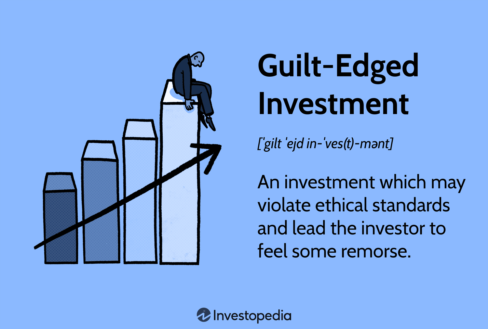

## Table of Contents

## What is a gilt-edged investment?

A gilt-edged investment is a type of investment that is considered very safe and reliable. These investments are usually government bonds or securities issued by stable governments, like those in the UK or the US. Because they are backed by the government, the risk of losing money is very low. People often choose gilt-edged investments when they want to keep their money safe rather than trying to make a lot of money quickly.

These investments are called "gilt-edged" because they are seen as being as good as gold. The term comes from the idea that something covered in gold is very valuable and trustworthy. Even though gilt-edged investments don't offer high returns, they are popular among investors who want to protect their money over the long term. They are especially appealing to people who are close to retirement or those who don't want to take big risks with their savings.

## Why are gilt-edged investments considered safe?

Gilt-edged investments are considered safe because they are backed by stable governments. When you buy a gilt-edged investment, you are basically lending money to the government. Since governments can usually pay back their loans, the risk of losing your money is very low. For example, if you buy a bond from the UK or the US government, you can be pretty sure that they will pay you back when the bond matures.

Another reason gilt-edged investments are safe is that they are less affected by market ups and downs. While other types of investments like stocks can go up and down a lot, gilt-edged investments stay more steady. This makes them a good choice for people who want to keep their money safe and don't want to worry about big losses. Overall, the safety of gilt-edged investments comes from the strong backing of the government and their stability in the market.

## What are the different types of gilt-edged securities?

Gilt-edged securities come in different types, but the most common ones are government bonds and treasury securities. Government bonds are loans that people give to the government. The government promises to pay back the money after a certain time and also gives interest payments regularly. These bonds are very safe because the government is behind them. In the UK, these are often just called "gilts." In the US, they are called "Treasuries."

Another type of gilt-edged security is treasury bills, which are also issued by the government. Treasury bills are different because they have a shorter time before they need to be paid back, usually less than a year. They don't pay interest like bonds do. Instead, you buy them at a lower price and get the full amount back when they mature. This makes them a safe and quick way to invest money. Both government bonds and treasury bills are considered very safe because they are backed by the government, making them gilt-edged securities.

## How do gilt-edged investments generate returns for investors?

Gilt-edged investments generate returns for investors mainly through interest payments. When you buy a government bond, you are lending money to the government. In return, the government pays you interest regularly, usually every six months or once a year. This interest is like a reward for letting the government use your money. The amount of interest you get depends on the bond's interest rate, which is set when you buy the bond. At the end of the bond's term, the government also gives you back the money you lent them, called the principal.

Another way gilt-edged investments can generate returns is through treasury bills. Treasury bills are different because they don't pay interest over time. Instead, you buy them at a lower price than their face value. When the treasury bill matures, usually in less than a year, you get the full face value back. The difference between what you paid and what you get back is your profit. This makes treasury bills a quick and safe way to earn a return on your money. Both methods show how gilt-edged investments can provide steady and reliable returns for investors.

## What is the history behind gilt-edged investments?

Gilt-edged investments have been around for a long time, starting in the UK. The term "gilt-edged" comes from the idea that these investments are as good as gold. They got their name because they were considered very safe and reliable, much like something covered in gold. The first gilt-edged securities were issued by the British government to help pay for wars and other big projects. People bought these securities because they trusted the government to pay them back, and they wanted a safe place to put their money.

Over time, gilt-edged investments became popular in other countries too, like the United States. In the US, they are called Treasury securities. Just like in the UK, these securities are backed by the government, making them very safe. Today, gilt-edged investments are still seen as a good choice for people who want to keep their money safe and get steady returns. They are especially popular with people who are close to retiring or anyone who doesn't want to take big risks with their money.

## How can someone start investing in gilt-edged securities?

To start investing in gilt-edged securities, you first need to decide which type you want to buy. In the UK, you can choose government bonds, which are called gilts. In the US, you can buy Treasury securities, like Treasury bonds or Treasury bills. You can find these securities through a broker or directly from the government. In the UK, you can buy gilts through the Debt Management Office or a bank. In the US, you can buy Treasuries directly from the Treasury Department's website or through a broker.

Once you know what you want to buy, you need to open an account. If you're buying through a broker, you'll need to set up a brokerage account. If you're buying directly from the government, you'll need to create an account on their website. After your account is set up, you can choose the specific gilt-edged security you want to invest in. You'll need to decide how much money you want to invest and then complete the purchase. After that, you just have to wait for the interest payments or the maturity of the security, depending on what you bought.

## What are the risks associated with gilt-edged investments?

Even though gilt-edged investments are very safe, they still have some risks. The biggest risk is that they might not keep up with inflation. Inflation is when prices go up over time, making money worth less. If the interest you get from your gilt-edged investment is less than the inflation rate, your money won't be worth as much in the future. This means you might lose buying power even if you get all your money back.

Another risk is interest rate changes. When interest rates go up, the value of existing bonds goes down. This happens because new bonds will pay more interest, making older bonds less attractive. If you need to sell your bond before it matures, you might have to sell it for less than you paid. But if you hold onto your bond until it matures, you'll still get the full amount back. So, the risk here is more about selling early than losing money in the long run.

## How do gilt-edged investments compare to other investment options like stocks or bonds?

Gilt-edged investments are safer than stocks and most bonds because they are backed by the government. When you invest in stocks, you own a piece of a company, and the value of your investment can go up or down a lot depending on how well the company does. With bonds, you lend money to a company or a government, and they pay you back with interest. But if the company goes bankrupt, you might not get all your money back. Gilt-edged investments are different because they come from stable governments that can almost always pay you back. This makes them a good choice if you want to keep your money safe.

On the other hand, stocks and some bonds can give you higher returns than gilt-edged investments. Stocks can grow a lot if the company does well, and some bonds from companies can pay higher interest rates. But these higher returns come with more risk. Gilt-edged investments won't make you rich quickly, but they are steady and reliable. They are best for people who want to protect their money and don't mind earning less in return for that safety. So, the choice between gilt-edged investments and other options depends on how much risk you're willing to take and what your investment goals are.

## What role do gilt-edged investments play in a diversified investment portfolio?

Gilt-edged investments are a great addition to a diversified investment portfolio because they are very safe. When you have different kinds of investments, like stocks, bonds, and real estate, adding gilt-edged securities can help balance out the risk. If the stock market goes down, your gilt-edged investments will stay steady because they are backed by the government. This means you won't lose as much money overall, which can give you peace of mind.

In a diversified portfolio, gilt-edged investments can also provide steady income through interest payments. While stocks might give you big returns sometimes, they can also lose value. Gilt-edged investments, on the other hand, give you regular interest, which can help you plan your finances better. They are especially useful for people who are close to retirement or anyone who wants to keep their money safe while still earning a little bit of income. So, having gilt-edged investments in your portfolio can help you balance risk and reward, making your overall investment strategy stronger.

## How are gilt-edged securities affected by changes in interest rates?

When interest rates go up, the value of existing gilt-edged securities goes down. This happens because new securities will be issued with higher interest rates, making the older ones less attractive. If you want to sell your gilt-edged security before it matures, you might have to sell it for less than you paid for it. But if you hold onto your security until it matures, you will still get the full amount back. So, the main risk here is if you need to sell early, not if you keep it until the end.

On the other hand, when interest rates go down, the value of existing gilt-edged securities goes up. This is because the interest they pay becomes more attractive compared to new securities that are issued with lower rates. If you need to sell your security during this time, you might be able to sell it for more than you paid. But again, if you hold onto it until it matures, you will get the same amount back no matter what the interest rates do. This shows that changes in interest rates mostly affect the price of gilt-edged securities if you plan to sell them before they mature.

## What are some advanced strategies for investing in gilt-edged securities?

One advanced strategy for investing in gilt-edged securities is called laddering. This means you buy different securities that mature at different times. For example, you could buy some that mature in one year, some in two years, and some in three years. This way, you get money back at different times, which can help you manage your cash flow better. It also helps you take advantage of different interest rates over time. If rates go up, you can reinvest the money from the securities that mature first at the new higher rate.

Another strategy is called duration matching. This means you try to match the time your securities mature with when you need the money. For example, if you know you'll need money in five years, you can buy securities that mature in five years. This helps you make sure you have the money when you need it, and it can also help you avoid the risk of selling early if interest rates change. By using these strategies, you can make the most of your gilt-edged investments while keeping them safe and steady.

## How do global economic conditions influence the performance of gilt-edged investments?

Global economic conditions can affect gilt-edged investments in a few ways. When the world economy is doing well, people might feel more confident and want to take more risks with their money. They might move their money from safe gilt-edged investments to riskier ones like stocks, which can lower the demand for gilts. This can make the price of existing gilt-edged securities go down. On the other hand, if the global economy is not doing well, people might want to keep their money safe. They might move their money into gilt-edged investments, which can make the demand for gilts go up and their prices go up too.

Another way global economic conditions can affect gilt-edged investments is through interest rates. When the world economy is growing fast, central banks might raise interest rates to slow things down a bit. Higher interest rates can make new gilt-edged securities more attractive because they pay more interest. But this can make the price of existing securities go down. When the global economy is not doing well, central banks might lower interest rates to help it grow. Lower interest rates can make new gilt-edged securities less attractive because they pay less interest. But this can make the price of existing securities go up. So, global economic conditions can have a big impact on how well gilt-edged investments do.

## What are the future prospects for sovereign bonds and gilt-edged investments?

Sovereign bonds and gilt-edged investments have long served as pillars of stability in diverse investment portfolios. However, their roles are evolving against the backdrop of shifting economic and geopolitical landscapes. As the global economy continues to adapt to new challenges, these fixed-income securities are poised for potential transformation influenced by economic policies, interest rates, and technological advancements.

Global economic policies significantly influence the trajectory of sovereign and gilt-edged bonds. Central banks' monetary policies, particularly regarding interest rate decisions, remain pivotal in shaping the yields on these securities. For example, in a low-interest-rate environment, investors might favor sovereign and gilt-edged bonds for their low-risk profile, despite the typically lower yields. However, if interest rates rise, the prices of existing bonds with lower coupon rates may decrease, affecting their market value negatively. Thus, understanding the relationship between interest rates and bond prices is crucial for investors. This relationship is typically inversely proportional, expressed as:

$$
P = \frac{C}{(1 + r)^n}
$$

where $P$ is the bond price, $C$ is the coupon payment, $r$ is the interest rate, and $n$ is the number of periods.

Additionally, geopolitical events can induce volatility and alter investor sentiment towards sovereign bonds, potentially impacting demand and pricing strategies. For instance, political instability or trade tensions can increase the appeal of government-backed securities as 'safe havens,' leading to fluctuations in their demand and yields.

Sustainable investing practices present significant prospects for the future of sovereign and gilt-edged bonds. As environmental, social, and governance ([ESG](/wiki/esg-investing)) criteria increasingly drive investment decisions, there is a growing inclination towards green bonds—debt instruments intended to fund environmental projects. Governments may leverage this evolving trend to issue green sovereign bonds, aligning national financial strategies with global sustainability goals, thereby broadening the appeal of their bond offerings to a socially conscious investor base.

Moreover, advancements in financial technologies, such as blockchain and smart contracts, are permeating the fixed-income markets. These technologies offer enhanced transparency, efficiency, and security in bond transactions. Blockchain can facilitate more straightforward, cost-effective issuance and trading of sovereign bonds, potentially making them more accessible to a broader range of investors. Additionally, algorithmic trading can optimize the handling of gilt-edged securities by automated systems, streamlining the buying and selling processes while maintaining liquidity and market stability.

In conclusion, the future prospects for sovereign bonds and gilt-edged investments are intricately linked to economic policies, technological progressions, and sustainability considerations. These factors collectively contribute to the dynamic landscape of fixed-income securities, reinforcing their enduring significance in diversifying investment portfolios while adapting to contemporary financial paradigms.

## References & Further Reading

[1]: ["The Handbook of Fixed Income Securities"](https://www.amazon.com/Handbook-Fixed-Income-Securities-Ninth/dp/1260473899) by Frank J. Fabozzi

[2]: Chaboud, A. P., Chiquoine, B., Hjalmarsson, E., & Vega, C. (2014). ["Rise of the Machines: Algorithmic Trading in the Foreign Exchange Market."](https://onlinelibrary.wiley.com/doi/abs/10.1111/jofi.12186) International Finance Discussion Papers.

[3]: ["Understanding Government Bonds"](https://www.investopedia.com/terms/g/government-bond.asp) by Ben McClure on Investopedia

[4]: Hendershott, T., Jones, C. M., & Menkveld, A. J. (2011). ["Does Algorithmic Trading Improve Liquidity?"](https://onlinelibrary.wiley.com/doi/full/10.1111/j.1540-6261.2010.01624.x) Journal of Finance, 66(1), 1-33.

[5]: ["Gilt-Edged Market"](https://en.wikipedia.org/wiki/Gilt-edged_securities) by the Bank of England

[6]: Harris, L. (2003). ["Trading and Exchanges: Market Microstructure for Practitioners"](https://academic.oup.com/book/52292) by Larry Harris

[7]: ["MiFID II: The New Market Structure Framework"](https://www.investopedia.com/terms/m/mifid-ii.asp) by The European Securities and Markets Authority (ESMA)