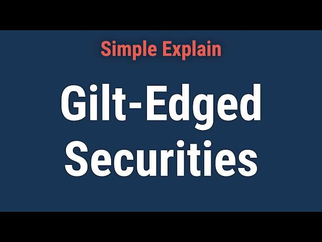

## Table of Contents

## What are gilt-edged securities?

Gilt-edged securities are government bonds that are considered very safe investments. They are called "gilt-edged" because they are backed by the government, which means there is a very low risk that the government will not be able to pay back the money it borrows. These securities are often used by investors who want to keep their money safe and earn a steady, though usually modest, return.

These securities are typically issued by governments to raise money for public spending. In the UK, for example, they are issued by the British government and are known simply as "gilts." The interest rate on these securities is usually lower than on riskier investments like stocks, but they are popular among conservative investors, such as pension funds, because of their reliability and stability.

## What is the origin of the term 'gilt-edged'?

The term 'gilt-edged' comes from the old practice of making fancy books and certificates. A long time ago, people would put a thin layer of gold on the edges of important books and documents to make them look special and valuable. This gold edge was called 'gilt.' So, when people started talking about very safe and valuable investments, they used the term 'gilt-edged' to show that these investments were like those fancy, gold-edged books – highly valued and reliable.

In the world of finance, the term 'gilt-edged' became popular to describe government bonds, especially in the UK where they are simply called 'gilts.' These bonds are seen as safe because they are backed by the government, which is very unlikely to fail to pay back the money it borrows. Just like the gold on those old books, these securities are seen as the best and most trustworthy kind of investment.

## How do gilt-edged securities differ from other types of securities?

Gilt-edged securities are different from other types of securities because they are very safe. They are issued by governments, which means they are backed by the full faith and credit of the government. This makes them much less risky than other securities like corporate bonds or stocks. When you buy a gilt-edged security, you can be pretty sure that you will get your money back, plus interest, because the government is unlikely to go bankrupt.

Other securities, like stocks and corporate bonds, can be riskier. Stocks can go up and down in value a lot, and there's a chance you could lose money if the company does badly. Corporate bonds are also riskier because the company issuing them might not be able to pay back the money it borrows. So, while gilt-edged securities might not offer the highest returns, they are a good choice if you want to keep your money safe and get a steady income.

## What are the historical developments of gilt-edged securities?

Gilt-edged securities have a long history that goes back to the 17th century. In England, the first gilt-edged securities were issued in 1693 when the government needed money to fund wars. These early securities were called 'Consols' because they were consolidated loans. People who bought them were lending money to the government, and in return, they got regular interest payments. Over time, as governments needed more money for different things like building roads or fighting wars, they kept issuing these securities. By the 19th century, gilt-edged securities became a common way for governments to borrow money, and they were seen as very safe investments.

In the 20th century, the use of gilt-edged securities grew even more. During big events like World War I and World War II, governments issued a lot of these securities to pay for the wars. After the wars, governments kept using them to manage their budgets and fund public projects. Over time, different types of gilt-edged securities were created, like those with fixed interest rates and those that adjusted for inflation. Today, gilt-edged securities are still important for governments to raise money, and they are popular with investors who want safe and reliable investments.

## Who are the typical issuers of gilt-edged securities?

The typical issuers of gilt-edged securities are governments. In the UK, for example, the government issues these securities, and they are called 'gilts.' Other countries have their own versions of gilt-edged securities, but they all work the same way. The government needs money to pay for things like schools, roads, and hospitals, so they borrow money from people and promise to pay it back with interest.

Sometimes, other very safe organizations, like big central banks, might issue securities that are similar to gilt-edged securities. But usually, it's the government that issues them because they can promise to pay back the money with a very low risk of not being able to do so. This makes gilt-edged securities a safe choice for people who want to invest their money without taking big risks.

## What are the main types of gilt-edged securities available in the market?

Gilt-edged securities come in different types, but the two main kinds are fixed-rate gilts and index-linked gilts. Fixed-rate gilts pay a set amount of interest, usually twice a year, until they mature. The interest rate stays the same for the whole time you own the gilt. This means you know exactly how much money you will get back each year. Fixed-rate gilts are popular with people who want a steady and predictable income from their investments.

Index-linked gilts are a bit different. The interest payments and the amount you get back when the gilt matures go up and down with inflation. This means if prices go up, the value of your gilt and the interest you earn will also go up. Index-linked gilts are good for people who want to make sure their investment keeps up with the cost of living. Both types of gilts are seen as very safe because they are backed by the government, but they help people in different ways depending on what they need from their investments.

## How are gilt-edged securities rated, and why is it important?

Gilt-edged securities are rated by special companies called credit rating agencies. These agencies look at how likely it is that the government will be able to pay back the money it borrows. They give the securities a grade, like AAA, AA, or A, with AAA being the best and safest. The rating helps investors know how safe their investment is. Since gilt-edged securities are backed by the government, they usually get very high ratings, which means they are seen as very safe.

The rating is important because it helps people decide if they want to buy the securities. If a gilt-edged security has a high rating, more people will want to buy it because they know it's safe. This can help the government borrow money more easily. On the other hand, if a country's economy is not doing well, the rating might go down, and fewer people might want to buy the securities. So, the rating is a big deal for both the government and the people who might invest in these securities.

## What are the risks associated with investing in gilt-edged securities?

Even though gilt-edged securities are seen as very safe because they are backed by the government, there are still some risks you should know about. One risk is interest rate risk. This means that if interest rates go up after you buy a gilt-edged security, the value of your security might go down. This happens because new securities will be issued with higher interest rates, making your older security less attractive to other investors. If you need to sell your security before it matures, you might get less money than you expected.

Another risk is inflation risk. This is when the cost of things goes up faster than the interest you earn from your gilt-edged security. If inflation is high, the money you get back from your investment might not be worth as much as it was when you first bought the security. This is why some people prefer index-linked gilts, which adjust their payments based on inflation, to help protect against this risk. Even though these risks exist, gilt-edged securities are still considered one of the safest investments because the government is very unlikely to not pay back the money it borrows.

## How can gilt-edged securities be used in portfolio diversification?

Gilt-edged securities can be a good way to diversify your investment portfolio because they are very safe. When you diversify, you spread your money across different types of investments to lower your risk. If you have a lot of money in risky investments like stocks, adding some gilt-edged securities can help balance things out. If the stock market goes down, the value of your gilt-edged securities will likely stay the same or even go up, which can protect your overall investment.

Another way gilt-edged securities help with diversification is by providing a steady income. Stocks can be up and down, and you might not know how much money you will get back each year. But with gilt-edged securities, you get regular interest payments, which can be important if you need a reliable source of money. By mixing gilt-edged securities with other investments, you can create a portfolio that is safer and gives you a steady income, which can help you feel more secure about your financial future.

## What role do gilt-edged securities play in government fiscal policy?

Gilt-edged securities are an important tool for governments when they want to control their money and spending. When the government needs money for things like building roads or paying for schools, they can sell gilt-edged securities to people and promise to pay them back with interest later. This way, the government can borrow money without having to raise taxes right away. If the economy is growing too fast and the government wants to slow it down a bit, they might sell more gilt-edged securities to take money out of people's hands and cool things down.

On the other hand, if the economy is not doing well and the government wants to help it grow, they might buy back some of the gilt-edged securities they sold before. This puts more money back into people's hands, which they can spend and help the economy grow. So, by using gilt-edged securities, the government can manage how much money is in the economy and help keep things stable. This is a big part of what they call fiscal policy, which is all about how the government uses its money to help the country.

## How have gilt-edged securities been affected by economic crises?

Gilt-edged securities are usually seen as very safe investments because they are backed by the government. But during big economic crises, even these securities can be affected. For example, during the 2008 financial crisis, many people were worried about the economy and started selling their investments, including gilt-edged securities. This made the prices of these securities go down for a while. However, because they are backed by the government, they bounced back faster than many other investments. The government's promise to pay back the money made them a safe place for people to put their money during tough times.

Another example is during the COVID-19 pandemic. When the economy slowed down because of lockdowns, many people moved their money into gilt-edged securities to keep it safe. This made the demand for these securities go up, and their prices went up too. The government also used these securities to borrow money and help the economy recover. So, even though economic crises can shake things up, gilt-edged securities often stay strong because people trust the government to pay them back.

## What are advanced strategies for trading gilt-edged securities?

Advanced strategies for trading gilt-edged securities can help you make more money, but they need a good understanding of the market. One strategy is called yield curve trading. This is when you look at the different interest rates for gilt-edged securities that mature at different times. If you think the difference between these rates will change, you can buy some securities and sell others to make money from the change. Another strategy is duration trading, where you try to guess how interest rates will change in the future. If you think rates will go down, you might buy longer-term gilts because their prices will go up more than shorter-term ones.

Another strategy is to use gilt-edged securities to hedge against other investments. If you have a lot of money in stocks and you're worried about the stock market going down, you can buy gilt-edged securities. This way, if the stock market does go down, the value of your gilts might go up, which can help balance out your losses. You can also use something called a gilt repo, which is like a short-term loan where you use your gilts as collateral. This can help you borrow money to buy more investments or to cover other financial needs.

These strategies can be tricky and might need a lot of research and understanding of the market. It's important to know that even though gilt-edged securities are safe, using them in advanced ways can still be risky. Always make sure you understand what you're doing and maybe talk to a financial advisor before trying these strategies.

## How can one navigate government bonds?

Government bonds, akin to gilt-edged securities, are debt instruments issued by national and subnational entities aimed at raising funds to finance public projects and achieve fiscal policy objectives. These bonds are critical to the economic framework, often regarded as benchmarks for risk-free interest rates due to their low default risk, supported by governmental backing.

### Role and Benefits

Government bonds serve as pivotal components in stabilizing economies, offering predictable income streams through regular interest payments, commonly referred to as coupons. This predictability makes them particularly attractive to risk-averse investors. Their introduction into investment portfolios can enhance diversification by offering a counterbalance to the more volatile asset classes, thus helping manage risk effectively.

### Key Features

**Issuance Process**: Government bonds are typically issued through auctions, where the government sets a base price, and investors place bids. The terms of these bonds—such as interest rates and maturity periods—are determined during these auctions. The primary market facilitates initial transactions between the issuing entity and investors, while the secondary market allows for subsequent trading.

**Maturity Periods**: These can range from short-term (typically less than a year) to medium-term (1 to 10 years) and long-term (10 to 30 years or more) bonds. The chosen maturity period influences the bond's yield, with longer maturities generally offering higher yields to compensate for the extended exposure to interest rate and inflation risks.

**Role in Global Financial Markets**: As cornerstones of national and global financial stability, government bonds are utilized by central banks for monetary policy operations, including open market transactions. They help maintain liquidity and manage currency exchange rates, influencing overall economic activity.

### Impact of Interest Rate Changes and Inflation

The prices of government bonds are inversely related to interest rates. When interest rates rise, existing bond prices tend to fall, as new bonds are likely to be issued at higher rates, making existing bonds with lower rates less attractive. Conversely, when interest rates fall, existing bond prices generally increase.

Inflation plays a crucial role in determining the real return on government bonds. Inflation erodes the purchasing power of future cash flows, effectively diminishing the real value of interest payments and principal. Investors often demand higher yields for bonds with longer maturities to compensate for this inflation risk. 

Mathematically, the relationship between bond prices and interest rates can be demonstrated through the bond's duration—a measure of sensitivity to [interest rate](/wiki/interest-rate-trading-strategies) changes. The bond's price change can be estimated as:

$$
\Delta P \approx -D \times \Delta i
$$

where $\Delta P$ is the change in bond price, $D$ is the bond's duration, and $\Delta i$ is the change in interest rate.

Using Python, we could approximate these changes in bond prices given specific interest rate changes:

```python
def bond_price_change(duration, interest_rate_change):
    return -duration * interest_rate_change

# Example usage:
duration = 7  # A bond with a 7-year duration
interest_rate_change = 0.01  # a 1% increase in interest rate
price_change = bond_price_change(duration, interest_rate_change)

print(f"The bond price will change by approximately {price_change*100:.2f}%")
```

Investors should carefully consider the effects of interest rate fluctuations and inflation dynamics when investing in government bonds to optimize their investment strategies for varied economic conditions.

## References & Further Reading

[1]: ["Advances in Financial Machine Learning"](https://www.amazon.com/Advances-Financial-Machine-Learning-Marcos/dp/1119482089) by Marcos Lopez de Prado

[2]: ["Quantitative Trading: How to Build Your Own Algorithmic Trading Business"](https://www.amazon.com/Quantitative-Trading-Build-Algorithmic-Business/dp/1119800064) by Ernest P. Chan

[3]: ["Machine Learning for Algorithmic Trading"](https://github.com/stefan-jansen/machine-learning-for-trading) by Stefan Jansen

[4]: ["Evidence-Based Technical Analysis: Applying the Scientific Method and Statistical Inference to Trading Signals"](https://www.amazon.com/Evidence-Based-Technical-Analysis-Scientific-Statistical/dp/0470008741) by David Aronson

[5]: Begg, D., Vernasca, G., Fischer, S., & Dornbusch, R. (2014). ["Economics"](https://www.mheducation.co.uk/higher-education/feature/begg-vernasca/economics-12th) (11th ed.). McGraw-Hill Education.

[6]: Clapham, J. H. (1944). ["The Bank of England: A History."](https://archive.org/details/bankofenglandhis0002unse) Cambridge University Press.

[7]: Chincarini, L. B., & Kim, D. (2006). ["Quantitative Equity Portfolio Management: An Active Approach to Portfolio Construction and Management."](https://www.mhebooklibrary.com/doi/book/10.1036/9781264268931) McGraw-Hill Education.