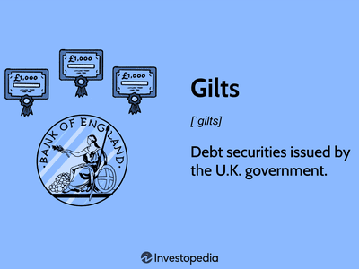

Gilt funds are mutual funds that primarily invest in government securities, known as gilts, which are bonds issued by the government. These funds are characterized by their low-risk profile, offering investors a relatively stable return due to the government's backing. In the broader investment landscape, gilt funds serve as a conservative investment choice, particularly appealing during periods of economic uncertainty. They help to diversify an investment portfolio while providing a steady income stream, appealing to risk-averse investors.

Algorithmic trading, or algo trading, refers to the use of computer algorithms to execute trading decisions quickly, leveraging mathematical models and pre-defined conditions. This form of trading has gained prominence in the financial sector due to its ability to increase trading efficiency, minimize human error, and execute large volumes of trades at high speed. The rise of technologies such as big data, machine learning, and artificial intelligence has further propelled algorithmic trading into the spotlight, making it a vital tool for modern traders and investors.



Combining gilt fund investments with algorithmic trading can optimize investment outcomes. Algorithms can analyze vast datasets to identify patterns and trends, thereby optimizing entry and exit points for gilt investments. This fusion of traditional investments with technology-driven strategies provides investors with a competitive edge and the potential for enhanced returns. Moreover, algorithmic strategies can incorporate risk management techniques, reducing volatility and safeguarding investments from market fluctuations.

The integration of gilt fund investments with algorithmic trading strategies presents numerous advantages, such as increased decision-making efficiency and improved risk management. However, it also introduces risks, including technological dependencies and the potential impact of rapid market movements. Understanding these tools is crucial in today’s fast-paced financial markets to navigate the complexities and leverage the potential rewards effectively.

In conclusion, the exploration of gilt funds and algorithmic trading underscores their significance in the current financial environment. To capitalize on their full potential, investors must remain informed and adaptable, considering both their risk tolerance and technological capabilities. The ongoing evolution of financial markets necessitates continual research and education in these advanced investment methodologies.

## Table of Contents

## Understanding Gilt Fund Investments

Gilt funds are a type of mutual fund that invests predominantly in government securities, which are debt instruments issued by a country's government to finance its operations and obligations. These funds are generally characterized by low risk, given their backing by government entities, and they offer investors steady returns relative to more volatile equity markets.

### Types of Gilt Funds

Gilt funds can be categorized primarily into short-term and long-term gilt funds. Short-term gilt funds invest in government securities with shorter maturity periods, typically less than three years, making them less sensitive to [interest rate](/wiki/interest-rate-trading-strategies) changes. Long-term gilt funds, on the other hand, invest in government securities with longer maturity periods, spanning up to 30 years. The choice between these depends on an investor’s risk appetite and investment horizon.

### Role in a Diversified Portfolio

Including gilt funds in a diversified investment portfolio serves as a risk mitigation strategy. The low-risk nature of government-backed securities provides a hedge against the [volatility](/wiki/volatility-trading-strategies) of equity markets. They are particularly appealing during periods of economic uncertainty, when investors seek safety, reliability, and preservation of capital.

### Historical Performance

Historically, gilt funds have performed steadily, though they may not offer the high returns associated with riskier assets. Their performance tends to be inversely correlated with interest rate movements—falling interest rates often lead to capital gains for gilt funds, as the value of existing bonds increases. Economic downturns often highlight the stability of gilt funds, attracting conservative investors aiming to reduce exposure to market volatility.

### Key Considerations for Investors

Investors considering gilt funds need to be mindful of certain factors:

- **Interest Rate Risk**: The value of gilt funds is sensitive to changes in interest rates. Long-term gilt funds, in particular, can be significantly impacted by interest rate fluctuations, which may lead to capital gains or losses.

- **Tax Implications**: The returns on gilt funds are subject to taxation. In many jurisdictions, capital gains from gilt funds held for more than three years are taxed at a lower rate compared to short-term capital gains, which are added to the investor’s income and taxed accordingly.

Understanding these characteristics and considerations is crucial for investors aiming to strategically utilize gilt funds. With their steady performance in fluctuating markets, investing in gilt funds can serve as a reliable way to stabilize a portfolio, provided that investors pay close attention to interest rate trends and tax structures.

## Algorithmic Trading: An Overview

Algorithmic trading refers to the use of computer programs and algorithms to execute financial trades at speeds and frequencies that are impossible for human traders. This method of trading involves the use of pre-defined sets of instructions for placing trades to generate profits at a speed and frequency that is unattainable by a human. These instructions are based on timing, price, quantity, or any mathematical model. The evolution of [algorithmic trading](/wiki/algorithmic-trading) has significantly reshaped financial markets over the past few decades. Its roots can be traced back to the 1970s with the advent of electronic exchanges, which paved the way for automated trading systems. 

The rapid development of technology in the late 20th and early 21st centuries has significantly bolstered algorithmic trading. Key advancements include the proliferation of big data, which provides the vast datasets necessary for analyzing trading patterns, and the development of [artificial intelligence](/wiki/ai-artificial-intelligence) (AI), which offers sophisticated models for predictive analytics and decision-making processes. AI, particularly through [machine learning](/wiki/machine-learning), has enabled algorithms to adapt and refine their trading strategies based on historical data and real-time market conditions.

Algorithmic trading offers several advantages over traditional trading methods. Among the most notable is speed; algorithms can execute trades within milliseconds, much faster than humans can react. This speed is complemented by increased accuracy, as algorithms can minimize human errors in trading decisions. Furthermore, the ability to process and analyze large datasets efficiently helps in better predictive analytics and identification of trading opportunities that might be invisible to manual analysis.

There are several common strategies employed in algorithmic trading, each with its own approach to generating profits. Arbitrage involves exploiting price differentials of the same asset in different markets, aiming for risk-free profits. Trend following relies on technical indicators to guide trading decisions based on the assumption that prices that have been moving in one direction will continue to do so. Market making involves buying and selling the same asset to take advantage of the bid-ask spread, thereby providing [liquidity](/wiki/liquidity-risk-premium) to the markets.

Despite its advantages, algorithmic trading presents challenges and ethical considerations. One major challenge is the reliance on technology, which can be a single point of failure if systems experience glitches or are targeted by cyber-attacks. The use of sophisticated algorithms also raises questions about market fairness and transparency, as not all investors have access to the same trading technology or speed, potentially creating uneven playing fields. Additionally, the ability of algorithms to react to real-time data means that sudden market shifts can trigger large volumes of trades, potentially leading to market instability, as witnessed in incidents like the 2010 Flash Crash.

Ethical considerations center on the potential for market manipulation and the broader impact on market dynamics and liquidity. Regulations have been implemented to oversee algorithmic trading practices, but continual advancements in technology require ongoing scrutiny and adaptation of these regulatory frameworks to ensure ethical and stable market operations.

## The Intersection of Gilt Fund Investments and Algorithmic Trading

Algorithmic trading, or algo trading, has significantly transformed how gilt fund investments are managed, offering a competitive edge by optimizing investment strategies. By using sophisticated algorithms, investors can analyze vast amounts of market data to identify trends, enabling them to make more informed decisions about entry and [exit](/wiki/exit-strategy) points for gilts. For instance, algorithms can process historical price data and real-time market information to forecast future price movements, applying statistical models and machine learning to predict when to buy or sell gilts for maximum profit. 

Consider a sample Python code snippet employing basic algorithms to determine optimal entry and exit points based on moving averages:

```python
import pandas as pd

# Suppose `data` is a pandas DataFrame containing gilt prices with dates as the index
data['Short_MA'] = data['Price'].rolling(window=20).mean()  # Short-term moving average
data['Long_MA'] = data['Price'].rolling(window=50).mean()  # Long-term moving average

def generate_signals(data):
    buy_signals = []
    sell_signals = []
    position = False  # False means not holding, True means holding

    for i in range(1, len(data)):
        if data['Short_MA'].iloc[i] > data['Long_MA'].iloc[i] and not position:
            buy_signals.append(data.index[i])
            position = True
        elif data['Short_MA'].iloc[i] < data['Long_MA'].iloc[i] and position:
            sell_signals.append(data.index[i])
            position = False

    return buy_signals, sell_signals

buy_signals, sell_signals = generate_signals(data)
```

This simple moving average crossover strategy illustrates how algorithms can be used to identify optimal trading signals in gilt markets.

Risk management is another critical area where algorithms play an essential role. Algorithms can be programmed to continually assess portfolio risk by measuring variables such as bond duration and interest rate sensitivity, adjusting the portfolio in real-time to mitigate potential losses. Risk management algorithms utilize statistical tools to gauge volatility and apply hedging strategies, ensuring that the investment remains within the risk appetite of the investor.

Case studies have shown the effectiveness of algorithmic strategies in the gilt market. For example, a financial institution implementing algorithmic trading was able to enhance return stability by managing the duration and cash flow timings of their gilt portfolios dynamically. The algorithms allowed for swift adjustments to market shifts, reducing exposure during periods of high volatility while capitalizing on favorable trading conditions.

Looking to the future, the integration of gilt fund investments with algorithmic trading is likely to grow, driven by advances in artificial intelligence and machine learning. These technologies promise to enhance the precision and adaptability of trading algorithms, allowing for real-time decision-making and further automation in trade execution. Additionally, increasing data availability and computational power are expected to lead to more sophisticated models capturing even the most intricate market dynamics, offering unparalleled opportunities to optimize returns from gilt investments. 

As financial markets evolve, the synergy between traditional investment vehicles like gilt funds and cutting-edge technologies will continue to shape investment strategies, necessitating ongoing research and adaptation.

## Benefits and Risks

Incorporating algorithmic trading into gilt fund investments offers numerous benefits that contribute to enhanced decision-making and increased efficiency. Algorithmic trading facilitates the rapid analysis of vast datasets, enabling investors to make informed decisions based on quantitative models and real-time market data. Algorithms can optimize trading strategies by identifying patterns and executing trades at optimal times, potentially improving returns while minimizing human error.

However, the integration of algorithmic trading with gilt fund investments is not without risks. One primary concern is the dependence on technology, which may lead to vulnerabilities such as system failures or data inaccuracies. Additionally, the fast-paced nature of algorithmic trading can amplify market volatility, especially during periods of rapid change, potentially resulting in substantial losses. Gilt funds themselves are subject to interest rate risks, where changes in rates can inversely affect their prices.

To manage these risks, diversification of investments and robust algorithm design are crucial. Diversifying gilt fund investments can mitigate risks specific to interest rate fluctuations and economic conditions. Investors employing algorithmic trading should prioritize the development and testing of algorithms that are resilient to market anomalies and can adapt to unforeseen circumstances.

Regulatory and compliance factors also play a significant role in algorithmic trading, as financial authorities impose stringent guidelines to ensure market stability and prevent manipulative practices. Investors must ensure that their algorithmic strategies comply with such regulations to avoid legal repercussions and maintain market integrity.

Best practices for integrating algorithmic trading into gilt fund investments include conducting thorough due diligence on algorithmic models, maintaining a balanced portfolio to safeguard against market shocks, and staying updated on regulatory changes. By combining technological innovation with strategic foresight, investors can harness the transformative potential of algorithmic trading while managing its inherent risks.

## Conclusion

The exploration of gilt fund investments alongside algorithmic trading showcases a promising convergence of traditional investment strategies with modern technological advancements. Gilt funds, with their government-backed securities and characteristic low-risk, steady returns, offer a stable investment platform. When complemented by the speed and precision of algorithmic trading, the potential for enhanced decision-making and efficiency in gilt fund management becomes evident. This fusion allows investors to maximize returns while maintaining a balanced risk profile. 

In today's fast-paced financial markets, staying informed and adaptable is crucial. The rapid evolution of technology requires investors to continuously update their knowledge and strategies. By integrating algorithmic trading into gilt fund investments, investors can better position themselves to respond to market changes, optimize their portfolios, and manage risks more effectively. 

Investors are encouraged to evaluate their risk tolerance and technological capabilities carefully. This involves understanding the complexities and potential drawbacks of algorithmic trading, such as technology reliance and rapid market shifts. A well-balanced approach, combining diversification, robust algorithm design, and adherence to regulatory frameworks, can mitigate these risks.

Looking ahead, the future of finance will likely be defined by an ever-closer alignment of traditional investment methods and cutting-edge technologies. Continued research and education are paramount to unlocking new opportunities and fostering innovation in the investment landscape. As this integration accelerates, investors who remain proactive in learning and adapting will be better equipped to navigate the future financial ecosystem successfully.

## References & Further Reading

[1]: ["Advances in Financial Machine Learning"](https://www.amazon.com/Advances-Financial-Machine-Learning-Marcos-ebook/dp/B079KLDW21) by Marcos Lopez de Prado

[2]: ["Machine Learning for Algorithmic Trading"](https://github.com/stefan-jansen/machine-learning-for-trading) by Stefan Jansen

[3]: ["Quantitative Trading: How to Build Your Own Algorithmic Trading Business"](https://www.amazon.com/Quantitative-Trading-Build-Algorithmic-Business/dp/1119800064) by Ernest P. Chan

[4]: ["Evidence-Based Technical Analysis: Applying the Scientific Method and Statistical Inference to Trading Signals"](https://www.amazon.com/Evidence-Based-Technical-Analysis-Scientific-Statistical/dp/0470008741) by David Aronson

[5]: "Algorithmic and High-Frequency Trading" by Álvaro Cartea, Sebastian Jaimungal, and José Penalva.